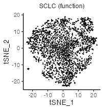
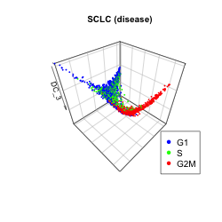

```{r, include = FALSE}
knitr::opts_chunk$set(
  collapse = TRUE,
  comment = "#>"
)
```


# Computational environment
MacBook Pro (Big Sur, 16-inch, 2019), Processor (2.4 GHz 8-Core Intel Core i9),
Memory (64 GB 2667 MHz DDR4).


<br>

# Install libraries
Attach necessary libraries:
```{r, eval = FALSE}
library(ASURAT)
library(SingleCellExperiment)
library(SummarizedExperiment)
```


<br>

# Introduction
In this vignette, we analyze single-cell RNA sequencing (scRNA-seq) data
obtained from small cell lung cancer (SCLC) patients with cisplatin treatment
(Stewart et al., Nat. Cancer 1, 2020).


<br>

# Prepare scRNA-seq data
## SCLC with cisplatin treatment
The data can be loaded by the following code:
```{r, eval = FALSE}
sclc <- readRDS(url("https://figshare.com/ndownloader/files/34112474"))
```
The data are stored in
[DOI:10.6084/m9.figshare.19200254](https://figshare.com/s/866fbf822a4bfab234e6)
and the generating process is described below.

<br>

The data were obtained from NCBI repository with accession number GSE138474: [GSM4104164](https://www.ncbi.nlm.nih.gov/geo/query/acc.cgi?acc=GSM4104164).
The following functions `read_matrix_10xdata()` and `read_gene_10xdata()`
process the scRNA-seq data into a raw count matrix and gene dataframe.
Here, `make.unique()` is applied for naming gene symbols, which appends a
sequential number with a period delimiter for every repeat name encountered.
```{r, eval = FALSE}
read_matrix_10xdata <- function(path_dir){
  barcode.path <- paste0(path_dir, "barcodes.tsv.gz")
  feature.path <- paste0(path_dir, "features.tsv.gz")
  matrix.path  <- paste0(path_dir, "matrix.mtx.gz")
  mat <- as.matrix(Matrix::readMM(file = matrix.path))
  genes <- read.delim(feature.path, header = FALSE, stringsAsFactors = FALSE)
  barcodes <- read.delim(barcode.path, header = FALSE, stringsAsFactors = FALSE)
  rownames(mat) <- make.unique(as.character(genes$V2))
  colnames(mat) <- make.unique(barcodes$V1)
  return(mat)
}
read_gene_10xdata <- function(path_dir){
  feature.path <- paste0(path_dir, "features.tsv.gz")
  genes <- read.delim(feature.path, header = FALSE, stringsAsFactors = FALSE)
  return(genes)
}
```

Create a SingleCellExperiment object by inputting a raw read count table.
```{r, eval = FALSE}
path_dir <- "rawdata/2020_001_stewart/sc68_cisp/SRR10211593_count/"
path_dir <- paste0(path_dir, "filtered_feature_bc_matrix/")
sclc <- read_matrix_10xdata(path_dir = path_dir)
sclc <- SingleCellExperiment(assays = list(counts = sclc),
                             rowData = data.frame(gene = rownames(sclc)),
                             colData = data.frame(cell = colnames(sclc)))
```

```{r, eval = FALSE}
dim(sclc)
```
```
[1] 33538  3433
```

```{r, eval = FALSE, echo = FALSE}
# Save data.
saveRDS(sclc, file = "backup/01_001_sclc_data.rds")

# Load data.
sclc <- readRDS("backup/01_001_sclc_data.rds")
```


<br>

# Preprocessing
## Control data quality
Remove variables (genes) and samples (cells) with low quality,
by processing the following three steps:

1. remove variables based on expression profiles across samples,
2. remove samples based on the numbers of reads and nonzero expressed variables,
3. remove variables based on the mean read counts across samples.

First of all, add metadata for both variables and samples using ASURAT function
`add_metadata()`.
```{r, eval = FALSE}
sclc <- add_metadata(sce = sclc, mitochondria_symbol = "^MT-")
```

Examine the expression levels of known SCLC marker genes
(Ireland, et al., 2020), namely ASCL1, NEUROD1, YAP1, and POU2F3.
```{r, eval = FALSE}
genes <- c("ASCL1", "NEUROD1", "YAP1", "POU2F3")
sce <- sclc[, which(colData(sclc)$nReads > 2000)]
set.seed(1)
inds <- sample(ncol(sce), size = 1000, replace = FALSE)
subsce <- sce[genes, inds]
mat <- log(as.matrix(assay(subsce, "counts")) + 1)
set.seed(1)
col_hc <- hclust(dist(t(mat)), method = "ward.D2")

filename <- "figures/figure_01_0005.png"
png(file = filename, height = 200, width = 520, res = 100)
#png(file = filename, height = 580, width = 1600, res = 300)
p <- ComplexHeatmap::Heatmap(mat, column_title = "SCLC",
                             name = "Log1p\nexpression", cluster_columns = col_hc,
                             cluster_rows = FALSE, show_row_names = TRUE,
                             row_names_side = "right", show_row_dend = FALSE,
                             show_column_names = FALSE, column_dend_side = "top",
                             show_parent_dend_line = FALSE)
p
dev.off()

# mtx <- t(colData(subsce)$nReads) ; rownames(mtx) <- "nReads"
# q <- ComplexHeatmap::Heatmap(mtx, name = "nReads",
#                              cluster_columns = col_hc, show_row_names = TRUE,
#                              row_names_side = "right", show_row_dend = FALSE,
#                              show_column_names = FALSE, show_column_dend = FALSE,
#                              col = circlize::colorRamp2(c(min(mtx), max(mtx)),
#                                                         c("cyan", "magenta")))
# p <- p %v% q
# p
# dev.off()
```


<br>

### Remove variables based on expression profiles
ASURAT function `remove_variables()` removes variable (gene) data such that
the numbers of non-zero expressing samples (cells) are less than `min_nsamples`.
```{r, eval = FALSE}
sclc <- remove_variables(sce = sclc, min_nsamples = 10)
```


<br>

### Remove samples based on expression profiles
Qualities of sample (cell) data are confirmed based on proper visualization of
`colData(sce)`.
```{r, eval = FALSE}
title <- "SCLC"
df <- data.frame(x = colData(sclc)$nReads, y = colData(sclc)$nGenes)
p <- ggplot2::ggplot() +
  ggplot2::geom_point(ggplot2::aes(x = df$x, y = df$y), size = 1, alpha = 1) +
  ggplot2::labs(title = title, x = "Number of reads", y = "Number of genes") +
  ggplot2::theme_classic(base_size = 20) +
  ggplot2::theme(plot.title = ggplot2::element_text(hjust = 0.5, size = 20))
filename <- "figures/figure_01_0010.png"
ggplot2::ggsave(file = filename, plot = p, dpi = 50, width = 5, height = 5)

df <- data.frame(x = colData(sclc)$nReads, y = colData(sclc)$percMT)
p <- ggplot2::ggplot() +
  ggplot2::geom_point(ggplot2::aes(x = df$x, y = df$y), size = 1, alpha = 1) +
  ggplot2::labs(title = title, x = "Number of reads", y = "Perc of MT reads") +
  ggplot2::theme_classic(base_size = 20) +
  ggplot2::theme(plot.title = ggplot2::element_text(hjust = 0.5, size = 20))
filename <- "figures/figure_01_0011.png"
ggplot2::ggsave(file = filename, plot = p, dpi = 50, width = 5, height = 5)
```


ASURAT function `remove_samples()` removes sample (cell) data by setting cutoff
values for the metadata.
```{r, eval = FALSE}
sclc <- remove_samples(sce = sclc, min_nReads = 1400, max_nReads = 40000,
                       min_nGenes = 1150, max_nGenes = 1e+10,
                       min_percMT = 0, max_percMT = 15)
```


 
<br>

### Remove variables based on the mean read counts
Qualities of variable (gene) data are confirmed based on proper visualization of
`rowData(sce)`.
```{r, eval = FALSE}
title <- "SCLC"
aveexp <- apply(as.matrix(assay(sclc, "counts")), 1, mean)
df <- data.frame(x = seq_len(nrow(rowData(sclc))),
                 y = sort(aveexp, decreasing = TRUE))
p <- ggplot2::ggplot() + ggplot2::scale_y_log10() +
  ggplot2::geom_point(ggplot2::aes(x = df$x, y = df$y), size = 1, alpha = 1) +
  ggplot2::labs(title = title, x = "Rank of genes", y = "Mean read counts") +
  ggplot2::theme_classic(base_size = 20) +
  ggplot2::theme(plot.title = ggplot2::element_text(hjust = 0.5, size = 20))
filename <- "figures/figure_01_0015.png"
ggplot2::ggsave(file = filename, plot = p, dpi = 50, width = 5, height = 5)
```


ASURAT function `remove_variables_second()` removes variable (gene) data
such that the mean read counts across samples are less than `min_meannReads`.
```{r, eval = FALSE}
sclc <- remove_variables_second(sce = sclc, min_meannReads = 0.20)
```

```{r, eval = FALSE}
dim(sclc)
```
```
[1] 6346 2283
```

```{r, eval = FALSE, echo = FALSE}
# Save data.
saveRDS(sclc, file = "backup/01_002_sclc_dataqc.rds")

# Load data.
sclc <- readRDS("backup/01_002_sclc_dataqc.rds")
```


<br>

## Normalize data {#normalization}
Perform `bayNorm()` (Tang et al., Bioinformatics, 2020) for attenuating
technical biases with respect to zero inflation and variation of capture
efficiencies between samples (cells).
```{r, eval = FALSE}
mat <- as.matrix(assay(sclc, "counts"))
BETA <- bayNorm::BetaFun(Data = mat, MeanBETA = 0.06)
bayout <- bayNorm::bayNorm(mat, BETA_vec = BETA[["BETA"]], mode_version = TRUE)
assay(sclc, "normalized") <- bayout$Bay_out
```

Perform log-normalization with a pseudo count.
```{r, eval = FALSE}
assay(sclc, "logcounts") <- log(assay(sclc, "normalized") + 1)
```

Center row data.
```{r, eval = FALSE}
mat <- assay(sclc, "logcounts")
assay(sclc, "centered") <- sweep(mat, 1, apply(mat, 1, mean), FUN = "-")
```

Set gene expression data into `altExp(sce)`.
```{r, eval = FALSE}
sname <- "logcounts"
altExp(sclc, sname) <- SummarizedExperiment(list(counts = assay(sclc, sname)))
```

Add ENTREZ Gene IDs to `rowData(sce)`.
```{r, eval = FALSE}
dictionary <- AnnotationDbi::select(org.Hs.eg.db::org.Hs.eg.db,
                                    key = rownames(sclc),
                                    columns = "ENTREZID", keytype = "SYMBOL")
dictionary <- dictionary[!duplicated(dictionary$SYMBOL), ]
rowData(sclc)$geneID <- dictionary$ENTREZID
```

```{r, eval = FALSE, echo = FALSE}
# Save data.
saveRDS(sclc, file = "backup/01_003_sclc_normalized.rds")

# Load data.
sclc <- readRDS("backup/01_003_sclc_normalized.rds")
```


<br>

# Multifaceted sign analysis
Infer cell or disease types, biological functions, and signaling pathway
activity at the single-cell level by inputting related databases.

ASURAT transforms centered read count tables to functional feature matrices,
termed sign-by-sample matrices (SSMs).
Using SSMs, perform unsupervised clustering of samples (cells).


<br>

## Compute correlation matrices
Prepare correlation matrices of gene expressions.
```{r, eval = FALSE}
mat <- t(as.matrix(assay(sclc, "centered")))
cormat <- cor(mat, method = "spearman")
```

```{r, eval = FALSE, echo = FALSE}
# Save data.
saveRDS(cormat, file = "backup/01_003_sclc_cormat.rds")

# Load data.
cormat <- readRDS("backup/01_003_sclc_cormat.rds")
```


<br>

## Load databases
Load databases.
```{r, eval = FALSE}
urlpath <- "https://github.com/keita-iida/ASURATDB/blob/main/genes2bioterm/"
load(url(paste0(urlpath, "20201213_human_DO.rda?raw=TRUE")))         # DO
load(url(paste0(urlpath, "20201213_human_GO_red.rda?raw=TRUE")))     # GO
load(url(paste0(urlpath, "20201213_human_KEGG.rda?raw=TRUE")))       # KEGG
```
The reformatted knowledge-based data were available from the following
repositories:

* [DOI:10.6084/m9.figshare.19102598](https://figshare.com/s/0599d2de970c2deb675c)
* [Github ASURATDB](https://github.com/keita-iida/ASURATDB)

Add formatted databases to `metadata(sce)$sign`.
```{r, eval = FALSE}
sclcs <- list(DO = sclc, GO = sclc, KG = sclc)
metadata(sclcs$DO) <- list(sign = human_DO[["disease"]])
metadata(sclcs$GO) <- list(sign = human_GO[["BP"]])
metadata(sclcs$KG) <- list(sign = human_KEGG[["pathway"]])
```


<br>

## Create signs
ASURAT function `remove_signs()` redefines functional gene sets for the
input database by removing genes, which are not included in `rownames(sce)`,
and further removes biological terms including too few or too many genes.
```{r, eval = FALSE}
sclcs$DO <- remove_signs(sce = sclcs$DO, min_ngenes = 2, max_ngenes = 1000)
sclcs$GO <- remove_signs(sce = sclcs$GO, min_ngenes = 2, max_ngenes = 1000)
sclcs$KG <- remove_signs(sce = sclcs$KG, min_ngenes = 2, max_ngenes = 1000)
```

ASURAT function `cluster_genes()` clusters functional gene sets using
a correlation graph-based decomposition method, producing strongly, variably,
and weakly correlated gene sets (SCG, VCG, and WCG, respectively).
```{r, eval = FALSE}
set.seed(1)
sclcs$DO <- cluster_genesets(sce = sclcs$DO, cormat = cormat,
                             th_posi = 0.28, th_nega = -0.22)
set.seed(1)
sclcs$GO <- cluster_genesets(sce = sclcs$GO, cormat = cormat,
                             th_posi = 0.20, th_nega = -0.20)
set.seed(1)
sclcs$KG <- cluster_genesets(sce = sclcs$KG, cormat = cormat,
                             th_posi = 0.17, th_nega = -0.16)
```

ASURAT function `create_signs()` creates signs by the following criteria:

1. the number of genes in SCG>= `min_cnt_strg` (the default value is 2) and
2. the number of genes in VCG>= `min_cnt_vari` (the default value is 2),

which are independently applied to SCGs and VCGs, respectively.
```{r, eval = FALSE}
sclcs$DO <- create_signs(sce = sclcs$DO, min_cnt_strg = 2, min_cnt_vari = 2)
sclcs$GO <- create_signs(sce = sclcs$GO, min_cnt_strg = 3, min_cnt_vari = 3)
sclcs$KG <- create_signs(sce = sclcs$KG, min_cnt_strg = 3, min_cnt_vari = 3)
```


<br>

## Select signs
If signs have semantic similarity information, one can use ASURAT function
`remove_signs_redundant()` for removing redundant sings using the semantic
similarity matrices.
```{r, eval = FALSE}
simmat <- human_DO$similarity_matrix$disease
sclcs$DO <- remove_signs_redundant(sce = sclcs$DO, similarity_matrix = simmat,
                                   threshold = 0.82, keep_rareID = TRUE)

simmat <- human_GO$similarity_matrix$BP
sclcs$GO <- remove_signs_redundant(sce = sclcs$GO, similarity_matrix = simmat,
                                   threshold = 0.80, keep_rareID = TRUE)
```

ASURAT function `remove_signs_manually()` removes signs by specifying
IDs (e.g., `GOID:XXX`) or descriptions (e.g., `metabolic`) using `grepl()`.
```{r, eval = FALSE}
keywords <- "Covid|COVID"
sclcs$KG <- remove_signs_manually(sce = sclcs$KG, keywords = keywords)
```


<br>

## Create sign-by-sample matrices
ASURAT function `create_sce_signmatrix()` creates a new SingleCellExperiment
object `new_sce`, consisting of the following information:

* `assayNames(new_sce)`: counts (SSM whose entries are termed sign scores),
* `names(colData(new_sce))`: nReads, nGenes, percMT,
* `names(rowData(new_sce))`: ParentSignID, Description, CorrGene, etc.,
* `names(metadata(new_sce))`: sign_SCG, sign_VCG, etc.,
* `altExpNames(new_sce)`: something if there is data in `altExp(sce)`.
```{r, eval = FALSE}
sclcs$DO <- makeSignMatrix(sce = sclcs$DO, weight_strg = 0.5, weight_vari = 0.5)
sclcs$GO <- makeSignMatrix(sce = sclcs$GO, weight_strg = 0.5, weight_vari = 0.5)
sclcs$KG <- makeSignMatrix(sce = sclcs$KG, weight_strg = 0.5, weight_vari = 0.5)
```


<br>

## Reduce dimensions of sign-by-sample matrices
Perform diffusion map for the SSM for disease.
```{r, eval = FALSE}
set.seed(1)
res <- destiny::DiffusionMap(t(assay(sclcs$DO, "counts")))
reducedDim(sclcs$DO, "DMAP") <- res@eigenvectors
```

Perform t-distributed stochastic neighbor embedding for the SSMs for biological
process and signaling pathway.
```{r, eval = FALSE}
dbs <- c("GO", "KG")
for(i in seq_along(dbs)){
  set.seed(1)
  mat <- t(as.matrix(assay(sclcs[[dbs[i]]], "counts")))
  res <- Rtsne::Rtsne(mat, dim = 2, pca = TRUE, initial_dims = 100)
  reducedDim(sclcs[[dbs[i]]], "TSNE") <- res[["Y"]]
}
```

Show the results of dimensional reduction in low-dimensional spaces.
Use ASURAT function `plot_dataframe3D()` for plotting three-dimensional data.
See `?plot_dataframe3D` for details.
```{r, eval = FALSE}
# DO
df <- as.data.frame(reducedDim(sclcs$DO, "DMAP"))[, seq_len(3)]
filename <- "figures/figure_01_0020.png"
png(file = filename, height = 250, width = 250, res = 50)
plot_dataframe3D(dataframe3D = df, theta = -45, phi = 220, title = "SCLC (disease)",
                 xlabel = "DC_1", ylabel = "DC_2", zlabel = "DC_3")
dev.off()

# GO
df <- as.data.frame(reducedDim(sclcs$GO, "TSNE"))
p <- ggplot2::ggplot() +
  ggplot2::geom_point(ggplot2::aes(x = df[, 1], y = df[, 2]),
                      color = "black", size = 1, alpha = 1) +
  ggplot2::labs(title = "SCLC (function)", x = "tSNE_1", y = "tSNE_2") +
  ggplot2::theme_classic(base_size = 20) +
  ggplot2::theme(plot.title = ggplot2::element_text(hjust = 0.5, size = 18))
filename <- "figures/figure_01_0021.png"
ggplot2::ggsave(file = filename, plot = p, dpi = 50, width = 4.1, height = 4.3)

# KEGG
df <- as.data.frame(reducedDim(sclcs$KG, "TSNE"))
p <- ggplot2::ggplot() +
  ggplot2::geom_point(ggplot2::aes(x = df[, 1], y = df[, 2]),
                      color = "black", size = 1, alpha = 1) +
  ggplot2::labs(title = "SCLC (pathway)", x = "tSNE_1", y = "tSNE_2") +
  ggplot2::theme_classic(base_size = 20) +
  ggplot2::theme(plot.title = ggplot2::element_text(hjust = 0.5, size = 18))
filename <- "figures/figure_01_0022.png"
ggplot2::ggsave(file = filename, plot = p, dpi = 50, width = 4.1, height = 4.3)
```





```{r, eval = FALSE, echo = FALSE}
# Save data.
saveRDS(sclcs, file = "backup/01_004_sclcs_ssm.rds")

# Load data.
sclcs <- readRDS("backup/01_004_sclcs_ssm.rds")
```


<br>

## Cluster cells
```{r, eval = FALSE}
# Load customized plot functions.
source("../R/plot_additional.R")
```


<br>

### Use MERLoT functions
MERLoT is a useful package detecting a tree-like topology in data space.
Using MERLoT, one can cluster cells by allocating individual cells to the
branches of the data manifold and define pseudotimes along the branches.
```{r, eval = FALSE}
# Preparation
res <- list()
dmap <- reducedDims(sclcs$DO)$DMAP[, seq_len(3)]
mat <- t(as.matrix(assay(sclcs$DO, "counts")))
# ScaffoldTree
res[[1]] <- merlot::CalculateScaffoldTree(CellCoordinates = dmap,
                                          NEndpoints = 3, random_seed = 1)
# ElasticTree
res[[2]] <- merlot::CalculateElasticTree(ScaffoldTree = res[[1]], N_yk = 30)
# SignsSpaceEmbedding
res[[3]] <- merlot::GenesSpaceEmbedding(ExpressionMatrix = mat,
                                        ElasticTree = res[[2]], NCores = 3)
# Pseudotime in high dimensional space
res[[4]] <- merlot::CalculatePseudotimes(InputTree = res[[2]], T0 = 1)
# Cluster cells based on tree branches embedded in high dimensional space.
labels <- res[[3]]$Cells2Branches
# Store the results
ngroups <- length(unique(sort(labels)))
colData(sclcs$DO)$merlot_clusters <- factor(labels, levels = seq_len(ngroups))
names(res) <- c("ScaffoldTree", "ElasticTree", "SignsSpaceEmbedding",
                "Pseudotimes_highdim")
metadata(sclcs$DO)$merlot <- res
```

Show elastic trees and pseudotimes, embedded in the original sign score space,
in diffusion map spaces.
```{r, eval = FALSE}
# Elastic tree
labels <- colData(sclcs$DO)$merlot_clusters
colors <- scales::hue_pal()(length(unique(labels)))[labels]
filename <- "figures/figure_01_0025.png"
png(file = filename, height = 250, width = 250, res = 50)
plot_elasticTree3D(ElasticTree = metadata(sclcs$DO)$merlot$ElasticTree,
                   labels = labels, colors = colors, theta = -45, phi = 220,
                   title = "SCLC (disease)", xlabel = "DC_1", ylabel = "DC_2",
                   zlabel = "DC_3")
dev.off()
# Pseudotime
filename <- "figures/figure_01_0026.png"
png(file = filename, height = 250, width = 250, res = 50)
plot_pseudotime3D(ElasticTree = metadata(sclcs$DO)$merlot$ElasticTree,
                  Pseudotimes = metadata(sclcs$DO)$merlot$Pseudotimes_highdim,
                  labels = labels, colors = colors, theta = -45, phi = 220,
                  title = "SCLC (disease)", xlabel = "DC_1", ylabel = "DC_2",
                  zlabel = "DC_3")
dev.off()
```

Show clustering results in low-dimensional spaces.
```{r, eval = FALSE}
labels <- colData(sclcs$DO)$merlot_clusters
df <- as.data.frame(reducedDim(sclcs$DO, "DMAP"))
filename <- "figures/figure_01_0030.png"
png(file = filename, height = 250, width = 250, res = 50)
plot_dataframe3D(dataframe3D = df, labels = labels,
                 theta = -45, phi = 220, title = "SCLC (disease)",
                 xlabel = "DC_1", ylabel = "DC_2", zlabel = "DC_3")
dev.off()
```


<br>

### Use Seurat functions
To date (December, 2021), one of the most useful clustering methods in scRNA-seq
data analysis is a combination of a community detection algorithm and
graph-based unsupervised clustering, developed in Seurat package.

Here, our strategy is as follows:

1. convert SingleCellExperiment objects into Seurat objects
  (note that `rowData()` and `colData()` must have data),
2. perform `ScaleData()`, `RunPCA()`, `FindNeighbors()`, and `FindClusters()`,
3. convert Seurat objects into temporal SingleCellExperiment objects `temp`,
4. add `colData(temp)$seurat_clusters` into `colData(sce)$seurat_clusters`.
```{r, eval = FALSE}
resolutions <- c(0.10, 0.20)
dims <- list(seq_len(40), seq_len(30))
dbs <- c("GO", "KG")
for(i in seq_along(dbs)){
  surt <- Seurat::as.Seurat(sclcs[[dbs[i]]], counts = "counts", data = "counts")
  mat <- as.matrix(assay(sclcs[[dbs[i]]], "counts"))
  surt[["SSM"]] <- Seurat::CreateAssayObject(counts = mat)
  Seurat::DefaultAssay(surt) <- "SSM"
  surt <- Seurat::ScaleData(surt, features = rownames(surt))
  surt <- Seurat::RunPCA(surt, features = rownames(surt))
  surt <- Seurat::FindNeighbors(surt, reduction = "pca", dims = dims[[i]])
  surt <- Seurat::FindClusters(surt, resolution = resolutions[i])
  temp <- Seurat::as.SingleCellExperiment(surt)
  colData(sclcs[[dbs[i]]])$seurat_clusters <- colData(temp)$seurat_clusters
}
```

Show the clustering results in low-dimensional spaces.
```{r, eval = FALSE}
titles <- c("SCLC (function)", "SCLC (pathway)")
dbs <- c("GO", "KG")
for(i in seq_along(dbs)){
  labels <- colData(sclcs[[dbs[i]]])$seurat_clusters
  df <- as.data.frame(reducedDim(sclcs[[dbs[i]]], "TSNE"))
  p <- ggplot2::ggplot() +
    ggplot2::geom_point(ggplot2::aes(x = df[, 1], y = df[, 2], color = labels),
                        size = 1, alpha = 1) +
    ggplot2::labs(title = titles[i], x = "tSNE_1", y = "tSNE_2", color = "") +
    ggplot2::theme_classic(base_size = 20) +
    ggplot2::theme(plot.title = ggplot2::element_text(hjust = 0.5, size = 18)) +
    ggplot2::guides(colour = ggplot2::guide_legend(override.aes = list(size = 4)))
  if(i == 1){
    p <- p + ggplot2::scale_colour_brewer(palette = "Set1")
  }else if(i == 2){
    p <- p + ggplot2::scale_colour_brewer(palette = "Set2")
  }
  filename <- sprintf("figures/figure_01_%04d.png", 30 + i)
  ggplot2::ggsave(file = filename, plot = p, dpi = 50, width = 5.1, height = 4.3)
}
```


<br>

### Cell cycle inference using Seurat functions
If there is gene expression data in `altExp(sce)`, we can easily infer
cell cycle phases by using Seurat functions in the similar manner as above.
```{r, eval = FALSE}
surt <- Seurat::as.Seurat(sclcs$DO, counts = "counts", data = "counts")
mat <- as.matrix(assay(altExp(sclcs$DO), "counts"))
surt[["GEM"]] <- Seurat::CreateAssayObject(counts = mat)
Seurat::DefaultAssay(surt) <- "GEM"
surt <- Seurat::ScaleData(surt, features = rownames(surt))
surt <- Seurat::RunPCA(surt, features = rownames(surt))
surt <- Seurat::CellCycleScoring(surt, s.features = Seurat::cc.genes$s.genes,
                                 g2m.features = Seurat::cc.genes$g2m.genes)
temp <- Seurat::as.SingleCellExperiment(surt)
colData(sclcs$DO)$Phase <- colData(temp)$Phase
```

Show cell cycle phases in low-dimensional spaces.
```{r, eval = FALSE}
labels <- factor(colData(sclcs$DO)$Phase, levels = unique(colData(sclcs$DO)$Phase))
colors <- colData(sclcs$DO)$Phase
colors[which(colors == "G1")] <- rainbow(3)[3]
colors[which(colors == "S")] <- rainbow(3)[2]
colors[which(colors == "G2M")] <- rainbow(3)[1]
df <- as.data.frame(reducedDim(sclcs$DO, "DMAP"))
filename <- "figures/figure_01_0035.png"
png(file = filename, height = 250, width = 250, res = 50)
plot_dataframe3D(dataframe3D = df, labels = labels, colors = colors,
                 theta = -45, phi = 220, title = "SCLC (disease)",
                 xlabel = "DC_1", ylabel = "DC_2", zlabel = "DC_3")
dev.off()

# df$label <- labels ; df$color <- colors ; df <- df[order(df$label), ]
# filename <- "figures/figure_01_0036.png"
# png(file = filename, height = 1500, width = 1500, res = 300)
# scatter3D(df[, 1], df[, 2], df[, 3], main = title, xlab = xlabel,
#           ylab = ylabel, zlab = zlabel, box = F, bty = "b2", axes = F,
#           nticks = 0, theta = theta, phi = phi, pch = 16, cex = 0.5,
#           alpha = 1.0, col = df$color, colvar = NA, colkey = FALSE)
# graphics::legend("bottomright", legend=unique(df$label), pch = 16,
#                  col = unique(df$color), cex = 1.2, inset = c(0.02))
# dev.off()
```




<br>

## Investigate significant signs
Significant signs are analogous to differentially expressed genes but bear
biological meanings.
Note that naïve usages of statistical tests should be avoided because the row
vectors of SSMs are centered.

Instead, ASURAT function `compute_sepI_all()` computes separation indices
for each cluster against the others.
Briefly, a separation index "sepI", ranging from -1 to 1, is a nonparametric
measure of significance of a given sign score for a given subpopulation.
The larger (resp. smaller) sepI is, the more reliable the sign is as a positive
(resp. negative) marker for the cluster.
```{r, eval = FALSE}
for(i in seq_along(sclcs)){
  set.seed(1)
  if(i == 1){
    labels <- colData(sclcs[[i]])$merlot_clusters
  }else{
    labels <- colData(sclcs[[i]])$seurat_clusters
  }
  sclcs[[i]] <- compute_sepI_all(sce = sclcs[[i]], labels = labels,
                                 nrand_samples = NULL)
}

sclcs_LabelDO_SignGO <- sclcs$GO
metadata(sclcs_LabelDO_SignGO)$marker_signs <- NULL
set.seed(1)
sclcs_LabelDO_SignGO <- compute_sepI_all(sce = sclcs_LabelDO_SignGO,
                                         labels = colData(sclcs$DO)$merlot_clusters,
                                         nrand_samples = NULL)

sclcs_LabelDO_SignKG <- sclcs$KG
metadata(sclcs_LabelDO_SignKG)$marker_signs <- NULL
set.seed(1)
sclcs_LabelDO_SignKG <- compute_sepI_all(sce = sclcs_LabelDO_SignKG,
                                         labels = colData(sclcs$DO)$merlot_clusters,
                                         nrand_samples = NULL)
```


<br>

## Investigate significant genes
### Use Seurat function
To date (December, 2021), one of the most useful methods of multiple statistical
tests in scRNA-seq data analysis is to use a Seurat function `FindAllMarkers()`.

If there is gene expression data in `altExp(sce)`, one can investigate
differentially expressed genes by using Seurat functions in the similar manner
as described before.
```{r, eval = FALSE}
set.seed(1)
surt <- Seurat::as.Seurat(sclcs$DO, counts = "counts", data = "counts")
mat <- as.matrix(assay(altExp(sclcs$DO), "counts"))
surt[["GEM"]] <- Seurat::CreateAssayObject(counts = mat)
Seurat::DefaultAssay(surt) <- "GEM"
surt <- Seurat::SetIdent(surt, value = "merlot_clusters")
res <- Seurat::FindAllMarkers(surt, only.pos = TRUE,
                              min.pct = 0.25, logfc.threshold = 0.25)
metadata(sclcs$DO)$marker_genes$all <- res
```

```{r, eval = FALSE, echo = FALSE}
# Save data.
saveRDS(sclcs, file = "backup/01_005_sclcs_desdeg.rds")
saveRDS(sclcs_LabelDO_SignGO, file = "backup/01_005_sclcs_LabelDO_SignGO.rds")
saveRDS(sclcs_LabelDO_SignKG, file = "backup/01_005_sclcs_LabelDO_SignKG.rds")

# Load data.
sclcs <- readRDS("backup/01_005_sclcs_desdeg.rds")
sclcs_LabelDO_SignGO <- readRDS("backup/01_005_sclcs_LabelDO_SignGO.rds")
sclcs_LabelDO_SignKG <- readRDS("backup/01_005_sclcs_LabelDO_SignKG.rds")
```


<br>

## Multifaceted analysis
Simultaneously analyze multiple sign-by-sample matrices, which helps us
characterize individual samples (cells) from multiple biological aspects.

ASURAT function `plot_multiheatmaps()` shows heatmaps (ComplexHeatmap object)
of sign scores and gene expression levels (if there are), where rows and columns
stand for sign (or gene) and sample (cell), respectively.

First, remove unrelated signs by setting keywords, followed by selecting top
significant signs and genes for the clustering results with respect to
separation index and p-value, respectively.
```{r, eval = FALSE}
# Significant signs
marker_signs <- list()
keys <- "cervical|Oocyte|cycle"
for(i in seq_along(sclcs)){
  if(i == 1){
    marker_signs[[i]] <- metadata(sclcs[[i]])$marker_signs$all
  }else if(i == 2){
    marker_signs[[i]] <- metadata(sclcs_LabelDO_SignGO)$marker_signs$all
  }else if(i == 3){
    marker_signs[[i]] <- metadata(sclcs_LabelDO_SignKG)$marker_signs$all
  }
  marker_signs[[i]] <- marker_signs[[i]][!grepl(keys, marker_signs[[i]]$Description), ]
  marker_signs[[i]] <- dplyr::group_by(marker_signs[[i]], Ident_1)
  marker_signs[[i]] <- dplyr::slice_max(marker_signs[[i]], sepI, n = 1)
  marker_signs[[i]] <- dplyr::slice_min(marker_signs[[i]], Rank, n = 1)
}
# Significant genes
marker_genes_DO <- metadata(sclcs$DO)$marker_genes$all
marker_genes_DO <- dplyr::group_by(marker_genes_DO, cluster)
marker_genes_DO <- dplyr::slice_min(marker_genes_DO, p_val_adj, n = 5)
marker_genes_DO <- dplyr::slice_max(marker_genes_DO, avg_log2FC, n = 5)
```

Then, prepare arguments.
```{r, eval = FALSE}
# ssm_list
sces_sub <- list() ; ssm_list <- list()
for(i in seq_along(sclcs)){
  sces_sub[[i]] <- sclcs[[i]][rownames(sclcs[[i]]) %in% marker_signs[[i]]$SignID, ]
  ssm_list[[i]] <- assay(sces_sub[[i]], "counts")
}
names(ssm_list) <- c("SSM_disease", "SSM_function", "SSM_pathway")
# gem_list
expr_sub <- altExp(sclcs$DO, "logcounts")
expr_sub <- expr_sub[rownames(expr_sub) %in% marker_genes_DO$gene]
gem_list <- list(x = t(scale(t(as.matrix(assay(expr_sub, "counts"))))))
names(gem_list) <- "Scaled\nLogExpr"
# ssmlabel_list
labels <- list() ; ssmlabel_list <- list()
tmp <- colData(sces_sub[[1]])$merlot_clusters
labels[[1]] <- data.frame(label = colData(sces_sub[[1]])$merlot_clusters)
n_groups <- length(unique(tmp))
labels[[1]]$color <- scales::hue_pal()(n_groups)[tmp]
ssmlabel_list[[1]] <- labels[[1]]
ssmlabel_list[[2]] <- data.frame(label = NA, color = NA)
ssmlabel_list[[3]] <- data.frame(label = NA, color = NA)
names(ssmlabel_list) <- c("Label_disease", NA, NA)
# gemlabel_list
mycolor <- colData(sclcs$DO)$Phase
mycolor[mycolor == "G1"] <- 3
mycolor[mycolor == "S"] <- 2
mycolor[mycolor == "G2M"] <- 1
label_CC <- data.frame(label = colData(sclcs$DO)$Phase,
                       color = rainbow(3)[as.integer(mycolor)])
label_CC$label <- factor(label_CC$label, levels = c("G1", "S", "G2M"))
gemlabel_list <- list(CellCycle = label_CC)
```

**Tips:**
If one would like to omit some color labels (e.g., labels[[3]]), set the
argument as follows:
```{r, eval = FALSE}
ssmlabel_list[[2]] <- data.frame(label = NA, color = NA)
ssmlabel_list[[3]] <- data.frame(label = NA, color = NA)
```

Finally, plot heatmaps for the selected signs and genes.
```{r, eval = FALSE}
filename <- "figures/figure_01_0040.png"
#png(file = filename, height = 1600, width = 1500, res = 300)
png(file = filename, height = 300, width = 300, res = 60)
set.seed(1)
title <- "SCLC"
plot_multiheatmaps(ssm_list = ssm_list, gem_list = gem_list,
                   ssmlabel_list = ssmlabel_list, gemlabel_list = gemlabel_list,
                   nrand_samples = 500, show_row_names = TRUE, title = title)
dev.off()
```


Show violin plots for the sign score distributions across cell type-related
clusters.
```{r, eval = FALSE}
labels <- colData(sclcs$DO)$merlot_clusters
vlist <- list(c("DO", "DOID:74-S",
                "hematopoietic system disease\n(CD24, MIF, ...)"),
              c("KG", "path:hsa03010-S",
                "Ribosome\n(RPL22, UBA52, ...)"),
              c("KG", "path:hsa01524-S",
                "Platinum drug resistance\n(TOP2A, BIRC5, ...)"),
              c("KG", "path:hsa05222-V",
                "Small cell lung cancer\n(TP53, CDKN1A, ...)"),
              c("KG", "path:hsa05235-S",
                "PD-L1 expression and PD-1 checkpoint...\n(JUN, NFKBIA, ...)"),
              c("GE", "CD24", ""))
xlabel <- "Cluster (disease)"
for(i in seq_along(vlist)){
  if(vlist[[i]][1] == "GE"){
    ind <- which(rownames(altExp(sclcs$DO, "logcounts")) == vlist[[i]][2])
    subsce <- altExp(sclcs$DO, "logcounts")[ind, ]
    df <- as.data.frame(t(as.matrix(assay(subsce, "counts"))))
    ylabel <- "Gene expression"
  }else{
    ind <- which(rownames(sclcs[[vlist[[i]][1]]]) == vlist[[i]][2])
    subsce <- sclcs[[vlist[[i]][1]]][ind, ]
    df <- as.data.frame(t(as.matrix(assay(subsce, "counts"))))
    ylabel <- "Sign score"
  }
  p <- ggplot2::ggplot() +
    ggplot2::geom_violin(ggplot2::aes(x = as.factor(labels), y = df[, 1],
                                      fill = labels), trim = FALSE, size = 0.5) +
    ggplot2::geom_boxplot(ggplot2::aes(x = as.factor(labels), y = df[, 1]),
                          width = 0.15, alpha = 0.6) +
    ggplot2::labs(title = paste0(vlist[[i]][2], "\n", vlist[[i]][3]),
                  x = xlabel, y = ylabel, fill = "Cluster") +
    ggplot2::theme_classic(base_size = 25, base_family = "Helvetica") +
    ggplot2::theme(plot.title = ggplot2::element_text(hjust = 0.5, size = 20),
                   legend.position = "none") +
    ggplot2::scale_fill_hue()
  filename <- sprintf("figures/figure_01_%04d.png", 49 + i)
  ggplot2::ggsave(file = filename, plot = p, dpi = 50, width = 5, height = 4)
}
```


Show pseudotime course plots with elastic tree for sign score distributions.
```{r, eval = FALSE}
vlist <- list(c("DO", "DOID:74-S",
                "hematopoietic system disease\n(CD24, MIF, ...)"),
              c("DO", "DOID:5409-V",
                "lung small cell carcinoma\n(BIRC5, MKI67, ...)"),
              c("DO", "DOID:654-S",
                "overnutrition\n(ATF3, DUSP1, ...)"))
labels <- colData(sclcs$DO)$merlot_clusters
n_groups <- length(unique(labels))
for(i in seq_along(vlist)){
  p <- plot_pseudotimecourse_wTree(
    sce = sclcs[[vlist[[i]][1]]], signID = vlist[[i]][2],
    ElasticTree = metadata(sclcs$DO)$merlot$ElasticTree,
    SignsSpaceEmbedding = metadata(sclcs$DO)$merlot$SignsSpaceEmbedding,
    Pseudotimes = metadata(sclcs$DO)$merlot$Pseudotimes_highdim,
    labels = labels, range_y = "cells")
  p <- p + ggplot2::scale_color_manual(values = scales::hue_pal()(n_groups)) +
    ggplot2::labs(title = paste0(vlist[[i]][2], "\n", vlist[[i]][3]),
                  x = "Pseudotime (disease)", y = "Sign score", color = "") +
    ggplot2::theme_classic(base_size = 25, base_family = "Helvetica") +
    ggplot2::theme(plot.title = ggplot2::element_text(hjust = 0.5, size = 20),
                   legend.position = "none")
  filename <- sprintf("figures/figure_01_%04d.png", 59 + i)
  ggplot2::ggsave(file = filename, plot = p, dpi = 50, width = 6.6, height = 4.5)
}
```


Show pseudotime course plots without elastic tree for sign score distributions.
```{r, eval = FALSE}
vlist <- list(c("DO", "DOID:74-S",
                "hematopoietic system disease\n(CD24, MIF, ...)"),
              c("KG", "path:hsa01524-S",
                "Platinum drug resistance\n(TOP2A, BIRC5, ...)"),
              c("KG", "path:hsa05222-V",
                "Small cell lung cancer\n(TP53, CDKN1A, ...)"),
              c("KG", "path:hsa05235-S",
                "PD-L1 expression and PD-1 checkpoint...\n(JUN, NFKBIA, ...)"))
for(i in seq_along(vlist)){
  p <- plot_pseudotimecourse_woTree(
    sce = sclcs[[vlist[[i]][1]]], signID = vlist[[i]][2],
    Pseudotimes = metadata(sclcs$DO)$merlot$Pseudotimes_highdim,
    range_y = "cells")
  p <- p + ggplot2::scale_colour_hue() +
    ggplot2::labs(title = paste0(vlist[[i]][2], "\n", vlist[[i]][3]),
                  x = "Pseudotime (disease)", y = "Sign score", fill = "") +
    ggplot2::theme_classic(base_size = 25, base_family = "Helvetica") +
    ggplot2::theme(plot.title = ggplot2::element_text(hjust = 0.5, size = 20),
                   legend.position = "none")
  filename <- sprintf("figures/figure_01_%04d.png", 69 + i)
  ggplot2::ggsave(file = filename, plot = p, dpi = 50, width = 6, height = 4.5)
}
```


<br>

## Infer cell state
```{r, eval = FALSE}
cell_state <- c("SCLC (Ribosome active)", "SCLC (Platinum resistance)",
                "SCLC (PD-L1 expression)")
colData(sclcs$DO)$cell_state <- as.character(colData(sclcs$DO)$merlot_clusters)
colData(sclcs$DO)$cell_type[colData(sclcs$DO)$cell_state == 1] <- cell_state[1]
colData(sclcs$DO)$cell_type[colData(sclcs$DO)$cell_state == 2] <- cell_state[2]
colData(sclcs$DO)$cell_type[colData(sclcs$DO)$cell_state == 3] <- cell_state[3]
```

Show the annotation results in low-dimensional spaces.
```{r, eval = FALSE}
labels <- factor(colData(sclcs$DO)$cell_type, levels = cell_state)
df <- as.data.frame(reducedDim(sclcs$DO, "DMAP"))
filename <- "figures/figure_01_0080.png"
png(file = filename, height = 250, width = 250, res = 50)
plot_dataframe3D(dataframe3D = df, labels = labels,
                 theta = -45, phi = 220, title = "SCLC (disease)",
                 xlabel = "DC_1", ylabel = "DC_2", zlabel = "DC_3")
dev.off()
```


```{r, eval = FALSE, echo = FALSE}
# Save data.
saveRDS(sclcs, file = "backup/01_006_sclcs_annotation.rds")

# Load data.
sclcs <- readRDS("backup/01_006_sclcs_annotation.rds")
```


<br>

# Using the existing softwares
## Seurat
Load the data (see [here](#normalization)).
```{r, eval = FALSE}
sclc <- readRDS("backup/01_003_sclc_normalized.rds")
```

Create Seurat objects.
```{r, eval = FALSE}
sclc <- Seurat::CreateSeuratObject(counts = as.matrix(assay(sclc, "counts")),
                                   project = "SCLC")
```


<br>

### Perform Seurat preprocessing
According to the Seurat protocol, normalize data, perform variance stabilizing
transform by setting the number of variable feature, scale data, and reduce
dimension using principal component analysis.
```{r, eval = FALSE}
# Normalization
sclc <- Seurat::NormalizeData(sclc, normalization.method = "LogNormalize")
# Variance stabilizing transform
n <- round(0.2 * ncol(sclc))
sclc <- Seurat::FindVariableFeatures(sclc, selection.method = "vst", nfeatures = n)
# Scale data
sclc <- Seurat::ScaleData(sclc)
# Principal component analysis
sclc <- Seurat::RunPCA(sclc, features = Seurat::VariableFeatures(sclc))
```


<br>

### Cluster cells
Compute the cumulative sum of variances, which is used for determining
the number of the principal components (PCs).
```{r, eval = FALSE}
pc <- which(cumsum(sclc@reductions[["pca"]]@stdev) /
              sum(sclc@reductions[["pca"]]@stdev) > 0.9)[1]
```

Perform cell clustering.
```{r, eval = FALSE}
# Create k-nearest neighbor graph.
sclc <- Seurat::FindNeighbors(sclc, reduction = "pca", dim = seq_len(pc))
# Cluster cells.
sclc <- Seurat::FindClusters(sclc, resolution = 0.1)
# Run t-SNE.
sclc <- Seurat::RunTSNE(sclc, dims.use = seq_len(2), reduction = "pca",
                        dims = seq_len(pc), do.fast = FALSE, perplexity = 30)
# Run UMAP.
sclc <- Seurat::RunUMAP(sclc, dims = seq_len(pc))
```

Show the clustering results.
```{r, eval = FALSE}
title <- "SCLC (Seurat)"
labels <- sclc@meta.data[["seurat_clusters"]]
mycolor <- scales::brewer_pal(palette = "Set2")(4)
mycolor <- c("0" = mycolor[1], "1" = mycolor[2], "2" = mycolor[4])
df <- sclc@reductions[["umap"]]@cell.embeddings
p <- ggplot2::ggplot() +
  ggplot2::geom_point(ggplot2::aes(x = df[, 1], y = df[, 2], color = labels),
                      size = 1, alpha = 1) +
  ggplot2::labs(title = title, x = "UMAP_1", y = "UMAP_2", color = "") +
  ggplot2::theme_classic(base_size = 20) +
  ggplot2::theme(plot.title = ggplot2::element_text(hjust = 0.5, size = 18)) +
  ggplot2::scale_color_manual(values = mycolor) +
  ggplot2::guides(colour = ggplot2::guide_legend(override.aes = list(size = 4)))
filename <- "figures/figure_01_0230.png"
ggplot2::ggsave(file = filename, plot = p, dpi = 50, width = 5.3, height = 4.5)
```


<br>

### Find differentially expressed genes
Find differentially expressed genes.
```{r, eval = FALSE}
sclc@misc$stat <- Seurat::FindAllMarkers(sclc, only.pos = TRUE, min.pct = 0.25,
                                         logfc.threshold = 0.25)
View(sclc@misc$stat[which(sclc@misc$stat$p_val_adj < 10^(-100)), ])
```


<br>

### Cell cycle inference
Assign each cell a cell cycle score using `CellCycleScoring()`.
`obj@meta.data[["Phase"]]`.
```{r, eval = FALSE}
s.genes <- Seurat::cc.genes$s.genes
g2m.genes <- Seurat::cc.genes$g2m.genes
sclc <- Seurat::CellCycleScoring(sclc, s.features = Seurat::cc.genes$s.genes,
                                 g2m.features = Seurat::cc.genes$g2m.genes)
```

Show the inferred cell cycle phases in low-dimensional spaces.
```{r, eval = FALSE}
title <- "SCLC (Seurat)"
labels <- factor(sclc@meta.data[["Phase"]], levels = c("G1", "S", "G2M"))
mycolor <- c(rainbow(3)[3], rainbow(3)[2], rainbow(3)[1])
df <- sclc@reductions[["umap"]]@cell.embeddings
p <- ggplot2::ggplot() +
  ggplot2::geom_point(ggplot2::aes(x = df[, 1], y = df[, 2], color = labels),
                      size = 1, alpha = 1) +
  ggplot2::labs(title = title, x = "UMAP_1", y = "UMAP_2", color = "Phase") +
  ggplot2::theme_classic(base_size = 20) +
  ggplot2::theme(plot.title = ggplot2::element_text(hjust = 0.5, size = 18)) +
  ggplot2::scale_color_manual(values = mycolor) +
  ggplot2::guides(colour = ggplot2::guide_legend(override.aes = list(size = 4)))
filename <- "figures/figure_01_0235.png"
ggplot2::ggsave(file = filename, plot = p, dpi = 50, width = 5.7, height = 4.5)
```


<br>

### Enrichment analysis
Perform GO and KEGG enrichment analyses using differentially expressed genes,
whose adjusted p-values are<= `padj_cutoff`.
```{r, eval = FALSE}
padj_cutoff = 0.01
```

Prepares a list of genes, which is used for an input of `compareCluster()` in
clusterProfiler package.
```{r, eval = FALSE}
n_groups <- length(unique(sclc@meta.data[["seurat_clusters"]]))
tmp <- sclc@misc[["stat"]]
cluster_names <- as.character(unique(tmp$cluster))
g <- list() ; glist <- list() ; label_names <- c()
for(i in seq_len(n_groups)){
  im1 <- i - 1
  df <- tmp[which(tmp$cluster == im1), ]
  g[[i]] <- df[which(df$p_val_adj <= padj_cutoff), ]$gene
  geneID <- clusterProfiler::bitr(g[[i]], fromType = "SYMBOL",
                                  toType = "ENTREZID",
                                  OrgDb = org.Hs.eg.db::org.Hs.eg.db)$ENTREZID
  glist[[i]] <- geneID
  label_names <- c(label_names, paste("Group_", im1, sep = ""))
}
names(glist) <- label_names
```

Performs `compareCluster()`, which easily compares enriched biological terms
across clusters.
```{r, eval = FALSE}
sclc@misc[["compareCluster_GO"]] <- clusterProfiler::compareCluster(
  glist, fun = "enrichGO", OrgDb = org.Hs.eg.db::org.Hs.eg.db, ont = "BP",
  pAdjustMethod = "BH", pvalueCutoff = padj_cutoff)

sclc@misc[["compareCluster_KEGG"]] <- clusterProfiler::compareCluster(
  glist, fun = "enrichKEGG", organism = "hsa", keyType = "kegg",
  pAdjustMethod = "BH", pvalueCutoff = padj_cutoff)
#  minGSSize = 10, maxGSSize = 500) # min/max size of genes annotated for testing
```

Show the results of the enrichment analyses.
```{r, eval = FALSE}
p <- enrichplot::dotplot(sclc@misc[["compareCluster_GO"]], showCategory = 5) +
  ggplot2::theme(panel.grid.major = ggplot2::element_line(size = 0.5,
                                                          color = "grey85"),
                 panel.border = ggplot2::element_rect(color = "black", fill = NA,
                                                      size = 1.5))
filename <- "figures/figure_01_0250.png"
ggplot2::ggsave(file = filename, plot = p, dpi = 80, width = 9.5, height = 4)

p <- enrichplot::dotplot(sclc@misc[["compareCluster_KEGG"]], showCategory = 5) +
  ggplot2::theme(panel.grid.major = ggplot2::element_line(size = 0.5,
                                                          color = "grey85"),
                 panel.border = ggplot2::element_rect(color = "black", fill = NA,
                                                      size = 1.5))
filename <- "figures/figure_01_0251.png"
ggplot2::ggsave(file = filename, plot = p, dpi = 80, width = 6.5, height = 3.5)
```


```{r, eval = FALSE, echo = FALSE}
# Save data.
saveRDS(sclc, file = "backup/01_021_sclc_seurat.rds")

# Load data.
sclc <- readRDS("backup/01_021_sclc_seurat.rds")
```


<br>

### Remove cell cycle 
```{r, eval = FALSE}
# Regress out the cell cycle effects.
sclc <- Seurat::ScaleData(sclc, vars.to.regress = c("S.Score", "G2M.Score"),
                          features = rownames(sclc))
# Run principal component analysis.
sclc <- Seurat::RunPCA(sclc, features = Seurat::VariableFeatures(sclc))
# Compute the cumulative sum of variances.
pc <- which(cumsum(sclc@reductions[["pca"]]@stdev) /
              sum(sclc@reductions[["pca"]]@stdev) > 0.9)[1]
# Create k-nearest neighbor graph.
sclc <- Seurat::FindNeighbors(sclc, reduction = "pca", dim = seq_len(pc))
# Cluster cells.
sclc <- Seurat::FindClusters(sclc, resolution = 0.1)
# Run t-SNE.
sclc <- Seurat::RunTSNE(sclc, dims.use = seq_len(2), reduction = "pca",
                        dims = seq_len(pc), do.fast = FALSE, perplexity = 30)
# Run UMAP.
sclc <- Seurat::RunUMAP(sclc, dims = seq_len(pc))
# Show the clustering results.
title <- "SCLC (Seurat wo CC)"
labels <- sclc@meta.data[["seurat_clusters"]]
df <- sclc@reductions[["umap"]]@cell.embeddings
p <- ggplot2::ggplot() +
  ggplot2::geom_point(ggplot2::aes(x = df[, 1], y = df[, 2], color = labels),
                      size = 1, alpha = 1) +
  ggplot2::labs(title = title, x = "UMAP_1", y = "UMAP_2", color = "") +
  ggplot2::theme_classic(base_size = 20) +
  ggplot2::theme(plot.title = ggplot2::element_text(hjust = 0.5, size = 18)) +
  ggplot2::scale_color_brewer(palette = "Set2") +
  ggplot2::guides(colour = ggplot2::guide_legend(override.aes = list(size = 4)))
filename <- "figures/figure_01_0260.png"
ggplot2::ggsave(file = filename, plot = p, dpi = 50, width = 5.3, height = 4.5)

labels <- factor(sclc@meta.data[["Phase"]], levels = c("G1", "S", "G2M"))
mycolor <- c(rainbow(3)[3], rainbow(3)[2], rainbow(3)[1])
df <- sclc@reductions[["umap"]]@cell.embeddings
p <- ggplot2::ggplot() +
  ggplot2::geom_point(ggplot2::aes(x = df[, 1], y = df[, 2], color = labels),
                      size = 1, alpha = 1) +
  ggplot2::labs(title = title, x = "UMAP_1", y = "UMAP_2", color = "Phase") +
  ggplot2::theme_classic(base_size = 20) +
  ggplot2::theme(plot.title = ggplot2::element_text(hjust = 0.5, size = 18)) +
  ggplot2::scale_color_manual(values = mycolor) +
  ggplot2::guides(colour = ggplot2::guide_legend(override.aes = list(size = 4)))
filename <- "figures/figure_01_0261.png"
ggplot2::ggsave(file = filename, plot = p, dpi = 50, width = 5.7, height = 4.5)
```


```{r, eval = FALSE, echo = FALSE}
# Save data.
saveRDS(sclc, file = "backup/01_022_sclc_seurat_woCC.rds")

# Load data.
sclc <- readRDS("backup/01_022_sclc_seurat_woCC.rds")
```
