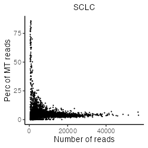
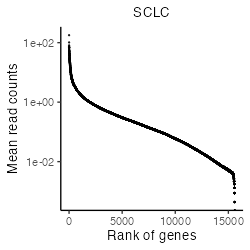

Analysis of small cell lung cancer dataset
================
Keita Iida
2022-02-19

-   [1 Install libraries](#install-libraries)
-   [2 Introduction](#introduction)
-   [3 Prepare scRNA-seq data (Stewart et
    al., 2020)](#prepare-scrna-seq-data-stewart-et-al-2020)
    -   [3.1 SCLC with cisplatin
        treatment](#sclc-with-cisplatin-treatment)
-   [4 Preprocessing](#preprocessing)
    -   [4.1 Control data quality](#control-data-quality)

# 1 Install libraries

Attach necessary libraries:

``` r
library(ASURAT)
library(SingleCellExperiment)
library(SummarizedExperiment)
```

<br>

# 2 Introduction

In this vignette, we analyze single-cell RNA sequencing (scRNA-seq) data
obtained from small cell lung cancer (SCLC) patients with cisplatin
treatment (Stewart et al., Nat. Cancer 1, 2020).

<br>

# 3 Prepare scRNA-seq data (Stewart et al., 2020)

## 3.1 SCLC with cisplatin treatment

The data can be loaded by the following code:

``` r
sclc <- readRDS(url("https://figshare.com/ndownloader/files/34112474"))
```

The data are stored in
[DOI:10.6084/m9.figshare.19200254](https://figshare.com/account/projects/132986/articles/19200254)
and the generating process is described below.

<br>

The data were obtained from NCBI repository with accession number
GSE138474:
[GSM4104164](https://www.ncbi.nlm.nih.gov/geo/query/acc.cgi?acc=GSM4104164).
The following functions `read_matrix_10xdata()` and
`read_gene_10xdata()` process the scRNA-seq data into a raw count matrix
and gene dataframe. Here, `make.unique()` is applied for naming gene
symbols, which appends a sequential number with a period delimiter for
every repeat name encountered.

``` r
read_matrix_10xdata <- function(path_dir){
  barcode.path <- paste0(path_dir, "barcodes.tsv.gz")
  feature.path <- paste0(path_dir, "features.tsv.gz")
  matrix.path  <- paste0(path_dir, "matrix.mtx.gz")
  mat <- as.matrix(Matrix::readMM(file = matrix.path))
  genes <- read.delim(feature.path, header = FALSE, stringsAsFactors = FALSE)
  barcodes <- read.delim(barcode.path, header = FALSE, stringsAsFactors = FALSE)
  rownames(mat) <- make.unique(as.character(genes$V2))
  colnames(mat) <- barcodes$V1
  return(mat)
}
read_gene_10xdata <- function(path_dir){
  feature.path <- paste0(path_dir, "features.tsv.gz")
  genes <- read.delim(feature.path, header = FALSE, stringsAsFactors = FALSE)
  return(genes)
}
```

Create a SingleCellExperiment object by inputting a raw read count
table.

``` r
path_dir <- "../rawdata/2020_001_stewart/sc68_cisp/SRR10211593_count/"
path_dir <- paste0(path_dir, "filtered_feature_bc_matrix/")
sclc <- read_matrix_10xdata(path_dir = path_dir)
sclc <- SingleCellExperiment(assays = list(counts = sclc),
                             rowData = data.frame(gene = rownames(sclc)),
                             colData = data.frame(cell = colnames(sclc)))
```

``` r
dim(sclc)
```

    [1] 33538  3433

<br>

# 4 Preprocessing

## 4.1 Control data quality

Remove variables (genes) and samples (cells) with low quality, by
processing the following three steps:

1.  remove variables based on expression profiles across samples,
2.  remove samples based on the numbers of reads and nonzero expressed
    variables,
3.  remove variables based on the mean read counts across samples.

First of all, add metadata for both variables and samples using ASURAT
function `add_metadata()`.

The arguments are

-   `sce`: SingleCellExperiment object, and
-   `mitochondria_symbol`: a string representing for mitochondrial
    genes.

``` r
sclc <- add_metadata(sce = sclc, mitochondria_symbol = "^MT-")
```

One can check the results in `rowData(sce)` and `colData(sce)` slots.

<br>

### 4.1.1 Remove variables based on expression profiles

ASURAT function `remove_variables()` removes variable (gene) data such
that the numbers of non-zero expressing samples (cells) are less than
`min_nsamples`.

``` r
sclc <- remove_variables(sce = sclc, min_nsamples = 10)
```

<br>

### 4.1.2 Remove samples based on expression profiles

Qualities of sample (cell) data are confirmed based on proper
visualization of `colData(sce)`. ASURAT function `plot_dataframe2D()`
shows scatter plots of two-dimensional data (see
[here](#visualization_lowdim) for details).

``` r
dataframe2D <- data.frame(x = colData(sclc)$nReads, y = colData(sclc)$nGenes)
plot_dataframe2D(dataframe2D = dataframe2D) +
  ggplot2::labs(title = "SCLC", x = "Number of reads", y = "Number of genes") +
  ggplot2::theme_classic(base_size = 20) +
  ggplot2::theme(plot.title = ggplot2::element_text(hjust = 0.5))
```

``` r
dataframe2D <- data.frame(x = colData(sclc)$nReads, y = colData(sclc)$percMT)
plot_dataframe2D(dataframe2D = dataframe2D) +
  ggplot2::labs(title = "SCLC", x = "Number of reads", y = "Perc of MT reads") +
  ggplot2::theme_classic(base_size = 20) +
  ggplot2::theme(plot.title = ggplot2::element_text(hjust = 0.5))
```




ASURAT function `remove_samples()` removes sample (cell) data by setting
cutoff values for the metadata.

The arguments are

-   `sce`: SingleCellExperiment object,
-   `min_nReads` and `max_nReads`: minimum and maximum number of reads,
-   `min_nGenes` and `max_nGenes`: minimum and maximum number of
    non-zero expressed genes, and
-   `min_percMT` and `max_percMT`: minimum and maximum percent of reads
    that map to mitochondrial genes, respectively.

``` r
sclc <- remove_samples(sce = sclc, min_nReads = 1400, max_nReads = 40000,
                       min_nGenes = 1400, max_nGenes = 1e+10,
                       min_percMT = 0, max_percMT = 15)
```

<br>

### 4.1.3 Remove variables based on the mean read counts

Qualities of variable (gene) data are confirmed based on proper
visualization of `rowData(sce)`. ASURAT function `plot_dataframe2D()`
shows scatter plots of two-dimensional data (see
[here](#visualization_lowdim) for details).

``` r
dataframe2D <- data.frame(x = seq_len(nrow(rowData(sclc))),
                          y = sort(rowData(sclc)$nSamples, decreasing = TRUE))
plot_dataframe2D(dataframe2D = dataframe2D) +
  ggplot2::labs(title = "SCLC", x = "Rank of genes", y = "Mean read counts") +
  ggplot2::theme_classic(base_size = 20) +
  ggplot2::theme(plot.title = ggplot2::element_text(hjust = 0.5))
```



ASURAT function `remove_variables_second()` removes variable (gene) data
such that the mean read counts across samples are less than
`min_meannReads`.

``` r
sclc <- remove_variables_second(sce = sclc, min_meannReads = 0.10)
```

``` r
dim(sclc)
```

    [1] 8679 2165
