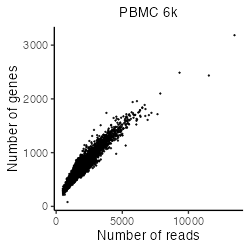
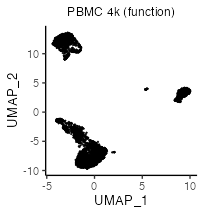
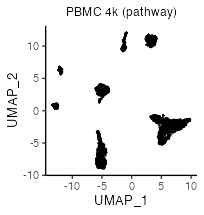
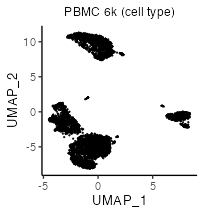
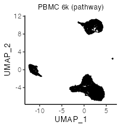
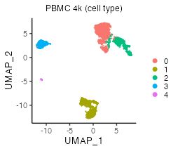
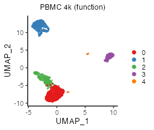

```{r, include = FALSE}
knitr::opts_chunk$set(
  collapse = TRUE,
  comment = "#>"
)
```


# Install libraries
Attach necessary libraries:
```{r, eval = FALSE}
library(ASURAT)
library(SingleCellExperiment)
library(SummarizedExperiment)
```


<br>

# Introduction
In this vignette, we analyze single-cell RNA sequencing (scRNA-seq) data
obtained from peripheral blood mononuclear cells (PBMCs) of healthy donors, and
PBMCs of donors with and without bacterial sepsis
(Reyes et al., Nat. Med. 26, 2020).


<br>

# Prepare scRNA-seq data
## PBMC 4k and 6k
The data can be loaded by the following code:
```{r, eval = FALSE}
pbmc4k <- readRDS(url("https://figshare.com/ndownloader/files/34112459"))
pbmc6k <- readRDS(url("https://figshare.com/ndownloader/files/34112462"))
```
The data are stored in
[DOI:10.6084/m9.figshare.19200254](https://figshare.com/s/866fbf822a4bfab234e6)
and the generating process is described below.

<br>

The data were obtained from 10x Genomics repository (PBMC 4k and 6k).
Create SingleCellExperiment objects by inputting raw read count tables.
```{r, eval = FALSE}
# --------------------------------------
# PBMC 4k
# --------------------------------------
path_dir <- "rawdata/2020_001_10xgenomics/pbmc_4k/"
path_dir <- paste0(path_dir, "filtered_gene_bc_matrices/GRCh38/")
pbmc4k <- Seurat::Read10X(data.dir = path_dir, gene.column = 2,
                          unique.features = TRUE, strip.suffix = FALSE)
# --------------------------------------
# PBMC 6k
# --------------------------------------
path_dir <- "rawdata/2020_001_10xgenomics/pbmc_6k/"
path_dir <- paste(path_dir, "filtered_matrices_mex/hg19/", sep = "")
pbmc6k <- Seurat::Read10X(data.dir = path_dir, gene.column = 2,
                          unique.features = TRUE, strip.suffix = FALSE)
```

```{r, eval = FALSE}
matrices <- list(PBMC4k = as.matrix(pbmc4k), PBMC6k = as.matrix(pbmc6k))
pbmcs <- list()
for(i in seq_len(length(matrices))){
  d <- matrices[[i]]
  colnames(d) <- paste0(names(matrices)[i], "-", colnames(d))
  pbmcs[[i]] <- SingleCellExperiment(assays = list(counts = as.matrix(d)),
                                     rowData = data.frame(gene = rownames(d)),
                                     colData = data.frame(sample = colnames(d)))
}
names(pbmcs) <- c("PBMC-4k", "PBMC-6k")
```

```{r, eval = FALSE}
rbind(dim(pbmcs[[1]]), dim(pbmcs[[2]]))
```
```
      [,1] [,2]
[1,] 33694 4340
[2,] 32738 5419
```

Add metadata for both variables and samples using ASURAT function
`add_metadata()`.
```{r, eval = FALSE}
for(i in seq_len(length(pbmcs))){
  pbmcs[[i]] <- add_metadata(sce = pbmcs[[i]], mitochondria_symbol = "^MT-")
}
```

Qualities of sample (cell) data are confirmed based on proper visualization of
`colData(sce)`.
ASURAT function `plot_dataframe2D()` shows scatter plots of two-dimensional data.
```{r, eval = FALSE}
for(i in seq_len(length(pbmcs))){
  dataframe2D <- data.frame(x = colData(pbmcs[[i]])$nReads,
                            y = colData(pbmcs[[i]])$nGenes)
  p <- plot_dataframe2D(dataframe2D = dataframe2D) +
    ggplot2::labs(title = names(pbmcs)[i],
                  x = "Number of reads", y = "Number of genes") +
    ggplot2::theme_classic(base_size = 20) +
    ggplot2::theme(plot.title = ggplot2::element_text(hjust = 0.5))
  filename <- paste0("figures/figure_04_0005_", i, ".png")
  ggplot2::ggsave(file = filename, plot = p, dpi = 100, width = 5, height = 5)
}
```


Confirming that the data qualities are comparable among experimental batches,
concatenate all the objects horizontally.
```{r, eval = FALSE}
# Take intersection of genes.
genes <- intersect(rownames(pbmcs[[1]]), rownames(pbmcs[[2]]))
for(i in seq_len(length(pbmcs))){
  pbmcs[[i]] <- pbmcs[[i]][genes, ]
  rowData(pbmcs[[i]])$nSamples <- NULL
}
# Horizontally concatenate SingleCellExperiment objects.
pbmc4k6k <- cbind(pbmcs[[1]], pbmcs[[2]])
colData(pbmc4k6k)$batch <- ifelse(grepl("PBMC4k", colData(pbmc4k6k)$sample),
                                  "PBMC4k", "PBMC6k")
# Add metadata again.
pbmc4k6k <- add_metadata(sce = pbmc4k6k, mitochondria_symbol = "^MT-")
```

```{r, eval = FALSE, echo = FALSE}
# Save data.
saveRDS(pbmc4k6k, file = "backup/04_001_pbmc4k6k_data.rds")

# Load data.
pbmc4k6k <- readRDS("backup/04_001_pbmc4k6k_data.rds")
```


<br>

## PBMCs with and without sepsis (Reyes et al., 2020)
The data can be loaded by the following code:
```{r, eval = FALSE}
pbmc130k <- readRDS(url("https://figshare.com/ndownloader/files/34112465"))
```
The data are stored in
[DOI:10.6084/m9.figshare.19200254](https://figshare.com/s/866fbf822a4bfab234e6)
and the generating process is described below.

<br>

The data were obtained from Broad Institute Single Cell Portal:
[SCP548](https://singlecell.broadinstitute.org/single_cell?type=study&page=1&terms=SCP548).
Since the file size of the raw read count table is huge (~5.61 GB),
we briefly removed gene and cell data such that the numbers of non-zero
expressing cells are less than 100 and the numbers of sequencing reads are
less than 2000, respectively, by using perl scripts as follows:
```{perl, eval = FALSE}
perl ../perl/pg_01_add_nsamples.pl
perl ../perl/pg_02_add_nreads.pl
perl ../perl/pg_03_remove_variables.pl
perl ../perl/pg_05_remove_samples_2nd.pl
```

Create a SingleCellExperiment object by inputting a raw read count table.
```{r, eval = FALSE}
# Load a raw read count table.
fn <- "rawdata/2020_001_Reyes/SCP548/expression/"
fn <- paste0(fn, "scp_gex_matrix_red2.csv")
pbmc130k <- read.csv(fn, check.names = FALSE)
genes <- pbmc130k[-1, 2]
cells <- colnames(pbmc130k)[-seq_len(2)]
pbmc130k <- pbmc130k[-1, -seq_len(2)]
rownames(pbmc130k) <- genes
colnames(pbmc130k) <- cells
# Load sample information
info <- read.delim("rawdata/2020_001_Reyes/SCP548/metadata/scp_meta.txt")
info <- info[-1, ]
rownames(info) <- info$NAME
info <- info[, -1]
info <- info[cells, ]
# Create a SingleCellExperiment object.
pbmc130k <- SingleCellExperiment(assays = list(counts = as.matrix(pbmc130k)),
                                 rowData = data.frame(gene = rownames(pbmc130k)),
                                 colData = as.data.frame(info))
```

```{r, eval = FALSE}
dim(pbmc130k)
```
```
[1] 14973 60022
```

Add metadata for both variables and samples using ASURAT function
`add_metadata()`.
```{r, eval = FALSE}
pbmc130k <- add_metadata(sce = pbmc130k, mitochondria_symbol = "^MT-")
```

```{r, eval = FALSE, echo = FALSE}
# Save data.
saveRDS(pbmc130k, file = "backup/05_001_pbmc130k_data.rds")

# Load data.
pbmc130k <- readRDS("backup/05_001_pbmc130k_data.rds")
```


<br>

# Preprocessing
## Control data quality
Remove variables (genes) and samples (cells) with low quality,
by processing the following three steps:

1. remove variables based on expression profiles across samples,
2. remove samples based on the numbers of reads and nonzero expressed variables,
3. remove variables based on the mean read counts across samples.


<br>

### Remove variables based on expression profiles
ASURAT function `remove_variables()` removes variable (gene) data such that
the numbers of non-zero expressing samples (cells) are less than `min_nsamples`.
```{r, eval = FALSE}
pbmc4k6k <- remove_variables(sce = pbmc4k6k, min_nsamples = 10)
pbmc130k <- remove_variables(sce = pbmc130k, min_nsamples = 100)
```


<br>

### Remove samples based on expression profiles
Qualities of sample (cell) data are confirmed based on proper visualization of
`colData(sce)`.
ASURAT function `plot_dataframe2D()` shows scatter plots of two-dimensional data.
```{r, eval = FALSE, echo = FALSE}
# --------------------------------------
# PBMC 4k and 6k
# --------------------------------------
dataframe2D <- data.frame(x = colData(pbmc4k6k)$nReads,
                          y = colData(pbmc4k6k)$nGenes)
p <- plot_dataframe2D(dataframe2D = dataframe2D) +
  ggplot2::labs(title = "PBMC 4k & 6k",
                x = "Number of reads", y = "Number of genes") +
  ggplot2::theme_classic(base_size = 20) +
  ggplot2::theme(plot.title = ggplot2::element_text(hjust = 0.5))
filename <- "figures/figure_04_0010.png"
ggplot2::ggsave(file = filename, plot = p, dpi = 100, width = 5, height = 5)
# --------------------------------------
# PBMC (Reyes et al.)
# --------------------------------------
dataframe2D <- data.frame(x = colData(pbmc130k)$nReads,
                          y = colData(pbmc130k)$nGenes)
p <- plot_dataframe2D(dataframe2D = dataframe2D) +
  ggplot2::labs(title = "PBMC (Reyes et al., 2020)",
                x = "Number of reads", y = "Number of genes") +
  ggplot2::theme_classic(base_size = 20) +
  ggplot2::theme(plot.title = ggplot2::element_text(hjust = 0.5))
filename <- "figures/figure_05_0010.png"
ggplot2::ggsave(file = filename, plot = p, dpi = 100, width = 5, height = 5)
```




```{r, eval = FALSE, echo = FALSE}
# --------------------------------------
# PBMC 4k and 6k
# --------------------------------------
dataframe2D <- data.frame(x = colData(pbmc4k6k)$nReads,
                          y = colData(pbmc4k6k)$percMT)
p <- plot_dataframe2D(dataframe2D = dataframe2D) +
  ggplot2::labs(title = "PBMC 4k & 6k",
                x = "Number of reads", y = "Perc of MT reads") +
  ggplot2::theme_classic(base_size = 20) +
  ggplot2::theme(plot.title = ggplot2::element_text(hjust = 0.5))
filename <- "figures/figure_04_0011.png"
ggplot2::ggsave(file = filename, plot = p, dpi = 100, width = 5, height = 5)
# --------------------------------------
# PBMC (Reyes et al.)
# --------------------------------------
dataframe2D <- data.frame(x = colData(pbmc130k)$nReads,
                          y = colData(pbmc130k)$percMT)
p <- plot_dataframe2D(dataframe2D = dataframe2D) +
  ggplot2::labs(title = "PBMC (Reyes et al., 2020)",
                x = "Number of reads", y = "Perc of MT reads") +
  ggplot2::theme_classic(base_size = 20) +
  ggplot2::theme(plot.title = ggplot2::element_text(hjust = 0.5))
filename <- "figures/figure_05_0011.png"
ggplot2::ggsave(file = filename, plot = p, dpi = 100, width = 5, height = 5)
```


ASURAT function `remove_samples()` removes sample (cell) data by setting cutoff
values for the metadata.
```{r, eval = FALSE}
pbmc4k6k <- remove_samples(sce = pbmc4k6k,
                           min_nReads = 2000, max_nReads = 20000,
                           min_nGenes = 500, max_nGenes = 1e+10,
                           min_percMT = 0, max_percMT = 10)
pbmc130k <- remove_samples(sce = pbmc130k,
                           min_nReads = 2000, max_nReads = 30000,
                           min_nGenes = 500, max_nGenes = 1e+10,
                           min_percMT = 0, max_percMT = 10)
```


<br>

### Remove variables based on the mean read counts
Qualities of variable (gene) data are confirmed based on proper visualization of
`rowData(sce)`.
ASURAT function `plot_dataframe2D()` shows scatter plots of two-dimensional data.
```{r, eval = FALSE, echo = FALSE}
# --------------------------------------
# PBMC 4k and 6k
# --------------------------------------
dataframe2D <- data.frame(x = seq_len(nrow(rowData(pbmc4k6k))),
                          y = sort(rowData(pbmc4k6k)$nSamples, decreasing = TRUE))
p <- plot_dataframe2D(dataframe2D = dataframe2D) +
  ggplot2::labs(title = "PBMC 4k & 6k",
                x = "Rank of genes", y = "Mean read counts") +
  ggplot2::theme_classic(base_size = 20) +
  ggplot2::theme(plot.title = ggplot2::element_text(hjust = 0.5))
filename <- "figures/figure_04_0015.png"
ggplot2::ggsave(file = filename, plot = p, dpi = 100, width = 5, height = 5)
# --------------------------------------
# PBMC (Reyes et al.)
# --------------------------------------
dataframe2D <- data.frame(x = seq_len(nrow(rowData(pbmc130k))),
                          y = sort(rowData(pbmc130k)$nSamples, decreasing = TRUE))
p <- plot_dataframe2D(dataframe2D = dataframe2D) +
  ggplot2::labs(title = "PBMC (Reyes et al., 2020)",
                x = "Rank of genes", y = "Mean read counts") +
  ggplot2::theme_classic(base_size = 20) +
  ggplot2::theme(plot.title = ggplot2::element_text(hjust = 0.5))
filename <- "figures/figure_05_0015.png"
ggplot2::ggsave(file = filename, plot = p, dpi = 100, width = 5, height = 5)
```


ASURAT function `remove_variables_second()` removes variable (gene) data
such that the mean read counts across samples are less than `min_meannReads`.
```{r, eval = FALSE}
pbmc4k6k <- remove_variables_second(sce = pbmc4k6k, min_meannReads = 0.05)
pbmc130k <- remove_variables_second(sce = pbmc130k, min_meannReads = 0.05)
```

```{r, eval = FALSE}
rbind(dim(pbmc4k6k), dim(pbmc130k))
```
```
[1,] 5797  6336
[2,] 5725 59879
```

```{r, eval = FALSE, echo = FALSE}
# Save data.
saveRDS(pbmc4k6k, file = "backup/04_002_pbmc4k6k_dataqc.rds")
saveRDS(pbmc130k, file = "backup/05_002_pbmc130k_dataqc.rds")

# Load data.
pbmc4k6k <- readRDS("backup/04_002_pbmc4k6k_dataqc.rds")
pbmc130k <- readRDS("backup/05_002_pbmc130k_dataqc.rds")
```


<br>

## Normalize data
### PBMCs (4k and 6k)
Normalize the data using bayNorm (Tang et al., Bioinformatics, 2020) and
Seurat functions (Butler Nat. Biotechnol., 2018), removing batch effects.
```{r, eval = FALSE}
# Use bayNorm.
BETA <- bayNorm::BetaFun(Data = assay(pbmc4k6k, "counts"), MeanBETA = 0.06)
bay_out <- bayNorm::bayNorm(assay(pbmc4k6k, "counts"),
                            Conditions = colData(pbmc4k6k)$batch,
                            BETA_vec = BETA[["BETA"]], Prior_type = "GG",
                            mode_version = TRUE)
# Use Seurat.
surt <- list(PBMC4k = bay_out[["Bay_out_list"]][["Group PBMC4k"]],
             PBMC6k = bay_out[["Bay_out_list"]][["Group PBMC6k"]])
for(i in seq_len(length(surt))){
  surt[[i]] <- Seurat::CreateSeuratObject(counts = surt[[i]],
                                          project = names(surt)[i])
  surt[[i]] <- Seurat::NormalizeData(surt[[i]])
  surt[[i]] <- Seurat::FindVariableFeatures(surt[[i]], selection.method = "vst",
                                            nfeatures = 5500)
}
genes <- Seurat::SelectIntegrationFeatures(object.list = surt, nfeatures = 5500)
anchors <- Seurat::FindIntegrationAnchors(object.list = surt,
                                          anchor.features = genes)
pbmc_surt <- Seurat::IntegrateData(anchorset = anchors,
                                   normalization.method = "LogNormalize")
pbmc4k6k <- pbmc4k6k[genes, ]
assay(pbmc4k6k, "logcounts") <- pbmc_surt@assays$integrated@data[genes, ]
```

Center row data.
```{r, eval = FALSE}
mat <- assay(pbmc4k6k, "logcounts")
assay(pbmc4k6k, "centered") <- sweep(mat, 1, apply(mat, 1, mean), FUN = "-")
```

```{r, eval = FALSE, echo = FALSE}
# Save data.
saveRDS(pbmc4k6k, file = "backup/04_003_pbmc4k6k_normalized.rds")

# Load data.
pbmc4k6k <- readRDS("backup/04_003_pbmc4k6k_normalized.rds")
```


<br>

### PBMC (Reyes et al., 2020)
Normalize the data using bayNorm functions (Tang et al., Bioinformatics, 2020),
removing batch effects.
```{r, eval = FALSE}
# Use bayNorm.
BETA <- bayNorm::BetaFun(Data = assay(pbmc130k, "counts"), MeanBETA = 0.06)
bay_out <- bayNorm::bayNorm(assay(pbmc130k, "counts"),
                            Conditions = colData(pbmc130k)$Patient,
                            BETA_vec = BETA[["BETA"]], Prior_type = "GG",
                            mode_version = TRUE)
mat_list <- bay_out[["Bay_out_list"]]
mat <- do.call("cbind", mat_list)
pbmc130k <- pbmc130k[, colnames(mat)]
assay(pbmc130k, "normalized") <- mat
```

Perform log-normalization with a pseudo count.
```{r, eval = FALSE}
assay(pbmc130k, "logcounts") <- log(assay(pbmc130k, "normalized") + 1)
```

Center row data.
```{r, eval = FALSE}
mat <- assay(pbmc130k, "logcounts")
assay(pbmc130k, "centered") <- sweep(mat, 1, apply(mat, 1, mean), FUN = "-")
```

```{r, eval = FALSE, echo = FALSE}
# Save data.
saveRDS(pbmc130k, file = "backup/05_003_pbmc130k_normalizd.rds")

# Load data.
pbmc130k <- readRDS("backup/05_003_pbmc130k_normalizd.rds")
```


<br>

# Multifaceted sign analysis {#sign}
Infer cell or disease types, biological functions, and signaling pathway
activity at the single-cell level by inputting related databases.

ASURAT transforms centered read count tables to functional feature matrices,
termed sign-by-sample matrices (SSMs).
Using SSMs, perform unsupervised clustering of samples (cells).


<br>

## Load databases
Load databases.
```{r, eval = FALSE}
urlpath <- "https://github.com/keita-iida/ASURATDB/blob/main/genes2bioterm/"
load(url(paste0(urlpath, "20220108_human_COMSig.rda?raw=TRUE"))) # CO & MSigDB
load(url(paste0(urlpath, "20201213_human_GO_red.rda?raw=TRUE"))) # GO
load(url(paste0(urlpath, "20201213_human_KEGG.rda?raw=TRUE")))   # KEGG
```
The reformatted knowledge-based data were available from the following
repositories:

* [DOI:10.6084/m9.figshare.19102598](https://figshare.com/s/0599d2de970c2deb675c)
* [Github ASURATDB](https://github.com/keita-iida/ASURATDB)

Prepare correlation matrices of gene expressions.
```{r, eval = FALSE}
pbmc4k6k_cormat <- cor(t(as.matrix(assay(pbmc4k6k, "centered"))), method = "spearman")
pbmc130k_cormat <- cor(t(as.matrix(assay(pbmc130k, "centered"))), method = "spearman")
```

Set gene expression data into `altExp(sce)`.
```{r, eval = FALSE}
sname <- "logcounts"
altExp(pbmc4k6k, sname) <- SummarizedExperiment(list(counts = assay(pbmc4k6k, sname)))
altExp(pbmc130k, sname) <- SummarizedExperiment(list(counts = assay(pbmc130k, sname)))
```

Add ENTREZ Gene IDs to `rowData(sce)`.
```{r, eval = FALSE}
# --------------------------------------
# PBMC 4k and 6k
# --------------------------------------
dictionary <- AnnotationDbi::select(org.Hs.eg.db::org.Hs.eg.db,
                                    key = rownames(pbmc4k6k),
                                    columns = "ENTREZID", keytype = "SYMBOL")
dictionary <- dictionary[!duplicated(dictionary$SYMBOL), ]
rowData(pbmc4k6k)$geneID <- dictionary$ENTREZID
# --------------------------------------
# PBMC (Reyes et al.)
# --------------------------------------
dictionary <- AnnotationDbi::select(org.Hs.eg.db::org.Hs.eg.db,
                                    key = rownames(pbmc130k),
                                    columns = "ENTREZID", keytype = "SYMBOL")
dictionary <- dictionary[!duplicated(dictionary$SYMBOL), ]
rowData(pbmc130k)$geneID <- dictionary$ENTREZID
```

Add formatted databases to `metadata(sce)$sign`.
```{r, eval = FALSE}
# --------------------------------------
# PBMC 4k and 6k
# --------------------------------------
pbmcs <- list(CM = pbmc4k6k, GO = pbmc4k6k, KG = pbmc4k6k)
metadata(pbmcs$CM) <- list(sign = human_COMSig[["cell"]])
metadata(pbmcs$GO) <- list(sign = human_GO[["BP"]])
metadata(pbmcs$KG) <- list(sign = human_KEGG[["pathway"]])
# --------------------------------------
# PBMC (Reyes et al.)
# --------------------------------------
reyes <- list(CM = pbmc130k, GO = pbmc130k, KG = pbmc130k)
metadata(reyes$CM) <- list(sign = human_COMSig[["cell"]])
metadata(reyes$GO) <- list(sign = human_GO[["BP"]])
metadata(reyes$KG) <- list(sign = human_KEGG[["pathway"]])
```


<br>

## Create signs
ASURAT function `remove_signs()` redefines functional gene sets for the
input database by removing genes, which are not included in `rownames(sce)`,
and further removes biological terms including too few or too many genes.
```{r, eval = FALSE}
# --------------------------------------
# PBMC 4k and 6k
# --------------------------------------
pbmcs$CM <- remove_signs(sce = pbmcs$CM, min_ngenes = 2, max_ngenes = 1000)
pbmcs$GO <- remove_signs(sce = pbmcs$GO, min_ngenes = 2, max_ngenes = 1000)
pbmcs$KG <- remove_signs(sce = pbmcs$KG, min_ngenes = 2, max_ngenes = 1000)
# --------------------------------------
# PBMC (Reyes et al.)
# --------------------------------------
reyes$CM <- remove_signs(sce = reyes$CM, min_ngenes = 2, max_ngenes = 1000)
reyes$GO <- remove_signs(sce = reyes$GO, min_ngenes = 2, max_ngenes = 1000)
reyes$KG <- remove_signs(sce = reyes$KG, min_ngenes = 2, max_ngenes = 1000)
```

ASURAT function `cluster_genes()` clusters functional gene sets using
a correlation graph-based decomposition method, which produces strongly,
variably, and weakly correlated gene sets (SCG, VCG, and WCG, respectively).
```{r, eval = FALSE}
# --------------------------------------
# PBMC 4k and 6k
# --------------------------------------
set.seed(1)
pbmcs$CM <- cluster_genesets(sce = pbmcs$CM, cormat = pbmc4k6k_cormat,
                             th_posi = 0.24, th_nega = -0.24)
pbmcs$GO <- cluster_genesets(sce = pbmcs$GO, cormat = pbmc4k6k_cormat,
                             th_posi = 0.22, th_nega = -0.28)
pbmcs$KG <- cluster_genesets(sce = pbmcs$KG, cormat = pbmc4k6k_cormat,
                             th_posi = 0.27, th_nega = -0.20)
# --------------------------------------
# PBMC (Reyes et al.)
# --------------------------------------
set.seed(1)
reyes$CM <- cluster_genesets(sce = reyes$CM, cormat = pbmc130k_cormat,
                             th_posi = 0.22, th_nega = -0.20)
reyes$GO <- cluster_genesets(sce = reyes$GO, cormat = pbmc130k_cormat,
                             th_posi = 0.28, th_nega = -0.22)
reyes$KG <- cluster_genesets(sce = reyes$KG, cormat = pbmc130k_cormat,
                             th_posi = 0.30, th_nega = -0.20)
```

ASURAT function `create_signs()` creates signs by the following criteria:

1. the number of genes in SCG>= `min_cnt_strg` (the default value is 2) and
2. the number of genes in VCG>= `min_cnt_vari` (the default value is 2),

which are independently applied to SCGs and VCGs, respectively.
```{r, eval = FALSE}
# --------------------------------------
# PBMC 4k and 6k
# --------------------------------------
pbmcs$CM <- create_signs(sce = pbmcs$CM, min_cnt_strg = 2, min_cnt_vari = 2)
pbmcs$GO <- create_signs(sce = pbmcs$GO, min_cnt_strg = 2, min_cnt_vari = 2)
pbmcs$KG <- create_signs(sce = pbmcs$KG, min_cnt_strg = 2, min_cnt_vari = 2)
# --------------------------------------
# PBMC (Reyes et al.)
# --------------------------------------
reyes$CM <- create_signs(sce = reyes$CM, min_cnt_strg = 2, min_cnt_vari = 2)
reyes$GO <- create_signs(sce = reyes$GO, min_cnt_strg = 2, min_cnt_vari = 2)
reyes$KG <- create_signs(sce = reyes$KG, min_cnt_strg = 2, min_cnt_vari = 2)
```


<br>

## Select useful signs
If signs have semantic similarity information, one can use ASURAT function
`remove_signs_redundant()` for removing redundant sings using the semantic
similarity matrices.
```{r, eval = FALSE}
# --------------------------------------
# PBMC 4k and 6k
# --------------------------------------
pbmcs$GO <- remove_signs_redundant(
  sce = pbmcs$GO, similarity_matrix = human_GO$similarity_matrix$BP,
  threshold = 0.80, keep_rareID = TRUE)
# --------------------------------------
# PBMC (Reyes et al.)
# --------------------------------------
reyes$GO <- remove_signs_redundant(
  sce = reyes$GO, similarity_matrix = human_GO$similarity_matrix$BP,
  threshold = 0.80, keep_rareID = TRUE)
```

ASURAT function `remove_signs_manually()` removes signs by specifying
IDs (e.g., `GOID:XXX`) or descriptions (e.g., `metabolic`) using `grepl()`.
```{r, eval = FALSE}
# --------------------------------------
# PBMC 4k and 6k
# --------------------------------------
keywords <- "Covid|COVID|foofoo|hogehoge"
pbmcs$KG <- remove_signs_manually(sce = pbmcs$KG, keywords = keywords)
# --------------------------------------
# PBMC (Reyes et al.)
# --------------------------------------
keywords <- "Covid|COVID|foofoo|hogehoge"
reyes$KG <- remove_signs_manually(sce = reyes$KG, keywords = keywords)
```


<br>

## Create sign-by-sample matrices
ASURAT function `create_sce_signmatrix()` creates a new SingleCellExperiment
object `new_sce`, consisting of the following information:

* `assayNames(new_sce)`: counts (SSM whose entries are termed sign scores),
* `names(colData(new_sce))`: nReads, nGenes, percMT,
* `names(rowData(new_sce))`: ParentSignID, Description, CorrGene, etc.,
* `names(metadata(new_sce))`: sign_SCG, sign_VCG, etc.,
* `altExpNames(new_sce)`: something if there is data in `altExp(sce)`.
```{r, eval = FALSE}
# --------------------------------------
# PBMC 4k and 6k
# --------------------------------------
pbmcs$CM <- makeSignMatrix(sce = pbmcs$CM, weight_strg = 0.5, weight_vari = 0.5)
pbmcs$GO <- makeSignMatrix(sce = pbmcs$GO, weight_strg = 0.5, weight_vari = 0.5)
pbmcs$KG <- makeSignMatrix(sce = pbmcs$KG, weight_strg = 0.5, weight_vari = 0.5)
# --------------------------------------
# PBMC (Reyes et al.)
# --------------------------------------
reyes$CM <- makeSignMatrix(sce = reyes$CM, weight_strg = 0.5, weight_vari = 0.5)
reyes$GO <- makeSignMatrix(sce = reyes$GO, weight_strg = 0.5, weight_vari = 0.5)
reyes$KG <- makeSignMatrix(sce = reyes$KG, weight_strg = 0.5, weight_vari = 0.5)
```

<br>

## Reduce dimensions of sign-by-sample matrices {#dim_reduction}
Perform t-distributed stochastic neighbor embedding.
```{r, eval = FALSE}
# --------------------------------------
# PBMC 4k and 6k
# --------------------------------------
set.seed(1)
for(i in seq_len(length(pbmcs))){
  res <- Rtsne::Rtsne(t(assay(pbmcs[[i]], "counts")), dim = 2, pca = FALSE)
  reducedDim(pbmcs[[i]], "TSNE") <- res[["Y"]]
}
# --------------------------------------
# PBMC (Reyes et al.)
# --------------------------------------
set.seed(1)
for(i in seq_len(length(reyes))){
  res <- prcomp(t(as.matrix(assay(reyes[[i]], "counts"))), scale = TRUE)
  res <- Rtsne::Rtsne(res$x[, seq_len(100)], dim = 2, pca = FALSE)
  reducedDim(reyes[[i]], "TSNE") <- res[["Y"]]
}
```

The results can be visualized by ASURAT functions `plot_dataframe2D()`.
```{r, eval = FALSE, echo = FALSE}
# --------------------------------------
# PBMC 4k and 6k
# --------------------------------------
dataframe2D <- as.data.frame(reducedDim(pbmcs$CM, "TSNE"))
p <- plot_dataframe2D(dataframe2D = dataframe2D) +
  ggplot2::labs(title = "PBMC 4k & 6k (CO & MSigDB)", x = "tSNE_1", y = "tSNE_2") +
  ggplot2::theme_classic(base_size = 15)
filename <- "figures/figure_04_0020.png"
ggplot2::ggsave(file = filename, plot = p, dpi = 100, width = 5, height = 5)

dataframe2D <- as.data.frame(reducedDim(pbmcs$GO, "TSNE"))
p <- plot_dataframe2D(dataframe2D = dataframe2D) +
  ggplot2::labs(title = "PBMC 4k & 6k (GO)", x = "tSNE_1", y = "tSNE_2") +
  ggplot2::theme_classic(base_size = 15)
filename <- "figures/figure_04_0021.png"
ggplot2::ggsave(file = filename, plot = p, dpi = 100, width = 5, height = 5)

dataframe2D <- as.data.frame(reducedDim(pbmcs$KG, "TSNE"))
p <- plot_dataframe2D(dataframe2D = dataframe2D) +
  ggplot2::labs(title = "PBMC 4k & 6k (KEGG)", x = "tSNE_1", y = "tSNE_2") +
  ggplot2::theme_classic(base_size = 15)
filename <- "figures/figure_04_0022.png"
ggplot2::ggsave(file = filename, plot = p, dpi = 100, width = 5, height = 5)
```

```{r, eval = FALSE, echo = FALSE}
# --------------------------------------
# PBMC (Reyes et al.)
# --------------------------------------
dataframe2D <- as.data.frame(reducedDim(reyes$CM, "TSNE"))
p <- plot_dataframe2D(dataframe2D = dataframe2D) +
  ggplot2::labs(title = "PBMC 130k (CO & MSigDB)", x = "tSNE_1", y = "tSNE_2") +
  ggplot2::theme_classic(base_size = 15)
filename <- "figures/figure_05_0020.png"
ggplot2::ggsave(file = filename, plot = p, dpi = 100, width = 5, height = 5)

dataframe2D <- as.data.frame(reducedDim(reyes$GO, "TSNE"))
p <- plot_dataframe2D(dataframe2D = dataframe2D) +
  ggplot2::labs(title = "PBMC 130k (GO)", x = "tSNE_1", y = "tSNE_2") +
  ggplot2::theme_classic(base_size = 15)
filename <- "figures/figure_05_0021.png"
ggplot2::ggsave(file = filename, plot = p, dpi = 100, width = 5, height = 5)

dataframe2D <- as.data.frame(reducedDim(reyes$KG, "TSNE"))
p <- plot_dataframe2D(dataframe2D = dataframe2D) +
  ggplot2::labs(title = "PBMC 130k (KEGG)", x = "tSNE_1", y = "tSNE_2") +
  ggplot2::theme_classic(base_size = 15)
filename <- "figures/figure_05_0022.png"
ggplot2::ggsave(file = filename, plot = p, dpi = 100, width = 5, height = 5)
```









```{r, eval = FALSE, echo = FALSE}
# Save data.
saveRDS(pbmcs, file = "backup/04_004_pbmc4k6k_ssm.rds")
saveRDS(reyes, file = "backup/05_004_pbmc130k_ssm.rds")

# Load data.
pbmcs <- readRDS("backup/04_004_pbmc4k6k_ssm.rds")
reyes <- readRDS("backup/05_004_pbmc130k_ssm.rds")
```


<br>

## Cluster cells
### Use Seurat functions
To date (December, 2021), one of the most useful clustering methods in scRNA-seq
data analysis is a combination of a community detection algorithm and
graph-based unsupervised clustering, developed in Seurat package.

In this tutorial, our strategy is as follows:

1. convert SingleCellExperiment objects into Seurat objects
  (note that `rowData()` and `colData()` must have data),
2. perform `ScaleData()`, `RunPCA()`, `FindNeighbors()`, and `FindClusters()`,
3. convert Seurat objects into temporal SingleCellExperiment objects `temp`,
4. add `colData(temp)$seurat_clusters` into `colData(sce)$seurat_clusters`.
```{r, eval = FALSE}
# --------------------------------------
# PBMC 4k and 6k
# --------------------------------------
resolutions <- c(0.10, 0.10, 0.15)
for(i in seq_len(length(pbmcs))){
  pbmcs_surt <- Seurat::as.Seurat(pbmcs[[i]], counts = "counts", data = "counts")
  pbmcs_surt[["SSM"]] <-
    Seurat::CreateAssayObject(counts = as.matrix(assay(pbmcs[[i]], "counts")))
  Seurat::DefaultAssay(pbmcs_surt) <- "SSM"
  pbmcs_surt <- Seurat::ScaleData(pbmcs_surt, features = rownames(pbmcs_surt))
  pbmcs_surt <- Seurat::RunPCA(pbmcs_surt, features = rownames(pbmcs_surt))
  pbmcs_surt <- Seurat::FindNeighbors(pbmcs_surt, reduction = "pca", dims = 1:50)
  pbmcs_surt <- Seurat::FindClusters(pbmcs_surt, resolution = resolutions[i])
  pbmcs_temp <- Seurat::as.SingleCellExperiment(pbmcs_surt)
  colData(pbmcs[[i]])$seurat_clusters <- colData(pbmcs_temp)$seurat_clusters
}
# --------------------------------------
# PBMC (Reyes et al.)
# --------------------------------------
resolutions <- c(0.10, 0.15, 0.15)
for(i in seq_len(length(reyes))){
  reyes_surt <- Seurat::as.Seurat(reyes[[i]], counts = "counts", data = "counts")
  reyes_surt[["SSM"]] <-
    Seurat::CreateAssayObject(counts = as.matrix(assay(reyes[[i]], "counts")))
  Seurat::DefaultAssay(reyes_surt) <- "SSM"
  reyes_surt <- Seurat::ScaleData(reyes_surt, features = rownames(reyes_surt))
  reyes_surt <- Seurat::RunPCA(reyes_surt, features = rownames(reyes_surt))
  reyes_surt <- Seurat::FindNeighbors(reyes_surt, reduction = "pca", dims = 1:50)
  reyes_surt <- Seurat::FindClusters(reyes_surt, resolution = resolutions[i])
  reyes_temp <- Seurat::as.SingleCellExperiment(reyes_surt)
  colData(reyes[[i]])$seurat_clusters <- colData(reyes_temp)$seurat_clusters
}
```

The results can be visualized by ASURAT functions `plot_dataframe2D()`.
```{r, eval = FALSE, echo = FALSE}
# --------------------------------------
# PBMC 4k and 6k
# --------------------------------------
labels <- colData(pbmcs$CM)$seurat_clusters
dataframe2D <- as.data.frame(reducedDim(pbmcs$CM, "TSNE"))
p <- plot_dataframe2D(dataframe2D = dataframe2D, labels = labels, colors = NULL) +
  ggplot2::labs(title = "PBMC 4k & 6k (CO & MSigDB)", x = "tSNE_1", y = "tSNE_2", color = "") +
  ggplot2::theme_classic(base_size = 20) +
  ggplot2::theme(plot.title = ggplot2::element_text(hjust = 0.5)) +
  ggplot2::guides(colour = ggplot2::guide_legend(override.aes = list(size = 4)))
filename <- "figures/figure_04_0030.png"
ggplot2::ggsave(file = filename, plot = p, dpi = 200, width = 5.7, height = 5)

labels <- colData(pbmcs$GO)$seurat_clusters
dataframe2D <- as.data.frame(reducedDim(pbmcs$GO, "TSNE"))
p <- plot_dataframe2D(dataframe2D = dataframe2D, labels = labels, colors = NULL) +
  ggplot2::labs(title = "PBMC 4k & 6k (GO)", x = "tSNE_1", y = "tSNE_2", color = "") +
  ggplot2::theme_classic(base_size = 20) +
  ggplot2::theme(plot.title = ggplot2::element_text(hjust = 0.5)) +
  ggplot2::guides(colour = ggplot2::guide_legend(override.aes = list(size = 4)))
filename <- "figures/figure_04_0031.png"
ggplot2::ggsave(file = filename, plot = p, dpi = 200, width = 5.7, height = 5)

labels <- colData(pbmcs$KG)$seurat_clusters
dataframe2D <- as.data.frame(reducedDim(pbmcs$KG, "TSNE"))
p <- plot_dataframe2D(dataframe2D = dataframe2D, labels = labels, colors = NULL) +
  ggplot2::labs(title = "PBMC 4k & 6k (KEGG)", x = "tSNE_1", y = "tSNE_2", color = "") +
  ggplot2::theme_classic(base_size = 20) +
  ggplot2::theme(plot.title = ggplot2::element_text(hjust = 0.5)) +
  ggplot2::guides(colour = ggplot2::guide_legend(override.aes = list(size = 4)))
filename <- "figures/figure_04_0032.png"
ggplot2::ggsave(file = filename, plot = p, dpi = 200, width = 5.7, height = 5)
```

```{r, eval = FALSE, echo = FALSE}
# --------------------------------------
# PBMC (Reyes et al.)
# --------------------------------------
labels <- colData(reyes$CM)$seurat_clusters
dataframe2D <- as.data.frame(reducedDim(reyes$CM, "TSNE"))
p <- plot_dataframe2D(dataframe2D = dataframe2D, labels = labels, colors = NULL) +
  ggplot2::labs(title = "PBMC 130k (CO & MSigDB)", x = "tSNE_1", y = "tSNE_2", color = "") +
  ggplot2::theme_classic(base_size = 20) +
  ggplot2::theme(plot.title = ggplot2::element_text(hjust = 0.5)) +
  ggplot2::guides(colour = ggplot2::guide_legend(override.aes = list(size = 4)))
filename <- "figures/figure_05_0030.png"
ggplot2::ggsave(file = filename, plot = p, dpi = 200, width = 5.7, height = 5)

labels <- colData(reyes$GO)$seurat_clusters
dataframe2D <- as.data.frame(reducedDim(reyes$GO, "TSNE"))
p <- plot_dataframe2D(dataframe2D = dataframe2D, labels = labels, colors = NULL) +
  ggplot2::labs(title = "PBMC 130k (GO)", x = "tSNE_1", y = "tSNE_2", color = "") +
  ggplot2::theme_classic(base_size = 20) +
  ggplot2::theme(plot.title = ggplot2::element_text(hjust = 0.5)) +
  ggplot2::guides(colour = ggplot2::guide_legend(override.aes = list(size = 4)))
filename <- "figures/figure_05_0031.png"
ggplot2::ggsave(file = filename, plot = p, dpi = 200, width = 5.7, height = 5)

labels <- colData(reyes$KG)$seurat_clusters
dataframe2D <- as.data.frame(reducedDim(reyes$KG, "TSNE"))
p <- plot_dataframe2D(dataframe2D = dataframe2D, labels = labels, colors = NULL) +
  ggplot2::labs(title = "PBMC 130k (KEGG)", x = "tSNE_1", y = "tSNE_2", color = "") +
  ggplot2::theme_classic(base_size = 20) +
  ggplot2::theme(plot.title = ggplot2::element_text(hjust = 0.5)) +
  ggplot2::guides(colour = ggplot2::guide_legend(override.aes = list(size = 4)))
filename <- "figures/figure_05_0032.png"
ggplot2::ggsave(file = filename, plot = p, dpi = 200, width = 5.7, height = 5)
```





<br>

## Investigate significant signs {#separation_index}
Significant signs are analogous to differentially expressed genes but bear
biological meanings.
Note that naïve usages of statistical tests should be avoided because the row
vectors of SSMs are centered.

Instead, ASURAT function `compute_sepI_all()` computes separation indices
for each cluster against the others.
Briefly, a separation index "sepI", ranging from -1 to 1, is a nonparametric
measure of significance of a given sign score for a given subpopulation.
The larger (resp. smaller) sepI is, the more reliable the sign is as a positive
(resp. negative) marker for the cluster.
```{r, eval = FALSE}
# --------------------------------------
# PBMC 4k and 6k
# --------------------------------------
for(i in seq_len(length(pbmcs))){
  set.seed(1)
  labels <- colData(pbmcs[[i]])$seurat_clusters
  pbmcs[[i]] <- compute_sepI_all(sce = pbmcs[[i]], labels = labels,
                                 nrand_samples = 1000)
}
# --------------------------------------
# PBMC (Reyes et al.)
# --------------------------------------
for(i in seq_len(length(reyes))){
  set.seed(1)
  labels <- colData(reyes[[i]])$seurat_clusters
  reyes[[i]] <- compute_sepI_all(sce = reyes[[i]], labels = labels,
                                 nrand_samples = 500)
}
```

ASURAT function `plot_violin()` shows violin plots showing sign score
distributions.
```{r, eval = FALSE, echo = FALSE}
# --------------------------------------
# PBMC 4k and 6k
# --------------------------------------
vname <- "MSigID:162-S"
pbmcs_sub <- pbmcs$CM[rownames(pbmcs$CM) %in% vname, ]
labels <- colData(pbmcs_sub)$seurat_clusters
dataframe1D <- as.data.frame(t(assay(pbmcs_sub, "counts")))
p <- plot_violin(dataframe1D = dataframe1D, labels = labels, colors = NULL) +
  ggplot2::labs(title = paste0(vname, "\n", "T cell (CD3D, CD6, ...)"),
                x = "Cluster (CO & MSigDB)", y = "Sign score", fill = "Cluster") +
  ggplot2::theme_classic(base_size = 20) +
  ggplot2::theme(plot.title = ggplot2::element_text(size = 18)) +
  ggplot2::theme(legend.position = "none")
filename <- "figures/figure_04_0040.png"
ggplot2::ggsave(file = filename, plot = p, dpi = 200, width = 5, height = 4)

vname <- "MSigID:161-V"
pbmcs_sub <- pbmcs$CM[rownames(pbmcs$CM) %in% vname, ]
labels <- colData(pbmcs_sub)$seurat_clusters
dataframe1D <- as.data.frame(t(assay(pbmcs_sub, "counts")))
p <- plot_violin(dataframe1D = dataframe1D, labels = labels, colors = NULL) +
  ggplot2::labs(title = paste0(vname, "\n", "Monocyte (CD68, MS4A7, ...)"),
                x = "Cluster (CO & MSigDB)", y = "Sign score", fill = "Cluster") +
  ggplot2::theme_classic(base_size = 20) +
  ggplot2::theme(plot.title = ggplot2::element_text(size = 18)) +
  ggplot2::theme(legend.position = "none")
filename <- "figures/figure_04_0041.png"
ggplot2::ggsave(file = filename, plot = p, dpi = 200, width = 5, height = 4)

vname <- "MSigID:4-S"
pbmcs_sub <- pbmcs$CM[rownames(pbmcs$CM) %in% vname, ]
labels <- colData(pbmcs_sub)$seurat_clusters
dataframe1D <- as.data.frame(t(assay(pbmcs_sub, "counts")))
p <- plot_violin(dataframe1D = dataframe1D, labels = labels, colors = NULL) +
  ggplot2::labs(title = paste0(vname, "\n", "NK/NKT cell (KLRB1, CD69, ...)"),
                x = "Cluster (CO & MSigDB)", y = "Sign score", fill = "Cluster") +
  ggplot2::theme_classic(base_size = 20) +
  ggplot2::theme(plot.title = ggplot2::element_text(size = 18)) +
  ggplot2::theme(legend.position = "none")
filename <- "figures/figure_04_0042.png"
ggplot2::ggsave(file = filename, plot = p, dpi = 200, width = 5, height = 4)

vname <- "MSigID:23-S"
pbmcs_sub <- pbmcs$CM[rownames(pbmcs$CM) %in% vname, ]
labels <- colData(pbmcs_sub)$seurat_clusters
dataframe1D <- as.data.frame(t(assay(pbmcs_sub, "counts")))
p <- plot_violin(dataframe1D = dataframe1D, labels = labels, colors = NULL) +
  ggplot2::labs(title = paste0(vname, "\n", "B cell (CD79A, MS4A1, ...)"),
                x = "Cluster (CO & MSigDB)", y = "Sign score", fill = "Cluster") +
  ggplot2::theme_classic(base_size = 20) +
  ggplot2::theme(plot.title = ggplot2::element_text(size = 18)) +
  ggplot2::theme(legend.position = "none")
filename <- "figures/figure_04_0043.png"
ggplot2::ggsave(file = filename, plot = p, dpi = 200, width = 5, height = 4)

vname <- "MSigID:155-S"
pbmcs_sub <- pbmcs$CM[rownames(pbmcs$CM) %in% vname, ]
labels <- colData(pbmcs_sub)$seurat_clusters
dataframe1D <- as.data.frame(t(assay(pbmcs_sub, "counts")))
p <- plot_violin(dataframe1D = dataframe1D, labels = labels, colors = NULL) +
  ggplot2::labs(title = paste0(vname, "\n", "DC (HLA-DPB1, SNX3, ...)"),
                x = "Cluster (CO & MSigDB)", y = "Sign score", fill = "Cluster") +
  ggplot2::theme_classic(base_size = 20) +
  ggplot2::theme(plot.title = ggplot2::element_text(size = 18)) +
  ggplot2::theme(legend.position = "none")
filename <- "figures/figure_04_0044.png"
ggplot2::ggsave(file = filename, plot = p, dpi = 200, width = 5, height = 4)

vname <- "path:hsa04658-S"
pbmcs_sub <- pbmcs$KG[rownames(pbmcs$KG) %in% vname, ]
labels <- colData(pbmcs_sub)$seurat_clusters
dataframe1D <- as.data.frame(t(assay(pbmcs_sub, "counts")))
p <- plot_violin(dataframe1D = dataframe1D, labels = labels, colors = NULL) +
  ggplot2::labs(title = paste0(vname, "\n", "Th1 and Th2 cell differentiation"),
                x = "Cluster (KEGG)", y = "Sign score", fill = "Cluster") +
  ggplot2::theme_classic(base_size = 20) +
  ggplot2::theme(plot.title = ggplot2::element_text(size = 18)) +
  ggplot2::theme(legend.position = "none")
filename <- "figures/figure_04_0060.png"
ggplot2::ggsave(file = filename, plot = p, dpi = 200, width = 5, height = 4)

vname <- "GO:0006910-S"
pbmcs_sub <- pbmcs$GO[rownames(pbmcs$GO) %in% vname, ]
labels <- colData(pbmcs_sub)$seurat_clusters
dataframe1D <- as.data.frame(t(assay(pbmcs_sub, "counts")))
p <- plot_violin(dataframe1D = dataframe1D, labels = labels, colors = NULL) +
  ggplot2::labs(title = paste0(vname, "\n", "Phagocytosis, recognition"),
                x = "Cluster (KEGG)", y = "Sign score", fill = "Cluster") +
  ggplot2::theme_classic(base_size = 20) +
  ggplot2::theme(plot.title = ggplot2::element_text(size = 18)) +
  ggplot2::theme(legend.position = "none")
filename <- "figures/figure_04_0061.png"
ggplot2::ggsave(file = filename, plot = p, dpi = 200, width = 5, height = 4)

vname <- "GO:0002903-S"
pbmcs_sub <- pbmcs$GO[rownames(pbmcs$GO) %in% vname, ]
labels <- colData(pbmcs_sub)$seurat_clusters
dataframe1D <- as.data.frame(t(assay(pbmcs_sub, "counts")))
p <- plot_violin(dataframe1D = dataframe1D, labels = labels, colors = NULL) +
  ggplot2::labs(title = paste0(vname, "\n",
                               paste0("Negative regulation of B cell\n",
                                      "apoptotic process")),
                x = "Cluster (GO)", y = "Sign score", fill = "Cluster") +
  ggplot2::theme_classic(base_size = 20) +
  ggplot2::theme(plot.title = ggplot2::element_text(size = 18)) +
  ggplot2::theme(legend.position = "none")
filename <- "figures/figure_04_0062.png"
ggplot2::ggsave(file = filename, plot = p, dpi = 200, width = 5, height = 4)

vname <- "GO:0002503-S"
pbmcs_sub <- pbmcs$GO[rownames(pbmcs$GO) %in% vname, ]
labels <- colData(pbmcs_sub)$seurat_clusters
dataframe1D <- as.data.frame(t(assay(pbmcs_sub, "counts")))
p <- plot_violin(dataframe1D = dataframe1D, labels = labels, colors = NULL) +
  ggplot2::labs(title = paste0(vname, "\n",
                               paste0("Peptide antigen assembly with\n",
                                      "MHC class II protein complex")),
                x = "Cluster (GO)", y = "Sign score", fill = "Cluster") +
  ggplot2::theme_classic(base_size = 20) +
  ggplot2::theme(plot.title = ggplot2::element_text(size = 18)) +
  ggplot2::theme(legend.position = "none")
filename <- "figures/figure_04_0063.png"
ggplot2::ggsave(file = filename, plot = p, dpi = 200, width = 5, height = 4)
```

```{r, eval = FALSE, echo = FALSE}
# --------------------------------------
# PBMC (Reyes et al.)
# --------------------------------------
vname <- "MSigID:1-S"
reyes_sub <- reyes$CM[rownames(reyes$CM) %in% vname, ]
labels <- colData(reyes_sub)$seurat_clusters
dataframe1D <- as.data.frame(t(assay(reyes_sub, "counts")))
p <- plot_violin(dataframe1D = dataframe1D, labels = labels, colors = NULL) +
  ggplot2::labs(title = paste0(vname, "\n", "NK/NKT cell (NKG7, GZMB, ...)"),
                x = "Cluster (CO & MSigDB)", y = "Sign score", fill = "Cluster") +
  ggplot2::theme_classic(base_size = 20) +
  ggplot2::theme(plot.title = ggplot2::element_text(size = 18)) +
  ggplot2::theme(legend.position = "none")
filename <- "figures/figure_05_0040.png"
ggplot2::ggsave(file = filename, plot = p, dpi = 200, width = 5, height = 4)

vname <- "MSigID:161-V"
reyes_sub <- reyes$CM[rownames(reyes$CM) %in% vname, ]
labels <- colData(reyes_sub)$seurat_clusters
dataframe1D <- as.data.frame(t(assay(reyes_sub, "counts")))
p <- plot_violin(dataframe1D = dataframe1D, labels = labels, colors = NULL) +
  ggplot2::labs(title = paste0(vname, "\n", "Monocyte (CD68, MS4A7, ...)"),
                x = "Cluster (CO & MSigDB)", y = "Sign score", fill = "Cluster") +
  ggplot2::theme_classic(base_size = 20) +
  ggplot2::theme(plot.title = ggplot2::element_text(size = 18)) +
  ggplot2::theme(legend.position = "none")
filename <- "figures/figure_05_0041.png"
ggplot2::ggsave(file = filename, plot = p, dpi = 200, width = 5, height = 4)

vname <- "MSigID:4-S"
reyes_sub <- reyes$CM[rownames(reyes$CM) %in% vname, ]
labels <- colData(reyes_sub)$seurat_clusters
dataframe1D <- as.data.frame(t(assay(reyes_sub, "counts")))
p <- plot_violin(dataframe1D = dataframe1D, labels = labels, colors = NULL) +
  ggplot2::labs(title = paste0(vname, "\n", "NK/NKT cell (KLRB1, CD69, ...)"),
                x = "Cluster (CO & MSigDB)", y = "Sign score", fill = "Cluster") +
  ggplot2::theme_classic(base_size = 20) +
  ggplot2::theme(plot.title = ggplot2::element_text(size = 18)) +
  ggplot2::theme(legend.position = "none")
filename <- "figures/figure_05_0042.png"
ggplot2::ggsave(file = filename, plot = p, dpi = 200, width = 5, height = 4)

vname <- "MSigID:23-S"
reyes_sub <- reyes$CM[rownames(reyes$CM) %in% vname, ]
labels <- colData(reyes_sub)$seurat_clusters
dataframe1D <- as.data.frame(t(assay(reyes_sub, "counts")))
p <- plot_violin(dataframe1D = dataframe1D, labels = labels, colors = NULL) +
  ggplot2::labs(title = paste0(vname, "\n", "B cell (CD79A, MS4A1, ...)"),
                x = "Cluster (CO & MSigDB)", y = "Sign score", fill = "Cluster") +
  ggplot2::theme_classic(base_size = 20) +
  ggplot2::theme(plot.title = ggplot2::element_text(size = 18)) +
  ggplot2::theme(legend.position = "none")
filename <- "figures/figure_05_0043.png"
ggplot2::ggsave(file = filename, plot = p, dpi = 200, width = 5, height = 4)

vname <- "MSigID:155-S"
reyes_sub <- reyes$CM[rownames(reyes$CM) %in% vname, ]
labels <- colData(reyes_sub)$seurat_clusters
dataframe1D <- as.data.frame(t(assay(reyes_sub, "counts")))
p <- plot_violin(dataframe1D = dataframe1D, labels = labels, colors = NULL) +
  ggplot2::labs(title = paste0(vname, "\n", "DC (HLA-DPB1, SNX3, ...)"),
                x = "Cluster (CO & MSigDB)", y = "Sign score", fill = "Cluster") +
  ggplot2::theme_classic(base_size = 20) +
  ggplot2::theme(plot.title = ggplot2::element_text(size = 18)) +
  ggplot2::theme(legend.position = "none")
filename <- "figures/figure_05_0044.png"
ggplot2::ggsave(file = filename, plot = p, dpi = 200, width = 5, height = 4)

vname <- "path:hsa04658-S"
reyes_sub <- reyes$KG[rownames(reyes$KG) %in% vname, ]
labels <- colData(reyes_sub)$seurat_clusters
dataframe1D <- as.data.frame(t(assay(reyes_sub, "counts")))
p <- plot_violin(dataframe1D = dataframe1D, labels = labels, colors = NULL) +
  ggplot2::labs(title = paste0(vname, "\n", "Th1 and Th2 cell differentiation"),
                x = "Cluster (KEGG)", y = "Sign score", fill = "Cluster") +
  ggplot2::theme_classic(base_size = 20) +
  ggplot2::theme(plot.title = ggplot2::element_text(size = 18)) +
  ggplot2::theme(legend.position = "none")
filename <- "figures/figure_05_0060.png"
ggplot2::ggsave(file = filename, plot = p, dpi = 200, width = 5, height = 4)

vname <- "GO:0006910-S"
reyes_sub <- reyes$GO[rownames(reyes$GO) %in% vname, ]
labels <- colData(reyes_sub)$seurat_clusters
dataframe1D <- as.data.frame(t(assay(reyes_sub, "counts")))
p <- plot_violin(dataframe1D = dataframe1D, labels = labels, colors = NULL) +
  ggplot2::labs(title = paste0(vname, "\n", "Phagocytosis, recognition"),
                x = "Cluster (KEGG)", y = "Sign score", fill = "Cluster") +
  ggplot2::theme_classic(base_size = 20) +
  ggplot2::theme(plot.title = ggplot2::element_text(size = 18)) +
  ggplot2::theme(legend.position = "none")
filename <- "figures/figure_05_0061.png"
ggplot2::ggsave(file = filename, plot = p, dpi = 200, width = 5, height = 4)

vname <- "GO:0002903-S"
reyes_sub <- reyes$GO[rownames(reyes$GO) %in% vname, ]
labels <- colData(reyes_sub)$seurat_clusters
dataframe1D <- as.data.frame(t(assay(reyes_sub, "counts")))
p <- plot_violin(dataframe1D = dataframe1D, labels = labels, colors = NULL) +
  ggplot2::labs(title = paste0(vname, "\n",
                               paste0("Negative regulation of B cell\n",
                                      "apoptotic process")),
                x = "Cluster (GO)", y = "Sign score", fill = "Cluster") +
  ggplot2::theme_classic(base_size = 20) +
  ggplot2::theme(plot.title = ggplot2::element_text(size = 18)) +
  ggplot2::theme(legend.position = "none")
filename <- "figures/figure_05_0062.png"
ggplot2::ggsave(file = filename, plot = p, dpi = 200, width = 5, height = 4)

vname <- "GO:0002503-S"
reyes_sub <- reyes$GO[rownames(reyes$GO) %in% vname, ]
labels <- colData(reyes_sub)$seurat_clusters
dataframe1D <- as.data.frame(t(assay(reyes_sub, "counts")))
p <- plot_violin(dataframe1D = dataframe1D, labels = labels, colors = NULL) +
  ggplot2::labs(title = paste0(vname, "\n",
                               paste0("Peptide antigen assembly with\n",
                                      "MHC class II protein complex")),
                x = "Cluster (GO)", y = "Sign score", fill = "Cluster") +
  ggplot2::theme_classic(base_size = 20) +
  ggplot2::theme(plot.title = ggplot2::element_text(size = 18)) +
  ggplot2::theme(legend.position = "none")
filename <- "figures/figure_05_0063.png"
ggplot2::ggsave(file = filename, plot = p, dpi = 200, width = 5, height = 4)
```


<br>

## Investigate significant genes
### Use Seurat function
To date (December, 2021), one of the most useful methods of multiple statistical
tests in scRNA-seq data analysis is to use a Seurat function `FindAllMarkers()`.

If there is gene expression data in `altExp(sce)`, one can investigate
differentially expressed genes by using Seurat functions in the similar manner
as described before.
```{r, eval = FALSE}
set.seed(1)
pbmc_surt <- Seurat::as.Seurat(pbmcs$CM, counts = "counts", data = "counts")
pbmc_surt[["GEM"]] <- Seurat::CreateAssayObject(counts = as.matrix(assay(altExp(pbmcs$CM), "counts")))
Seurat::DefaultAssay(pbmc_surt) <- "GEM"
pbmc_surt <- Seurat::SetIdent(pbmc_surt, value = "seurat_clusters")
res <- Seurat::FindAllMarkers(pbmc_surt, only.pos = TRUE,
                              min.pct = 0.25, logfc.threshold = 0.25)
metadata(pbmcs$CM)$marker_genes$all <- res
```

ASURAT function `plog_violin()` shows violin plots showing gene expression
distributions.
```{r, eval = FALSE}
vname <- "CD3D"
expr_sub <- altExp(pbmcs$CM, "logcounts")
expr_sub <- expr_sub[rownames(expr_sub) == vname]
labels <- colData(pbmcs$CM)$seurat_clusters
dataframe1D <- as.data.frame(t(assay(expr_sub, "counts")))
p <- plot_violin(dataframe1D = dataframe1D, labels = labels, colors = NULL) +
  ggplot2::labs(title = vname, x = "Cluster (CO & MSigDB)",
                y = "Normalized expression", fill = "Cluster") +
  ggplot2::theme_classic(base_size = 20) +
  ggplot2::theme(plot.title = ggplot2::element_text(size = 18)) +
  ggplot2::theme(legend.position = "none")
filename <- "figures/figure_04_0070.png"
ggplot2::ggsave(file = filename, plot = p, dpi = 200, width = 5, height = 4)
```

```{r, eval = FALSE, echo = FALSE}
vname <- "CD68"
expr_sub <- altExp(pbmcs$CM, "logcounts")
expr_sub <- expr_sub[rownames(expr_sub) == vname]
labels <- colData(pbmcs$CM)$seurat_clusters
dataframe1D <- as.data.frame(t(assay(expr_sub, "counts")))
p <- plot_violin(dataframe1D = dataframe1D, labels = labels, colors = NULL) +
  ggplot2::labs(title = vname, x = "Cluster (CO & MSigDB)",
                y = "Normalized expression", fill = "Cluster") +
  ggplot2::theme_classic(base_size = 20) +
  ggplot2::theme(plot.title = ggplot2::element_text(size = 18)) +
  ggplot2::theme(legend.position = "none")
filename <- "figures/figure_04_0071.png"
ggplot2::ggsave(file = filename, plot = p, dpi = 200, width = 5, height = 4)
```

```{r, eval = FALSE, echo = FALSE}
vname <- "KLRB1"
expr_sub <- altExp(pbmcs$CM, "logcounts")
expr_sub <- expr_sub[rownames(expr_sub) == vname]
labels <- colData(pbmcs$CM)$seurat_clusters
dataframe1D <- as.data.frame(t(assay(expr_sub, "counts")))
p <- plot_violin(dataframe1D = dataframe1D, labels = labels, colors = NULL) +
  ggplot2::labs(title = vname, x = "Cluster (CO & MSigDB)",
                y = "Normalized expression", fill = "Cluster") +
  ggplot2::theme_classic(base_size = 20) +
  ggplot2::theme(plot.title = ggplot2::element_text(size = 18)) +
  ggplot2::theme(legend.position = "none")
filename <- "figures/figure_04_0072.png"
ggplot2::ggsave(file = filename, plot = p, dpi = 200, width = 5, height = 4)
```

```{r, eval = FALSE, echo = FALSE}
vname <- "CD79A"
expr_sub <- altExp(pbmcs$CM, "logcounts")
expr_sub <- expr_sub[rownames(expr_sub) == vname]
labels <- colData(pbmcs$CM)$seurat_clusters
dataframe1D <- as.data.frame(t(assay(expr_sub, "counts")))
p <- plot_violin(dataframe1D = dataframe1D, labels = labels, colors = NULL) +
  ggplot2::labs(title = vname, x = "Cluster (CO & MSigDB)",
                y = "Normalized expression", fill = "Cluster") +
  ggplot2::theme_classic(base_size = 20) +
  ggplot2::theme(plot.title = ggplot2::element_text(size = 18)) +
  ggplot2::theme(legend.position = "none")
filename <- "figures/figure_04_0073.png"
ggplot2::ggsave(file = filename, plot = p, dpi = 200, width = 5, height = 4)
```

```{r, eval = FALSE, echo = FALSE}
vname <- "HLA-DPB1"
expr_sub <- altExp(pbmcs$CM, "logcounts")
expr_sub <- expr_sub[rownames(expr_sub) == vname]
labels <- colData(pbmcs$CM)$seurat_clusters
dataframe1D <- as.data.frame(t(assay(expr_sub, "counts")))
p <- plot_violin(dataframe1D = dataframe1D, labels = labels, colors = NULL) +
  ggplot2::labs(title = vname, x = "Cluster (CO & MSigDB)",
                y = "Normalized expression", fill = "Cluster") +
  ggplot2::theme_classic(base_size = 20) +
  ggplot2::theme(plot.title = ggplot2::element_text(size = 18)) +
  ggplot2::theme(legend.position = "none")
filename <- "figures/figure_04_0074.png"
ggplot2::ggsave(file = filename, plot = p, dpi = 200, width = 5, height = 4)
```

```{r, eval = FALSE, echo = FALSE}
# Save data.
saveRDS(pbmcs, file = "backup/04_005_pbmc4k6k_desdeg.rds")

# Load data.
pbmcs <- readRDS("backup/04_005_pbmc4k6k_desdeg.rds")
```


<br>

# Multifaceted sign analysis {#multilayered}
Simultaneously analyze multiple sign-by-sample matrices, which helps us
characterize individual samples (cells) from multiple biological aspects.

ASURAT function `plot_multiheatmaps()` shows heatmaps (ComplexHeatmap object)
of sign scores and gene expression levels (if there are), where rows and columns
stand for sign (or gene) and sample (cell), respectively.

First, remove unrelated signs by setting keywords, followed by selecting top
significant signs and genes for the clustering results with respect to
separation index and p-value, respectively.
```{r}
# Significant signs
marker_signs <- list()
keywords <- "OLFACTORY|ASTROCYTE|LIVER|neuron"
for(i in seq_len(length(pbmcs))){
  marker_signs[[i]] <- metadata(pbmcs[[i]])$marker_signs$all
  marker_signs[[i]] <- marker_signs[[i]][!grepl(keywords, marker_signs[[i]]$Description), ]
  marker_signs[[i]] <- dplyr::group_by(marker_signs[[i]], Ident_1)
  marker_signs[[i]] <- dplyr::slice_max(marker_signs[[i]], sepI, n = 2)
}
# Significant genes
marker_genes_CM <- metadata(pbmcs$CM)$marker_genes$all
marker_genes_CM <- dplyr::group_by(marker_genes_CM, cluster)
marker_genes_CM <- dplyr::slice_min(marker_genes_CM, p_val_adj, n = 2)
marker_genes_CM <- dplyr::slice_max(marker_genes_CM, avg_log2FC, n = 2)
```

Then, prepare arguments.
```{r}
# ssm_list
pbmcs_sub <- list() ; ssm_list <- list()
for(i in seq_len(length(pbmcs))){
  pbmcs_sub[[i]] <- pbmcs[[i]][rownames(pbmcs[[i]]) %in% marker_signs[[i]]$SignID, ]
  ssm_list[[i]] <- assay(pbmcs_sub[[i]], "counts")
}
names(ssm_list) <- c("SSM_COMSig", "SSM_GO", "SSM_KEGG")
# gem_list
expr_sub <- altExp(pbmcs$CM, "logcounts")
expr_sub <- expr_sub[rownames(expr_sub) %in% marker_genes_CM$gene]
gem_list <- list(GeneExpr = assay(expr_sub, "counts"))
# ssmlabel_list
labels <- list() ; ssmlabel_list <- list()
for(i in seq_len(length(pbmcs))){
  labels[[i]] <- data.frame(label = colData(pbmcs_sub[[i]])$seurat_clusters)
  labels[[i]]$color <- NA
  ssmlabel_list[[i]] <- labels[[i]]
}
names(ssmlabel_list) <- c("Label_COMSig", "Label_GO", "Label_KEGG")
```

Finally, plot heatmaps for the selected signs and genes.
```{r, message = FALSE, warning = FALSE}
filename <- "figures/figure_04_0080.png"
png(file = filename, height = 1600, width = 1300, res = 200)
set.seed(1)
plot_multiheatmaps(ssm_list = ssm_list, gem_list = gem_list,
                   ssmlabel_list = ssmlabel_list, gemlabel_list = NULL,
                   nSamples = 500, show_row_names = TRUE, title = "PBMC 4k & 6k")
dev.off()
```
