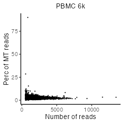

```{r, include = FALSE}
knitr::opts_chunk$set(
  collapse = TRUE,
  comment = "#>"
)
```


# Install libraries
Attach necessary libraries:
```{r, eval = FALSE}
library(ASURAT)
library(SingleCellExperiment)
library(SummarizedExperiment)
```


<br>

# Introduction
In this vignette, we analyze single-cell RNA sequencing (scRNA-seq) data
obtained from peripheral blood mononuclear cells (PBMCs) of healthy donors, and
PBMCs of donors with and without bacterial sepsis
(Reyes et al., Nat. Med. 26, 2020).


<br>

# Prepare scRNA-seq data
## PBMC 4k and 6k
The data can be loaded by the following code:
```{r, eval = FALSE}
pbmc4k <- readRDS(url("https://figshare.com/ndownloader/files/34112459"))
pbmc6k <- readRDS(url("https://figshare.com/ndownloader/files/34112462"))
```
The data are stored in
[DOI:10.6084/m9.figshare.19200254](https://figshare.com/account/projects/132986/articles/19200254) and the generating process is described below.

<br>

The data were obtained from 10x Genomics repository (PBMC 4k and 6k).
Create SingleCellExperiment objects by inputting raw read count tables.
```{r, eval = FALSE}
path_dir <- "rawdata/2020_001_10xgenomics/pbmc_4k/"
path_dir <- paste0(path_dir, "filtered_gene_bc_matrices/GRCh38/")
pbmc4k <- Seurat::Read10X(data.dir = path_dir, gene.column = 2,
                          unique.features = TRUE, strip.suffix = FALSE)

path_dir <- "rawdata/2020_001_10xgenomics/pbmc_6k/"
path_dir <- paste(path_dir, "filtered_matrices_mex/hg19/", sep = "")
pbmc6k <- Seurat::Read10X(data.dir = path_dir, gene.column = 2,
                          unique.features = TRUE, strip.suffix = FALSE)

matrices <- list(PBMC4k = as.matrix(pbmc4k), PBMC6k = as.matrix(pbmc6k))
pbmcs <- list()
for(i in seq_len(length(matrices))){
  d <- matrices[[i]]
  colnames(d) <- paste0(names(matrices)[i], "-", colnames(d))
  pbmcs[[i]] <- SingleCellExperiment(assays = list(counts = as.matrix(d)),
                                     rowData = data.frame(gene = rownames(d)),
                                     colData = data.frame(sample = colnames(d)))
}
```

```{r, eval = FALSE}
rbind(dim(pbmcs[[1]]), dim(pbmcs[[2]]))
```
```
      [,1] [,2]
[1,] 33694 4340
[2,] 32738 5419
```

Add metadata for both variables and samples using ASURAT function
`add_metadata()`.
The arguments are

* `sce`: SingleCellExperiment object, and
* `mitochondria_symbol`: a string representing for mitochondrial genes.
```{r, eval = FALSE}
for(i in seq_len(length(pbmcs))){
  pbmcs[[i]] <- add_metadata(sce = pbmcs[[i]], mitochondria_symbol = "^MT-")
}
```
One can check the results in `rowData(sce)` and `colData(sce)` slots.

Qualities of sample (cell) data are confirmed based on proper visualization of
`colData(sce)`.
ASURAT function `plot_dataframe2D()` shows scatter plots of two-dimensional data.
```{r, eval = FALSE}
for(i in seq_len(length(pbmcs))){
  dataframe2D <- data.frame(x = colData(pbmcs[[i]])$nReads,
                            y = colData(pbmcs[[i]])$nGenes)
  p <- plot_dataframe2D(dataframe2D = dataframe2D) +
    ggplot2::labs(title = names(pbmcs)[i],
                  x = "Number of reads", y = "Number of genes") +
    ggplot2::theme_classic(base_size = 20) +
    ggplot2::theme(plot.title = ggplot2::element_text(hjust = 0.5))
  filename <- paste0("figures/figure_04_0005_", i, ".png")
  ggplot2::ggsave(file = filename, plot = p, dpi = 100, width = 5, height = 5)
}
```


Confirming that the data qualities are comparable among experimental batches,
concatenate all the objects horizontally.
```{r, eval = FALSE}
# Take intersection of genes.
genes <- intersect(rownames(pbmcs[[1]]), rownames(pbmcs[[2]]))
for(i in seq_len(length(pbmcs))){
  pbmcs[[i]] <- pbmcs[[i]][genes, ]
  rowData(pbmcs[[i]])$nSamples <- NULL
}
# Horizontally concatenate SingleCellExperiment objects.
pbmcs <- cbind(pbmcs[[1]], pbmcs[[2]])
colData(pbmcs)$batch <- ifelse(grepl("PBMC4k", colData(pbmcs)$sample), "PBMC4k", "PBMC6k")
# Add metadata again.
pbmcs <- add_metadata(sce = pbmcs, mitochondria_symbol = "^MT-")
```

```{r, eval = FALSE, echo = FALSE}
# Save data.
saveRDS(pbmcs, file = "backup/04_001_pbmcs_data.rds")

# Load data.
pbmcs <- readRDS("backup/04_001_pbmcs_data.rds")
```


<br>

## PBMCs with and without sepsis (Reyes et al., 2020)
The data can be loaded by the following code:
```{r, eval = FALSE}
pbmc130k <- readRDS(url("https://figshare.com/ndownloader/files/34112465"))
```
The data are stored in
[DOI:10.6084/m9.figshare.19200254](https://figshare.com/account/projects/132986/articles/19200254) and the generating process is described below.

<br>

The data were obtained from Broad Institute Single Cell Portal:
[SCP548](https://singlecell.broadinstitute.org/single_cell?type=study&page=1&terms=SCP548).
Since the file size of the raw read count table is huge (~5.61 GB),
we briefly removed gene and cell data such that the numbers of non-zero
expressing cells are less than 100 and the numbers of sequencing reads are
less than 2000, respectively, by using perl scripts as follows:
```{perl, eval = FALSE}
perl ../perl/pg_01_add_nsamples.pl
perl ../perl/pg_02_add_nreads.pl
perl ../perl/pg_03_remove_variables.pl
perl ../perl/pg_05_remove_samples_2nd.pl
```

Create a SingleCellExperiment object by inputting a raw read count table.
```{r, eval = FALSE}
fn <- "rawdata/2020_001_Reyes/SCP548/expression/"
fn <- paste0(fn, "scp_gex_matrix_red2.csv")
pbmc130k <- read.csv(fn)
genes <- pbmc130k[-1, 2]
cells <- colnames(pbmc130k)[-seq_len(2)]
pbmc130k <- pbmc130k[-1, -seq_len(2)]
rownames(pbmc130k) <- genes
colnames(pbmc130k) <- cells
pbmc130k <- SingleCellExperiment(assays = list(counts = as.matrix(pbmc130k)),
                                 rowData = data.frame(gene = rownames(pbmc130k)),
                                 colData = data.frame(cell = colnames(pbmc130k)))
```

```{r, eval = FALSE}
dim(pbmc130k)
```
```
[1] 14973 60022
```

Add metadata for both variables and samples using ASURAT function
`add_metadata()`.
The arguments are

* `sce`: SingleCellExperiment object, and
* `mitochondria_symbol`: a string representing for mitochondrial genes.
```{r, eval = FALSE}
pbmc130k <- add_metadata(sce = pbmc130k, mitochondria_symbol = "^MT-")
```
One can check the results in `rowData(sce)` and `colData(sce)` slots.

```{r, eval = FALSE, echo = FALSE}
# Save data.
saveRDS(pbmc130k, file = "backup/05_001_pbmc130k_data.rds")

# Load data.
pbmc130k <- readRDS("backup/05_001_pbmc130k_data.rds")
```


<br>

# Preprocessing
## Control data quality
Remove variables (genes) and samples (cells) with low quality,
by processing the following three steps:

1. remove variables based on expression profiles across samples,
2. remove samples based on the numbers of reads and nonzero expressed variables,
3. remove variables based on the mean read counts across samples.


<br>

### Remove variables based on expression profiles
ASURAT function `remove_variables()` removes variable (gene) data such that
the numbers of non-zero expressing samples (cells) are less than `min_nsamples`.
```{r, eval = FALSE}
pbmcs <- remove_variables(sce = pbmcs, min_nsamples = 10)
pbmc130k <- remove_variables(sce = pbmc130k, min_nsamples = 100)
```


<br>

### Remove samples based on expression profiles
Qualities of sample (cell) data are confirmed based on proper visualization of
`colData(sce)`.
ASURAT function `plot_dataframe2D()` shows scatter plots of two-dimensional data.
```{r, eval = FALSE}
dataframe2D <- data.frame(x = colData(pbmcs)$nReads, y = colData(pbmcs)$nGenes)
p <- plot_dataframe2D(dataframe2D = dataframe2D) +
  ggplot2::labs(title = "PBMCs", x = "Number of reads", y = "Number of genes") +
  ggplot2::theme_classic(base_size = 20) +
  ggplot2::theme(plot.title = ggplot2::element_text(hjust = 0.5))
filename <- "figures/figure_04_0010.png"
ggplot2::ggsave(file = filename, plot = p, dpi = 100, width = 5, height = 5)
```

```{r, eval = FALSE, echo = FALSE}
dataframe2D <- data.frame(x = colData(pbmc130k)$nReads, y = colData(pbmc130k)$nGenes)
p <- plot_dataframe2D(dataframe2D = dataframe2D) +
  ggplot2::labs(title = "PBMC (Reyes et al., 2020)",
                x = "Number of reads", y = "Number of genes") +
  ggplot2::theme_classic(base_size = 20) +
  ggplot2::theme(plot.title = ggplot2::element_text(hjust = 0.5))
filename <- "figures/figure_05_0010.png"
ggplot2::ggsave(file = filename, plot = p, dpi = 100, width = 5, height = 5)
```


```{r, eval = FALSE}
dataframe2D <- data.frame(x = colData(pbmcs)$nReads, y = colData(pbmcs)$percMT)
p <- plot_dataframe2D(dataframe2D = dataframe2D) +
  ggplot2::labs(title = "PBMCs", x = "Number of reads", y = "Perc of MT reads") +
  ggplot2::theme_classic(base_size = 20) +
  ggplot2::theme(plot.title = ggplot2::element_text(hjust = 0.5))
filename <- "figures/figure_04_0011.png"
ggplot2::ggsave(file = filename, plot = p, dpi = 100, width = 5, height = 5)
```

```{r, eval = FALSE, echo = FALSE}
dataframe2D <- data.frame(x = colData(pbmc130k)$nReads, y = colData(pbmc130k)$percMT)
p <- plot_dataframe2D(dataframe2D = dataframe2D) +
  ggplot2::labs(title = "PBMC (Reyes et al., 2020)",
                x = "Number of reads", y = "Perc of MT reads") +
  ggplot2::theme_classic(base_size = 20) +
  ggplot2::theme(plot.title = ggplot2::element_text(hjust = 0.5))
filename <- "figures/figure_05_0011.png"
ggplot2::ggsave(file = filename, plot = p, dpi = 100, width = 5, height = 5)
```




ASURAT function `remove_samples()` removes sample (cell) data by setting cutoff
values for the metadata.
The arguments are

* `sce`: SingleCellExperiment object,
* `min_nReads` and `max_nReads`: minimum and maximum number of reads,
* `min_nGenes` and `max_nGenes`: minimum and maximum number of non-zero
expressed genes, and
* `min_percMT` and `max_percMT`: minimum and maximum percent of reads that
map to mitochondrial genes, respectively.
```{r, eval = FALSE}
pbmcs <- remove_samples(sce = pbmcs, min_nReads = 2000, max_nReads = 20000,
                        min_nGenes = 500, max_nGenes = 1e+10,
                        min_percMT = 0, max_percMT = 10)

pbmc130k <- remove_samples(sce = pbmc130k, min_nReads = 2000, max_nReads = 30000,
                           min_nGenes = 500, max_nGenes = 1e+10,
                           min_percMT = 0, max_percMT = 10)
```


<br>

### Remove variables based on the mean read counts
Qualities of variable (gene) data are confirmed based on proper visualization of
`rowData(sce)`.
ASURAT function `plot_dataframe2D()` shows scatter plots of two-dimensional data.
```{r, eval = FALSE}
dataframe2D <- data.frame(x = seq_len(nrow(rowData(pbmcs))),
                          y = sort(rowData(pbmcs)$nSamples, decreasing = TRUE))
p <- plot_dataframe2D(dataframe2D = dataframe2D) +
  ggplot2::labs(title = "PBMCs", x = "Rank of genes", y = "Mean read counts") +
  ggplot2::theme_classic(base_size = 20) +
  ggplot2::theme(plot.title = ggplot2::element_text(hjust = 0.5))
filename <- "figures/figure_04_0015.png"
ggplot2::ggsave(file = filename, plot = p, dpi = 100, width = 5, height = 5)
```

```{r, eval = FALSE, echo = FALSE}
dataframe2D <- data.frame(x = seq_len(nrow(rowData(pbmc130k))),
                          y = sort(rowData(pbmc130k)$nSamples, decreasing = TRUE))
p <- plot_dataframe2D(dataframe2D = dataframe2D) +
  ggplot2::labs(title = "PBMC (Reyes et al., 2020)",
                x = "Rank of genes", y = "Mean read counts") +
  ggplot2::theme_classic(base_size = 20) +
  ggplot2::theme(plot.title = ggplot2::element_text(hjust = 0.5))
filename <- "figures/figure_05_0015.png"
ggplot2::ggsave(file = filename, plot = p, dpi = 100, width = 5, height = 5)
```


ASURAT function `remove_variables_second()` removes variable (gene) data
such that the mean read counts across samples are less than `min_meannReads`.
```{r, eval = FALSE}
pbmcs <- remove_variables_second(sce = pbmcs, min_meannReads = 0.05)
pbmc130k <- remove_variables_second(sce = pbmc130k, min_meannReads = 0.05)
```

```{r, eval = FALSE}
rbind(dim(pbmcs), dim(pbmc130k))
```
```
[1,] 5797  6336
[2,] 5725 59879
```

```{r, eval = FALSE, echo = FALSE}
# Save data.
saveRDS(pbmcs, file = "backup/04_002_pbmcs_dataqc.rds")
saveRDS(pbmc130k, file = "backup/05_002_pbmc130k_dataqc.rds")

# Load data.
pbmcs <- readRDS("backup/04_002_pbmcs_dataqc.rds")
pbmc130k <- readRDS("backup/05_002_pbmc130k_dataqc.rds")
```


<br>

## Normalize data
Normalize the data using bayNorm (Tang et al., Bioinformatics, 2020) and
Seurat functions (Butler Nat. Biotechnol., 2018).
```{r, eval = FALSE}
# Use bayNorm.
BETA <- bayNorm::BetaFun(Data = assay(pbmcs, "counts"), MeanBETA = 0.06)
bay_out <- bayNorm::bayNorm(assay(pbmcs, "counts"),
                            Conditions = colData(pbmcs)$batch,
                            BETA_vec = BETA[["BETA"]], Prior_type = "GG",
                            mode_version = TRUE)
# Use Seurat.
surt <- list(PBMC4k = bay_out[["Bay_out_list"]][["Group PBMC4k"]],
             PBMC6k = bay_out[["Bay_out_list"]][["Group PBMC6k"]])
for(i in seq_len(length(surt))){
  surt[[i]] <- Seurat::CreateSeuratObject(counts = surt[[i]],
                                          project = names(surt)[i])
  surt[[i]] <- Seurat::NormalizeData(surt[[i]])
  surt[[i]] <- Seurat::FindVariableFeatures(surt[[i]], selection.method = "vst",
                                            nfeatures = 5500)
}
genes <- Seurat::SelectIntegrationFeatures(object.list = surt, nfeatures = 5500)
anchors <- Seurat::FindIntegrationAnchors(object.list = surt,
                                          anchor.features = genes)
pbmc_surt <- Seurat::IntegrateData(anchorset = anchors,
                                   normalization.method = "LogNormalize")
pbmcs <- pbmcs[genes, ]
assay(pbmcs, "logcounts") <- pbmc_surt@assays$integrated@data[genes, ]
```

Center row data.
```{r, eval = FALSE}
mat <- assay(pbmcs, "logcounts")
assay(pbmcs, "centered") <- sweep(mat, 1, apply(mat, 1, mean), FUN = "-")
```

```{r, eval = FALSE, echo = FALSE}
# Save data.
saveRDS(pbmcs, file = "backup/04_003_pbmcs_normalized.rds")

# Load data.
pbmcs <- readRDS("backup/04_003_pbmcs_normalized.rds")
```


