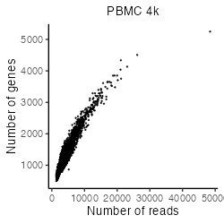
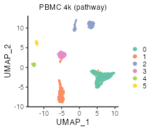

Analysis of peripheral blood mononuclear cell datasets
================
Keita Iida
2022-02-25

-   [1 Install libraries](#install-libraries)
-   [2 Introduction](#introduction)
-   [3 Prepare scRNA-seq data](#prepare-scrna-seq-data)
    -   [3.1 PBMC 4k and 6k](#pbmc-4k-and-6k)
    -   [3.2 PBMCs with and without sepsis (Reyes et
        al., 2020)](#pbmcs-with-and-without-sepsis-reyes-et-al-2020)
-   [4 Preprocessing](#preprocessing)
    -   [4.1 Control data quality](#control-data-quality)
    -   [4.2 Normalize data](#normalize-data)
-   [5 Multifaceted sign analysis](#sign)
    -   [5.1 Load databases](#load-databases)
    -   [5.2 Create signs](#create-signs)
    -   [5.3 Select useful signs](#select-useful-signs)
    -   [5.4 Create sign-by-sample
        matrices](#create-sign-by-sample-matrices)
    -   [5.5 Reduce dimensions of sign-by-sample
        matrices](#dim_reduction)
    -   [5.6 Cluster cells](#cluster-cells)
    -   [5.7 Investigate significant signs](#separation_index)

# 1 Install libraries

Attach necessary libraries:

``` r
library(ASURAT)
library(SingleCellExperiment)
library(SummarizedExperiment)
```

<br>

# 2 Introduction

In this vignette, we analyze single-cell RNA sequencing (scRNA-seq) data
obtained from peripheral blood mononuclear cells (PBMCs) of healthy
donors, and PBMCs of donors with and without bacterial sepsis (Reyes et
al., Nat. Med. 26, 2020).

<br>

# 3 Prepare scRNA-seq data

## 3.1 PBMC 4k and 6k

The data can be loaded by the following code:

``` r
pbmc4k <- readRDS(url("https://figshare.com/ndownloader/files/34112459"))
pbmc6k <- readRDS(url("https://figshare.com/ndownloader/files/34112462"))
```

The data are stored in
[DOI:10.6084/m9.figshare.19200254](https://figshare.com/s/866fbf822a4bfab234e6)
and the generating process is described below.

<br>

The data were obtained from 10x Genomics repository (PBMC 4k and 6k).
Create SingleCellExperiment objects by inputting raw read count tables.

``` r
path_dir <- "rawdata/2020_001_10xgenomics/pbmc_4k/"
path_dir <- paste0(path_dir, "filtered_gene_bc_matrices/GRCh38/")
pbmc4k <- Seurat::Read10X(data.dir = path_dir, gene.column = 2,
                          unique.features = TRUE, strip.suffix = FALSE)

path_dir <- "rawdata/2020_001_10xgenomics/pbmc_6k/"
path_dir <- paste(path_dir, "filtered_matrices_mex/hg19/", sep = "")
pbmc6k <- Seurat::Read10X(data.dir = path_dir, gene.column = 2,
                          unique.features = TRUE, strip.suffix = FALSE)

matrices <- list(PBMC4k = as.matrix(pbmc4k), PBMC6k = as.matrix(pbmc6k))
pbmcs <- list()
for(i in seq_len(length(matrices))){
  d <- matrices[[i]]
  colnames(d) <- paste0(names(matrices)[i], "-", colnames(d))
  pbmcs[[i]] <- SingleCellExperiment(assays = list(counts = as.matrix(d)),
                                     rowData = data.frame(gene = rownames(d)),
                                     colData = data.frame(sample = colnames(d)))
}
names(pbmcs) <- c("PBMC-4k", "PBMC-6k")
```

``` r
rbind(dim(pbmcs[[1]]), dim(pbmcs[[2]]))
```

          [,1] [,2]
    [1,] 33694 4340
    [2,] 32738 5419

Add metadata for both variables and samples using ASURAT function
`add_metadata()`.

``` r
for(i in seq_len(length(pbmcs))){
  pbmcs[[i]] <- add_metadata(sce = pbmcs[[i]], mitochondria_symbol = "^MT-")
}
```

Qualities of sample (cell) data are confirmed based on proper
visualization of `colData(sce)`. ASURAT function `plot_dataframe2D()`
shows scatter plots of two-dimensional data.

``` r
for(i in seq_len(length(pbmcs))){
  dataframe2D <- data.frame(x = colData(pbmcs[[i]])$nReads,
                            y = colData(pbmcs[[i]])$nGenes)
  p <- plot_dataframe2D(dataframe2D = dataframe2D) +
    ggplot2::labs(title = names(pbmcs)[i],
                  x = "Number of reads", y = "Number of genes") +
    ggplot2::theme_classic(base_size = 20) +
    ggplot2::theme(plot.title = ggplot2::element_text(hjust = 0.5))
  filename <- paste0("figures/figure_04_0005_", i, ".png")
  ggplot2::ggsave(file = filename, plot = p, dpi = 100, width = 5, height = 5)
}
```


Confirming that the data qualities are comparable among experimental
batches, concatenate all the objects horizontally.

``` r
# Take intersection of genes.
genes <- intersect(rownames(pbmcs[[1]]), rownames(pbmcs[[2]]))
for(i in seq_len(length(pbmcs))){
  pbmcs[[i]] <- pbmcs[[i]][genes, ]
  rowData(pbmcs[[i]])$nSamples <- NULL
}
# Horizontally concatenate SingleCellExperiment objects.
pbmc4k6k <- cbind(pbmcs[[1]], pbmcs[[2]])
colData(pbmc4k6k)$batch <- ifelse(grepl("PBMC4k", colData(pbmc4k6k)$sample),
                                  "PBMC4k", "PBMC6k")
# Add metadata again.
pbmc4k6k <- add_metadata(sce = pbmc4k6k, mitochondria_symbol = "^MT-")
```

<br>

## 3.2 PBMCs with and without sepsis (Reyes et al., 2020)

The data can be loaded by the following code:

``` r
pbmc130k <- readRDS(url("https://figshare.com/ndownloader/files/34112465"))
```

The data are stored in
[DOI:10.6084/m9.figshare.19200254](https://figshare.com/s/866fbf822a4bfab234e6)
and the generating process is described below.

<br>

The data were obtained from Broad Institute Single Cell Portal:
[SCP548](https://singlecell.broadinstitute.org/single_cell?type=study&page=1&terms=SCP548).
Since the file size of the raw read count table is huge (\~5.61 GB), we
briefly removed gene and cell data such that the numbers of non-zero
expressing cells are less than 100 and the numbers of sequencing reads
are less than 2000, respectively, by using perl scripts as follows:

``` perl
perl ../perl/pg_01_add_nsamples.pl
perl ../perl/pg_02_add_nreads.pl
perl ../perl/pg_03_remove_variables.pl
perl ../perl/pg_05_remove_samples_2nd.pl
```

Create a SingleCellExperiment object by inputting a raw read count
table.

``` r
fn <- "rawdata/2020_001_Reyes/SCP548/expression/"
fn <- paste0(fn, "scp_gex_matrix_red2.csv")
pbmc130k <- read.csv(fn)
genes <- pbmc130k[-1, 2]
cells <- colnames(pbmc130k)[-seq_len(2)]
pbmc130k <- pbmc130k[-1, -seq_len(2)]
rownames(pbmc130k) <- genes
colnames(pbmc130k) <- cells
pbmc130k <- SingleCellExperiment(assays = list(counts = as.matrix(pbmc130k)),
                                 rowData = data.frame(gene = rownames(pbmc130k)),
                                 colData = data.frame(cell = colnames(pbmc130k)))
```

``` r
dim(pbmc130k)
```

    [1] 14973 60022

Add metadata for both variables and samples using ASURAT function
`add_metadata()`.

``` r
pbmc130k <- add_metadata(sce = pbmc130k, mitochondria_symbol = "^MT-")
```

<br>

# 4 Preprocessing

## 4.1 Control data quality

Remove variables (genes) and samples (cells) with low quality, by
processing the following three steps:

1.  remove variables based on expression profiles across samples,
2.  remove samples based on the numbers of reads and nonzero expressed
    variables,
3.  remove variables based on the mean read counts across samples.

<br>

### 4.1.1 Remove variables based on expression profiles

ASURAT function `remove_variables()` removes variable (gene) data such
that the numbers of non-zero expressing samples (cells) are less than
`min_nsamples`.

``` r
pbmc4k6k <- remove_variables(sce = pbmc4k6k, min_nsamples = 10)
pbmc130k <- remove_variables(sce = pbmc130k, min_nsamples = 100)
```

<br>

### 4.1.2 Remove samples based on expression profiles

Qualities of sample (cell) data are confirmed based on proper
visualization of `colData(sce)`. ASURAT function `plot_dataframe2D()`
shows scatter plots of two-dimensional data.

``` r
dataframe2D <- data.frame(x = colData(pbmc4k6k)$nReads,
                          y = colData(pbmc4k6k)$nGenes)
p <- plot_dataframe2D(dataframe2D = dataframe2D) +
  ggplot2::labs(title = "PBMC 4k & 6k",
                x = "Number of reads", y = "Number of genes") +
  ggplot2::theme_classic(base_size = 20) +
  ggplot2::theme(plot.title = ggplot2::element_text(hjust = 0.5))
filename <- "figures/figure_04_0010.png"
ggplot2::ggsave(file = filename, plot = p, dpi = 100, width = 5, height = 5)
```




``` r
dataframe2D <- data.frame(x = colData(pbmc4k6k)$nReads, y = colData(pbmc4k6k)$percMT)
p <- plot_dataframe2D(dataframe2D = dataframe2D) +
  ggplot2::labs(title = "PBMC 4k & 6k",
                x = "Number of reads", y = "Perc of MT reads") +
  ggplot2::theme_classic(base_size = 20) +
  ggplot2::theme(plot.title = ggplot2::element_text(hjust = 0.5))
filename <- "figures/figure_04_0011.png"
ggplot2::ggsave(file = filename, plot = p, dpi = 100, width = 5, height = 5)
```


ASURAT function `remove_samples()` removes sample (cell) data by setting
cutoff values for the metadata.

``` r
pbmc4k6k <- remove_samples(sce = pbmc4k6k,
                           min_nReads = 2000, max_nReads = 20000,
                           min_nGenes = 500, max_nGenes = 1e+10,
                           min_percMT = 0, max_percMT = 10)

pbmc130k <- remove_samples(sce = pbmc130k,
                           min_nReads = 2000, max_nReads = 30000,
                           min_nGenes = 500, max_nGenes = 1e+10,
                           min_percMT = 0, max_percMT = 10)
```

<br>

### 4.1.3 Remove variables based on the mean read counts

Qualities of variable (gene) data are confirmed based on proper
visualization of `rowData(sce)`. ASURAT function `plot_dataframe2D()`
shows scatter plots of two-dimensional data.

``` r
dataframe2D <- data.frame(x = seq_len(nrow(rowData(pbmc4k6k))),
                          y = sort(rowData(pbmc4k6k)$nSamples, decreasing = TRUE))
p <- plot_dataframe2D(dataframe2D = dataframe2D) +
  ggplot2::labs(title = "PBMC 4k & 6k",
                x = "Rank of genes", y = "Mean read counts") +
  ggplot2::theme_classic(base_size = 20) +
  ggplot2::theme(plot.title = ggplot2::element_text(hjust = 0.5))
filename <- "figures/figure_04_0015.png"
ggplot2::ggsave(file = filename, plot = p, dpi = 100, width = 5, height = 5)
```


ASURAT function `remove_variables_second()` removes variable (gene) data
such that the mean read counts across samples are less than
`min_meannReads`.

``` r
pbmc4k6k <- remove_variables_second(sce = pbmc4k6k, min_meannReads = 0.05)
pbmc130k <- remove_variables_second(sce = pbmc130k, min_meannReads = 0.05)
```

``` r
rbind(dim(pbmc4k6k), dim(pbmc130k))
```

    [1,] 5797  6336
    [2,] 5725 59879

<br>

## 4.2 Normalize data

### 4.2.1 PBMCs (4k and 6k)

Normalize the data using bayNorm (Tang et al., Bioinformatics, 2020) and
Seurat functions (Butler Nat. Biotechnol., 2018).

``` r
# Use bayNorm.
BETA <- bayNorm::BetaFun(Data = assay(pbmc4k6k, "counts"), MeanBETA = 0.06)
bay_out <- bayNorm::bayNorm(assay(pbmc4k6k, "counts"),
                            Conditions = colData(pbmc4k6k)$batch,
                            BETA_vec = BETA[["BETA"]], Prior_type = "GG",
                            mode_version = TRUE)
# Use Seurat.
surt <- list(PBMC4k = bay_out[["Bay_out_list"]][["Group PBMC4k"]],
             PBMC6k = bay_out[["Bay_out_list"]][["Group PBMC6k"]])
for(i in seq_len(length(surt))){
  surt[[i]] <- Seurat::CreateSeuratObject(counts = surt[[i]],
                                          project = names(surt)[i])
  surt[[i]] <- Seurat::NormalizeData(surt[[i]])
  surt[[i]] <- Seurat::FindVariableFeatures(surt[[i]], selection.method = "vst",
                                            nfeatures = 5500)
}
genes <- Seurat::SelectIntegrationFeatures(object.list = surt, nfeatures = 5500)
anchors <- Seurat::FindIntegrationAnchors(object.list = surt,
                                          anchor.features = genes)
pbmc_surt <- Seurat::IntegrateData(anchorset = anchors,
                                   normalization.method = "LogNormalize")
pbmc4k6k <- pbmc4k6k[genes, ]
assay(pbmc4k6k, "logcounts") <- pbmc_surt@assays$integrated@data[genes, ]
```

Center row data.

``` r
mat <- assay(pbmc4k6k, "logcounts")
assay(pbmc4k6k, "centered") <- sweep(mat, 1, apply(mat, 1, mean), FUN = "-")
```

<br>

### 4.2.2 PBMC (Reyes et al., 2020)

Normalize the data using bayNorm (Tang et al., Bioinformatics, 2020)
functions.

``` r
bayout <- bayNorm::bayNorm(Data = counts(pbmc130k), mode_version = TRUE)
assay(pbmc130k, "normalized") <- bayout$Bay_out
```

Perform log-normalization with a pseudo count.

``` r
assay(pbmc130k, "logcounts") <- log(assay(pbmc130k, "normalized") + 1)
```

Center row data.

``` r
mat <- assay(pbmc130k, "logcounts")
assay(pbmc130k, "centered") <- sweep(mat, 1, apply(mat, 1, mean), FUN = "-")
```

<br>

# 5 Multifaceted sign analysis

Infer cell or disease types, biological functions, and signaling pathway
activity at the single-cell level by inputting related databases.

ASURAT transforms centered read count tables to functional feature
matrices, termed sign-by-sample matrices (SSMs). Using SSMs, perform
unsupervised clustering of samples (cells).

<br>

## 5.1 Load databases

Load databases.

``` r
urlpath <- "https://github.com/keita-iida/ASURATDB/blob/main/genes2bioterm/"
load(url(paste0(urlpath, "20220108_human_COMSig.rda?raw=TRUE"))) # CO & MSigDB
load(url(paste0(urlpath, "20201213_human_GO_red.rda?raw=TRUE"))) # GO
load(url(paste0(urlpath, "20201213_human_KEGG.rda?raw=TRUE")))   # KEGG
```

The reformatted knowledge-based data were available from the following
repositories:

-   [DOI:10.6084/m9.figshare.19102598](https://figshare.com/s/0599d2de970c2deb675c)
-   [Github ASURATDB](https://github.com/keita-iida/ASURATDB)

Prepare correlation matrices of gene expressions.

``` r
pbmc4k6k_cormat <- cor(t(as.matrix(assay(pbmc4k6k, "centered"))), method = "spearman")
pbmc130k_cormat <- cor(t(as.matrix(assay(pbmc130k, "centered"))), method = "spearman")
```

Set gene expression data into `altExp(sce)`.

``` r
sname <- "logcounts"
altExp(pbmc4k6k, sname) <- SummarizedExperiment(list(counts = assay(pbmc4k6k, sname)))
```

Add ENTREZ Gene IDs to `rowData(sce)`.

``` r
dictionary <- AnnotationDbi::select(org.Hs.eg.db::org.Hs.eg.db,
                                    key = rownames(pbmc4k6k),
                                    columns = "ENTREZID", keytype = "SYMBOL")
dictionary <- dictionary[!duplicated(dictionary$SYMBOL), ]
rowData(pbmc4k6k)$geneID <- dictionary$ENTREZID
```

Add formatted databases to `metadata(sce)$sign`.

``` r
pbmcs <- list(CM = pbmc4k6k, GO = pbmc4k6k, KG = pbmc4k6k)
metadata(pbmcs$CM) <- list(sign = human_COMSig[["cell"]])
metadata(pbmcs$GO) <- list(sign = human_GO[["BP"]])
metadata(pbmcs$KG) <- list(sign = human_KEGG[["pathway"]])
```

<br>

## 5.2 Create signs

ASURAT function `remove_signs()` redefines functional gene sets for the
input database by removing genes, which are not included in
`rownames(sce)`, and further removes biological terms including too few
or too many genes.

``` r
pbmcs$CM <- remove_signs(sce = pbmcs$CM, min_ngenes = 2, max_ngenes = 1000)
pbmcs$GO <- remove_signs(sce = pbmcs$GO, min_ngenes = 2, max_ngenes = 1000)
pbmcs$KG <- remove_signs(sce = pbmcs$KG, min_ngenes = 2, max_ngenes = 1000)
```

ASURAT function `cluster_genes()` clusters functional gene sets using a
correlation graph-based decomposition method, which produces strongly,
variably, and weakly correlated gene sets (SCG, VCG, and WCG,
respectively).

``` r
set.seed(1)
pbmcs$CM <- cluster_genesets(sce = pbmcs$CM, cormat = pbmc4k6k_cormat,
                             th_posi = 0.24, th_nega = -0.24)
pbmcs$GO <- cluster_genesets(sce = pbmcs$GO, cormat = pbmc4k6k_cormat,
                             th_posi = 0.22, th_nega = -0.28)
pbmcs$KG <- cluster_genesets(sce = pbmcs$KG, cormat = pbmc4k6k_cormat,
                             th_posi = 0.27, th_nega = -0.20)
```

ASURAT function `create_signs()` creates signs by the following
criteria:

1.  the number of genes in SCG&gt;= `min_cnt_strg` (the default value
    is 2) and
2.  the number of genes in VCG&gt;= `min_cnt_vari` (the default value is
    2),

which are independently applied to SCGs and VCGs, respectively.

``` r
pbmcs$CM <- create_signs(sce = pbmcs$CM, min_cnt_strg = 2, min_cnt_vari = 2)
pbmcs$GO <- create_signs(sce = pbmcs$GO, min_cnt_strg = 2, min_cnt_vari = 2)
pbmcs$KG <- create_signs(sce = pbmcs$KG, min_cnt_strg = 2, min_cnt_vari = 2)
```

<br>

## 5.3 Select useful signs

If signs have semantic similarity information, one can use ASURAT
function `remove_signs_redundant()` for removing redundant sings using
the semantic similarity matrices.

``` r
pbmcs$GO <- remove_signs_redundant(
  sce = pbmcs$GO, similarity_matrix = human_GO$similarity_matrix$BP,
  threshold = 0.80, keep_rareID = TRUE)
```

ASURAT function `remove_signs_manually()` removes signs by specifying
IDs (e.g., `GOID:XXX`) or descriptions (e.g., `metabolic`) using
`grepl()`.

``` r
keywords <- "Covid|COVID|foofoo|hogehoge"
pbmcs$KG <- remove_signs_manually(sce = pbmcs$KG, keywords = keywords)
```

<br>

## 5.4 Create sign-by-sample matrices

ASURAT function `create_sce_signmatrix()` creates a new
SingleCellExperiment object `new_sce`, consisting of the following
information:

-   `assayNames(new_sce)`: counts (SSM whose entries are termed sign
    scores),
-   `names(colData(new_sce))`: nReads, nGenes, percMT,
-   `names(rowData(new_sce))`: ParentSignID, Description, CorrGene,
    etc.,
-   `names(metadata(new_sce))`: sign\_SCG, sign\_VCG, etc.,
-   `altExpNames(new_sce)`: something if there is data in `altExp(sce)`.

``` r
pbmcs$CM <- makeSignMatrix(sce = pbmcs$CM, weight_strg = 0.5, weight_vari = 0.5)
pbmcs$GO <- makeSignMatrix(sce = pbmcs$GO, weight_strg = 0.5, weight_vari = 0.5)
pbmcs$KG <- makeSignMatrix(sce = pbmcs$KG, weight_strg = 0.5, weight_vari = 0.5)
```

<br>

## 5.5 Reduce dimensions of sign-by-sample matrices

Perform t-distributed stochastic neighbor embedding.

``` r
set.seed(1)
for(i in seq_len(length(pbmcs))){
  res <- Rtsne::Rtsne(t(assay(pbmcs[[i]], "counts")), dim = 2, pca = FALSE)
  reducedDim(pbmcs[[i]], "TSNE") <- res[["Y"]]
}
```

The results can be visualized by ASURAT functions `plot_dataframe2D()`
or `plot_dataframe3D()`.

``` r
dataframe2D <- as.data.frame(reducedDim(pbmcs$CM, "TSNE"))
p <- plot_dataframe2D(dataframe2D = dataframe2D) +
  ggplot2::labs(title = "PBMC 4k & 6k (CO & MSigDB)", x = "tSNE_1", y = "tSNE_2") +
  ggplot2::theme_classic(base_size = 15)
filename <- "figures/figure_04_0020.png"
ggplot2::ggsave(file = filename, plot = p, dpi = 100, width = 5, height = 5)
```


<br>

## 5.6 Cluster cells

### 5.6.1 Use Seurat functions

To date (December, 2021), one of the most useful clustering methods in
scRNA-seq data analysis is a combination of a community detection
algorithm and graph-based unsupervised clustering, developed in Seurat
package.

In this tutorial, our strategy is as follows:

1.  convert SingleCellExperiment objects into Seurat objects (note that
    `rowData()` and `colData()` must have data),
2.  perform `ScaleData()`, `RunPCA()`, `FindNeighbors()`, and
    `FindClusters()`,
3.  convert Seurat objects into temporal SingleCellExperiment objects
    `temp`,
4.  add `colData(temp)$seurat_clusters` into
    `colData(sce)$seurat_clusters`.

``` r
resolutions <- c(0.12, 0.10, 0.15)
for(i in seq_len(length(pbmcs))){
  pbmc_surt <- Seurat::as.Seurat(pbmcs[[i]], counts = "counts", data = "counts")
  pbmc_surt[["SSM"]] <- Seurat::CreateAssayObject(counts = as.matrix(assay(pbmcs[[i]], "counts")))
  Seurat::DefaultAssay(pbmc_surt) <- "SSM"
  pbmc_surt <- Seurat::ScaleData(pbmc_surt, features = rownames(pbmc_surt))
  pbmc_surt <- Seurat::RunPCA(pbmc_surt, features = rownames(pbmc_surt))
  pbmc_surt <- Seurat::FindNeighbors(pbmc_surt, reduction = "pca", dims = 1:50)
  pbmc_surt <- Seurat::FindClusters(pbmc_surt, resolution = resolutions[i])
  pbmc_temp <- Seurat::as.SingleCellExperiment(pbmc_surt)
  colData(pbmcs[[i]])$seurat_clusters <- colData(pbmc_temp)$seurat_clusters
}
```

The results can be visualized by ASURAT functions `plot_dataframe2D()`
or `plot_dataframe3D()`.

``` r
labels <- colData(pbmcs$CM)$seurat_clusters
dataframe2D <- as.data.frame(reducedDim(pbmcs$CM, "TSNE"))
p <- plot_dataframe2D(dataframe2D = dataframe2D, labels = labels, colors = NULL) +
  ggplot2::labs(title = "PBMC (CO & MSigDB)", x = "tSNE_1", y = "tSNE_2", color = "") +
  ggplot2::theme_classic(base_size = 20) +
  ggplot2::theme(plot.title = ggplot2::element_text(hjust = 0.5)) +
  ggplot2::guides(colour = ggplot2::guide_legend(override.aes = list(size = 4)))
filename <- "figures/figure_04_0030.png"
ggplot2::ggsave(file = filename, plot = p, dpi = 200, width = 5.7, height = 5)
```




<br>

## 5.7 Investigate significant signs

Significant signs are analogous to differentially expressed genes but
bear biological meanings. Note that naïve usages of statistical tests
should be avoided because the row vectors of SSMs are centered.

Instead, ASURAT function `compute_sepI_all()` computes separation
indices for each cluster against the others. Briefly, a separation index
“sepI”, ranging from -1 to 1, is a nonparametric measure of significance
of a given sign score for a given subpopulation. The larger (resp.
smaller) sepI is, the more reliable the sign is as a positive (resp.
negative) marker for the cluster.

``` r
for(i in seq_len(length(pbmcs))){
  set.seed(1)
  labels <- colData(pbmcs[[i]])$seurat_clusters
  pbmcs[[i]] <- compute_sepI_all(sce = pbmcs[[i]], labels = labels,
                                 nrand_samples = 1000)
}
```

ASURAT function `plot_violin()` shows violin plots showing sign score
distributions.

``` r
vname <- "MSigID:162-S"
pbmc_sub <- pbmcs$CM[rownames(pbmcs$CM) %in% vname, ]
labels <- colData(pbmc_sub)$seurat_clusters
dataframe1D <- as.data.frame(t(assay(pbmc_sub, "counts")))
p <- plot_violin(dataframe1D = dataframe1D, labels = labels, colors = NULL) +
  ggplot2::labs(title = paste0(vname, "\n", "T cell (CD3D, CD6, ...)"),
                x = "Cluster (CO & MSigDB)", y = "Sign score", fill = "Cluster") +
  ggplot2::theme_classic(base_size = 20) +
  ggplot2::theme(plot.title = ggplot2::element_text(size = 18)) +
  ggplot2::theme(legend.position = "none")
filename <- "figures/figure_04_0040.png"
ggplot2::ggsave(file = filename, plot = p, dpi = 200, width = 5, height = 4)
```
