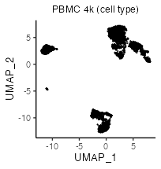
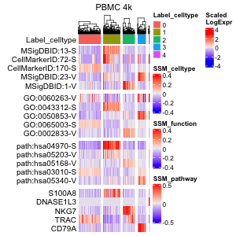

Analysis of 10x PBMC datasets
================
Keita Iida
2022-03-08

-   [1 Computational environment](#computational-environment)
-   [2 Install libraries](#install-libraries)
-   [3 Introduction](#introduction)
-   [4 Prepare scRNA-seq data](#prepare-scrna-seq-data)
    -   [4.1 PBMC 4k and 6k](#pbmc-4k-and-6k)
-   [5 Preprocessing](#preprocessing)
    -   [5.1 Control data quality](#control-data-quality)
    -   [5.2 Normalize data](#normalization)
-   [6 Multifaceted sign analysis](#multifaceted-sign-analysis)
    -   [6.1 Compute correlation
        matrices](#compute-correlation-matrices)
    -   [6.2 Load databases](#load-databases)
    -   [6.3 Create signs](#create-signs)
    -   [6.4 Select signs](#select-signs)
    -   [6.5 Create sign-by-sample
        matrices](#create-sign-by-sample-matrices)
    -   [6.6 Reduce dimensions of sign-by-sample
        matrices](#reduce-dimensions-of-sign-by-sample-matrices)
    -   [6.7 Cluster cells](#cluster-cells)
    -   [6.8 Investigate significant
        signs](#investigate-significant-signs)
    -   [6.9 Investigate significant
        genes](#investigate-significant-genes)
    -   [6.10 Multifaceted analysis](#multifaceted-analysis)
-   [7 Using the existing softwares](#using-the-existing-softwares)
    -   [7.1 scran](#scran)

# 1 Computational environment

MacBook Pro (Big Sur, 16-inch, 2019), Processor (2.4 GHz 8-Core Intel
Core i9), Memory (64 GB 2667 MHz DDR4).

<br>

# 2 Install libraries

Attach necessary libraries:

``` r
library(ASURAT)
library(SingleCellExperiment)
library(SummarizedExperiment)
```

<br>

# 3 Introduction

In this vignette, we analyze single-cell RNA sequencing (scRNA-seq) data
obtained from peripheral blood mononuclear cells (PBMCs) of healthy
donors.

<br>

# 4 Prepare scRNA-seq data

## 4.1 PBMC 4k and 6k

The data can be loaded by the following code:

``` r
pbmc4k <- readRDS(url("https://figshare.com/ndownloader/files/34112459"))
pbmc6k <- readRDS(url("https://figshare.com/ndownloader/files/34112462"))
```

The data are stored in
[DOI:10.6084/m9.figshare.19200254](https://figshare.com/s/866fbf822a4bfab234e6)
and the generating process is described below.

<br>

The data were obtained from 10x Genomics repository (PBMC 4k and 6k).
Create SingleCellExperiment objects by inputting raw read count tables.

``` r
# --------------------------------------
# PBMC 4k
# --------------------------------------
path_dir <- "rawdata/2020_001_10xgenomics/pbmc_4k/"
path_dir <- paste0(path_dir, "filtered_gene_bc_matrices/GRCh38/")
pbmc4k <- Seurat::Read10X(data.dir = path_dir, gene.column = 2,
                          unique.features = TRUE, strip.suffix = FALSE)
# --------------------------------------
# PBMC 6k
# --------------------------------------
path_dir <- "rawdata/2020_001_10xgenomics/pbmc_6k/"
path_dir <- paste(path_dir, "filtered_matrices_mex/hg19/", sep = "")
pbmc6k <- Seurat::Read10X(data.dir = path_dir, gene.column = 2,
                          unique.features = TRUE, strip.suffix = FALSE)
```

``` r
matrices <- list(PBMC4k = as.matrix(pbmc4k), PBMC6k = as.matrix(pbmc6k))
pbmcs <- list()
for(i in seq_len(length(matrices))){
  d <- matrices[[i]]
  colnames(d) <- paste0(names(matrices)[i], "-", colnames(d))
  pbmcs[[i]] <- SingleCellExperiment(assays = list(counts = as.matrix(d)),
                                     rowData = data.frame(gene = rownames(d)),
                                     colData = data.frame(sample = colnames(d)))
}
names(pbmcs) <- c("PBMC-4k", "PBMC-6k")
```

``` r
rbind(dim(pbmcs[[1]]), dim(pbmcs[[2]]))
```

          [,1] [,2]
    [1,] 33694 4340
    [2,] 32738 5419

Add metadata for both variables and samples using ASURAT function
`add_metadata()`.

``` r
for(i in seq_len(length(pbmcs))){
  pbmcs[[i]] <- add_metadata(sce = pbmcs[[i]], mitochondria_symbol = "^MT-")
}
```

Qualities of sample (cell) data are confirmed based on proper
visualization of `colData(sce)`. ASURAT function `plot_dataframe2D()`
shows scatter plots of two-dimensional data.

``` r
for(i in seq_len(length(pbmcs))){
  df <- data.frame(x = colData(pbmcs[[i]])$nReads,
                   y = colData(pbmcs[[i]])$nGenes)
  p <- plot_dataframe2D(dataframe2D = df) +
    ggplot2::labs(title = names(pbmcs)[i],
                  x = "Number of reads", y = "Number of genes") +
    ggplot2::theme_classic(base_size = 20) +
    ggplot2::theme(plot.title = ggplot2::element_text(hjust = 0.5))
  filename <- paste0("figures/figure_04_0005_", i, ".png")
  ggplot2::ggsave(file = filename, plot = p, dpi = 100, width = 5, height = 5)
}
```


Confirming that the data qualities are comparable among experimental
batches, concatenate all the objects horizontally.

``` r
# Take intersection of genes.
genes <- intersect(rownames(pbmcs[[1]]), rownames(pbmcs[[2]]))
for(i in seq_len(length(pbmcs))){
  pbmcs[[i]] <- pbmcs[[i]][genes, ]
  rowData(pbmcs[[i]])$nSamples <- NULL
}
# Horizontally concatenate SingleCellExperiment objects.
pbmc <- cbind(pbmcs[[1]], pbmcs[[2]])
colData(pbmc)$batch <- ifelse(grepl("PBMC4k", colData(pbmc)$sample),
                              "PBMC4k", "PBMC6k")
# Add metadata again.
pbmc <- add_metadata(sce = pbmc, mitochondria_symbol = "^MT-")
```

<br>

# 5 Preprocessing

## 5.1 Control data quality

Remove variables (genes) and samples (cells) with low quality, by
processing the following three steps:

1.  remove variables based on expression profiles across samples,
2.  remove samples based on the numbers of reads and nonzero expressed
    variables,
3.  remove variables based on the mean read counts across samples.

<br>

### 5.1.1 Remove variables based on expression profiles

ASURAT function `remove_variables()` removes variable (gene) data such
that the numbers of non-zero expressing samples (cells) are less than
`min_nsamples`.

``` r
pbmc <- remove_variables(sce = pbmc, min_nsamples = 10)
```

<br>

### 5.1.2 Remove samples based on expression profiles

Qualities of sample (cell) data are confirmed based on proper
visualization of `colData(sce)`. ASURAT function `plot_dataframe2D()`
shows scatter plots of two-dimensional data.

``` r
df <- data.frame(x = colData(pbmc)$nReads, y = colData(pbmc)$nGenes)
title <- "PBMC 4k 6k"
p <- plot_dataframe2D(dataframe2D = df) +
  ggplot2::labs(title = title, x = "Number of reads", y = "Number of genes") +
  ggplot2::theme_classic(base_size = 20) +
  ggplot2::theme(plot.title = ggplot2::element_text(hjust = 0.5))
filename <- "figures/figure_04_0010.png"
ggplot2::ggsave(file = filename, plot = p, dpi = 100, width = 5, height = 5)
```


``` r
df <- data.frame(x = colData(pbmc)$nReads, y = colData(pbmc)$percMT)
title <- "PBMC 4k 6k"
p <- plot_dataframe2D(dataframe2D = df) +
  ggplot2::labs(title = title, x = "Number of reads", y = "Perc of MT reads") +
  ggplot2::theme_classic(base_size = 20) +
  ggplot2::theme(plot.title = ggplot2::element_text(hjust = 0.5))
filename <- "figures/figure_04_0011.png"
ggplot2::ggsave(file = filename, plot = p, dpi = 100, width = 5, height = 5)
```


ASURAT function `remove_samples()` removes sample (cell) data by setting
cutoff values for the metadata.

``` r
pbmc <- remove_samples(sce = pbmc, min_nReads = 2000, max_nReads = 20000,
                       min_nGenes = 500, max_nGenes = 1e+10,
                       min_percMT = 0, max_percMT = 10)
```

<br>

### 5.1.3 Remove variables based on the mean read counts

Qualities of variable (gene) data are confirmed based on proper
visualization of `rowData(sce)`. ASURAT function `plot_dataframe2D()`
shows scatter plots of two-dimensional data.

``` r
df <- data.frame(x = seq_len(nrow(rowData(pbmc))),
                 y = sort(rowData(pbmc)$nSamples, decreasing = TRUE))
title <- "PBMC 4k 6k"
p <- plot_dataframe2D(dataframe2D = df) +
  ggplot2::labs(title = title, x = "Rank of genes", y = "Mean read counts") +
  ggplot2::theme_classic(base_size = 20) +
  ggplot2::theme(plot.title = ggplot2::element_text(hjust = 0.5))
filename <- "figures/figure_04_0015.png"
ggplot2::ggsave(file = filename, plot = p, dpi = 100, width = 5, height = 5)
```


ASURAT function `remove_variables_second()` removes variable (gene) data
such that the mean read counts across samples are less than
`min_meannReads`.

``` r
pbmc <- remove_variables_second(sce = pbmc, min_meannReads = 0.05)
```

``` r
dim(pbmc)
```

    [1] 5797  6336

<br>

## 5.2 Normalize data

Normalize the data using bayNorm (Tang et al., Bioinformatics, 2020).

``` r
BETA <- bayNorm::BetaFun(Data = assay(pbmc, "counts"), MeanBETA = 0.06)
bay_out <- bayNorm::bayNorm(assay(pbmc, "counts"),
                            Conditions = colData(pbmc)$batch,
                            BETA_vec = BETA[["BETA"]], Prior_type = "GG",
                            mode_version = TRUE)
saveRDS(bay_out, file = "backup/04_003_pbmc4k6k_bayout.rds")
```

Attenuate batch effects using Seurat functions (Butler Nat. Biotechnol.,
2018).

``` r
surt <- list(PBMC4k = bay_out[["Bay_out_list"]][["Group PBMC4k"]],
             PBMC6k = bay_out[["Bay_out_list"]][["Group PBMC6k"]])
for(i in seq_len(length(surt))){
  surt[[i]] <- Seurat::CreateSeuratObject(counts = surt[[i]], project = names(surt)[i])
  surt[[i]] <- Seurat::NormalizeData(surt[[i]])
  surt[[i]] <- Seurat::FindVariableFeatures(surt[[i]], selection.method = "vst",
                                            nfeatures = 5500)
}
genes <- Seurat::SelectIntegrationFeatures(object.list = surt, nfeatures = 5500)
anchors <- Seurat::FindIntegrationAnchors(object.list = surt,
                                          anchor.features = genes)
pbmc_surt <- Seurat::IntegrateData(anchorset = anchors,
                                   normalization.method = "LogNormalize")
pbmc <- pbmc[genes, ]
assay(pbmc, "logcounts") <- pbmc_surt@assays$integrated@data[genes, ]
```

Center row data.

``` r
mat <- assay(pbmc, "logcounts")
assay(pbmc, "centered") <- sweep(mat, 1, apply(mat, 1, mean), FUN = "-")
```

<br>

# 6 Multifaceted sign analysis

Infer cell or disease types, biological functions, and signaling pathway
activity at the single-cell level by inputting related databases.

ASURAT transforms centered read count tables to functional feature
matrices, termed sign-by-sample matrices (SSMs). Using SSMs, perform
unsupervised clustering of samples (cells).

<br>

## 6.1 Compute correlation matrices

Prepare correlation matrices of gene expressions.

``` r
mat <- t(as.matrix(assay(pbmc, "centered")))
cormat <- cor(mat, method = "spearman")
```

Set gene expression data into `altExp(sce)`.

``` r
sname <- "logcounts"
altExp(pbmc, sname) <- SummarizedExperiment(list(counts = assay(pbmc, sname)))
```

Add ENTREZ Gene IDs to `rowData(sce)`.

``` r
dictionary <- AnnotationDbi::select(org.Hs.eg.db::org.Hs.eg.db,
                                    key = rownames(pbmc),
                                    columns = "ENTREZID", keytype = "SYMBOL")
dictionary <- dictionary[!duplicated(dictionary$SYMBOL), ]
rowData(pbmc)$geneID <- dictionary$ENTREZID
```

<br>

## 6.2 Load databases

Load databases.

``` r
urlpath <- "https://github.com/keita-iida/ASURATDB/blob/main/genes2bioterm/"
load(url(paste0(urlpath, "20201213_human_CO.rda?raw=TRUE")))         # CO
load(url(paste0(urlpath, "20220308_human_MSigDB.rda?raw=TRUE")))     # MSigDB
load(url(paste0(urlpath, "20220304_human_CellMarker.rda?raw=TRUE"))) # CellMarker
load(url(paste0(urlpath, "20201213_human_GO_red.rda?raw=TRUE")))     # GO
load(url(paste0(urlpath, "20201213_human_KEGG.rda?raw=TRUE")))       # KEGG
```

The reformatted knowledge-based data were available from the following
repositories:

-   [DOI:10.6084/m9.figshare.19102598](https://figshare.com/s/0599d2de970c2deb675c)
-   [Github ASURATDB](https://github.com/keita-iida/ASURATDB)

Create a custom-built cell type-related databases by combining different
databases for analyzing human single-cell transcriptome data.

``` r
d <- list(human_CO[["cell"]], human_MSigDB[["cell"]], human_CellMarker[["cell"]])
res <- do.call("rbind", d)
res$IC <- NA
human_CB <- list(cell = res)
```

Add formatted databases to `metadata(sce)$sign`.

``` r
pbmcs <- list(CB = pbmc, GO = pbmc, KG = pbmc)
metadata(pbmcs$CB) <- list(sign = human_CB[["cell"]])
metadata(pbmcs$GO) <- list(sign = human_GO[["BP"]])
metadata(pbmcs$KG) <- list(sign = human_KEGG[["pathway"]])
```

<br>

## 6.3 Create signs

ASURAT function `remove_signs()` redefines functional gene sets for the
input database by removing genes, which are not included in
`rownames(sce)`, and further removes biological terms including too few
or too many genes.

``` r
pbmcs$CB <- remove_signs(sce = pbmcs$CB, min_ngenes = 2, max_ngenes = 1000)
pbmcs$GO <- remove_signs(sce = pbmcs$GO, min_ngenes = 2, max_ngenes = 1000)
pbmcs$KG <- remove_signs(sce = pbmcs$KG, min_ngenes = 2, max_ngenes = 1000)
```

ASURAT function `cluster_genes()` clusters functional gene sets using a
correlation graph-based decomposition method, which produces strongly,
variably, and weakly correlated gene sets (SCG, VCG, and WCG,
respectively).

``` r
set.seed(1)
pbmcs$CB <- cluster_genesets(sce = pbmcs$CB, cormat = cormat,
                             th_posi = 0.20, th_nega = -0.30)

set.seed(1)
pbmcs$GO <- cluster_genesets(sce = pbmcs$GO, cormat = cormat,
                             th_posi = 0.20, th_nega = -0.30)

set.seed(1)
pbmcs$KG <- cluster_genesets(sce = pbmcs$KG, cormat = cormat,
                             th_posi = 0.25, th_nega = -0.25)
```

ASURAT function `create_signs()` creates signs by the following
criteria:

1.  the number of genes in SCG&gt;= `min_cnt_strg` (the default value
    is 2) and
2.  the number of genes in VCG&gt;= `min_cnt_vari` (the default value is
    2),

which are independently applied to SCGs and VCGs, respectively.

``` r
pbmcs$CB <- create_signs(sce = pbmcs$CB, min_cnt_strg = 3, min_cnt_vari = 3)
pbmcs$GO <- create_signs(sce = pbmcs$GO, min_cnt_strg = 3, min_cnt_vari = 3)
pbmcs$KG <- create_signs(sce = pbmcs$KG, min_cnt_strg = 3, min_cnt_vari = 3)
```

<br>

## 6.4 Select signs

If signs have semantic similarity information, one can use ASURAT
function `remove_signs_redundant()` for removing redundant sings using
the semantic similarity matrices.

``` r
simmat <- human_GO$similarity_matrix$BP
pbmcs$GO <- remove_signs_redundant(sce = pbmcs$GO, similarity_matrix = simmat,
                                   threshold = 0.85, keep_rareID = TRUE)
```

ASURAT function `remove_signs_manually()` removes signs by specifying
IDs (e.g., `GOID:XXX`) or descriptions (e.g., `metabolic`) using
`grepl()`.

``` r
keywords <- "Covid|COVID|foofoo|hogehoge"
pbmcs$KG <- remove_signs_manually(sce = pbmcs$KG, keywords = keywords)
```

<br>

## 6.5 Create sign-by-sample matrices

ASURAT function `create_sce_signmatrix()` creates a new
SingleCellExperiment object `new_sce`, consisting of the following
information:

-   `assayNames(new_sce)`: counts (SSM whose entries are termed sign
    scores),
-   `names(colData(new_sce))`: nReads, nGenes, percMT,
-   `names(rowData(new_sce))`: ParentSignID, Description, CorrGene,
    etc.,
-   `names(metadata(new_sce))`: sign\_SCG, sign\_VCG, etc.,
-   `altExpNames(new_sce)`: something if there is data in `altExp(sce)`.

``` r
pbmcs$CB <- makeSignMatrix(sce = pbmcs$CB, weight_strg = 0.5, weight_vari = 0.5)
pbmcs$GO <- makeSignMatrix(sce = pbmcs$GO, weight_strg = 0.5, weight_vari = 0.5)
pbmcs$KG <- makeSignMatrix(sce = pbmcs$KG, weight_strg = 0.5, weight_vari = 0.5)
```

<br>

## 6.6 Reduce dimensions of sign-by-sample matrices

Perform t-distributed stochastic neighbor embedding.

``` r
for(i in seq_len(length(pbmcs))){
  set.seed(3)
  mat <- t(as.matrix(assay(pbmcs[[i]], "counts")))
  res <- Rtsne::Rtsne(mat, dim = 2, pca = TRUE, initial_dims = 50)
  reducedDim(pbmcs[[i]], "TSNE") <- res[["Y"]]
}
```

The results can be visualized by ASURAT functions `plot_dataframe2D()`.

``` r
titles <- c("PBMC 4k 6k (CB)", "PBMC 4k 6k (GO)", "PBMC 4k 6k (KEGG)")
for(i in seq_len(length(titles))){
  df <- as.data.frame(reducedDim(pbmcs[[i]], "TSNE"))
  p <- plot_dataframe2D(dataframe2D = df) +
    ggplot2::labs(title = titles[i], x = "tSNE_1", y = "tSNE_2") +
    ggplot2::theme_classic(base_size = 20) +
    ggplot2::theme(plot.title = ggplot2::element_text(hjust = 0.5, size = 20))
  filename <- sprintf("figures/figure_04_%04d.png", 19 + i)
  ggplot2::ggsave(file = filename, plot = p, dpi = 100, width = 4.8, height = 5)
}
```




<br>

## 6.7 Cluster cells

### 6.7.1 Use Seurat functions

To date (December, 2021), one of the most useful clustering methods in
scRNA-seq data analysis is a combination of a community detection
algorithm and graph-based unsupervised clustering, developed in Seurat
package.

Here, our strategy is as follows:

1.  convert SingleCellExperiment objects into Seurat objects (note that
    `rowData()` and `colData()` must have data),
2.  perform `ScaleData()`, `RunPCA()`, `FindNeighbors()`, and
    `FindClusters()`,
3.  convert Seurat objects into temporal SingleCellExperiment objects
    `temp`,
4.  add `colData(temp)$seurat_clusters` into
    `colData(sce)$seurat_clusters`.

``` r
resolutions <- c(0.10, 0.10, 0.20)
for(i in seq_len(length(pbmcs))){
  surt <- Seurat::as.Seurat(pbmcs[[i]], counts = "counts", data = "counts")
  mat <- as.matrix(assay(pbmcs[[i]], "counts"))
  surt[["SSM"]] <- Seurat::CreateAssayObject(counts = mat)
  Seurat::DefaultAssay(surt) <- "SSM"
  surt <- Seurat::ScaleData(surt, features = rownames(surt))
  surt <- Seurat::RunPCA(surt, features = rownames(surt))
  surt <- Seurat::FindNeighbors(surt, reduction = "pca", dims = 1:40)
  surt <- Seurat::FindClusters(surt, resolution = resolutions[i])
  pbmcs_temp <- Seurat::as.SingleCellExperiment(surt)
  colData(pbmcs[[i]])$seurat_clusters <- colData(pbmcs_temp)$seurat_clusters
}
```

The results can be visualized by ASURAT functions `plot_dataframe2D()`.

``` r
titles <- c("PBMC 4k 6k (CB)", "PBMC 4k 6k (GO)", "PBMC 4k 6k (KEGG)")
for(i in seq_len(length(titles))){
  labels <- colData(pbmcs[[i]])$seurat_clusters
  df <- as.data.frame(reducedDim(pbmcs[[i]], "TSNE"))
  p <- plot_dataframe2D(dataframe2D = df, labels = labels, colors = NULL) +
    ggplot2::labs(title = titles[i], x = "tSNE_1", y = "tSNE_2", color = "") +
    ggplot2::theme_classic(base_size = 20) +
    ggplot2::theme(plot.title = ggplot2::element_text(hjust = 0.5, size = 20)) +
    ggplot2::guides(colour = ggplot2::guide_legend(override.aes = list(size = 4)))
  filename <- sprintf("figures/figure_04_%04d.png", 29 + i)
  ggplot2::ggsave(file = filename, plot = p, dpi = 100, width = 5.8, height = 5)
}
```


<br>

## 6.8 Investigate significant signs

Significant signs are analogous to differentially expressed genes but
bear biological meanings. Note that naïve usages of statistical tests
should be avoided because the row vectors of SSMs are centered.

Instead, ASURAT function `compute_sepI_all()` computes separation
indices for each cluster against the others. Briefly, a separation index
“sepI”, ranging from -1 to 1, is a nonparametric measure of significance
of a given sign score for a given subpopulation. The larger (resp.
smaller) sepI is, the more reliable the sign is as a positive (resp.
negative) marker for the cluster.

``` r
for(i in seq_len(length(pbmcs))){
  set.seed(1)
  labels <- colData(pbmcs[[i]])$seurat_clusters
  pbmcs[[i]] <- compute_sepI_all(sce = pbmcs[[i]], labels = labels,
                                 nrand_samples = NULL)
}
```

<br>

## 6.9 Investigate significant genes

### 6.9.1 Use Seurat function

To date (December, 2021), one of the most useful methods of multiple
statistical tests in scRNA-seq data analysis is to use a Seurat function
`FindAllMarkers()`.

If there is gene expression data in `altExp(sce)`, one can investigate
differentially expressed genes by using Seurat functions in the similar
manner as described before.

``` r
set.seed(1)
surt <- Seurat::as.Seurat(pbmcs$CB, counts = "counts", data = "counts")
mat <- as.matrix(assay(altExp(pbmcs$CB), "counts"))
surt[["GEM"]] <- Seurat::CreateAssayObject(counts = mat)
Seurat::DefaultAssay(surt) <- "GEM"
surt <- Seurat::SetIdent(surt, value = "seurat_clusters")
res <- Seurat::FindAllMarkers(surt, only.pos = TRUE,
                              min.pct = 0.25, logfc.threshold = 0.25)
metadata(pbmcs$CB)$marker_genes$all <- res
```

<br>

## 6.10 Multifaceted analysis

Simultaneously analyze multiple sign-by-sample matrices, which helps us
characterize individual samples (cells) from multiple biological
aspects.

ASURAT function `plot_multiheatmaps()` shows heatmaps (ComplexHeatmap
object) of sign scores and gene expression levels (if there are), where
rows and columns stand for sign (or gene) and sample (cell),
respectively.

First, remove unrelated signs by setting keywords, followed by selecting
top significant signs and genes for the clustering results with respect
to separation index and p-value, respectively.

``` r
# Significant signs
marker_signs <- list()
keys <- "Cancer|CARDIOMYOCYTE|PANCREAS|ERYTHROBLAST|Leydig"
for(i in seq_len(length(pbmcs))){
  marker_signs[[i]] <- metadata(pbmcs[[i]])$marker_signs$all
  marker_signs[[i]] <- marker_signs[[i]][!grepl(keys, marker_signs[[i]]$Description), ]
  marker_signs[[i]] <- dplyr::group_by(marker_signs[[i]], Ident_1)
  marker_signs[[i]] <- dplyr::slice_max(marker_signs[[i]], sepI, n = 5)
  marker_signs[[i]] <- dplyr::slice_min(marker_signs[[i]], Rank, n = 2)
}
# Significant genes
marker_genes_CB <- metadata(pbmcs$CB)$marker_genes$all
marker_genes_CB <- dplyr::group_by(marker_genes_CB, cluster)
marker_genes_CB <- dplyr::slice_min(marker_genes_CB, p_val_adj, n = 2)
marker_genes_CB <- dplyr::slice_max(marker_genes_CB, avg_log2FC, n = 2)
```

Then, prepare arguments.

``` r
# ssm_list
pbmcs_sub <- list() ; ssm_list <- list()
for(i in seq_len(length(pbmcs))){
  pbmcs_sub[[i]] <- pbmcs[[i]][rownames(pbmcs[[i]]) %in% marker_signs[[i]]$SignID, ]
  ssm_list[[i]] <- assay(pbmcs_sub[[i]], "counts")
}
names(ssm_list) <- c("SSM_CB", "SSM_GO", "SSM_KEGG")
# gem_list
expr_sub <- altExp(pbmcs$CB, "logcounts")
expr_sub <- expr_sub[rownames(expr_sub) %in% marker_genes_CB$gene]
gem_list <- list(GeneExpr = assay(expr_sub, "counts"))
# ssmlabel_list
labels <- list() ; ssmlabel_list <- list()
for(i in seq_len(length(pbmcs))){
  labels[[i]] <- data.frame(label = colData(pbmcs_sub[[i]])$seurat_clusters)
  labels[[i]]$color <- NA
  ssmlabel_list[[i]] <- labels[[i]]
}
names(ssmlabel_list) <- c("Label_CB", "Label_GO", "Label_KEGG")
```

Finally, plot heatmaps for the selected signs and genes.

``` r
filename <- "figures/figure_04_0040.png"
png(file = filename, height = 1600, width = 1300, res = 200)
set.seed(1)
title <- "PBMC 4k 6k"
plot_multiheatmaps(ssm_list = ssm_list, gem_list = gem_list,
                   ssmlabel_list = ssmlabel_list, gemlabel_list = NULL,
                   nrand_samples = 500, show_row_names = TRUE, title = title)
dev.off()
```



ASURAT function `plot_violin()` shows violin plots for sign score
distributions, which helps users annotate each cluster.

``` r
vlist <- list(c("CB", "CellMarkerID:60-S", "CD4+ T cell"),
              c("CB", "CellMarkerID:168-S", "Monocyte"),
              c("CB", "MSigDBID:4-S", "...NK_NKT_CELLS..."),
              c("CB", "MSigDBID:57-V", "...B_CELLS"),
              c("CB", "CellMarkerID:212-S", "Plasmacytoid dendritic cell"))
xlabels <- list(CB = "Cluster (CB)", GO = "Cluster (GO)", KG = "Cluster (KEGG)")
p <- list()
for(i in seq_len(length(vlist))){
  ind <- which(rownames(pbmcs[[vlist[[i]][1]]]) == vlist[[i]][2])
  subsce <- pbmcs[[vlist[[i]][1]]][ind, ]
  labels <- colData(subsce)$seurat_clusters
  dataframe1D <- as.data.frame(t(assay(subsce, "counts")))
  p[[i]] <- plot_violin(dataframe1D = dataframe1D, labels = labels) +
    ggplot2::labs(title = paste0(vlist[[i]][2], "\n", vlist[[i]][3]),
                  x = xlabels[[vlist[[i]][1]]], y = "Sign score", fill = "Cluster") +
    ggplot2::theme_classic(base_size = 20) +
    ggplot2::theme(plot.title = ggplot2::element_text(hjust = 0.5, size = 20),
                   legend.position = "none")
  filename <- sprintf("figures/figure_04_%04d.png", 49 + i)
  ggplot2::ggsave(file = filename, plot = p[[i]], dpi = 100, width = 4.5, height = 3.5)
}
```


<br>

# 7 Using the existing softwares

## 7.1 scran

Attach necessary libraries:

``` r
#library(scRNAseq)        # For using scran
library(scran)           # For using scran
library(scuttle)         # For using scran
library(scater)          # For using scran
```

``` r
packageVersion("scran")
```

    [1] '1.18.7'

Load the normalized data by bayNorm (see [here](#normalization)) and
create a SingleCellExperiment object.

``` r
bay_out <- readRDS("backup/04_003_pbmc4k6k_bayout.rds")
mat <- cbind(bay_out[["Bay_out_list"]][["Group PBMC4k"]],
             bay_out[["Bay_out_list"]][["Group PBMC6k"]])
pbmc <- SingleCellExperiment(assays = list(counts = as.matrix(mat)),
                             rowData = data.frame(gene = rownames(mat)),
                             colData = data.frame(sample = colnames(mat)))
```

<br>

### 7.1.1 Normalize data

According to the scran protocol, perform cell clustering for computing
size factors for individual clusters, normalize data within individual
clusters, and perform a variance modeling for each gene.

``` r
# Quick cell clustering
clusters <- quickCluster(pbmc)
# scran normalization
pbmc <- computeSumFactors(pbmc, clusters = clusters)
pbmc <- logNormCounts(pbmc)
# Perform a variance modeling
metadata(pbmc)$dec <- modelGeneVar(pbmc)
```

Show the results of variance modeling.

``` r
df <- data.frame(x = metadata(pbmc)$dec$mean, y = metadata(pbmc)$dec$total,
                 z = metadata(pbmc)$dec$tech)
title <- "PBMC 4k 6k"
p <- ggplot() +
  geom_point(aes(x = df[,1], y = df[,2]), color = "black", alpha = 1, size = 2) +
  geom_line(aes(x = df[,1], y = df[,3]), color = "red", alpha = 1, size = 2) +
  labs(title = title, x = "Mean log-expression", y = "Variance") +
  theme_classic(base_size = 20, base_family = "Helvetica") +
  theme(plot.title = element_text(hjust = 0.5, size = 20))
filename <- "figures/figure_04_0110.png"
ggsave(file = filename, plot = p, dpi = 100, width = 4.0, height = 4.0)
```


<br>

### 7.1.2 Cluster cells

According to the scran protocol, choose top variable genes using
`getTopHVGs()`, performe `denoisPCA()` by inputting the variable genes,
and perform k-nearest neighbor graph-based clustering, where k is a
resolution parameter.

**Tips:** As mentioned in Cruz and Wishart, Cancer Inform. 2, 59-77
(2006), highly variable genes are selected as the cell-per-variable gene
ratio being 5:1.

``` r
# Choose top variable genes.
hvg <- getTopHVGs(metadata(pbmc)$dec, n = round(0.2 * ncol(pbmc)))
# Principal component analysis
pbmc <- denoisePCA(pbmc, metadata(pbmc)$dec, subset.row = hvg)
# Cell clustering
set.seed(1)
g <- buildSNNGraph(pbmc, use.dimred = "PCA", k = 100, type = "rank")
c <- igraph::cluster_louvain(g)$membership
colData(pbmc)$scran_clusters <- as.factor(c)
```

Check the reduced number of PCs.

``` r
ncol(reducedDim(pbmc, "PCA"))
```

    [1] 50

<br>

### 7.1.3 Reduce dimensions

Perform t-distributed stochastic neighbor embedding.

``` r
set.seed(1)
mat <- reducedDim(pbmc, "PCA")
res <- Rtsne::Rtsne(mat, dim = 2, pca = FALSE)
reducedDim(pbmc, "TSNE") <- res[["Y"]]
```

The results can be visualized by ASURAT functions `plot_dataframe2D()`.

``` r
title <- "PBMC 4k 6k (scran)"
labels <- colData(pbmc)$scran_clusters
df <- as.data.frame(reducedDim(pbmc, "TSNE"))
p <- plot_dataframe2D(dataframe2D = df, labels = labels, colors = NULL) +
  labs(title = title, x = "tSNE_1", y = "tSNE_2", color = "") +
  theme_classic(base_size = 20, base_family = "Helvetica") +
  theme(plot.title = element_text(hjust = 0.5, size = 20)) +
  guides(colour = guide_legend(override.aes = list(size = 4)))
filename <- "figures/figure_04_0130.png"
ggsave(file = filename, plot = p, dpi = 100, width = 5.8, height = 5)
```


