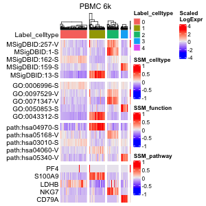

Analysis of 10x PBMC 6k dataset
================
Keita Iida
2022-07-14

-   [1 Computational environment](#1-computational-environment)
-   [2 Install libraries](#2-install-libraries)
-   [3 Introduction](#3-introduction)
-   [4 Prepare scRNA-seq data](#4-prepare-scrna-seq-data)
    -   [4.1 PBMC 6k](#41-pbmc-6k)
-   [5 Preprocessing](#5-preprocessing)
    -   [5.1 Control data quality](#51-control-data-quality)
    -   [5.2 Normalize data](#normalization)
-   [6 Multifaceted sign analysis](#6-multifaceted-sign-analysis)
    -   [6.1 Compute correlation
        matrices](#61-compute-correlation-matrices)
    -   [6.2 Load databases](#62-load-databases)
    -   [6.3 Create signs](#63-create-signs)
    -   [6.4 Select signs](#64-select-signs)
    -   [6.5 Create sign-by-sample
        matrices](#65-create-sign-by-sample-matrices)
    -   [6.6 Reduce dimensions of sign-by-sample
        matrices](#66-reduce-dimensions-of-sign-by-sample-matrices)
    -   [6.7 Cluster cells](#67-cluster-cells)
    -   [6.8 Investigate significant
        signs](#68-investigate-significant-signs)
    -   [6.9 Investigate significant
        genes](#69-investigate-significant-genes)
    -   [6.10 Multifaceted analysis](#610-multifaceted-analysis)
    -   [6.11 Infer cell types](#611-infer-cell-types)
-   [7 Using the existing softwares](#7-using-the-existing-softwares)
    -   [7.1 scran](#71-scran)
    -   [7.2 Seurat](#72-seurat)
    -   [7.3 Monocle 3](#73-monocle-3)
    -   [7.4 SC3](#74-sc3)
    -   [7.5 Cluster cells](#75-cluster-cells)

# 1 Computational environment

MacBook Pro (Big Sur, 16-inch, 2019), Processor (2.4 GHz 8-Core Intel
Core i9), Memory (64 GB 2667 MHz DDR4).

<br>

# 2 Install libraries

Attach necessary libraries:

``` r
library(ASURAT)
library(SingleCellExperiment)
library(SummarizedExperiment)
```

<br>

# 3 Introduction

In this vignette, we analyze single-cell RNA sequencing (scRNA-seq) data
obtained from peripheral blood mononuclear cells (PBMCs) of healthy
donors.

<br>

# 4 Prepare scRNA-seq data

## 4.1 PBMC 6k

The data can be loaded by the following code:

``` r
pbmc <- readRDS(url("https://figshare.com/ndownloader/files/34112462"))
```

The data are stored in
[DOI:10.6084/m9.figshare.19200254](https://figshare.com/s/866fbf822a4bfab234e6)
and the generating process is described below.

<br>

The data were obtained from 10x Genomics repository (PBMC 6k). Create
SingleCellExperiment objects by inputting raw read count tables.

``` r
path_dir <- "rawdata/2020_001_10xgenomics/pbmc_6k/"
path_dir <- paste0(path_dir, "filtered_matrices_mex/hg19/")
mat <- Seurat::Read10X(data.dir = path_dir, gene.column = 2,
                       unique.features = TRUE, strip.suffix = FALSE)
pbmc <- SingleCellExperiment(assays = list(counts = as.matrix(mat)),
                             rowData = data.frame(gene = rownames(mat)),
                             colData = data.frame(sample = colnames(mat)))
```

``` r
dim(pbmc)
```

    [2,] 32738 5419

``` r
# Save data.
saveRDS(pbmc, file = "backup/05_001_pbmc6k_rawdata.rds")

# Load data.
pbmc <- readRDS("backup/05_001_pbmc6k_rawdata.rds")
```

<br>

# 5 Preprocessing

## 5.1 Control data quality

Remove variables (genes) and samples (cells) with low quality, by
processing the following three steps:

1.  remove variables based on expression profiles across samples,
2.  remove samples based on the numbers of reads and nonzero expressed
    variables,
3.  remove variables based on the mean read counts across samples.

First of all, add metadata for both variables and samples using ASURAT
function `add_metadata()`.

``` r
pbmc <- add_metadata(sce = pbmc, mitochondria_symbol = "^MT-")
```

<br>

### 5.1.1 Remove variables based on expression profiles

ASURAT function `remove_variables()` removes variable (gene) data such
that the numbers of non-zero expressing samples (cells) are less than
`min_nsamples`.

``` r
pbmc <- remove_variables(sce = pbmc, min_nsamples = 10)
```

<br>

### 5.1.2 Remove samples based on expression profiles

Qualities of sample (cell) data are confirmed based on proper
visualization of `colData(sce)`.

``` r
title <- "PBMC 6k"
df <- data.frame(x = colData(pbmc)$nReads, y = colData(pbmc)$nGenes)
p <- ggplot2::ggplot() +
  ggplot2::geom_point(ggplot2::aes(x = df$x, y = df$y), size = 1, alpha = 1) +
  ggplot2::labs(title = title, x = "Number of reads", y = "Number of genes") +
  ggplot2::theme_classic(base_size = 20) +
  ggplot2::theme(plot.title = ggplot2::element_text(hjust = 0.5, size = 20))
filename <- "figures/figure_05_0010.png"
ggplot2::ggsave(file = filename, plot = p, dpi = 50, width = 5, height = 5)

df <- data.frame(x = colData(pbmc)$nReads, y = colData(pbmc)$percMT)
p <- ggplot2::ggplot() +
  ggplot2::geom_point(ggplot2::aes(x = df$x, y = df$y), size = 1, alpha = 1) +
  ggplot2::labs(title = title, x = "Number of reads", y = "Perc of MT reads") +
  ggplot2::theme_classic(base_size = 20) +
  ggplot2::theme(plot.title = ggplot2::element_text(hjust = 0.5, size = 20))
filename <- "figures/figure_05_0011.png"
ggplot2::ggsave(file = filename, plot = p, dpi = 50, width = 5, height = 5)
```


ASURAT function `remove_samples()` removes sample (cell) data by setting
cutoff values for the metadata.

``` r
pbmc <- remove_samples(sce = pbmc, min_nReads = 500, max_nReads = 10000,
                       min_nGenes = 100, max_nGenes = 1e+10,
                       min_percMT = 0, max_percMT = 10)
```

<br>

### 5.1.3 Remove variables based on the mean read counts

Qualities of variable (gene) data are confirmed based on proper
visualization of `rowData(sce)`.

``` r
title <- "PBMC 6k"
aveexp <- apply(as.matrix(assay(pbmc, "counts")), 1, mean)
df <- data.frame(x = seq_len(nrow(rowData(pbmc))),
                 y = sort(aveexp, decreasing = TRUE))
p <- ggplot2::ggplot() + ggplot2::scale_y_log10() +
  ggplot2::geom_point(ggplot2::aes(x = df$x, y = df$y), size = 1, alpha = 1) +
  ggplot2::labs(title = title, x = "Rank of genes", y = "Mean read counts") +
  ggplot2::theme_classic(base_size = 20) +
  ggplot2::theme(plot.title = ggplot2::element_text(hjust = 0.5, size = 20))
filename <- "figures/figure_05_0015.png"
ggplot2::ggsave(file = filename, plot = p, dpi = 50, width = 5, height = 5)
```


ASURAT function `remove_variables_second()` removes variable (gene) data
such that the mean read counts across samples are less than
`min_meannReads`.

``` r
pbmc <- remove_variables_second(sce = pbmc, min_meannReads = 0.05)
```

``` r
dim(pbmc)
```

    [1] 3554 5406

``` r
# Save data.
saveRDS(pbmc, file = "backup/05_002_pbmc6k_dataqc.rds")

# Load data.
pbmc <- readRDS("backup/05_002_pbmc6k_dataqc.rds")
```

<br>

## 5.2 Normalize data

Perform `bayNorm()` (Tang et al., Bioinformatics, 2020) for attenuating
technical biases with respect to zero inflation and variation of capture
efficiencies between samples (cells).

``` r
bayout <- bayNorm::bayNorm(Data = assay(pbmc, "counts"), mode_version = TRUE)
assay(pbmc, "normalized") <- bayout$Bay_out
```

Perform log-normalization with a pseudo count.

``` r
assay(pbmc, "logcounts") <- log(assay(pbmc, "normalized") + 1)
```

Center row data.

``` r
mat <- assay(pbmc, "logcounts")
assay(pbmc, "centered") <- sweep(mat, 1, apply(mat, 1, mean), FUN = "-")
```

Set gene expression data into `altExp(sce)`.

``` r
sname <- "logcounts"
altExp(pbmc, sname) <- SummarizedExperiment(list(counts = assay(pbmc, sname)))
```

Add ENTREZ Gene IDs to `rowData(sce)`.

``` r
dictionary <- AnnotationDbi::select(org.Hs.eg.db::org.Hs.eg.db,
                                    key = rownames(pbmc),
                                    columns = "ENTREZID", keytype = "SYMBOL")
dictionary <- dictionary[!duplicated(dictionary$SYMBOL), ]
rowData(pbmc)$geneID <- dictionary$ENTREZID
```

``` r
# Save data.
saveRDS(pbmc, file = "backup/05_003_pbmc6k_normalized.rds")

# Load data.
pbmc <- readRDS("backup/05_003_pbmc6k_normalized.rds")
```

<br>

# 6 Multifaceted sign analysis

Infer cell or disease types, biological functions, and signaling pathway
activity at the single-cell level by inputting related databases.

ASURAT transforms centered read count tables to functional feature
matrices, termed sign-by-sample matrices (SSMs). Using SSMs, perform
unsupervised clustering of samples (cells).

<br>

## 6.1 Compute correlation matrices

Prepare correlation matrices of gene expressions.

``` r
mat <- t(as.matrix(assay(pbmc, "centered")))
cormat <- cor(mat, method = "spearman")
```

``` r
# Save data.
saveRDS(cormat, file = "backup/05_003_pbmc6k_cormat.rds")

# Load data.
cormat <- readRDS("backup/05_003_pbmc6k_cormat.rds")
```

<br>

## 6.2 Load databases

Load databases.

``` r
urlpath <- "https://github.com/keita-iida/ASURATDB/blob/main/genes2bioterm/"
load(url(paste0(urlpath, "20201213_human_CO.rda?raw=TRUE")))         # CO
load(url(paste0(urlpath, "20220308_human_MSigDB.rda?raw=TRUE")))     # MSigDB
load(url(paste0(urlpath, "20220308_human_CellMarker.rda?raw=TRUE"))) # CellMarker
load(url(paste0(urlpath, "20201213_human_GO_red.rda?raw=TRUE")))     # GO
load(url(paste0(urlpath, "20201213_human_KEGG.rda?raw=TRUE")))       # KEGG
```

The reformatted knowledge-based data were available from the following
repositories:

-   [DOI:10.6084/m9.figshare.19102598](https://figshare.com/s/0599d2de970c2deb675c)
-   [Github ASURATDB](https://github.com/keita-iida/ASURATDB)

Create a custom-built cell type-related databases by combining different
databases for analyzing human single-cell transcriptome data.

``` r
d <- list(human_CO[["cell"]], human_MSigDB[["cell"]], human_CellMarker[["cell"]])
human_CB <- list(cell = do.call("rbind", d))
```

Add formatted databases to `metadata(sce)$sign`.

``` r
pbmcs <- list(CB = pbmc, GO = pbmc, KG = pbmc)
metadata(pbmcs$CB) <- list(sign = human_CB[["cell"]])
metadata(pbmcs$GO) <- list(sign = human_GO[["BP"]])
metadata(pbmcs$KG) <- list(sign = human_KEGG[["pathway"]])
```

<br>

## 6.3 Create signs

ASURAT function `remove_signs()` redefines functional gene sets for the
input database by removing genes, which are not included in
`rownames(sce)`, and further removes biological terms including too few
or too many genes.

``` r
pbmcs$CB <- remove_signs(sce = pbmcs$CB, min_ngenes = 2, max_ngenes = 1000)
pbmcs$GO <- remove_signs(sce = pbmcs$GO, min_ngenes = 2, max_ngenes = 1000)
pbmcs$KG <- remove_signs(sce = pbmcs$KG, min_ngenes = 2, max_ngenes = 1000)
```

ASURAT function `cluster_genes()` clusters functional gene sets using a
correlation graph-based decomposition method, which produces strongly,
variably, and weakly correlated gene sets (SCG, VCG, and WCG,
respectively).

``` r
set.seed(1)
pbmcs$CB <- cluster_genesets(sce = pbmcs$CB, cormat = cormat,
                             th_posi = 0.22, th_nega = -0.20)
set.seed(1)
pbmcs$GO <- cluster_genesets(sce = pbmcs$GO, cormat = cormat,
                             th_posi = 0.20, th_nega = -0.30)
set.seed(1)
pbmcs$KG <- cluster_genesets(sce = pbmcs$KG, cormat = cormat,
                             th_posi = 0.20, th_nega = -0.20)
```

ASURAT function `create_signs()` creates signs by the following
criteria:

1.  the number of genes in SCG\>= `min_cnt_strg` (the default value
    is 2) and
2.  the number of genes in VCG\>= `min_cnt_vari` (the default value is
    2),

which are independently applied to SCGs and VCGs, respectively.

``` r
pbmcs$CB <- create_signs(sce = pbmcs$CB, min_cnt_strg = 5, min_cnt_vari = 5)
pbmcs$GO <- create_signs(sce = pbmcs$GO, min_cnt_strg = 3, min_cnt_vari = 3)
pbmcs$KG <- create_signs(sce = pbmcs$KG, min_cnt_strg = 3, min_cnt_vari = 3)
```

<br>

## 6.4 Select signs

If signs have semantic similarity information, one can use ASURAT
function `remove_signs_redundant()` for removing redundant sings using
the semantic similarity matrices.

``` r
simmat <- human_GO$similarity_matrix$BP
pbmcs$GO <- remove_signs_redundant(sce = pbmcs$GO, similarity_matrix = simmat,
                                   threshold = 0.85, keep_rareID = TRUE)
```

ASURAT function `remove_signs_manually()` removes signs by specifying
IDs (e.g., `GOID:XXX`) or descriptions (e.g., `metabolic`) using
`grepl()`.

``` r
keywords <- "Covid|COVID"
pbmcs$KG <- remove_signs_manually(sce = pbmcs$KG, keywords = keywords)
```

<br>

## 6.5 Create sign-by-sample matrices

ASURAT function `create_sce_signmatrix()` creates a new
SingleCellExperiment object `new_sce`, consisting of the following
information:

-   `assayNames(new_sce)`: counts (SSM whose entries are termed sign
    scores),
-   `names(colData(new_sce))`: nReads, nGenes, percMT,
-   `names(rowData(new_sce))`: ParentSignID, Description, CorrGene,
    etc.,
-   `names(metadata(new_sce))`: sign_SCG, sign_VCG, etc.,
-   `altExpNames(new_sce)`: something if there is data in `altExp(sce)`.

``` r
pbmcs$CB <- makeSignMatrix(sce = pbmcs$CB, weight_strg = 0.5, weight_vari = 0.5)
pbmcs$GO <- makeSignMatrix(sce = pbmcs$GO, weight_strg = 0.5, weight_vari = 0.5)
pbmcs$KG <- makeSignMatrix(sce = pbmcs$KG, weight_strg = 0.5, weight_vari = 0.5)
```

<br>

## 6.6 Reduce dimensions of sign-by-sample matrices

Perform t-distributed stochastic neighbor embedding.

``` r
for(i in seq_along(pbmcs)){
  set.seed(1)
  mat <- t(as.matrix(assay(pbmcs[[i]], "counts")))
  res <- Rtsne::Rtsne(mat, dim = 2, pca = TRUE, initial_dims = 50)
  reducedDim(pbmcs[[i]], "TSNE") <- res[["Y"]]
}
```

Perform Uniform Manifold Approximation and Projection.

``` r
for(i in seq_along(pbmcs)){
  set.seed(1)
  mat <- t(as.matrix(assay(pbmcs[[i]], "counts")))
  res <- umap::umap(mat, n_components = 2)
  reducedDim(pbmcs[[i]], "UMAP") <- res[["layout"]]
}
```

Show the results of dimensional reduction in low-dimensional spaces.

``` r
titles <- c("PBMC 6k (cell type)", "PBMC 6k (function)", "PBMC 6k (pathway)")
for(i in seq_along(titles)){
  df <- as.data.frame(reducedDim(pbmcs[[i]], "UMAP"))
  p <- ggplot2::ggplot() +
    ggplot2::geom_point(ggplot2::aes(x = df[, 1], y = df[, 2]),
                        color = "black", size = 1, alpha = 1) +
    ggplot2::labs(title = titles[i], x = "UMAP_1", y = "UMAP_2") +
    ggplot2::theme_classic(base_size = 20) +
    ggplot2::theme(plot.title = ggplot2::element_text(hjust = 0.5, size = 18))
  filename <- sprintf("figures/figure_05_%04d.png", 19 + i)
  ggplot2::ggsave(file = filename, plot = p, dpi = 50, width = 4.1, height = 4.3)
}
```


``` r
# Save data.
saveRDS(pbmcs, file = "backup/05_004_pbmcs6k_ssm.rds")

# Load data.
pbmcs <- readRDS("backup/05_004_pbmcs6k_ssm.rds")
```

<br>

## 6.7 Cluster cells

### 6.7.1 Use Seurat functions

To date (December, 2021), one of the most useful clustering methods in
scRNA-seq data analysis is a combination of a community detection
algorithm and graph-based unsupervised clustering, developed in Seurat
package.

Here, our strategy is as follows:

1.  convert SingleCellExperiment objects into Seurat objects (note that
    `rowData()` and `colData()` must have data),
2.  perform `ScaleData()`, `RunPCA()`, `FindNeighbors()`, and
    `FindClusters()`,
3.  convert Seurat objects into temporal SingleCellExperiment objects
    `temp`,
4.  add `colData(temp)$seurat_clusters` into
    `colData(sce)$seurat_clusters`.

``` r
resolutions <- c(0.15, 0.15, 0.15)
dims <- list(seq_len(40), seq_len(40), seq_len(40))
for(i in seq_along(pbmcs)){
  surt <- Seurat::as.Seurat(pbmcs[[i]], counts = "counts", data = "counts")
  mat <- as.matrix(assay(pbmcs[[i]], "counts"))
  surt[["SSM"]] <- Seurat::CreateAssayObject(counts = mat)
  Seurat::DefaultAssay(surt) <- "SSM"
  surt <- Seurat::ScaleData(surt, features = rownames(surt))
  surt <- Seurat::RunPCA(surt, features = rownames(surt))
  surt <- Seurat::FindNeighbors(surt, reduction = "pca", dims = dims[[i]])
  surt <- Seurat::FindClusters(surt, resolution = resolutions[i])
  temp <- Seurat::as.SingleCellExperiment(surt)
  colData(pbmcs[[i]])$seurat_clusters <- colData(temp)$seurat_clusters
}
```

Show the clustering results in low-dimensional spaces.

``` r
titles <- c("PBMC 6k (cell type)", "PBMC 6k (function)", "PBMC 6k (pathway)")
for(i in seq_along(titles)){
  labels <- colData(pbmcs[[i]])$seurat_clusters
  df <- as.data.frame(reducedDim(pbmcs[[i]], "UMAP"))
  p <- ggplot2::ggplot() +
    ggplot2::geom_point(ggplot2::aes(x = df[, 1], y = df[, 2], color = labels),
                        size = 1, alpha = 1) +
    ggplot2::labs(title = titles[i], x = "UMAP_1", y = "UMAP_2", color = "") +
    ggplot2::theme_classic(base_size = 20) +
    ggplot2::theme(plot.title = ggplot2::element_text(hjust = 0.5, size = 18)) +
    ggplot2::guides(colour = ggplot2::guide_legend(override.aes = list(size = 4)))
  if(i == 1){
    p <- p + ggplot2::scale_colour_hue()
  }else if(i == 2){
    p <- p + ggplot2::scale_colour_brewer(palette = "Set1")
  }else if(i == 3){
    p <- p + ggplot2::scale_colour_brewer(palette = "Set2")
  }
  filename <- sprintf("figures/figure_05_%04d.png", 29 + i)
  ggplot2::ggsave(file = filename, plot = p, dpi = 50, width = 5.1, height = 4.3)
}
```


<br>

## 6.8 Investigate significant signs

Significant signs are analogous to differentially expressed genes but
bear biological meanings. Note that naïve usages of statistical tests
should be avoided because the row vectors of SSMs are centered.

Instead, ASURAT function `compute_sepI_all()` computes separation
indices for each cluster against the others. Briefly, a separation index
“sepI”, ranging from -1 to 1, is a nonparametric measure of significance
of a given sign score for a given subpopulation. The larger (resp.
smaller) sepI is, the more reliable the sign is as a positive (resp.
negative) marker for the cluster.

``` r
for(i in seq_along(pbmcs)){
  set.seed(1)
  labels <- colData(pbmcs[[i]])$seurat_clusters
  pbmcs[[i]] <- compute_sepI_all(sce = pbmcs[[i]], labels = labels,
                                 nrand_samples = NULL)
}

set.seed(1)
pbmcs_LabelCB_SignGO <- pbmcs$GO
metadata(pbmcs_LabelCB_SignGO)$marker_signs <- NULL
lbs <- colData(pbmcs$CB)$seurat_clusters
pbmcs_LabelCB_SignGO <- compute_sepI_all(sce = pbmcs_LabelCB_SignGO,
                                         labels = lbs, nrand_samples = NULL)

set.seed(1)
pbmcs_LabelCB_SignKG <- pbmcs$KG
metadata(pbmcs_LabelCB_SignKG)$marker_signs <- NULL
lbs <- colData(pbmcs$CB)$seurat_clusters
pbmcs_LabelCB_SignKG <- compute_sepI_all(sce = pbmcs_LabelCB_SignKG,
                                         labels = lbs, nrand_samples = NULL)
```

<br>

## 6.9 Investigate significant genes

### 6.9.1 Use Seurat function

To date (December, 2021), one of the most useful methods of multiple
statistical tests in scRNA-seq data analysis is to use a Seurat function
`FindAllMarkers()`.

If there is gene expression data in `altExp(sce)`, one can investigate
differentially expressed genes by using Seurat functions in the similar
manner as described before.

``` r
set.seed(1)
surt <- Seurat::as.Seurat(pbmcs$CB, counts = "counts", data = "counts")
mat <- as.matrix(assay(altExp(pbmcs$CB), "counts"))
surt[["GEM"]] <- Seurat::CreateAssayObject(counts = mat)
Seurat::DefaultAssay(surt) <- "GEM"
surt <- Seurat::SetIdent(surt, value = "seurat_clusters")
res <- Seurat::FindAllMarkers(surt, only.pos = TRUE,
                              min.pct = 0.25, logfc.threshold = 0.25)
metadata(pbmcs$CB)$marker_genes$all <- res
```

``` r
# Save data.
saveRDS(pbmcs, file = "backup/05_005_pbmcs6k_desdeg.rds")
saveRDS(pbmcs_LabelCB_SignGO, file = "backup/05_005_pbmcs6k_LabelCB_SignGO.rds")
saveRDS(pbmcs_LabelCB_SignKG, file = "backup/05_005_pbmcs6k_LabelCB_SignKG.rds")

# Load data.
pbmcs <- readRDS("backup/05_005_pbmcs6k_desdeg.rds")
pbmcs_LabelCB_SignGO <- readRDS("backup/05_005_pbmcs6k_LabelCB_SignGO.rds")
pbmcs_LabelCB_SignKG <- readRDS("backup/05_005_pbmcs6k_LabelCB_SignKG.rds")
```

<br>

## 6.10 Multifaceted analysis

Simultaneously analyze multiple sign-by-sample matrices, which helps us
characterize individual samples (cells) from multiple biological
aspects.

ASURAT function `plot_multiheatmaps()` shows heatmaps (ComplexHeatmap
object) of sign scores and gene expression levels (if there are), where
rows and columns stand for sign (or gene) and sample (cell),
respectively.

First, remove unrelated signs by setting keywords, followed by selecting
top significant signs and genes for the clustering results with respect
to separation index and p-value, respectively.

``` r
# Significant signs
marker_signs <- list()
keys <- "foofoo|hogehoge"
for(i in seq_along(pbmcs)){
  if(i == 1){
    marker_signs[[i]] <- metadata(pbmcs[[i]])$marker_signs$all
  }else if(i == 2){
    marker_signs[[i]] <- metadata(pbmcs_LabelCB_SignGO)$marker_signs$all
  }else if(i == 3){
    marker_signs[[i]] <- metadata(pbmcs_LabelCB_SignKG)$marker_signs$all
  }
  marker_signs[[i]] <- marker_signs[[i]][!grepl(keys, marker_signs[[i]]$Description), ]
  marker_signs[[i]] <- dplyr::group_by(marker_signs[[i]], Ident_1)
  marker_signs[[i]] <- dplyr::slice_max(marker_signs[[i]], sepI, n = 1)
  marker_signs[[i]] <- dplyr::slice_min(marker_signs[[i]], Rank, n = 1)
}
# Significant genes
marker_genes_CB <- metadata(pbmcs$CB)$marker_genes$all
marker_genes_CB <- dplyr::group_by(marker_genes_CB, cluster)
marker_genes_CB <- dplyr::slice_min(marker_genes_CB, p_val_adj, n = 1)
marker_genes_CB <- dplyr::slice_max(marker_genes_CB, avg_log2FC, n = 1)
```

Then, prepare arguments.

``` r
# ssm_list
sces_sub <- list() ; ssm_list <- list()
for(i in seq_along(pbmcs)){
  sces_sub[[i]] <- pbmcs[[i]][rownames(pbmcs[[i]]) %in% marker_signs[[i]]$SignID, ]
  ssm_list[[i]] <- assay(sces_sub[[i]], "counts")
}
names(ssm_list) <- c("SSM_celltype", "SSM_function", "SSM_pathway")
# gem_list
expr_sub <- altExp(pbmcs$CB, "logcounts")
expr_sub <- expr_sub[rownames(expr_sub) %in% marker_genes_CB$gene]
gem_list <- list(x = t(scale(t(as.matrix(assay(expr_sub, "counts"))))))
names(gem_list) <- "Scaled\nLogExpr"
# ssmlabel_list
labels <- list() ; ssmlabel_list <- list()
for(i in seq_along(pbmcs)){
  tmp <- colData(sces_sub[[i]])$seurat_clusters
  labels[[i]] <- data.frame(label = tmp)
  n_groups <- length(unique(tmp))
  if(i == 1){
    labels[[i]]$color <- scales::hue_pal()(n_groups)[tmp]
  }else if(i == 2){
    labels[[i]]$color <- scales::brewer_pal(palette = "Set1")(n_groups)[tmp]
  }else if(i == 3){
    labels[[i]]$color <- scales::brewer_pal(palette = "Set2")(n_groups)[tmp]
  }
  ssmlabel_list[[i]] <- labels[[i]]
}
names(ssmlabel_list) <- c("Label_celltype", "Label_function", "Label_pathway")
```

**Tips:** If one would like to omit some color labels (e.g., labels


\]), set the argument as follows:

``` r
ssmlabel_list[[2]] <- data.frame(label = NA, color = NA)
ssmlabel_list[[3]] <- data.frame(label = NA, color = NA)
```

Finally, plot heatmaps for the selected signs and genes.

``` r
filename <- "figures/figure_05_0040.png"
#png(file = filename, height = 1450, width = 1650, res = 300)
png(file = filename, height = 300, width = 300, res = 60)
set.seed(4)
title <- "PBMC 6k"
plot_multiheatmaps(ssm_list = ssm_list, gem_list = gem_list,
                   ssmlabel_list = ssmlabel_list, gemlabel_list = NULL,
                   nrand_samples = 500, show_row_names = TRUE, title = title)
dev.off()
```



Show violin plots for the sign score distributions across cell
type-related clusters.

``` r
labels <- colData(pbmcs$CB)$seurat_clusters
vlist <- list(c("CB", "MSigDBID:162-S", "...T_CELL (CD3D, CD69, ...)"),
              c("CB", "MSigDBID:266-S", "...MACROPHAGE... (LYZ, ...)"),
              c("CB", "MSigDBID:1-S", "...NK_NKT_CELLS... (NKG7, GZMB, ...)"),
              c("CB", "MSigDBID:159-S", "...B_CELLS (BLK, MS4A1, ...)"),
              c("CB", "MSigDBID:257-V", "...MEGAKARYOCYTE... (PF4, PPBP, ...)"))
for(i in seq_along(vlist)){
  ind <- which(rownames(pbmcs[[vlist[[i]][1]]]) == vlist[[i]][2])
  subsce <- pbmcs[[vlist[[i]][1]]][ind, ]
  df <- as.data.frame(t(as.matrix(assay(subsce, "counts"))))
  p <- ggplot2::ggplot() +
    ggplot2::geom_violin(ggplot2::aes(x = as.factor(labels), y = df[, 1],
                                      fill = labels), trim = FALSE, size = 0.5) +
    ggplot2::geom_boxplot(ggplot2::aes(x = as.factor(labels), y = df[, 1]),
                          width = 0.15, alpha = 0.6) +
    ggplot2::labs(title = paste0(vlist[[i]][2], "\n", vlist[[i]][3]),
                  x = "Cluster (cell type)", y = "Sign score", fill = "Cluster") +
    ggplot2::theme_classic(base_size = 25) +
    ggplot2::theme(plot.title = ggplot2::element_text(hjust = 0.5, size = 20),
                   legend.position = "none") +
    ggplot2::scale_fill_hue()
  filename <- sprintf("figures/figure_05_%04d.png", 49 + i)
  ggplot2::ggsave(file = filename, plot = p, dpi = 50, width = 6, height = 3.5)
}
```


<br>

## 6.11 Infer cell types

``` r
colData(pbmcs$CB)$cell_type <- as.character(colData(pbmcs$CB)$seurat_clusters)
colData(pbmcs$CB)$cell_type[colData(pbmcs$CB)$cell_type == 0] <- "T"
colData(pbmcs$CB)$cell_type[colData(pbmcs$CB)$cell_type == 1] <- "Mono"
colData(pbmcs$CB)$cell_type[colData(pbmcs$CB)$cell_type == 2] <- "NK/NKT"
colData(pbmcs$CB)$cell_type[colData(pbmcs$CB)$cell_type == 3] <- "B"
colData(pbmcs$CB)$cell_type[colData(pbmcs$CB)$cell_type == 4] <- "Megakaryocyte"
```

Show the annotation results in low-dimensional spaces.

``` r
title <- "PBMC 6k (cell type)"
labels <- factor(colData(pbmcs$CB)$cell_type,
                 levels = c("T", "Mono", "NK/NKT", "B", "Megakaryocyte"))
df <- as.data.frame(reducedDim(pbmcs$CB, "UMAP"))
p <- ggplot2::ggplot() +
  ggplot2::geom_point(ggplot2::aes(x = df[, 1], y = df[, 2], color = labels),
                      size = 1, alpha = 1) +
  ggplot2::labs(title = title, x = "UMAP_1", y = "UMAP_2", color = "Cell state") +
  ggplot2::theme_classic(base_size = 20) +
  ggplot2::theme(plot.title = ggplot2::element_text(hjust = 0.5, size = 18)) +
  ggplot2::scale_colour_hue() +
  ggplot2::guides(colour = ggplot2::guide_legend(override.aes = list(size = 4)))
filename <- "figures/figure_05_0080.png"
ggplot2::ggsave(file = filename, plot = p, dpi = 50, width = 6.5, height = 4.3)
```


``` r
# Save data.
saveRDS(pbmcs, file = "backup/05_006_pbmcs6k_annotation.rds")

# Load data.
pbmcs <- readRDS("backup/05_006_pbmcs6k_annotation.rds")
```

<br>

# 7 Using the existing softwares

## 7.1 scran

Load the normalized data (see [here](#normalization)).

``` r
pbmc <- readRDS("backup/05_003_pbmc6k_normalized.rds")
```

Prepare a SingleCellExperiment object.

``` r
mat <- as.matrix(assay(pbmc, "counts"))
pbmc <- SingleCellExperiment(assays = list(counts = as.matrix(mat)),
                             rowData = data.frame(gene = rownames(mat)),
                             colData = data.frame(sample = colnames(mat)))
```

<br>

### 7.1.1 Normalize data

According to the scran protocol, perform cell clustering for computing
size factors for individual clusters, normalize data within individual
clusters, and perform a variance modeling for each gene.

``` r
# Quick cell clustering
clusters <- scran::quickCluster(pbmc)
# scran normalization
pbmc <- scran::computeSumFactors(pbmc, clusters = clusters)
pbmc <- scater::logNormCounts(pbmc)
# Perform a variance modeling
metadata(pbmc)$dec <- scran::modelGeneVar(pbmc)
```

Show the results of variance modeling.

``` r
df <- data.frame(x = metadata(pbmc)$dec$mean, y = metadata(pbmc)$dec$total,
                 z = metadata(pbmc)$dec$tech)
title <- "PBMC 6k"
p <- ggplot2::ggplot() +
  ggplot2::geom_point(ggplot2::aes(x = df[,1], y = df[,2]), color = "black",
                      alpha = 1, size = 2) +
  ggplot2::geom_line(ggplot2::aes(x = df[,1], y = df[,3]), color = "red",
                     alpha = 1, size = 2) +
  ggplot2::labs(title = title, x = "Mean log-expression", y = "Variance") +
  ggplot2::theme_classic(base_size = 20) +
  ggplot2::theme(plot.title = ggplot2::element_text(hjust = 0.5, size = 20))
filename <- "figures/figure_05_0110.png"
ggplot2::ggsave(file = filename, plot = p, dpi = 50, width = 4.0, height = 4.0)
```


<br>

### 7.1.2 Cluster cells

According to the scran protocol, choose top variable genes using
`getTopHVGs()`, performe `denoisPCA()` by inputting the variable genes,
and perform k-nearest neighbor graph-based clustering, where k is a
resolution parameter.

**Tips:** As mentioned in Cruz and Wishart, Cancer Inform. 2, 59-77
(2006), highly variable genes are selected as the cell-per-variable gene
ratio being 5:1.

``` r
# Choose top variable genes.
hvg <- scran::getTopHVGs(metadata(pbmc)$dec, n = round(0.2 * ncol(pbmc)))
# Principal component analysis
pbmc <- scran::denoisePCA(pbmc, metadata(pbmc)$dec, subset.row = hvg)
# Cell clustering
set.seed(1)
g <- scran::buildSNNGraph(pbmc, use.dimred = "PCA", k = 200, type = "rank")
c <- igraph::cluster_louvain(g)$membership
colData(pbmc)$scran_clusters <- as.factor(c)
```

<br>

### 7.1.3 Reduce dimensions

Perform t-distributed stochastic neighbor embedding and Uniform Manifold
Approximation and Projection.

``` r
mat <- reducedDim(pbmc, "PCA")
# t-SNE
set.seed(1)
res <- Rtsne::Rtsne(mat, dim = 2, pca = FALSE)
reducedDim(pbmc, "TSNE") <- res[["Y"]]
# UMAP
set.seed(1)
res <- umap::umap(mat, n_components = 2)
reducedDim(pbmc, "UMAP") <- res[["layout"]]
```

Show the clustering results.

``` r
title <- "PBMC 6k (scran)"
labels <- colData(pbmc)$scran_clusters
df <- as.data.frame(reducedDim(pbmc, "UMAP"))
p <- ggplot2::ggplot() +
  ggplot2::geom_point(ggplot2::aes(x = df[, 1], y = df[, 2], color = labels),
                      size = 1, alpha = 1) +
  ggplot2::labs(title = title, x = "UMAP_1", y = "UMAP_2", color = "") +
  ggplot2::theme_classic(base_size = 20) +
  ggplot2::theme(plot.title = ggplot2::element_text(hjust = 0.5, size = 20)) +
  ggplot2::scale_colour_hue() +
  ggplot2::guides(colour = ggplot2::guide_legend(override.aes = list(size = 4)))
filename <- "figures/figure_05_0130.png"
ggplot2::ggsave(file = filename, plot = p, dpi = 50, width = 5.1, height = 4.3)
```


<br>

### 7.1.4 Find differentially expressed genes

Performs `pairwiseTTests()` and `combineMarkers()` for finding cluster
markers.

``` r
metadata(pbmc)$pwtt <- scran::pairwiseTTests(
  x = as.matrix(assay(pbmc, "logcounts")),
  groups = colData(pbmc)$scran_clusters, direction = "up")
metadata(pbmc)$cmb <- scran::combineMarkers(
  de.lists = metadata(pbmc)$pwtt$statistics,
  pairs = metadata(pbmc)$pwtt$pairs, pval.type = "all")
# Create a result table.
res <- list()
for(i in seq_along(metadata(pbmc)$cmb@listData)){
  g <- metadata(pbmc)$cmb@listData[[i]]@rownames
  p <- metadata(pbmc)$cmb@listData[[i]]@listData[["p.value"]]
  fd <- metadata(pbmc)$cmb@listData[[i]]@listData[["FDR"]]
  fc <- metadata(pbmc)$cmb@listData[[i]]@listData[["summary.logFC"]]
  res[[i]] <- data.frame(label = i, gene = g, pval = p, FDR = fd, logFC = fc)
}
tmp <- c()
for(i in seq_along(res)){
  tmp <- rbind(tmp, res[[i]])
}
metadata(pbmc)$stat <- tmp
View(metadata(pbmc)$stat[metadata(pbmc)$stat$FDR < 10^(-100), ])
```

<br>

### 7.1.5 Infer cell types

Defining significant genes as genes with FDR\<1e-100, infer cell types
using [GeneCards](https://www.genecards.org/).

    1: Unspecified  # Only LDHB, RPS14, and RPS3 were detected as DEGs.
    2: Monocyte     # S100A9 (FDR ~0), S100A8 (FDR ~0)
    3: NK/NKT       # NKG7 (FDR ~e-239), GZMA (FDR ~e-204)
    4: B cell       # CD79A (FDR ~e-274), CD79B (FDR ~e-256)

``` r
colData(pbmc)$cell_type <- as.integer(as.character(colData(pbmc)$scran_clusters))
colData(pbmc)$cell_type[colData(pbmc)$cell_type == 1] <- "Unspecified"
colData(pbmc)$cell_type[colData(pbmc)$cell_type == 2] <- "Mono"
colData(pbmc)$cell_type[colData(pbmc)$cell_type == 3] <- "NK/NKT"
colData(pbmc)$cell_type[colData(pbmc)$cell_type == 4] <- "B"
```

Show the annotation results in low-dimensional spaces.

``` r
title <- "PBMC 6k (scran)"
labels <- factor(colData(pbmc)$cell_type,
                 levels = c("Mono", "NK/NKT", "B", "Unspecified"))
df <- as.data.frame(reducedDim(pbmc, "UMAP"))
mycolor <- scales::hue_pal()(5)
mycolor <- c("Mono" = mycolor[2], "NK/NKT" = mycolor[3], "B" = mycolor[4],
             "Unspecified" = "grey80")
p <- ggplot2::ggplot() +
  ggplot2::geom_point(ggplot2::aes(x = df[, 1], y = df[, 2], color = labels),
                      size = 1, alpha = 1) +
  ggplot2::labs(title = title, x = "UMAP_1", y = "UMAP_2", color = "Cell type") +
  ggplot2::theme_classic(base_size = 20) +
  ggplot2::theme(plot.title = ggplot2::element_text(hjust = 0.5, size = 18)) +
  ggplot2::guides(colour = ggplot2::guide_legend(override.aes = list(size = 4))) +
  ggplot2::scale_color_manual(values = mycolor)
filename <- "figures/figure_05_0140.png"
ggplot2::ggsave(file = filename, plot = p, dpi = 50, width = 6.1, height = 4.3)
```


``` r
# Save data.
saveRDS(pbmc, file = "backup/05_011_pbmc6k_scran.rds")

# Load data.
pbmc <- readRDS("backup/05_011_pbmc6k_scran.rds")
```

<br>

## 7.2 Seurat

Load the normalized data (see [here](#normalization)).

``` r
pbmc <- readRDS("backup/05_003_pbmc6k_normalized.rds")
```

Create Seurat objects.

``` r
pbmc <- Seurat::CreateSeuratObject(counts = as.matrix(assay(pbmc, "counts")),
                                   project = "PBMC")
```

<br>

### 7.2.1 Perform Seurat preprocessing

According to the Seurat protocol, normalize data, perform variance
stabilizing transform by setting the number of variable feature, scale
data, and reduce dimension using principal component analysis.

``` r
# Normalization
pbmc <- Seurat::NormalizeData(pbmc, normalization.method = "LogNormalize")
# Variance stabilizing transform
n <- round(0.2 * ncol(pbmc))
pbmc <- Seurat::FindVariableFeatures(pbmc, selection.method = "vst", nfeatures = n)
# Scale data
pbmc <- Seurat::ScaleData(pbmc)
# Principal component analysis
pbmc <- Seurat::RunPCA(pbmc, features = Seurat::VariableFeatures(pbmc))
```

<br>

### 7.2.2 Cluster cells

Compute the cumulative sum of variances, which is used for determining
the number of the principal components (PCs).

``` r
pc <- which(cumsum(pbmc@reductions[["pca"]]@stdev) /
              sum(pbmc@reductions[["pca"]]@stdev) > 0.9)[1]
```

Perform cell clustering.

``` r
# Create k-nearest neighbor graph.
pbmc <- Seurat::FindNeighbors(pbmc, reduction = "pca", dim = seq_len(pc))
# Cluster cells.
pbmc <- Seurat::FindClusters(pbmc, resolution = 0.1)
# Run t-SNE.
pbmc <- Seurat::RunTSNE(pbmc, dims.use = seq_len(2), reduction = "pca",
                        dims = seq_len(pc), do.fast = FALSE, perplexity = 30)
# Run UMAP.
pbmc <- Seurat::RunUMAP(pbmc, dims = seq_len(pc))
```

Show the clustering results.

``` r
title <- "PBMC 6k (Seurat)"
labels <- pbmc$seurat_clusters
df <- pbmc@reductions[["umap"]]@cell.embeddings
p <- ggplot2::ggplot() +
  ggplot2::geom_point(ggplot2::aes(x = df[, 1], y = df[, 2], color = labels),
                      size = 1, alpha = 1) +
  ggplot2::labs(title = title, x = "UMAP_1", y = "UMAP_2", color = "") +
  ggplot2::theme_classic(base_size = 20) +
  ggplot2::theme(plot.title = ggplot2::element_text(hjust = 0.5, size = 18)) +
  ggplot2::scale_colour_hue() +
  ggplot2::guides(colour = ggplot2::guide_legend(override.aes = list(size = 4)))
filename <- "figures/figure_05_0230.png"
ggplot2::ggsave(file = filename, plot = p, dpi = 50, width = 5.1, height = 4.3)
```


<br>

### 7.2.3 Find differentially expressed genes

Find differentially expressed genes.

``` r
pbmc@misc$stat <- Seurat::FindAllMarkers(pbmc, only.pos = TRUE, min.pct = 0.25,
                                         logfc.threshold = 0.25)
View(pbmc@misc$stat[which(pbmc@misc$stat$p_val_adj < 10^(-100)), ])
```

<br>

### 7.2.4 Infer cell types

Defining significant genes as genes with FDR\<1e-100, infer cell types
using [GeneCards](https://www.genecards.org/).

    0: T cell        # CD3D (p_val_adj ~0), CD3E (p_val_adj ~e-276)
    1: Monocyte      # S100A8 (p_val_adj ~0), S100A9 (p_val_adj ~0)
    2: NK/NKT        # NKG7 (p_val_adj ~0), GZMA (p_val_adj ~0)
    3: B cell        # CD79A (p_val_adj ~0), CD79B (p_val_adj ~0)
    4: Megakaryocyte # PPBP (p_val_adj ~e-220), GZMB (p_val_adj ~e-285)

``` r
tmp <- as.integer(as.character(pbmc$seurat_clusters))
pbmc$cell_type <- tmp
pbmc$cell_type[pbmc$cell_type == 0] <- "T"
pbmc$cell_type[pbmc$cell_type == 1] <- "Mono"
pbmc$cell_type[pbmc$cell_type == 2] <- "NK/NKT"
pbmc$cell_type[pbmc$cell_type == 3] <- "B"
pbmc$cell_type[pbmc$cell_type == 4] <- "Megakaryocyte"
```

Show the annotation results in low-dimensional spaces.

``` r
title <- "PBMC 6k (Seurat)"
labels <- factor(pbmc$cell_type,
                 levels = c("T", "Mono", "NK/NKT", "B", "Megakaryocyte"))
df <- pbmc@reductions[["umap"]]@cell.embeddings
p <- ggplot2::ggplot() +
  ggplot2::geom_point(ggplot2::aes(x = df[, 1], y = df[, 2], color = labels),
                      size = 1, alpha = 1) +
  ggplot2::labs(title = title, x = "UMAP_1", y = "UMAP_2", color = "Cell type") +
  ggplot2::theme_classic(base_size = 20) +
  ggplot2::theme(plot.title = ggplot2::element_text(hjust = 0.5, size = 18)) +
  ggplot2::scale_colour_hue() +
  ggplot2::guides(colour = ggplot2::guide_legend(override.aes = list(size = 4)))
filename <- "figures/figure_05_0240.png"
ggplot2::ggsave(file = filename, plot = p, dpi = 50, width = 6.5, height = 4.3)
```


``` r
# Save data.
saveRDS(pbmc, file = "backup/05_021_pbmc6k_seurat.rds")

# Load data.
pbmc <- readRDS("backup/05_021_pbmc6k_seurat.rds")
```

<br>

### 7.2.5 Infer cell types using Seurat and scCATCH

Check the package version.

``` r
packageVersion("scCATCH")
```

    [1] ‘3.0’

Load Seurat computational results.

``` r
pbmc <- readRDS("backup/05_021_pbmc6k_seurat.rds")
```

Create scCATCH objects.

``` r
mat <- as.matrix(Seurat::GetAssayData(object = pbmc, slot = "data"))
mat <- scCATCH::rev_gene(data = mat, data_type = "data", species = "Human",
                         geneinfo = scCATCH::geneinfo)
labels <- as.character(pbmc$seurat_clusters)
scc <- scCATCH::createscCATCH(data = mat, cluster = labels)
```

Perform `findmarkergenes()` and `findcelltype()`.

``` r
scc <- scCATCH::findmarkergene(object = scc, species = "Human",
                               marker = scCATCH::cellmatch,
                               tissue = "Peripheral blood", cancer = "Normal",
                               cell_min_pct = 0.25, logfc = 0.25, pvalue = 0.05)
scc <- scCATCH::findcelltype(object = scc)
pbmc@misc[["scCATCH"]] <- scc
View(pbmc@misc[["scCATCH"]]@celltype)
```

Annotate cells.

``` r
tmp <- pbmc[[]]
tmp[which(tmp$seurat_clusters == 0), ]$cell_type <- "Mono"
tmp[which(tmp$seurat_clusters == 1), ]$cell_type <- "Mono"
tmp[which(tmp$seurat_clusters == 2), ]$cell_type <- "T"
tmp[which(tmp$seurat_clusters == 3), ]$cell_type <- "B"
tmp[which(tmp$seurat_clusters == 4), ]$cell_type <- "T"
pbmc <- Seurat::AddMetaData(pbmc, tmp)
```

Show the annotation results in low-dimensional spaces.

``` r
title <- "PBMC 6k (Seurat + scCatch)"
labels <- factor(pbmc[[]]$cell_type, levels = c("T", "Mono", "B"))
mycolor <- scales::hue_pal()(5)
mycolor <- c("T" = mycolor[1], "Mono" = mycolor[2], "B" = mycolor[4])
df <- pbmc@reductions[["umap"]]@cell.embeddings
p <- ggplot2::ggplot() +
  ggplot2::geom_point(ggplot2::aes(x = df[, 1], y = df[, 2], color = labels),
                      size = 1, alpha = 1) +
  ggplot2::labs(title = title, x = "UMAP_1", y = "UMAP_2", color = "Cell type") +
  ggplot2::theme_classic(base_size = 20) +
  ggplot2::theme(plot.title = ggplot2::element_text(hjust = 0.5, size = 18)) +
  ggplot2::scale_color_manual(values = mycolor) +
  ggplot2::guides(colour = ggplot2::guide_legend(override.aes = list(size = 4)))
filename <- "figures/figure_05_0245.png"
ggplot2::ggsave(file = filename, plot = p, dpi = 50, width = 5.7, height = 4.3)
```


``` r
# Save data.
saveRDS(pbmc, file = "backup/05_022_pbmc6k_seurat_sccatch.rds")

# Load data.
pbmc <- readRDS("backup/05_022_pbmc6k_seurat_sccatch.rds")
```

<br>

### 7.2.6 Infer cell types using ssGSEA

Load the Seurat annotation results.

``` r
pbmc <- readRDS("backup/05_021_pbmc6k_seurat.rds")
```

Check the package version.

``` r
packageVersion("escape")
```

    [1] ‘1.0.1’

Perform `getGeneSets()` with an argument `library = "C8"` (“cell type
signature gene sets” in
[MSigDB](https://www.gsea-msigdb.org/gsea/msigdb/collections.jsp)).

``` r
pbmc@misc[["getGeneSets"]] <- escape::getGeneSets(species = "Homo sapiens",
                                                  library = "C8")
```

Perform `enrichIt()`, estimating ssGSEA scores, in which the arguments
are the same with those in the vignettes in escape package.

``` r
ES <- escape::enrichIt(obj = pbmc, gene.sets = pbmc@misc[["getGeneSets"]],
                       groups = 1000, cores = 4)
pbmc <- Seurat::AddMetaData(pbmc, ES)
pbmc@misc[["enrichIt"]] <- ES
```

    [1] "Using sets of 1000 cells. Running 5 times."
    Setting parallel calculations through a SnowParam back-end
    with workers=4 and tasks=100.
    Estimating ssGSEA scores for 654 gene sets.
    Setting parallel calculations through a SnowParam back-end
    with workers=4 and tasks=100.
    Estimating ssGSEA scores for 654 gene sets.
    ...
    Setting parallel calculations through a SnowParam back-end
    with workers=4 and tasks=100.
    Estimating ssGSEA scores for 654 gene sets.

Perform t-distributed stochastic neighbor embedding and Uniform Manifold
Approximation and Projection.

``` r
mat <- pbmc@misc[["enrichIt"]]
# t-SNE
set.seed(1)
res <- Rtsne::Rtsne(mat, dim = 2, pca = TRUE, initial_dims = 50)
pbmc@reductions[["tsne_ssgsea"]] <- res[["Y"]]
# UMAP
set.seed(1)
res <- umap::umap(mat, n_components = 2)
pbmc@reductions[["umap_ssgsea"]] <- res[["layout"]]
```

Perform unsupervised clustering of cells using Seurat functions.

``` r
surt <- Seurat::CreateSeuratObject(counts = t(pbmc@misc[["enrichIt"]]),
                                   project = "PBMC")
surt <- Seurat::ScaleData(surt, features = rownames(surt))
surt <- Seurat::RunPCA(surt, features = rownames(surt))
surt <- Seurat::FindNeighbors(surt, reduction = "pca", dims = seq_len(40))
surt <- Seurat::FindClusters(surt, resolution = 0.1)
pbmc <- Seurat::AddMetaData(pbmc, metadata = surt[[]]$seurat_clusters,
                            col.name = "ssgsea_clusters")
```

Show the clustering results in low-dimensional spaces.

``` r
labels <- pbmc$ssgsea_clusters
df <- as.data.frame(pbmc@reductions[["umap_ssgsea"]])
p <- ggplot2::ggplot() +
  ggplot2::geom_point(ggplot2::aes(x = df[, 1], y = df[, 2], color = labels),
                      size = 0.2, alpha = 1) +
  ggplot2::labs(title = "PBMC 6k (ssGSEA)", x = "UMAP_1", y = "UMAP_2",
                color = "") +
  ggplot2::theme_classic(base_size = 20) +
  ggplot2::theme(plot.title = ggplot2::element_text(hjust = 0.5, size = 18)) +
  ggplot2::guides(colour = ggplot2::guide_legend(override.aes = list(size = 4),
                                                 ncol = 1))
filename <- "figures/figure_05_0280.png"
ggplot2::ggsave(file = filename, plot = p, dpi = 50, width = 5.1, height = 4.3)
```


``` r
# Save data.
saveRDS(pbmc, file = "backup/05_023_pbmc6k_ssGSEA_msigdb.rds")

# Load data.
pbmc <- readRDS("backup/05_023_pbmc6k_ssGSEA_msigdb.rds")
```

<br>

### 7.2.7 Infer cell types using Seurat and ssGSEA

Load ssGSEA results.

``` r
pbmc <- readRDS("backup/05_023_pbmc6k_ssGSEA_msigdb.rds")
```

Investigate “significant” modules for Seurat clustering results.

``` r
set.seed(1)
surt <- Seurat::CreateSeuratObject(counts = t(pbmc@misc[["enrichIt"]]))
surt <- Seurat::AddMetaData(surt, metadata = pbmc$cell_type,
                            col.name = "seurat_cell_type")
surt <- Seurat::SetIdent(surt, value = "seurat_cell_type")
res <- Seurat::FindAllMarkers(surt, only.pos = TRUE,
                              min.pct = 0.15, logfc.threshold = 0.15)
rownames(res) <- seq_len(nrow(res))
pbmc@misc[["ssGSEA_stat"]] <- res
```

Show violin plots for ssGSEA score distributions for Seurat annotation
results.

``` r
lvs <- c("T", "Mono", "NK/NKT", "B", "Megakaryocyte")
labels <- factor(pbmc$cell_type, levels = lvs)
descriptions <- c(gsub("-", "_", "DURANTE-ADULT-OLFACTORY-NEUROEPITHELIUM-CD4-T-CELLS"),
                  gsub("-", "_", "DURANTE-ADULT-OLFACTORY-NEUROEPITHELIUM-MACROPHAGES"),
                  gsub("-", "_", "TRAVAGLINI-LUNG-NATURAL-KILLER-T-CELL"),
                  gsub("-", "_", "DURANTE-ADULT-OLFACTORY-NEUROEPITHELIUM-B-CELLS"),
                  gsub("-", "_", "TRAVAGLINI-LUNG-PLATELET-MEGAKARYOCYTE-CELL"))
titles <- c(paste0("MSigDB: ssGSEA score for\n", gsub("_", "-", descriptions[1])),
            paste0("MSigDB: ssGSEA score for\n", gsub("_", "-", descriptions[2])),
            paste0("MSigDB: ssGSEA score for\n", gsub("_", "-", descriptions[3])),
            paste0("MSigDB: ssGSEA score for\n", gsub("_", "-", descriptions[4])),
            paste0("MSigDB: ssGSEA score for\n", gsub("_", "-", descriptions[5])))
mat <- pbmc@misc[["enrichIt"]]
mat <- mat[, which(colnames(mat) %in% descriptions)]
for(i in seq_along(descriptions)){
  df <- data.frame(label = labels,
                   ssGSEA = mat[, which(colnames(mat) == descriptions[i])])
#  df <- tidyr::pivot_longer(df, cols = c("Sign", "ssGSEA"))
  p <- ggplot2::ggplot() +
    ggplot2::geom_violin(ggplot2::aes(x = as.factor(df$label), y = df$ssGSEA),
                         fill = "grey80", trim = FALSE, size = 1) +
    ggplot2::labs(title = titles[i], x = "Seurat annotations",
                  y = "ssGSEA scores") +
    ggplot2::scale_x_discrete(guide = ggplot2::guide_axis(angle = 45)) +
    ggplot2::theme_classic(base_size = 20) +
    ggplot2::theme(plot.title = ggplot2::element_text(hjust = 0.5, size = 15))
  filename <- sprintf("figures/figure_05_%04d.png", 289 + i)
  ggplot2::ggsave(file = filename, plot = p, dpi = 50, width = 6, height = 5.3)
}
```


``` r
# Save data.
saveRDS(pbmc, file = "backup/05_024_pbmc6k_seurat_ssGSEA.rds")

# Load data.
pbmc <- readRDS("backup/05_024_pbmc6k_seurat_ssGSEA.rds")
```

<br>

### 7.2.8 Infer cell types using ASURAT by inputting MSigDB

Load the normalized data (see [here](#normalization)) and correlation
matrix.

``` r
pbmc <- readRDS("backup/05_003_pbmc6k_normalized.rds")
cormat <- readRDS("backup/05_003_pbmc6k_cormat.rds")
```

Load the MSigDB.

``` r
urlpath <- "https://github.com/keita-iida/ASURATDB/blob/main/genes2bioterm/"
load(url(paste0(urlpath, "20220308_human_MSigDB.rda?raw=TRUE"))) # MSigDB
```

Perform ASURAT protocols.

``` r
# Create a sign-by-sample matrix.
pbmcs <- list(CB = pbmc)
metadata(pbmcs$CB) <- list(sign = human_MSigDB$cell)
pbmcs$CB <- remove_signs(sce = pbmcs$CB, min_ngenes = 2, max_ngenes = 1000)
set.seed(1)
pbmcs$CB <- cluster_genesets(sce = pbmcs$CB, cormat = cormat,
                             th_posi = 0.22, th_nega = -0.20)
pbmcs$CB <- create_signs(sce = pbmcs$CB, min_cnt_strg = 5, min_cnt_vari = 5)
pbmcs$CB <- makeSignMatrix(sce = pbmcs$CB, weight_strg = 0.5, weight_vari = 0.5)
# Perform dimension reduction (t-SNE).
set.seed(1)
mat <- t(as.matrix(assay(pbmcs$CB, "counts")))
res <- Rtsne::Rtsne(mat, dim = 2, pca = TRUE, initial_dims = 50)
reducedDim(pbmcs$CB, "TSNE") <- res[["Y"]]
# Perform dimension reduction (UMAP).
set.seed(1)
mat <- t(as.matrix(assay(pbmcs$CB, "counts")))
res <- umap::umap(mat, n_components = 2)
reducedDim(pbmcs$CB, "UMAP") <- res[["layout"]]
# Perform a cell clustering.
surt <- Seurat::as.Seurat(pbmcs$CB, counts = "counts", data = "counts")
mat <- as.matrix(assay(pbmcs$CB, "counts"))
surt[["SSM"]] <- Seurat::CreateAssayObject(counts = mat)
Seurat::DefaultAssay(surt) <- "SSM"
surt <- Seurat::ScaleData(surt, features = rownames(surt))
surt <- Seurat::RunPCA(surt, features = rownames(surt))
surt <- Seurat::FindNeighbors(surt, reduction = "pca", dims = seq_len(40))
surt <- Seurat::FindClusters(surt, resolution = 0.15)
temp <- Seurat::as.SingleCellExperiment(surt)
colData(pbmcs$CB)$seurat_clusters <- colData(temp)$seurat_clusters
# Show the clustering results in low-dimensional spaces.
labels <- colData(pbmcs$CB)$seurat_clusters
df <- as.data.frame(reducedDim(pbmcs$CB, "UMAP"))
p <- ggplot2::ggplot() +
  ggplot2::geom_point(ggplot2::aes(x = df[, 1], y = df[, 2], color = labels),
                      size = 1, alpha = 1) +
  ggplot2::labs(title = "PBMC 6k (ASURAT using MSigDB)",
                x = "UMAP_1", y = "UMAP_2", color = "") +
  ggplot2::theme_classic(base_size = 20) +
  ggplot2::theme(plot.title = ggplot2::element_text(hjust = 0.5, size = 18)) +
  ggplot2::guides(colour = ggplot2::guide_legend(override.aes = list(size = 4)))
filename <- "figures/figure_05_0299.png"
ggplot2::ggsave(file = filename, plot = p, dpi = 50, width = 5.1, height = 4.3)
# Compute separation indices for each cluster against the others.
set.seed(1)
labels <- colData(pbmcs$CB)$seurat_clusters
pbmcs$CB <- compute_sepI_all(sce = pbmcs$CB, labels = labels, nrand_samples = NULL)
# Compute differentially expressed genes.
set.seed(1)
surt <- Seurat::as.Seurat(pbmcs$CB, counts = "counts", data = "counts")
mat <- as.matrix(assay(altExp(pbmcs$CB), "counts"))
surt[["GEM"]] <- Seurat::CreateAssayObject(counts = mat)
Seurat::DefaultAssay(surt) <- "GEM"
surt <- Seurat::SetIdent(surt, value = "seurat_clusters")
res <- Seurat::FindAllMarkers(surt, only.pos = TRUE,
                              min.pct = 0.25, logfc.threshold = 0.25)
metadata(pbmcs$CB)$marker_genes$all <- res
```


``` r
# Save data.
saveRDS(pbmcs, file = "backup/05_025_pbmc6k_asurat_msigdb.rds")

# Load data.
pbmcs <- readRDS("backup/05_025_pbmc6k_asurat_msigdb.rds")
```

<br>

## 7.3 Monocle 3

Load the normalized data (see [here](#normalization)).

``` r
pbmc <- readRDS("backup/05_003_pbmc6k_normalized.rds")
```

Create Monocle 3 objects (cell_data_set (CDS)).

``` r
gene_metadata <- data.frame(gene_short_name = rowData(pbmc)$gene)
rownames(gene_metadata) <- rowData(pbmc)$gene
pbmc <- monocle3::new_cell_data_set(
  expression_data = as.matrix(assay(pbmc, "counts")),
  cell_metadata = colData(pbmc),
  gene_metadata = gene_metadata)
```

<br>

### 7.3.1 Perform Monocle 3 preprocessing

Preprocess the data under the default settings of Monocle 3 (version
1.0.0), e.g., `num_dim = 50` and `norm_method = "log"`.

``` r
pbmc <- monocle3::preprocess_cds(pbmc)
```

Perform log-normalization with a pseudo count.

``` r
assay(pbmc, "logcounts") <- monocle3::normalized_counts(pbmc,
                                                        norm_method = "log",
                                                        pseudocount = 1)
```

Perform dimensionality reduction.

``` r
#pbmc <- monocle3::reduce_dimension(pbmc, reduction_method = "tSNE",
#                                   preprocess_method = "PCA")
pbmc <- monocle3::reduce_dimension(pbmc, reduction_method = "UMAP",
                                   preprocess_method = "PCA")
```

<br>

### 7.3.2 Cluster cells

Group cells into several clusters by using a community detection
algorithm.

``` r
#pbmc <- monocle3::cluster_cells(pbmc, resolution = 5e-4, reduction_method = "tSNE")
pbmc <- monocle3::cluster_cells(pbmc, resolution = 2e-4, reduction_method = "UMAP")
```

Show the clustering results.

``` r
title <- "PBMC 6k (Monocle 3)"
labels <- pbmc@clusters@listData[["UMAP"]][["clusters"]]
df <- reducedDim(pbmc, "UMAP")
p <- ggplot2::ggplot() +
  ggplot2::geom_point(ggplot2::aes(x = df[, 1], y = df[, 2], color = labels),
                      size = 1, alpha = 1) +
  ggplot2::labs(title = title, x = "UMAP_1", y = "UMAP_2", color = "") +
  ggplot2::theme_classic(base_size = 20) +
  ggplot2::theme(plot.title = ggplot2::element_text(hjust = 0.5, size = 18)) +
  ggplot2::scale_colour_hue() +
  ggplot2::guides(colour = ggplot2::guide_legend(override.aes = list(size = 4)))
filename <- "figures/figure_05_0330.png"
ggplot2::ggsave(file = filename, plot = p, dpi = 50, width = 5.1, height = 4.3)
```


<br>

### 7.3.3 Find differentially expressed genes

Find differentially expressed genes.

``` r
set.seed(1)
metadata(pbmc)$markers <- monocle3::top_markers(pbmc, group_cells_by = "cluster",
                                                reference_cells = 1000, cores = 2)
markers <- metadata(pbmc)$markers
markers <- markers[order(markers$cell_group, markers$marker_test_q_value), ]
View(markers[which(markers$marker_test_q_value < 10^(-100)), ])
```

<br>

### 7.3.4 Infer cell types

Defining significant genes as genes with marker_teset_q\_value\<1e-100,
infer cell types using [GeneCards](https://www.genecards.org/).

    1: T cell          # CD3D (marker_teset_q_value ~e-154)
                       # CD3E (marker_teset_q_value ~e-120)
    2: Monocyte        # LYZ (marker_teset_q_value ~0)
                       # S100A9 (marker_teset_q_value ~e-312)
    3: B cell          # CD79A (marker_teset_q_value ~e-249)
                       # CD79B (marker_teset_q_value ~e-214)
    4: NK/NKT          # NKG7 (marker_teset_q_value ~e-299)
                       # GZMA (marker_teset_q_value ~e-199)
    5: Unspecified     # No significant genes are detected.
    6: Unspecified     # No significant genes are detected.

``` r
tmp <- as.integer(as.character(pbmc@clusters@listData[["UMAP"]][["clusters"]]))
colData(pbmc)$cell_type <- tmp
colData(pbmc)$cell_type[colData(pbmc)$cell_type == 1] <- "T"
colData(pbmc)$cell_type[colData(pbmc)$cell_type == 2] <- "Mono"
colData(pbmc)$cell_type[colData(pbmc)$cell_type == 3] <- "B"
colData(pbmc)$cell_type[colData(pbmc)$cell_type == 4] <- "NK/NKT"
colData(pbmc)$cell_type[colData(pbmc)$cell_type == 5] <- "Unspecified"
colData(pbmc)$cell_type[colData(pbmc)$cell_type == 6] <- "Unspecified"
```

Show the annotation results in low-dimensional spaces.

``` r
title <- "PBMC 6k (Monocle 3)"
labels <- factor(colData(pbmc)$cell_type,
                 levels = c("T", "Mono", "B", "NK/NKT", "Unspecified"))
mycolor <- scales::hue_pal()(5)
mycolor <- c("T" = mycolor[1], "Mono" = mycolor[2], "NK/NKT" = mycolor[3],
             "B" = mycolor[4], "Unspecified" = "grey80")
df <- reducedDim(pbmc, "UMAP")
p <- ggplot2::ggplot() +
  ggplot2::geom_point(ggplot2::aes(x = df[, 1], y = df[, 2], color = labels),
                      size = 1, alpha = 1) +
  ggplot2::labs(title = title, x = "UMAP_1", y = "UMAP_2", color = "Cell type") +
  ggplot2::theme_classic(base_size = 20) +
  ggplot2::theme(plot.title = ggplot2::element_text(hjust = 0.5, size = 18)) +
  ggplot2::scale_color_manual(values = mycolor) +
  ggplot2::guides(colour = ggplot2::guide_legend(override.aes = list(size = 4)))
filename <- "figures/figure_05_0340.png"
ggplot2::ggsave(file = filename, plot = p, dpi = 50, width = 6.1, height = 4.3)
```


``` r
# Save data.
saveRDS(pbmc, file = "backup/05_031_pbmc6k_monocle3.rds")

# Load data.
pbmc <- readRDS("backup/05_031_pbmc6k_monocle3.rds")
```

<br>

## 7.4 SC3

Load the normalized data (see [here](#normalization)).

``` r
pbmc <- readRDS("backup/05_003_pbmc6k_normalized.rds")
```

Prepare a SingleCellExperiment object.

``` r
mat <- as.matrix(assay(pbmc, "counts"))
pbmc <- SingleCellExperiment(assays = list(counts = as.matrix(mat),
                                           logcounts = log2(mat + 1)),
                             rowData = data.frame(gene = rownames(mat)),
                             colData = data.frame(sample = colnames(mat)))
rowData(pbmc)$feature_symbol <- rownames(pbmc)
```

<br>

## 7.5 Cluster cells

Run `sc3()`, in which parameter `ks` is subjectively determined by
considering biological backgrounds. Here, `sc3()` could not compute for
`sc68_vehi` and `sc68_cisp`.

``` r
set.seed(1)
pbmc <- SC3::sc3(pbmc, ks = 4:8, biology = TRUE)
```

Plot stability indices across `ks` for investigating “optimal” number of
clusters.

``` r
kss <- as.integer(names(metadata(pbmc)$sc3$consensus))
for(i in seq_along(kss)){
  p <- SC3::sc3_plot_cluster_stability(pbmc, k = kss[i])
  p <- p + ggplot2::labs(title = paste0("PBMC 6k (SC3) k = ", kss[i])) +
    ggplot2::theme_classic(base_size = 20) +
    ggplot2::theme(plot.title = ggplot2::element_text(hjust = 0.5, size = 18))
  filename <- sprintf("figures/figure_05_%04d.png", 409 + i)
  ggplot2::ggsave(file = filename, plot = p, dpi = 50, width = 5, height = 4)
}
```


<br>

### 7.5.1 Find differentially expressed genes

Setting the optimal number of clusters, find differentially expressed
genes.

``` r
row_data <- rowData(pbmc)
markers <- as.data.frame(row_data[ , grep("gene|sc3_4", colnames(row_data))])
markers <- markers[order(markers$sc3_4_markers_clusts, markers$sc3_4_de_padj), ]
View(markers[which(markers$sc3_4_de_padj < 10^(-100)), ])
```

<br>

### 7.5.2 Infer cell types

Defining significant genes as genes with sc3_4\_de_padj\<1e-100, infer
cell types using [GeneCards](https://www.genecards.org/).

    1: T cell          # CD3E (sc3_4_de_padj ~0)
                       # CD3D (sc3_4_de_padj ~0)
    2: Monocyte        # S100A9 (sc3_4_de_padj ~0)
                       # S100A8 (sc3_4_de_padj ~0)
    3: B cell          # CD74 (sc3_4_de_padj ~0)
                       # CD79B (sc3_4_de_padj ~0)
    4: NK/NKT cell     # GZMA (sc3_4_de_padj ~0)
                       # GZMB (sc3_4_de_padj ~0)

``` r
col_data <- colData(pbmc)
clusters <- col_data[ , grep("sc3_4_clusters", colnames(col_data))]
colData(pbmc)$cell_type <- as.integer(as.character(clusters))
colData(pbmc)$cell_type[colData(pbmc)$cell_type == 1] <- "T"
colData(pbmc)$cell_type[colData(pbmc)$cell_type == 2] <- "Mono"
colData(pbmc)$cell_type[colData(pbmc)$cell_type == 3] <- "B"
colData(pbmc)$cell_type[colData(pbmc)$cell_type == 4] <- "NK/NKT"
colData(pbmc)$cell_type[is.na(colData(pbmc)$cell_type)] <- "Unspecified"
```

``` r
# Save data.
saveRDS(pbmc, file = "backup/05_041_pbmc6k_sc3.rds")

# Load data.
pbmc <- readRDS("backup/05_041_pbmc6k_sc3.rds")
```
