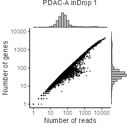
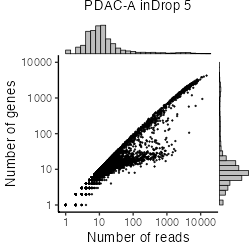
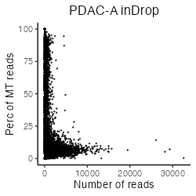
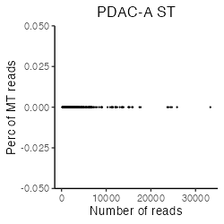

```{r, include = FALSE}
knitr::opts_chunk$set(
  collapse = TRUE,
  comment = "#>"
)
```


# Install libraries
Attach necessary libraries:
```{r, eval = FALSE}
library(ASURAT)
library(SingleCellExperiment)
library(SummarizedExperiment)
```


<br>

# Introduction
In this vignette, we analyze single-cell RNA sequencing (scRNA-seq) and spatial
transcriptome (ST) data obtained from primary tumors of pancreatic ductal
adenocarcinoma (PDAC) patients (Moncada et al., Nat. Biotechnol. 38, 2020).


<br>

# Prepare scRNA-seq and ST data (Moncada et al., 2020)
## scRNA-seq data
The data can be loaded by the following code:
```{r, eval = FALSE}
pdacrna <- readRDS(url("https://figshare.com/ndownloader/files/34112468"))
```
The data are stored in
[DOI:10.6084/m9.figshare.19200254](https://figshare.com/s/866fbf822a4bfab234e6)
and the generating process is described below.

<br>

From [GSE111672](https://www.ncbi.nlm.nih.gov/geo/query/acc.cgi?acc=GSE111672),
we downloaded inDrop data with sample accession numbers GSM3036909, GSM3036910,
GSM3405527, GSM3405528, GSM3405529, and GSM3405530 (PDAC-A inDrop1-inDrop6).
```{r, eval = FALSE}
fn <- c("rawdata/2020_001_Moncada/pdac_indrop/PDACA_1/results/gene_expression.tsv",
        "rawdata/2020_001_Moncada/pdac_indrop/PDACA_2/results/gene_expression.tsv",
        "rawdata/2020_001_Moncada/pdac_indrop/PDACA_3/results/gene_expression.tsv",
        "rawdata/2020_001_Moncada/pdac_indrop/PDACA_4/results/gene_expression.tsv",
        "rawdata/2020_001_Moncada/pdac_indrop/PDACA_5/results/gene_expression.tsv",
        "rawdata/2020_001_Moncada/pdac_indrop/PDACA_6/results/gene_expression.tsv")
pdacrna <- list()
for(i in seq_len(length(fn))){
  d <- read.table(fn[i], header = TRUE, stringsAsFactors = FALSE, row.names = 1)
  colnames(d) <- paste0("PDAC-A-inDrop", i, "-", colnames(d))
  pdacrna[[i]] <- SingleCellExperiment(assays = list(counts = as.matrix(d)),
                                       rowData = data.frame(gene = rownames(d)),
                                       colData = data.frame(sample = colnames(d)))
}
```

```{r, eval = FALSE, echo = FALSE}
rbind(dim(pdacrna[[1]]), dim(pdacrna[[2]]), dim(pdacrna[[3]]),
      dim(pdacrna[[4]]), dim(pdacrna[[5]]), dim(pdacrna[[6]]))
```
```
      [,1]  [,2]
[1,] 19811 10000
[2,] 19811 10000
[3,] 19811 10000
[4,] 19811 10000
[5,] 19811 10000
[6,] 19811 10000
```

Add metadata for both variables and samples using ASURAT function
`add_metadata()`.
```{r, eval = FALSE}
for(i in seq_len(length(pdacrna))){
  pdacrna[[i]] <- add_metadata(sce = pdacrna[[i]], mitochondria_symbol = "^MT-")
}
```

Qualities of sample (cell) data are confirmed based on proper visualization of
`colData(sce)`.
ASURAT function `plot_dataframe2D()` shows scatter plots of two-dimensional data.
```{r, eval = FALSE}
for(i in seq_len(length(pdacrna))){
  dataframe2D <- data.frame(x = colData(pdacrna[[i]])$nReads,
                            y = colData(pdacrna[[i]])$nGenes)
  p <- plot_dataframe2D(dataframe2D = dataframe2D) +
    ggplot2::labs(title = paste0("PDAC-A inDrop ", i),
                  x = "Number of reads", y = "Number of genes") +
    ggplot2::theme_classic(base_size = 20) +
    ggplot2::theme(plot.title = ggplot2::element_text(hjust = 0.5))
  filename <- paste0("figures/figure_08_0005_", i, ".png")
  ggplot2::ggsave(file = filename, plot = p, dpi = 100, width = 5, height = 5)
}
```







Confirming that the data qualities are comparable among experimental batches,
concatenate all the objects horizontally.
```{r, eval = FALSE}
# Take intersection of genes.
genes <- Reduce(intersect, list(rownames(pdacrna[[1]]), rownames(pdacrna[[2]]),
                                rownames(pdacrna[[3]]), rownames(pdacrna[[4]]),
                                rownames(pdacrna[[5]]), rownames(pdacrna[[6]])))
for(i in seq_len(length(pdacrna))){
  pdacrna[[i]] <- pdacrna[[i]][genes, ]
  rowData(pdacrna[[i]])$nSamples <- NULL
}
# Horizontally concatenate SingleCellExperiment objects.
pdacrna <- cbind(pdacrna[[1]], pdacrna[[2]], pdacrna[[3]],
                 pdacrna[[4]], pdacrna[[5]], pdacrna[[6]])
# Add metadata again.
pdacrna <- add_metadata(sce = pdacrna, mitochondria_symbol = "^MT-")
```

```{r, eval = FALSE, echo = FALSE}
# Save data.
saveRDS(pdacrna, file = "backup/08_001_pdacrna_data.rds")

# Load data.
pdacrna <- readRDS("backup/08_001_pdacrna_data.rds")
```


<br>

## ST data
The data can be loaded by the following code:
```{r, eval = FALSE}
pdacst <- readRDS(url("https://figshare.com/ndownloader/files/34112471"))
```
The data are stored in
[DOI:10.6084/m9.figshare.19200254](https://figshare.com/account/projects/132986/articles/19200254) and the generating process is described below.

<br>

Load a raw read count table, convert Ensembl IDs into gene symbols, and change
the column names.
```{r, eval = FALSE}
fn <- "rawdata/2020_001_Moncada/pdac_st/SRR6825057_stdata.tsv"
pdacst <- read.table(fn, header = TRUE, stringsAsFactors = FALSE, row.names = 1)
pdacst <- t(pdacst)
ensembl <- rownames(pdacst)
dictionary <- AnnotationDbi::select(org.Hs.eg.db::org.Hs.eg.db, key = ensembl,
                                    columns = c("SYMBOL", "ENTREZID"),
                                    keytype = "ENSEMBL")
dictionary <- dictionary[!duplicated(dictionary$ENSEMBL), ]
dictionary[which(is.na(dictionary$SYMBOL)),]$SYMBOL <- as.character("NA")
rownames(pdacst) <- make.unique(as.character(dictionary$SYMBOL))
colnames(pdacst) <- paste0("PDAC-A-ST1_", colnames(pdacst))
```

Create a SingleCellExperiment object by inputting the read count table.
```{r, eval = FALSE}
pdacst <- SingleCellExperiment(assays = list(counts = as.matrix(pdacst)),
                               rowData = data.frame(gene = rownames(pdacst)),
                               colData = data.frame(sample = colnames(pdacst)))
```

A Seurat object, including PDAC tissue images, was obtained from the authors of
[DOI:10.1038/s41587-019-0392-8](https://doi.org/10.1038/s41587-019-0392-8) and
[DOI:10.1093/nar/gkab043](https://academic.oup.com/nar/article/49/9/e50/6129341),
and set the tissue image data into the metadata slot.
```{r, eval = FALSE}
fn <- "rawdata/2020_001_Moncada/pdac_st/PDAC-A_ST_list.RDS"
pdacst_surt <- readRDS(file = fn)
pdacst_surt <- pdacst_surt$GSM3036911
metadata(pdacst)$images <- pdacst_surt@images
```

Since the above SingleCellExperiment object includes spatial coordinates
outside of tissues, remove such spots.
```{r, eval = FALSE}
pdacst <- pdacst[, colnames(pdacst_surt)]
identical(colnames(pdacst), colnames(pdacst_surt))
```
```
[1] TRUE
```

```{r, eval = FALSE}
dim(pdacst)
```
```
[1] 25807   428
```

Add metadata for both variables and samples using ASURAT function
`add_metadata()`.
```{r, eval = FALSE}
pdacst <- add_metadata(sce = pdacst, mitochondria_symbol = "^MT-")
```

```{r, eval = FALSE, echo = FALSE}
# Save data.
saveRDS(pdacst, file = "backup/09_001_pdacst_data.rds")

# Load data.
pdacst <- readRDS("backup/09_001_pdacst_data.rds")
```


<br>

# Preprocessing
## Control data quality
Remove variables (genes) and samples (cells) with low quality,
by processing the following three steps:

1. remove variables based on expression profiles across samples,
2. remove samples based on the numbers of reads and nonzero expressed variables,
3. remove variables based on the mean read counts across samples.


<br>

### Remove variables based on expression profiles
ASURAT function `remove_variables()` removes variable (gene) data such that
the numbers of non-zero expressing samples (cells) are less than `min_nsamples`.
```{r, eval = FALSE}
pdacrna <- remove_variables(sce = pdacrna, min_nsamples = 10)
pdacst <- remove_variables(sce = pdacst, min_nsamples = 10)
```


<br>

### Remove samples based on expression profiles
Qualities of sample (cell) data are confirmed based on proper visualization of
`colData(sce)`.
ASURAT function `plot_dataframe2D()` shows scatter plots of
two-dimensional data (see [here](#visualization_lowdim) for details).
```{r, eval = FALSE}
dataframe2D <- data.frame(x = colData(pdacrna)$nReads, y = colData(pdacrna)$nGenes)
p <- plot_dataframe2D(dataframe2D = dataframe2D) +
  ggplot2::labs(title = "PDAC-A inDrop", x = "Number of reads", y = "Number of genes") +
  ggplot2::theme_classic(base_size = 20) +
  ggplot2::theme(plot.title = ggplot2::element_text(hjust = 0.5))
filename <- "figures/figure_08_0010.png"
ggplot2::ggsave(file = filename, plot = p, dpi = 100, width = 5, height = 5)
```

```{r, eval = FALSE, echo = FALSE}
dataframe2D <- data.frame(x = colData(pdacst)$nReads, y = colData(pdacst)$nGenes)
p <- plot_dataframe2D(dataframe2D = dataframe2D) +
  ggplot2::labs(title = "PDAC-A ST", x = "Number of reads", y = "Number of genes") +
  ggplot2::theme_classic(base_size = 20) +
  ggplot2::theme(plot.title = ggplot2::element_text(hjust = 0.5))
filename <- "figures/figure_09_0010.png"
ggplot2::ggsave(file = filename, plot = p, dpi = 100, width = 5, height = 5)
```


```{r, eval = FALSE}
dataframe2D <- data.frame(x = colData(pdacrna)$nReads, y = colData(pdacrna)$percMT)
p <- plot_dataframe2D(dataframe2D = dataframe2D) +
  ggplot2::labs(title = "PDAC-A ST", x = "Number of reads", y = "Perc of MT reads") +
  ggplot2::theme_classic(base_size = 20) +
  ggplot2::theme(plot.title = ggplot2::element_text(hjust = 0.5))
filename <- "figures/figure_08_0011.png"
ggplot2::ggsave(file = filename, plot = p, dpi = 100, width = 5, height = 5)
```

```{r, eval = FALSE, echo = FALSE}
dataframe2D <- data.frame(x = colData(pdacst)$nReads, y = colData(pdacst)$percMT)
p <- plot_dataframe2D(dataframe2D = dataframe2D) +
  ggplot2::labs(title = "PDAC-A ST", x = "Number of reads", y = "Perc of MT reads") +
  ggplot2::theme_classic(base_size = 20) +
  ggplot2::theme(plot.title = ggplot2::element_text(hjust = 0.5))
filename <- "figures/figure_09_0011.png"
ggplot2::ggsave(file = filename, plot = p, dpi = 100, width = 5, height = 5)
```




ASURAT function `remove_samples()` removes sample (cell) data by setting cutoff
values for the metadata.
```{r, eval = FALSE}
pdacrna <- remove_samples(sce = pdacrna, min_nReads = 1000, max_nReads = 10000,
                          min_nGenes = 500, max_nGenes = 1e+10,
                          min_percMT = 0, max_percMT = 20)

pdacst <- remove_samples(sce = pdacst, min_nReads = 0, max_nReads = 1e+10,
                         min_nGenes = 0, max_nGenes = 1e+10,
                         min_percMT = NULL, max_percMT = NULL)
```


<br>

### Remove variables based on the mean read counts
Qualities of variable (gene) data are confirmed based on proper visualization of
`rowData(sce)`.
ASURAT function `plot_dataframe2D()` shows scatter plots of two-dimensional data
(see [here](#visualization_lowdim) for details).
```{r, eval = FALSE}
dataframe2D <- data.frame(x = seq_len(nrow(rowData(pdacrna))),
                          y = sort(rowData(pdacrna)$nSamples, decreasing = TRUE))
p <- plot_dataframe2D(dataframe2D = dataframe2D) +
  ggplot2::labs(title = "PDAC-A inDrop", x = "Rank of genes", y = "Mean read counts") +
  ggplot2::theme_classic(base_size = 20) +
  ggplot2::theme(plot.title = ggplot2::element_text(hjust = 0.5))
filename <- "figures/figure_08_0015.png"
ggplot2::ggsave(file = filename, plot = p, dpi = 100, width = 5, height = 5)
```

```{r, eval = FALSE, echo = FALSE}
dataframe2D <- data.frame(x = seq_len(nrow(rowData(pdacst))),
                          y = sort(rowData(pdacst)$nSamples, decreasing = TRUE))
p <- plot_dataframe2D(dataframe2D = dataframe2D) +
  ggplot2::labs(title = "PDAC-A ST", x = "Rank of genes", y = "Mean read counts") +
  ggplot2::theme_classic(base_size = 20) +
  ggplot2::theme(plot.title = ggplot2::element_text(hjust = 0.5))
filename <- "figures/figure_09_0015.png"
ggplot2::ggsave(file = filename, plot = p, dpi = 100, width = 5, height = 5)
```


ASURAT function `remove_variables_second()` removes variable (gene) data
such that the mean read counts across samples are less than `min_meannReads`.
```{r, eval = FALSE}
pdacrna <- remove_variables_second(sce = pdacrna, min_meannReads = 0.10)
pdacst <- remove_variables_second(sce = pdacst, min_meannReads = 0.10)
```

```{r, eval = FALSE}
rbind(dim(pdacrna), dim(pdacst))
```
```
[1,] 5747 2016
[2,] 4497  428
```

```{r, eval = FALSE, echo = FALSE}
# Save data.
saveRDS(pdacrna, file = "backup/08_002_pdacrna_dataqc.rds")
saveRDS(pdacst, file = "backup/09_002_pdacst_dataqc.rds")

# Load data.
pdacrna <- readRDS("backup/08_002_pdacrna_dataqc.rds")
pdacst <- readRDS("backup/09_002_pdacst_dataqc.rds")
```


<br>

## Normalize data
Horizontally concatenate SingleCellExperiment objects.
```{r, eval = FALSE}
# Take intersection of genes.
genes <- intersect(rownames(pdacrna), rownames(pdacst))
pdacrna <- pdacrna[genes, ]
pdacst <- pdacst[genes, ]
rowData(pdacrna)$nSamples <- NULL
rowData(pdacst)$nSamples <- NULL
# Horizontally concatenate SingleCellExperiment objects.
pdac <- cbind(pdacrna, pdacst)
colData(pdac)$batch <- ifelse(grepl("inDrop", colData(pdac)$sample), "inDrop", "ST")
```

```{r, eval = FALSE}
dim(pdac)
```
```
[1] 2750 2444
```

Normalize the data using bayNorm (Tang et al., Bioinformatics, 2020) and
Seurat functions (Butler Nat. Biotechnol., 2018).
```{r, eval = FALSE}
# Use bayNorm.
BETA <- bayNorm::BetaFun(Data = assay(pdac, "counts"), MeanBETA = 0.06)
bay_out <- bayNorm::bayNorm(assay(pdac, "counts"),
                            Conditions = colData(pdac)$batch,
                            BETA_vec = BETA[["BETA"]], Prior_type = "GG",
                            mode_version = TRUE)
# Use Seurat.
surt <- list(indrop = bay_out[["Bay_out_list"]][["Group inDrop"]],
             st = bay_out[["Bay_out_list"]][["Group ST"]])
for(i in seq_len(length(surt))){
  surt[[i]] <- Seurat::CreateSeuratObject(counts = surt[[i]],
                                          project = names(surt)[i])
  surt[[i]] <- Seurat::NormalizeData(surt[[i]])
  surt[[i]] <- Seurat::FindVariableFeatures(surt[[i]], selection.method = "vst",
                                            nfeatures = 2750)
}
genes <- Seurat::SelectIntegrationFeatures(object.list = surt, nfeatures = 2750)
anchors <- Seurat::FindIntegrationAnchors(object.list = surt,
                                          anchor.features = genes)
pdac_surt <- Seurat::IntegrateData(anchorset = anchors,
                                   normalization.method = "LogNormalize")
pdac <- pdac[genes, ]
assay(pdac, "logcounts") <- pdac_surt@assays$integrated@data[rownames(pdac), ]
```

Center row data.
```{r, eval = FALSE}
mat <- assay(pdac, "logcounts")
assay(pdac, "centered") <- sweep(mat, 1, apply(mat, 1, mean), FUN = "-")
```

```{r, eval = FALSE, echo = FALSE}
# Save data.
saveRDS(pdac, file = "backup/10_003_pdac_normalized.rds")

# Load data.
pdac <- readRDS("backup/10_003_pdac_normalized.rds")
```


