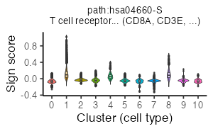

```{r, include = FALSE}
knitr::opts_chunk$set(
  collapse = TRUE,
  comment = "#>"
)
```


# Computational environment
MacBook Pro (Big Sur, 16-inch, 2019), Processor (2.4 GHz 8-Core Intel Core i9),
Memory (64 GB 2667 MHz DDR4).


<br>

# Install libraries
Attach necessary libraries:
```{r, eval = FALSE}
library(ASURAT)
library(SingleCellExperiment)
library(SummarizedExperiment)
```


<br>

# Introduction
In this vignette, we analyze single-cell RNA sequencing (scRNA-seq) data
obtained from peripheral blood mononuclear cells (PBMCs) of donors with and
without bacterial sepsis (Reyes et al., Nat. Med. 26, 2020).


<br>

# Prepare scRNA-seq data
## PBMCs with and without sepsis (Reyes et al., 2020)
The data can be loaded by the following code:
```{r, eval = FALSE}
pbmc <- readRDS(url("https://figshare.com/ndownloader/files/34112465"))
```
The data are stored in
[DOI:10.6084/m9.figshare.19200254](https://figshare.com/s/866fbf822a4bfab234e6)
and the generating process is described below.

<br>

The data were obtained from Broad Institute Single Cell Portal:
[SCP548](https://singlecell.broadinstitute.org/single_cell?type=study&page=1&terms=SCP548).
Since the file size of the raw read count table is huge (~5.61 GB),
we briefly removed gene and cell data such that the numbers of non-zero
expressing cells are less than 100 and the numbers of sequencing reads are
less than 2000, respectively, by using perl scripts as follows:
```{perl, eval = FALSE}
perl ../perl/pg_01_add_nsamples.pl
perl ../perl/pg_02_add_nreads.pl
perl ../perl/pg_03_remove_variables.pl
perl ../perl/pg_04_remove_samples.pl
```

Create a SingleCellExperiment object by inputting a raw read count table.
```{r, eval = FALSE}
# Load a raw read count table.
fn <- "rawdata/2020_001_Reyes/SCP548/expression/scp_gex_matrix_red.csv"
pbmc <- read.csv(fn, check.names = FALSE)
genes <- pbmc[-1, 2]
cells <- colnames(pbmc)[-seq_len(2)]
pbmc <- pbmc[-1, -seq_len(2)]
rownames(pbmc) <- make.unique(genes)
colnames(pbmc) <- make.unique(cells)
# Load sample information
info <- read.delim("rawdata/2020_001_Reyes/SCP548/metadata/scp_meta.txt")
info <- info[-1, ]
rownames(info) <- info$NAME
info <- info[, -1]
info <- info[cells, ]
# Create a SingleCellExperiment object.
pbmc <- SingleCellExperiment(assays = list(counts = as.matrix(pbmc)),
                             rowData = data.frame(gene = rownames(pbmc)),
                             colData = as.data.frame(info))
```

```{r, eval = FALSE}
dim(pbmc)
```
```
[1] 14973 95853
```

```{r, eval = FALSE}
# Save data.
saveRDS(pbmc, file = "backup/06_001_pbmc130k_data.rds")

# Load data.
pbmc <- readRDS("backup/06_001_pbmc130k_data.rds")
```


<br>

# Preprocessing
## Control data quality
Remove variables (genes) and samples (cells) with low quality,
by processing the following three steps:

1. remove variables based on expression profiles across samples,
2. remove samples based on the numbers of reads and nonzero expressed variables,
3. remove variables based on the mean read counts across samples.

First of all, add metadata for both variables and samples using ASURAT function
`add_metadata()`.
```{r, eval = FALSE}
pbmc <- add_metadata(sce = pbmc, mitochondria_symbol = "^MT-")
```


<br>

### Remove variables based on expression profiles
ASURAT function `remove_variables()` removes variable (gene) data such that
the numbers of non-zero expressing samples (cells) are less than `min_nsamples`.
```{r, eval = FALSE}
pbmc <- remove_variables(sce = pbmc, min_nsamples = 100)
```


<br>

### Remove samples based on expression profiles
Qualities of sample (cell) data are confirmed based on proper visualization of
`colData(sce)`.
```{r, eval = FALSE}
title <- "PBMC (Reyes et al., 2020)"
df <- data.frame(x = colData(pbmc)$nReads, y = colData(pbmc)$nGenes)
p <- ggplot2::ggplot() +
  ggplot2::geom_point(ggplot2::aes(x = df$x, y = df$y), size = 1, alpha = 1) +
  ggplot2::labs(title = title, x = "Number of reads", y = "Number of genes") +
  ggplot2::theme_classic(base_size = 20) +
  ggplot2::theme(plot.title = ggplot2::element_text(hjust = 0.5, size = 20))
filename <- "figures/figure_06_0010.png"
ggplot2::ggsave(file = filename, plot = p, dpi = 50, width = 5, height = 5)

df <- data.frame(x = colData(pbmc)$nReads, y = colData(pbmc)$percMT)
p <- ggplot2::ggplot() +
  ggplot2::geom_point(ggplot2::aes(x = df$x, y = df$y), size = 1, alpha = 1) +
  ggplot2::labs(title = title, x = "Number of reads", y = "Perc of MT reads") +
  ggplot2::theme_classic(base_size = 20) +
  ggplot2::theme(plot.title = ggplot2::element_text(hjust = 0.5, size = 20))
filename <- "figures/figure_06_0011.png"
ggplot2::ggsave(file = filename, plot = p, dpi = 50, width = 5, height = 5)
```


ASURAT function `remove_samples()` removes sample (cell) data by setting cutoff
values for the metadata.
```{r, eval = FALSE}
pbmc <- remove_samples(sce = pbmc, min_nReads = 1500, max_nReads = 30000,
                       min_nGenes = 100, max_nGenes = 1e+10,
                       min_percMT = 0, max_percMT = 10)
```


<br>

### Remove variables based on the mean read counts
Qualities of variable (gene) data are confirmed based on proper visualization of
`rowData(sce)`.
```{r, eval = FALSE}
title <- "PBMC (Reyes et al., 2020)"
df <- data.frame(x = seq_len(nrow(rowData(pbmc))),
                 y = sort(rowData(pbmc)$nSamples, decreasing = TRUE))
p <- ggplot2::ggplot() + ggplot2::scale_y_log10() +
  ggplot2::geom_point(ggplot2::aes(x = df$x, y = df$y), size = 1, alpha = 1) +
  ggplot2::labs(title = title, x = "Rank of genes", y = "Mean read counts") +
  ggplot2::theme_classic(base_size = 20) +
  ggplot2::theme(plot.title = ggplot2::element_text(hjust = 0.5, size = 20))
filename <- "figures/figure_06_0015.png"
ggplot2::ggsave(file = filename, plot = p, dpi = 50, width = 5, height = 5)
```


ASURAT function `remove_variables_second()` removes variable (gene) data
such that the mean read counts across samples are less than `min_meannReads`.
```{r, eval = FALSE}
pbmc <- remove_variables_second(sce = pbmc, min_meannReads = 0.05)
```

```{r, eval = FALSE}
dim(pbmc)
```
```
[1]  5322 77161
```

```{r, eval = FALSE}
# Save data.
saveRDS(pbmc, file = "backup/06_002_pbmc130k_dataqc.rds")

# Load data.
pbmc <- readRDS("backup/06_002_pbmc130k_dataqc.rds")
```


<br>

## Normalize data {#normalization}
Perform `bayNorm()` (Tang et al., Bioinformatics, 2020) for attenuating
technical biases with respect to zero inflation and variation of capture
efficiencies between samples (cells).
```{r, eval = FALSE}
BETA <- bayNorm::BetaFun(Data = assay(pbmc, "counts"), MeanBETA = 0.06)
bay_out <- bayNorm::bayNorm(assay(pbmc, "counts"),
                            Conditions = colData(pbmc)$Patient,
                            BETA_vec = BETA[["BETA"]], Prior_type = "GG",
                            mode_version = TRUE)
mat_list <- bay_out[["Bay_out_list"]]
mat <- do.call("cbind", mat_list)
pbmc <- pbmc[, colnames(mat)]
assay(pbmc, "normalized") <- mat
```

Perform log-normalization with a pseudo count.
```{r, eval = FALSE}
assay(pbmc, "logcounts") <- log(assay(pbmc, "normalized") + 1)
```

Center row data.
```{r, eval = FALSE}
mat <- assay(pbmc, "logcounts")
assay(pbmc, "centered") <- sweep(mat, 1, apply(mat, 1, mean), FUN = "-")
```

Set gene expression data into `altExp(sce)`.
```{r, eval = FALSE}
sname <- "logcounts"
altExp(pbmc, sname) <- SummarizedExperiment(list(counts = assay(pbmc, sname)))
```

Add ENTREZ Gene IDs to `rowData(sce)`.
```{r, eval = FALSE}
dictionary <- AnnotationDbi::select(org.Hs.eg.db::org.Hs.eg.db,
                                    key = rownames(pbmc),
                                    columns = "ENTREZID", keytype = "SYMBOL")
dictionary <- dictionary[!duplicated(dictionary$SYMBOL), ]
rowData(pbmc)$geneID <- dictionary$ENTREZID
```

```{r, eval = FALSE}
# Save data.
saveRDS(pbmc, file = "backup/06_003_pbmc130k_normalized.rds")

# Load data.
pbmc <- readRDS("backup/06_003_pbmc130k_normalized.rds")
```


<br>

# Multifaceted sign analysis
Infer cell or disease types, biological functions, and signaling pathway
activity at the single-cell level by inputting related databases.

ASURAT transforms centered read count tables to functional feature matrices,
termed sign-by-sample matrices (SSMs).
Using SSMs, perform unsupervised clustering of samples (cells).


<br>

## Compute correlation matrices
Prepare correlation matrices of gene expressions.
```{r, eval = FALSE}
mat <- t(as.matrix(assay(pbmc, "centered")))
cormat <- cor(mat, method = "spearman")
```

```{r, eval = FALSE}
# Save data.
saveRDS(cormat, file = "backup/06_003_pbmc130k_cormat.rds")

# Load data.
cormat <- readRDS("backup/06_003_pbmc130k_cormat.rds")
```


<br>

## Load databases
Load databases.
```{r, eval = FALSE}
urlpath <- "https://github.com/keita-iida/ASURATDB/blob/main/genes2bioterm/"
load(url(paste0(urlpath, "20201213_human_CO.rda?raw=TRUE")))         # CO
load(url(paste0(urlpath, "20220308_human_MSigDB.rda?raw=TRUE")))     # MSigDB
load(url(paste0(urlpath, "20220308_human_CellMarker.rda?raw=TRUE"))) # CellMarker
load(url(paste0(urlpath, "20201213_human_GO_red.rda?raw=TRUE")))     # GO
load(url(paste0(urlpath, "20201213_human_KEGG.rda?raw=TRUE")))       # KEGG
```
The reformatted knowledge-based data were available from the following
repositories:

* [DOI:10.6084/m9.figshare.19102598](https://figshare.com/s/0599d2de970c2deb675c)
* [Github ASURATDB](https://github.com/keita-iida/ASURATDB)

Create a custom-built cell type-related databases by combining different
databases for analyzing human single-cell transcriptome data.
```{r, eval = FALSE}
d <- list(human_CO[["cell"]], human_MSigDB[["cell"]], human_CellMarker[["cell"]])
human_CB <- list(cell = do.call("rbind", d))
```

Add formatted databases to `metadata(sce)$sign`.
```{r, eval = FALSE}
pbmcs <- list(CB = pbmc, GO = pbmc, KG = pbmc)
metadata(pbmcs$CB) <- list(sign = human_CB[["cell"]])
metadata(pbmcs$GO) <- list(sign = human_GO[["BP"]])
metadata(pbmcs$KG) <- list(sign = human_KEGG[["pathway"]])
```


<br>

## Create signs
ASURAT function `remove_signs()` redefines functional gene sets for the
input database by removing genes, which are not included in `rownames(sce)`,
and further removes biological terms including too few or too many genes.
```{r, eval = FALSE}
pbmcs$CB <- remove_signs(sce = pbmcs$CB, min_ngenes = 2, max_ngenes = 1000)
pbmcs$GO <- remove_signs(sce = pbmcs$GO, min_ngenes = 2, max_ngenes = 1000)
pbmcs$KG <- remove_signs(sce = pbmcs$KG, min_ngenes = 2, max_ngenes = 1000)
```

ASURAT function `cluster_genes()` clusters functional gene sets using
a correlation graph-based decomposition method, which produces strongly,
variably, and weakly correlated gene sets (SCG, VCG, and WCG, respectively).
```{r, eval = FALSE}
set.seed(1)
pbmcs$CB <- cluster_genesets(sce = pbmcs$CB, cormat = cormat,
                             th_posi = 0.20, th_nega = -0.50)
set.seed(1)
pbmcs$GO <- cluster_genesets(sce = pbmcs$GO, cormat = cormat,
                             th_posi = 0.20, th_nega = -0.30)
set.seed(1)
pbmcs$KG <- cluster_genesets(sce = pbmcs$KG, cormat = cormat,
                             th_posi = 0.15, th_nega = -0.20)
```

ASURAT function `create_signs()` creates signs by the following criteria:

1. the number of genes in SCG>= `min_cnt_strg` (the default value is 2) and
2. the number of genes in VCG>= `min_cnt_vari` (the default value is 2),

which are independently applied to SCGs and VCGs, respectively.
```{r, eval = FALSE}
pbmcs$CB <- create_signs(sce = pbmcs$CB, min_cnt_strg = 3, min_cnt_vari = 3)
pbmcs$GO <- create_signs(sce = pbmcs$GO, min_cnt_strg = 3, min_cnt_vari = 3)
pbmcs$KG <- create_signs(sce = pbmcs$KG, min_cnt_strg = 4, min_cnt_vari = 4)
```


<br>

## Select signs
If signs have semantic similarity information, one can use ASURAT function
`remove_signs_redundant()` for removing redundant sings using the semantic
similarity matrices.
```{r, eval = FALSE}
simmat <- human_GO$similarity_matrix$BP
pbmcs$GO <- remove_signs_redundant(sce = pbmcs$GO, similarity_matrix = simmat,
                                   threshold = 0.85, keep_rareID = TRUE)
```

ASURAT function `remove_signs_manually()` removes signs by specifying
IDs (e.g., `GOID:XXX`) or descriptions (e.g., `metabolic`) using `grepl()`.
```{r, eval = FALSE}
keywords <- "Covid|COVID"
pbmcs$KG <- remove_signs_manually(sce = pbmcs$KG, keywords = keywords)
```


<br>

## Create sign-by-sample matrices
ASURAT function `create_sce_signmatrix()` creates a new SingleCellExperiment
object `new_sce`, consisting of the following information:

* `assayNames(new_sce)`: counts (SSM whose entries are termed sign scores),
* `names(colData(new_sce))`: nReads, nGenes, percMT,
* `names(rowData(new_sce))`: ParentSignID, Description, CorrGene, etc.,
* `names(metadata(new_sce))`: sign_SCG, sign_VCG, etc.,
* `altExpNames(new_sce)`: something if there is data in `altExp(sce)`.
```{r, eval = FALSE}
pbmcs$CB <- makeSignMatrix(sce = pbmcs$CB, weight_strg = 0.5, weight_vari = 0.5)
pbmcs$GO <- makeSignMatrix(sce = pbmcs$GO, weight_strg = 0.5, weight_vari = 0.5)
pbmcs$KG <- makeSignMatrix(sce = pbmcs$KG, weight_strg = 0.5, weight_vari = 0.5)
```


<br>

## Reduce dimensions of sign-by-sample matrices
Perform t-distributed stochastic neighbor embedding.
```{r, eval = FALSE}
for(i in seq_along(pbmcs)){
  set.seed(1)
  mat <- t(as.matrix(assay(pbmcs[[i]], "counts")))
  res <- Rtsne::Rtsne(mat, dim = 2, pca = TRUE, initial_dims = 50)
  reducedDim(pbmcs[[i]], "TSNE") <- res[["Y"]]
}
```

Show the results of dimensional reduction in low-dimensional spaces.
```{r, eval = FALSE}
titles <- c("Reyes 2020 (cell type)", "Reyes 2020 (function)",
            "Reyes 2020 (pathway)")
for(i in seq_along(titles)){
  df <- as.data.frame(reducedDim(pbmcs[[i]], "TSNE"))
  p <- ggplot2::ggplot() +
    ggplot2::geom_point(ggplot2::aes(x = df[, 1], y = df[, 2]),
                        color = "black", size = 0.1, alpha = 1) +
    ggplot2::labs(title = titles[i], x = "tSNE_1", y = "tSNE_2") +
    ggplot2::theme_classic(base_size = 20) +
    ggplot2::theme(plot.title = ggplot2::element_text(hjust = 0.5, size = 18))
  filename <- sprintf("figures/figure_06_%04d.png", 19 + i)
  ggplot2::ggsave(file = filename, plot = p, dpi = 50, width = 4.1, height = 4.3)
}
```


```{r, eval = FALSE}
# Save data.
saveRDS(pbmcs, file = "backup/06_004_pbmcs130k_ssm.rds")

# Load data.
pbmcs <- readRDS("backup/06_004_pbmcs130k_ssm.rds")
```


<br>

## Cluster cells
### Use Seurat functions
To date (December, 2021), one of the most useful clustering methods in scRNA-seq
data analysis is a combination of a community detection algorithm and
graph-based unsupervised clustering, developed in Seurat package.

Here, our strategy is as follows:

1. convert SingleCellExperiment objects into Seurat objects
  (note that `rowData()` and `colData()` must have data),
2. perform `ScaleData()`, `RunPCA()`, `FindNeighbors()`, and `FindClusters()`,
3. convert Seurat objects into temporal SingleCellExperiment objects `temp`,
4. add `colData(temp)$seurat_clusters` into `colData(sce)$seurat_clusters`.
```{r, eval = FALSE}
resolutions <- c(0.15, 0.15, 0.15)
dims <- list(seq_len(40), seq_len(40), seq_len(40))
for(i in seq_along(pbmcs)){
  surt <- Seurat::as.Seurat(pbmcs[[i]], counts = "counts", data = "counts")
  mat <- as.matrix(assay(pbmcs[[i]], "counts"))
  surt[["SSM"]] <- Seurat::CreateAssayObject(counts = mat)
  Seurat::DefaultAssay(surt) <- "SSM"
  surt <- Seurat::ScaleData(surt, features = rownames(surt))
  surt <- Seurat::RunPCA(surt, features = rownames(surt))
  surt <- Seurat::FindNeighbors(surt, reduction = "pca", dims = dims[[i]])
  surt <- Seurat::FindClusters(surt, resolution = resolutions[i])
  temp <- Seurat::as.SingleCellExperiment(surt)
  colData(pbmcs[[i]])$seurat_clusters <- colData(temp)$seurat_clusters
}
```

Show the clustering results in low-dimensional spaces.
```{r, eval = FALSE}
titles <- c("Reyes 2020 (cell type)", "Reyes 2020 (function)",
            "Reyes 2020 (pathway)")
for(i in seq_along(titles)){
  labels <- colData(pbmcs[[i]])$seurat_clusters
  df <- as.data.frame(reducedDim(pbmcs[[i]], "TSNE"))
  p <- ggplot2::ggplot() +
    ggplot2::geom_point(ggplot2::aes(x = df[, 1], y = df[, 2], color = labels),
                        size = 0.2, alpha = 1) +
    ggplot2::labs(title = titles[i], x = "tSNE_1", y = "tSNE_2", color = "") +
    ggplot2::theme_classic(base_size = 20) +
    ggplot2::theme(plot.title = ggplot2::element_text(hjust = 0.5, size = 18)) +
    ggplot2::guides(colour = ggplot2::guide_legend(override.aes = list(size = 4)))
  if(i == 1){
    p <- p + ggplot2::scale_colour_hue()
  }else if(i == 2){
    p <- p + ggplot2::scale_colour_brewer(palette = "Dark2")
  }else if(i == 3){
    p <- p + ggplot2::scale_colour_brewer(palette = "Paired")
  }
  filename <- sprintf("figures/figure_06_%04d.png", 29 + i)
  if(i == 1){
    ggplot2::ggsave(file = filename, plot = p, dpi = 50, width = 5.2, height = 4.3)
  }else{
    ggplot2::ggsave(file = filename, plot = p, dpi = 50, width = 5.1, height = 4.3)
  }
}
```


<br>

## Investigate significant signs {#separation_index}
Significant signs are analogous to differentially expressed genes but bear
biological meanings.
Note that naïve usages of statistical tests should be avoided because the row
vectors of SSMs are centered.

Instead, ASURAT function `compute_sepI_all()` computes separation indices
for each cluster against the others.
Briefly, a separation index "sepI", ranging from -1 to 1, is a nonparametric
measure of significance of a given sign score for a given subpopulation.
The larger (resp. smaller) sepI is, the more reliable the sign is as a positive
(resp. negative) marker for the cluster.
```{r, eval = FALSE}
for(i in seq_along(pbmcs)){
  set.seed(1)
  labels <- colData(pbmcs[[i]])$seurat_clusters
  pbmcs[[i]] <- compute_sepI_all(sce = pbmcs[[i]], labels = labels,
                                 nrand_samples = 20000)
}
```

Perform `compute_sepI_all()` for investigating significant signs for the
clustering results of cell types.
```{r, eval = FALSE}
lbs <- colData(pbmcs$CB)$seurat_clusters

pbmcs_LabelCB_SignGO <- pbmcs$GO
metadata(pbmcs_LabelCB_SignGO)$marker_signs <- NULL
set.seed(1)
pbmcs_LabelCB_SignGO <- compute_sepI_all(sce = pbmcs_LabelCB_SignGO,
                                         labels = lbs, nrand_samples = 20000)

pbmcs_LabelCB_SignKG <- pbmcs$KG
metadata(pbmcs_LabelCB_SignKG)$marker_signs <- NULL
set.seed(1)
pbmcs_LabelCB_SignKG <- compute_sepI_all(sce = pbmcs_LabelCB_SignKG,
                                         labels = lbs, nrand_samples = 20000)

for(i in c(0, 2, 3)){
  set.seed(1)
  pbmcs_LabelCB_SignGO <- compute_sepI_clusters(sce = pbmcs_LabelCB_SignGO,
                                                labels = lbs, nrand_samples = 20000,
                                                ident_1 = i,
                                                ident_2 = setdiff(c(0, 2, 3), i))
}

for(i in c(0, 2, 3)){
  set.seed(1)
  pbmcs_LabelCB_SignKG <- compute_sepI_clusters(sce = pbmcs_LabelCB_SignKG,
                                                labels = lbs, nrand_samples = 20000,
                                                ident_1 = i,
                                                ident_2 = setdiff(c(0, 2, 3), i))
}
```


<br>

## Investigate significant genes
### Use Seurat function
To date (December, 2021), one of the most useful methods of multiple statistical
tests in scRNA-seq data analysis is to use a Seurat function `FindAllMarkers()`.

If there is gene expression data in `altExp(sce)`, one can investigate
differentially expressed genes by using Seurat functions in the similar manner
as described before.
```{r, eval = FALSE}
set.seed(1)
surt <- Seurat::as.Seurat(pbmcs$CB, counts = "counts", data = "counts")
mat <- as.matrix(assay(altExp(pbmcs$CB), "counts"))
surt[["GEM"]] <- Seurat::CreateAssayObject(counts = mat)
Seurat::DefaultAssay(surt) <- "GEM"
surt <- Seurat::SetIdent(surt, value = "seurat_clusters")
res <- Seurat::FindAllMarkers(surt, only.pos = TRUE,
                              min.pct = 0.25, logfc.threshold = 0.25)
metadata(pbmcs$CB)$marker_genes$all <- res
```

```{r, eval = FALSE}
# Save data.
saveRDS(pbmcs, file = "backup/06_005_pbmcs130k_desdeg.rds")
saveRDS(pbmcs_LabelCB_SignGO, file = "backup/06_005_pbmcs130k_LabelCB_SignGO.rds")
saveRDS(pbmcs_LabelCB_SignKG, file = "backup/06_005_pbmcs130k_LabelCB_SignKG.rds")

# Load data.
pbmcs <- readRDS("backup/06_005_pbmcs130k_desdeg.rds")
pbmcs_LabelCB_SignGO <- readRDS("backup/06_005_pbmcs130k_LabelCB_SignGO.rds")
pbmcs_LabelCB_SignKG <- readRDS("backup/06_005_pbmcs130k_LabelCB_SignKG.rds")
```


<br>

## Multifaceted analysis {#multilayered}
Simultaneously analyze multiple sign-by-sample matrices, which helps us
characterize individual samples (cells) from multiple biological aspects.

ASURAT function `plot_multiheatmaps()` shows heatmaps (ComplexHeatmap object)
of sign scores and gene expression levels (if there are), where rows and columns
stand for sign (or gene) and sample (cell), respectively.

First, remove unrelated signs by setting keywords, followed by selecting top
significant signs and genes for the clustering results with respect to
separation index and p-value, respectively.
```{r, eval = FALSE}
# Significant signs
marker_signs <- list()
keys <- "foofoo|hogehoge"
for(i in seq_along(pbmcs)){
  if(i == 1){
    marker_signs[[i]] <- metadata(pbmcs[[i]])$marker_signs$all
  }else if(i == 2){
    marker_signs[[i]] <- metadata(pbmcs_LabelCB_SignGO)$marker_signs$all
  }else if(i == 3){
    marker_signs[[i]] <- metadata(pbmcs_LabelCB_SignKG)$marker_signs$all
  }
  marker_signs[[i]] <- marker_signs[[i]][!grepl(keys, marker_signs[[i]]$Description), ]
  marker_signs[[i]] <- dplyr::group_by(marker_signs[[i]], Ident_1)
  marker_signs[[i]] <- dplyr::slice_max(marker_signs[[i]], sepI, n = 1)
  marker_signs[[i]] <- dplyr::slice_min(marker_signs[[i]], Rank, n = 1)
}
# Significant genes
marker_genes_CB <- metadata(pbmcs$CB)$marker_genes$all
marker_genes_CB <- dplyr::group_by(marker_genes_CB, cluster)
marker_genes_CB <- dplyr::slice_min(marker_genes_CB, p_val_adj, n = 1)
marker_genes_CB <- dplyr::slice_max(marker_genes_CB, avg_log2FC, n = 1)
```

Then, prepare arguments.
```{r, eval = FALSE}
# ssm_list
sces_sub <- list() ; ssm_list <- list()
for(i in seq_along(pbmcs)){
  sces_sub[[i]] <- pbmcs[[i]][rownames(pbmcs[[i]]) %in% marker_signs[[i]]$SignID, ]
  ssm_list[[i]] <- assay(sces_sub[[i]], "counts")
}
names(ssm_list) <- c("SSM_celltype", "SSM_function", "SSM_pathway")
# gem_list
expr_sub <- altExp(pbmcs$CB, "logcounts")
expr_sub <- expr_sub[rownames(expr_sub) %in% marker_genes_CB$gene]
gem_list <- list(x = t(scale(t(as.matrix(assay(expr_sub, "counts"))))))
names(gem_list) <- "Scaled\nLogExpr"
# ssmlabel_list
labels <- list() ; ssmlabel_list <- list()
for(i in seq_along(pbmcs)){
  tmp <- colData(sces_sub[[i]])$seurat_clusters
  labels[[i]] <- data.frame(label = tmp)
  n_groups <- length(unique(tmp))
  if(i == 1){
    labels[[i]]$color <- scales::hue_pal()(n_groups)[tmp]
  }else if(i == 2){
    labels[[i]]$color <- scales::brewer_pal(palette = "Dark2")(n_groups)[tmp]
  }else if(i == 3){
    labels[[i]]$color <- scales::brewer_pal(palette = "Paired")(n_groups)[tmp]
  }
  ssmlabel_list[[i]] <- labels[[i]]
}
names(ssmlabel_list) <- c("Label_celltype", "Label_function", "Label_pathway")
```

**Tips:**
If one would like to omit some color labels (e.g., labels[[3]]), set the
argument as follows:
```{r, eval = FALSE}
ssmlabel_list[[2]] <- data.frame(label = NA, color = NA)
ssmlabel_list[[3]] <- data.frame(label = NA, color = NA)
```

Finally, plot heatmaps for the selected signs and genes.
```{r, eval = FALSE}
filename <- "figures/figure_06_0040.png"
#png(file = filename, height = 2200, width = 1800, res = 300)
png(file = filename, height = 450, width = 350, res = 60)
set.seed(1)
title <- "PBMC (Reyes et al., 2020)"
plot_multiheatmaps(ssm_list = ssm_list, gem_list = gem_list,
                   ssmlabel_list = ssmlabel_list, gemlabel_list = NULL,
                   nrand_samples = 1000, show_row_names = TRUE, title = title)
dev.off()
```


Show violin plots for sign score and gene expression distributions across cell
type-related clusters.
```{r, eval = FALSE}
labels <- colData(pbmcs$CB)$seurat_clusters
vlist <- list(c("GE", "CD14", "(Monocyte)"),
              c("GE", "HLA-DPB1", "(Dendritic cell)"),
              c("GE", "CD68", "(Phagocytosis)"),
              c("GE", "CD4", "(T cell)"),
              c("GE", "CD8B", "(T cell)"),
              c("GE", "TRAC", "(T Cell Receptor Alpha)"),
              c("GE", "LILRA4", "(Plasmacytoid dendritic cells)"),
              c("CB", "CellMarkerID:6-S", "Activated T cell (CD69, KLRG1, ...)"),
              c("CB", "CellMarkerID:184-S", "Natural killer cell (NKG7, GZMB, ...)"),
              c("CB", "CellMarkerID:99-S", "Follicular B cell (MS4A1, CD27, ...)"),
              c("CB", "CellMarkerID:53-S", "...dendritic cell (HLA-DPB1, SNX3, ...)"),
              c("GO", "GO:0032757-S", "...interleukin-8... (CD14, FCN1, ...)"),
              c("GO", "GO:0032647-S", "...interferon-alpha... (IRF7, PTPRS, ...)"),
              c("KG", "path:hsa04660-S", "T cell receptor... (CD8A, CD3E, ...)"),
              c("KG", "path:hsa04664-V", "Fc epsilon RI... (FCER1A, ALOX5AP, ...)"))
ylabels <- list(GE = "Expression", CB = "Sign score", GO = "Sign score",
                KG = "Sign score")
for(i in seq_along(vlist)){
  if(vlist[[i]][1] == "GE"){
    ind <- which(rownames(altExp(pbmcs$CB, "logcounts")) == vlist[[i]][2])
    subsce <- altExp(pbmcs$CB, "logcounts")[ind, ]
    df <- as.data.frame(t(as.matrix(assay(subsce, "counts"))))
  }else{
    ind <- which(rownames(pbmcs[[vlist[[i]][1]]]) == vlist[[i]][2])
    subsce <- pbmcs[[vlist[[i]][1]]][ind, ]
    df <- as.data.frame(t(as.matrix(assay(subsce, "counts"))))
  }
  p <- ggplot2::ggplot() +
    ggplot2::geom_violin(ggplot2::aes(x = as.factor(labels), y = df[, 1],
                                      fill = labels), trim = FALSE, size = 0.5) +
    ggplot2::geom_boxplot(ggplot2::aes(x = as.factor(labels), y = df[, 1]),
                          width = 0.15, alpha = 0.6) +
    ggplot2::labs(title = paste0(vlist[[i]][2], "\n", vlist[[i]][3]),
                  x = "Cluster (cell type)", y = ylabels[[vlist[[i]][1]]]) +
    ggplot2::theme_classic(base_size = 25) +
    ggplot2::theme(plot.title = ggplot2::element_text(hjust = 0.5, size = 20),
                   legend.position = "none") +
    ggplot2::scale_fill_hue()
  filename <- sprintf("figures/figure_06_%04d.png", 49 + i)
  ggplot2::ggsave(file = filename, plot = p, dpi = 50, width = 6, height = 3.7)
}
```





Show violin plots for the sign score distributions across given
cell type-related clusters.
```{r, eval = FALSE}
labels <- colData(pbmcs$CB)$seurat_clusters
vlist <- list(c("KG", "path:hsa00071-S", "Fatty acid degradation (ACAT1, ...)"),
              c("KG", "path:hsa00010-S", "Glycolysis / Gluconeogenesis (ENO1, ...)"),
              c("KG", "path:hsa04514-V", "Cell adhesion molecules (ITGA4, ...)"),
              c("GO", "GO:0010498-S", "Proteasomal protein catabolic... (PSMB2, ...)"),
              c("GO", "GO:0044262-S", "Cellular carbohydrate metabolic... (PGD, ...)"))
mycolor <- scales::hue_pal()(11)
mycolor <- c("0" = mycolor[1], "2" = mycolor[3], "3" = mycolor[4])
for(i in seq_along(vlist)){
  inds_sign <- which(rownames(pbmcs[[vlist[[i]][1]]]) == vlist[[i]][2])
  inds_cell <- which(colData(pbmcs$CB)$seurat_clusters %in% c(0, 2, 3))
  subsce <- pbmcs[[vlist[[i]][1]]][inds_sign, inds_cell]
  sublabels <- labels[inds_cell]
  df <- as.data.frame(t(as.matrix(assay(subsce, "counts"))))
  p <- ggplot2::ggplot() +
    ggplot2::geom_violin(ggplot2::aes(x = as.factor(sublabels), y = df[, 1],
                                      fill = sublabels), trim = FALSE, size = 0.5) +
    ggplot2::geom_boxplot(ggplot2::aes(x = as.factor(sublabels), y = df[, 1]),
                          width = 0.15, alpha = 0.6) +
    ggplot2::labs(title = paste0(vlist[[i]][2], "\n", vlist[[i]][3]),
                  x = "Cluster (cell type)", y = "Sign score") +
    ggplot2::theme_classic(base_size = 25) +
    ggplot2::theme(plot.title = ggplot2::element_text(hjust = 0.5, size = 20),
                   legend.position = "none") +
    ggplot2::scale_fill_manual(values = mycolor)
  filename <- sprintf("figures/figure_06_%04d.png", 69 + i)
  ggplot2::ggsave(file = filename, plot = p, dpi = 50, width = 5, height = 3.7)
}
```


Show violin plots for the gene expression distributions across given
cell type-related clusters.
```{r, eval = FALSE}
labels <- colData(pbmcs$CB)$seurat_clusters
vlist <- list(c("GE", "LILRA4", "(Plasmacytoid dendritic cells)"))
mycolor <- scales::hue_pal()(11)
mycolor <- c("6" = mycolor[7], "7" = mycolor[8], "9" = mycolor[10], "10" = mycolor[11])
for(i in seq_along(vlist)){
  inds_gene <- which(rownames(altExp(pbmcs$CB, "logcounts")) == vlist[[i]][2])
  inds_cell <- which(colData(pbmcs$CB)$seurat_clusters %in% c(6, 7, 9, 10))
  subsce <- altExp(pbmcs$CB, "logcounts")[inds_gene, inds_cell]
  sublabels <- labels[inds_cell]
  df <- as.data.frame(t(as.matrix(assay(subsce, "counts"))))
  p <- ggplot2::ggplot() +
    ggplot2::geom_violin(ggplot2::aes(x = as.factor(sublabels), y = df[, 1],
                                      fill = sublabels), trim = FALSE, size = 0.5) +
    ggplot2::geom_boxplot(ggplot2::aes(x = as.factor(sublabels), y = df[, 1]),
                          width = 0.15, alpha = 0.6) +
    ggplot2::labs(title = paste0(vlist[[i]][2], "\n", vlist[[i]][3]),
                  x = "Cluster (cell type)", y = "Expression") +
    ggplot2::theme_classic(base_size = 25) +
    ggplot2::theme(plot.title = ggplot2::element_text(hjust = 0.5, size = 20),
                   legend.position = "none") +
    ggplot2::scale_fill_manual(values = mycolor)
  filename <- sprintf("figures/figure_06_%04d.png", 74 + i)
  ggplot2::ggsave(file = filename, plot = p, dpi = 50, width = 5, height = 4)
}
```


<br>

## Infer cell types
Classify cells into large cell type categories.
```{r, eval = FALSE}
colData(pbmcs$CB)$cell_type <- as.character(colData(pbmcs$CB)$seurat_clusters)
colData(pbmcs$CB)$cell_type[colData(pbmcs$CB)$cell_type == 0] <- "Mono"
colData(pbmcs$CB)$cell_type[colData(pbmcs$CB)$cell_type == 1] <- "T"
colData(pbmcs$CB)$cell_type[colData(pbmcs$CB)$cell_type == 2] <- "Mono"
colData(pbmcs$CB)$cell_type[colData(pbmcs$CB)$cell_type == 3] <- "Mono" # or T
colData(pbmcs$CB)$cell_type[colData(pbmcs$CB)$cell_type == 4] <- "NK/NKT"
colData(pbmcs$CB)$cell_type[colData(pbmcs$CB)$cell_type == 5] <- "B"
colData(pbmcs$CB)$cell_type[colData(pbmcs$CB)$cell_type == 6] <- "DC"
colData(pbmcs$CB)$cell_type[colData(pbmcs$CB)$cell_type == 7] <- "DC"
colData(pbmcs$CB)$cell_type[colData(pbmcs$CB)$cell_type == 8] <- "T"
colData(pbmcs$CB)$cell_type[colData(pbmcs$CB)$cell_type == 9] <- "DC"
colData(pbmcs$CB)$cell_type[colData(pbmcs$CB)$cell_type == 10] <- "DC"
```

Classify cells into the detailed categories.
```{r, eval = FALSE}
colData(pbmcs$CB)$cell_state <- as.character(colData(pbmcs$CB)$seurat_clusters)
colData(pbmcs$CB)$cell_state[colData(pbmcs$CB)$cell_state == 0] <- "Mono-1"
colData(pbmcs$CB)$cell_state[colData(pbmcs$CB)$cell_state == 1] <- "T-1"
colData(pbmcs$CB)$cell_state[colData(pbmcs$CB)$cell_state == 2] <- "Mono-2"
colData(pbmcs$CB)$cell_state[colData(pbmcs$CB)$cell_state == 3] <- "Mono-3" # or T
colData(pbmcs$CB)$cell_state[colData(pbmcs$CB)$cell_state == 4] <- "NK/NKT"
colData(pbmcs$CB)$cell_state[colData(pbmcs$CB)$cell_state == 5] <- "B"
colData(pbmcs$CB)$cell_state[colData(pbmcs$CB)$cell_state == 6] <- "DC-1"
colData(pbmcs$CB)$cell_state[colData(pbmcs$CB)$cell_state == 7] <- "DC-2"
colData(pbmcs$CB)$cell_state[colData(pbmcs$CB)$cell_state == 8] <- "T-2"
colData(pbmcs$CB)$cell_state[colData(pbmcs$CB)$cell_state == 9] <- "DC-3"
colData(pbmcs$CB)$cell_state[colData(pbmcs$CB)$cell_state == 10] <- "DC-4"
```

Show the annotation results in low-dimensional spaces.
```{r, eval = FALSE}
title <- "Reyes 2020 (cell state)"
labels <- factor(colData(pbmcs$CB)$cell_state,
                 levels = c("Mono-1", "T-1", "Mono-2", "Mono-3", "NK/NKT",
                            "B", "DC-1", "DC-2", "T-2", "DC-3", "DC-4"))
df <- as.data.frame(reducedDim(pbmcs$CB, "TSNE"))
p <- ggplot2::ggplot() +
  ggplot2::geom_point(ggplot2::aes(x = df[, 1], y = df[, 2], color = labels),
                      size = 0.1, alpha = 1) +
  ggplot2::labs(title = title, x = "tSNE_1", y = "tSNE_2", color = "Cell state") +
  ggplot2::theme_classic(base_size = 20) +
  ggplot2::theme(plot.title = ggplot2::element_text(hjust = 0.5, size = 18)) +
  ggplot2::scale_fill_hue() +
  ggplot2::guides(colour = ggplot2::guide_legend(override.aes = list(size = 4)))
filename <- "figures/figure_06_0080.png"
ggplot2::ggsave(file = filename, plot = p, dpi = 50, width = 5.8, height = 4.3)
```


Check the reported sample information (Reyes et al., 2020) in low-dimensional
spaces.
```{r, eval = FALSE}
types <- c("Sort", "Patient", "Cell_Type")
title <- "Reyes 2020 (cell type)"
for(i in seq_along(types)){
  labels <- colData(pbmcs$CB)[[types[i]]]
  df <- as.data.frame(reducedDim(pbmcs$CB, "TSNE"))
  p <- ggplot2::ggplot() +
    ggplot2::geom_point(ggplot2::aes(x = df[, 1], y = df[, 2], color = labels),
                        size = 0.1, alpha = 1) +
    ggplot2::labs(title = title, x = "tSNE_1", y = "tSNE_2", color = types[i]) +
    ggplot2::theme_classic(base_size = 20) +
    ggplot2::theme(plot.title = ggplot2::element_text(hjust = 0.5, size = 18)) +
    ggplot2::scale_fill_hue() +
    ggplot2::guides(colour = ggplot2::guide_legend(override.aes = list(size = 4)))
  filename <- sprintf("figures/figure_06_%04d.png", 80 + i)
  if(types[i] == "Sort"){
    ggplot2::ggsave(file = filename, plot = p, dpi = 50, width = 5.6, height = 4.3)
  }else if(types[i] == "Patient"){
    ggplot2::ggsave(file = filename, plot = p, dpi = 50, width = 9.3, height = 4.3)
  }else if(types[i] == "Cell_Type"){
    ggplot2::ggsave(file = filename, plot = p, dpi = 50, width = 5.8, height = 4.3)
  }
}
```


Load the sample information reported in previous paper (Reyes et al., 2020) and
show the reported t-SNE plots.
```{r, eval = FALSE}
# Load t-SNE coordinates.
data <- read.delim("rawdata/2020_001_Reyes/SCP548/cluster/scp_tsne.txt",
                   header = TRUE, skip = 1, row.names = 1)
cells <- rownames(data)
# Load sample information.
info <- read.delim("rawdata/2020_001_Reyes/SCP548/metadata/scp_meta.txt")
info <- info[-1, ]
rownames(info) <- info$NAME
info <- info[, -1]
info <- info[cells, ]
# Show t-SNE plot.
title <- "PBMC (Reyes 2020)"
labels <- info$Cell_Type
df <- as.data.frame(data)
p <- ggplot2::ggplot() +
  ggplot2::geom_point(ggplot2::aes(x = df[, 1], y = df[, 2], color = labels),
                      size = 0.1, alpha = 1) +
  ggplot2::labs(title = title, x = "tSNE_1", y = "tSNE_2", color = "Cell_Type") +
  ggplot2::theme_classic(base_size = 20) +
  ggplot2::theme(plot.title = ggplot2::element_text(hjust = 0.5, size = 18)) +
  ggplot2::scale_fill_hue() +
  ggplot2::guides(colour = ggplot2::guide_legend(override.aes = list(size = 4)))
filename <- "figures/figure_06_0084.png"
ggplot2::ggsave(file = filename, plot = p, dpi = 50, width = 5.8, height = 4.3)
```


```{r, eval = FALSE}
# Save data.
saveRDS(pbmcs, file = "backup/06_006_pbmcs130k_annotation.rds")

# Load data.
pbmcs <- readRDS("backup/06_006_pbmcs130k_annotation.rds")
```


<br>

## Investigate population ratios across cohorts
For each cell states, investigate population ratios across subject types
```{r, eval = FALSE}
x <- c("Cohort", "cell_state", "seurat_clusters", "Patient")
df <- as.data.frame(colData(pbmcs$CB))[, which(colnames(colData(pbmcs$CB)) %in% x)]
df <- df[!grepl("DC", df$cell_state),]
lvs <- c("Control", "Leuk-UTI", "Int-URO", "URO", "Bac-SEP", "ICU-SEP", "ICU-NoSEP")
cohorts <- sort(factor(unique(df$Cohort), levels = lvs))
res <- c()
for(i in seq_along(cohorts)){
  df_cohorts <- df[which(df$Cohort == cohorts[i]), ]
  df_cohorts <- dplyr::group_by(df_cohorts, Patient, cell_state, seurat_clusters,
                                Cohort)
  df_cohorts <- dplyr::summarise(df_cohorts, n = dplyr::n())
  patients <- unique(df_cohorts$Patient)
  res_cohorts <- c()
  for(j in seq_along(patients)){
    tmp <- df_cohorts[which(df_cohorts$Patient == patients[j]), ]
    tmp$ratio <- tmp$n / sum(tmp$n)
    res_cohorts <- rbind(res_cohorts, tmp)
  }
  res <- rbind(res, res_cohorts)
}

cells <- unique(res[, which(colnames(res) %in% c("cell_state", "seurat_clusters"))])
cells <- cells[order(cells$seurat_clusters), ]$cell_state
for(i in seq_along(cells)){
  title <- paste0("PBMC: ", cells[i])
  df_cells <- res[which(res$cell_state == cells[i]), ]
  df_cells$Cohort <- factor(df_cells$Cohort, levels = lvs)
  df_cells <- df_cells[order(df_cells$Cohort), ]
  df_cells <- dplyr::group_by(df_cells, Cohort)
  p <- ggplot2::ggplot(df_cells) +
    ggplot2::geom_boxplot(ggplot2::aes(x = Cohort, y = ratio),
                          fill = "grey90", lwd = 1) +
    ggplot2::labs(title = title, x = "", y = "Population ratio (w/o DC)") +
    ggplot2::scale_x_discrete(guide = ggplot2::guide_axis(angle = 45)) +
    ggplot2::theme_classic(base_size = 25) +
    ggplot2::theme(plot.title = ggplot2::element_text(hjust = 0.5, size = 25),
                   legend.position = "none")
  filename <- sprintf("figures/figure_06_%04d.png", 89 + i)
  ggplot2::ggsave(file = filename, plot = p, dpi = 50, width = 7, height = 6.5)
}
```


Focusing on monocytes, investigate population ratios across subject types.
```{r, eval = FALSE}
x <- c("Cohort", "cell_type", "Patient")
df <- as.data.frame(colData(pbmcs$CB))[, which(colnames(colData(pbmcs$CB)) %in% x)]
df <- df[!grepl("DC", df$cell_type),]
lvs <- c("Control", "Leuk-UTI", "Int-URO", "URO", "Bac-SEP", "ICU-SEP", "ICU-NoSEP")
cohorts <- sort(factor(unique(df$Cohort), levels = lvs))
res <- c()
for(i in seq_along(cohorts)){
  df_cohorts <- df[which(df$Cohort == cohorts[i]), ]
  df_cohorts <- dplyr::group_by(df_cohorts, Patient, cell_type, Cohort)
  df_cohorts <- dplyr::summarise(df_cohorts, n = dplyr::n())
  patients <- unique(df_cohorts$Patient)
  res_cohorts <- c()
  for(j in seq_along(patients)){
    tmp <- df_cohorts[which(df_cohorts$Patient == patients[j]), ]
    tmp$ratio <- tmp$n / sum(tmp$n)
    res_cohorts <- rbind(res_cohorts, tmp)
  }
  res <- rbind(res, res_cohorts)
}
res <- res[which(res$cell_type == "Mono"), ]

title <- "PBMC: Monocyte"
res$Cohort <- factor(res$Cohort, levels = lvs)
res <- res[order(res$Cohort), ]
res <- dplyr::group_by(res, Cohort)
p <- ggplot2::ggplot(res) +
  ggplot2::geom_boxplot(ggplot2::aes(x = Cohort, y = ratio),
                        fill = "grey90", lwd = 1) +
  ggplot2::labs(title = title, x = "", y = "Population ratio (w/o DC)") +
  ggplot2::scale_x_discrete(guide = ggplot2::guide_axis(angle = 45)) +
  ggplot2::theme_classic(base_size = 25) +
  ggplot2::theme(plot.title = ggplot2::element_text(hjust = 0.5, size = 25),
                 legend.position = "none")
filename <- "figures/figure_06_0100.png"
ggplot2::ggsave(file = filename, plot = p, dpi = 50, width = 7, height = 6.5)
```

Simultaneously show population ratios of monocyte subpopulation across
subject types.
```{r, eval = FALSE}
x <- c("Cohort", "cell_state", "Patient")
df <- as.data.frame(colData(pbmcs$CB))[, which(colnames(colData(pbmcs$CB)) %in% x)]
df <- df[!grepl("DC", df$cell_state),]
lvs <- c("Control", "Leuk-UTI", "Int-URO", "URO", "Bac-SEP", "ICU-SEP", "ICU-NoSEP")
cohorts <- sort(factor(unique(df$Cohort), levels = lvs))
res2 <- c()
for(i in seq_along(cohorts)){
  df_cohorts <- df[which(df$Cohort == cohorts[i]), ]
  df_cohorts <- dplyr::group_by(df_cohorts, Patient, cell_state, Cohort)
  df_cohorts <- dplyr::summarise(df_cohorts, n = dplyr::n())
  patients <- unique(df_cohorts$Patient)
  res_cohorts <- c()
  for(j in seq_along(patients)){
    tmp <- df_cohorts[which(df_cohorts$Patient == patients[j]), ]
    tmp$ratio <- tmp$n / sum(tmp$n)
    res_cohorts <- rbind(res_cohorts, tmp)
  }
  res2 <- rbind(res2, res_cohorts)
}
res2 <- res2[which(res2$cell_state == "Mono-2"), ]
colnames(res)[2] <- "cell_state"
res$cell_state[which(res$cell_state == "Mono")] <- "Mono-all"
res <- rbind(res, res2)

# res[which(res$Cohort == "Control"), ]$Cohort <- "Control (19)"
# res[which(res$Cohort == "Leuk-UTI"), ]$Cohort <- "Leuk-UTI (10)"
# res[which(res$Cohort == "Int-URO"), ]$Cohort <- "Int-URO (7)"
# res[which(res$Cohort == "URO"), ]$Cohort <- "URO (10)"
# res[which(res$Cohort == "Bac-SEP"), ]$Cohort <- "Bac-SEP (4)"
# res[which(res$Cohort == "ICU-SEP"), ]$Cohort <- "ICU-SEP (8)"
# res[which(res$Cohort == "ICU-NoSEP"), ]$Cohort <- "ICU-NoSEP (7)"
# lvs = unique(res$Cohort)
# res$Cohort <- factor(res$Cohort, levels = lvs)

title <- "PBMC: Monocyte"
res$Cohort <- factor(res$Cohort, levels = lvs)
res$cell_state <- factor(res$cell_state, levels = c("Mono-all", "Mono-2"))
res <- res[order(res$Cohort), ]
res <- dplyr::group_by(res, Cohort)
p <- ggplot2::ggplot(res, ggplot2::aes(x = Cohort, y = ratio, fill = cell_state)) +
  ggplot2::geom_boxplot(alpha = 1, lwd = 1.5) +
  ggplot2::labs(title = title, x = "", y = "Population ratio (w/o D1-D4)",
                fill = "Cell state") +
  ggplot2::scale_x_discrete(guide = ggplot2::guide_axis(angle = 45)) +
  ggplot2::theme_classic(base_size = 25) +
  ggplot2::theme(plot.title = ggplot2::element_text(hjust = 0.5, size = 25),
                 legend.position = "right") +
  ggplot2::scale_fill_manual(values = c("grey80", scales::hue_pal()(11)[3]))
filename <- "figures/figure_06_0101.png"
ggplot2::ggsave(file = filename, plot = p, dpi = 50, width = 10, height = 6.5)
```


<br>

## scran
Load the normalized data (see [here](#normalization)).
```{r, eval = FALSE}
pbmc <- readRDS("backup/06_003_pbmc130k_normalized.rds")
```

Prepare a SingleCellExperiment object.
```{r, eval = FALSE}
mat <- as.matrix(assay(pbmc, "counts"))
pbmc <- SingleCellExperiment(assays = list(counts = as.matrix(mat)),
                             rowData = data.frame(gene = rownames(mat)),
                             colData = data.frame(sample = colnames(mat)))
```


<br>

### Normalize data
According to the scran protocol, perform cell clustering for computing size
factors for individual clusters, normalize data within individual clusters, and
perform a variance modeling for each gene.
```{r, eval = FALSE}
# Quick cell clustering
clusters <- scran::quickCluster(pbmc)
# scran normalization
pbmc <- scran::computeSumFactors(pbmc, clusters = clusters)
pbmc <- scater::logNormCounts(pbmc)
# Perform a variance modeling
metadata(pbmc)$dec <- scran::modelGeneVar(pbmc)
```

Show the results of variance modeling.
```{r, eval = FALSE}
df <- data.frame(x = metadata(pbmc)$dec$mean, y = metadata(pbmc)$dec$total,
                 z = metadata(pbmc)$dec$tech)
title <- "PBMC (Reyes et al., 2020)"
p <- ggplot2::ggplot() +
  ggplot2::geom_point(ggplot2::aes(x = df[,1], y = df[,2]), color = "black",
                      alpha = 1, size = 2) +
  ggplot2::geom_line(ggplot2::aes(x = df[,1], y = df[,3]), color = "red",
                     alpha = 1, size = 2) +
  ggplot2::labs(title = title, x = "Mean log-expression", y = "Variance") +
  ggplot2::theme_classic(base_size = 20) +
  ggplot2::theme(plot.title = ggplot2::element_text(hjust = 0.5, size = 20))
filename <- "figures/figure_06_0110.png"
ggplot2::ggsave(file = filename, plot = p, dpi = 50, width = 4.0, height = 4.0)
```


<br>

### Cluster cells
According to the scran protocol, choose top variable genes using `getTopHVGs()`,
performe `denoisPCA()` by inputting the variable genes, and perform k-nearest
neighbor graph-based clustering, where k is a resolution parameter.
```{r, eval = FALSE}
# Choose top variable genes.
hvg <- scran::getTopHVGs(metadata(pbmc)$dec, n = round(0.9 * dim(pbmc)[1]))
# Principal component analysis
pbmc <- scran::denoisePCA(pbmc, metadata(pbmc)$dec, subset.row = hvg)
# Cell clustering
set.seed(1)
g <- scran::buildSNNGraph(pbmc, use.dimred = "PCA", k = 950)
c <- igraph::cluster_louvain(g)$membership
colData(pbmc)$scran_clusters <- as.factor(c)
```


<br>

### Reduce dimensions
Perform t-distributed stochastic neighbor embedding.
```{r, eval = FALSE}
set.seed(1)
mat <- reducedDim(pbmc, "PCA")
res <- Rtsne::Rtsne(mat, dim = 2, pca = FALSE)
reducedDim(pbmc, "TSNE") <- res[["Y"]]
```

Show the clustering results.
```{r, eval = FALSE}
title <- "Reyes 2020 (scran)"
labels <- colData(pbmc)$scran_clusters
df <- as.data.frame(reducedDim(pbmc, "TSNE"))
p <- ggplot2::ggplot() +
  ggplot2::geom_point(ggplot2::aes(x = df[, 1], y = df[, 2], color = labels),
                      size = 0.1, alpha = 1) +
  ggplot2::labs(title = title, x = "tSNE_1", y = "tSNE_2", color = "") +
  ggplot2::theme_classic(base_size = 20) +
  ggplot2::theme(plot.title = ggplot2::element_text(hjust = 0.5, size = 18)) +
  ggplot2::scale_fill_hue() +
  ggplot2::guides(colour = ggplot2::guide_legend(override.aes = list(size = 4)))
filename <- "figures/figure_06_0130.png"
ggplot2::ggsave(file = filename, plot = p, dpi = 50, width = 5.1, height = 4.3)
```


<br>

### Find differentially expressed genes
Performs `pairwiseTTests()` and `combineMarkers()` for finding cluster markers.
```{r, eval = FALSE}
metadata(pbmc)$pwtt <- scran::pairwiseTTests(
  x = as.matrix(assay(pbmc, "logcounts")),
  groups = colData(pbmc)$scran_clusters, direction = "up")
metadata(pbmc)$cmb <- scran::combineMarkers(
  de.lists = metadata(pbmc)$pwtt$statistics,
  pairs = metadata(pbmc)$pwtt$pairs, pval.type = "all")
# Create a result table.
res <- list()
for(i in seq_along(metadata(pbmc)$cmb@listData)){
  g <- metadata(pbmc)$cmb@listData[[i]]@rownames
  p <- metadata(pbmc)$cmb@listData[[i]]@listData[["p.value"]]
  fd <- metadata(pbmc)$cmb@listData[[i]]@listData[["FDR"]]
  fc <- metadata(pbmc)$cmb@listData[[i]]@listData[["summary.logFC"]]
  res[[i]] <- data.frame(label = i, gene = g, pval = p, FDR = fd, logFC = fc)
}
tmp <- c()
for(i in seq_along(res)){
  tmp <- rbind(tmp, res[[i]])
}
metadata(pbmc)$stat <- tmp
View(metadata(pbmc)$stat[metadata(pbmc)$stat$FDR < 10^(-100),])
```


<br>

### Infer cell types
Defining significant genes as genes with FDR<1e-100, infer cell types
using [GeneCards](https://www.genecards.org/).
```
1: T cell          # TRAC (FDR ~0), TRAT1 (FDR ~e-288)
2: Monocyte???     # No significant genes are detected.
                   # (IER2 (FDR ~e-77), FCN1 (FDR ~e-72))
3: Monocyte        # FCER1G (FDR ~0), AIF1 (FDR ~0)
4: Monocyte        # S100A9 (FDR ~0), S100A12 (FDR ~0), S100A8 (FDR ~0)
5: NK/NKT          # CD160 (FDR ~0), FCRL6 (FDR ~0), GNLY (FDR ~0)
6: B cell          # BANK1 (FDR ~0), MS4A1 (FDR ~0), CD79B (FDR ~0), CD79A (FDR ~0)
7: B cell          # BCL11A (FDR ~0), MZB1 (FDR ~0)
8: Dendritic cell  # HLA-DRA (FDR ~0), HLA-DRB1 (FDR ~0), HLA-DQA1 (FDR ~0)
```

```{r, eval = FALSE}
colData(pbmc)$cell_type <- as.integer(as.character(colData(pbmc)$scran_clusters))
colData(pbmc)$cell_type[colData(pbmc)$cell_type == 1] <- "T"
colData(pbmc)$cell_type[colData(pbmc)$cell_type == 2] <- "Unspecified"
colData(pbmc)$cell_type[colData(pbmc)$cell_type == 3] <- "Mono"
colData(pbmc)$cell_type[colData(pbmc)$cell_type == 4] <- "Mono"
colData(pbmc)$cell_type[colData(pbmc)$cell_type == 5] <- "NK/NKT"
colData(pbmc)$cell_type[colData(pbmc)$cell_type == 6] <- "B"
colData(pbmc)$cell_type[colData(pbmc)$cell_type == 7] <- "B"
colData(pbmc)$cell_type[colData(pbmc)$cell_type == 8] <- "DC"

colData(pbmc)$cell_state <- as.integer(as.character(colData(pbmc)$scran_clusters))
colData(pbmc)$cell_state[colData(pbmc)$cell_state == 1] <- "T"
colData(pbmc)$cell_state[colData(pbmc)$cell_state == 2] <- "Unspecified"
colData(pbmc)$cell_state[colData(pbmc)$cell_state == 3] <- "Mono-1"
colData(pbmc)$cell_state[colData(pbmc)$cell_state == 4] <- "Mono-2"
colData(pbmc)$cell_state[colData(pbmc)$cell_state == 5] <- "NK/NKT"
colData(pbmc)$cell_state[colData(pbmc)$cell_state == 6] <- "B-1"
colData(pbmc)$cell_state[colData(pbmc)$cell_state == 7] <- "B-2"
colData(pbmc)$cell_state[colData(pbmc)$cell_state == 8] <- "DC"
```

Show the annotation results in low-dimensional spaces.
```{r, eval = FALSE}
title <- "Reyes 2020 (scran)"
lvs <- c("T", "Mono", "NK/NKT", "B", "DC", "Unspecified")
labels <- factor(colData(pbmc)$cell_type, levels = lvs)
df <- as.data.frame(reducedDim(pbmc, "TSNE"))
mycolor <- scales::hue_pal()(5)
mycolor <- c("T" = mycolor[1], "Mono" = mycolor[2], "NK/NKT" = mycolor[3],
             "B" = mycolor[4], "DC" = mycolor[5], "Unspecified" = "grey80")
p <- ggplot2::ggplot() +
  ggplot2::geom_point(ggplot2::aes(x = df[, 1], y = df[, 2], color = labels),
                      size = 0.1, alpha = 1) +
  ggplot2::labs(title = title, x = "tSNE_1", y = "tSNE_2", color = "Cell state") +
  ggplot2::theme_classic(base_size = 20) +
  ggplot2::theme(plot.title = ggplot2::element_text(hjust = 0.5, size = 18)) +
  ggplot2::guides(colour = ggplot2::guide_legend(override.aes = list(size = 4))) +
  ggplot2::scale_color_manual(values = mycolor)
filename <- "figures/figure_06_0140.png"
ggplot2::ggsave(file = filename, plot = p, dpi = 50, width = 6.1, height = 4.3)
```


```{r, eval = FALSE}
# Save data.
saveRDS(pbmc, file = "backup/06_011_pbmc130k_scran.rds")

# Load data.
pbmc <- readRDS("backup/06_011_pbmc130k_scran.rds")
```


<br>

## Seurat
Load the normalized data (see [here](#normalization)) and keep the sample
information.
```{r, eval = FALSE}
pbmc <- readRDS("backup/06_003_pbmc130k_normalized.rds")
info <- as.data.frame(colData(pbmc))
```

Create Seurat objects.
```{r, eval = FALSE}
pbmc <- Seurat::CreateSeuratObject(counts = as.matrix(assay(pbmc, "counts")),
                                   project = "PBMC", meta.data = info[, seq_len(5)])
```


<br>

### Perform Seurat preprocessing
According to the Seurat protocol, normalize data, perform variance stabilizing
transform by setting the number of variable feature, scale data, and reduce
dimension using principal component analysis.
```{r, eval = FALSE}
# Normalization
pbmc <- Seurat::NormalizeData(pbmc, normalization.method = "LogNormalize")
# Variance stabilizing transform
n <- round(0.5 * dim(pbmc)[1])
pbmc <- Seurat::FindVariableFeatures(pbmc, selection.method = "vst", nfeatures = n)
# Scale data
pbmc <- Seurat::ScaleData(pbmc)
# Principal component analysis
pbmc <- Seurat::RunPCA(pbmc, features = Seurat::VariableFeatures(pbmc))
```


<br>

### Cluster cells
Compute the cumulative sum of variances, which is used for determining
the number of the principal components (PCs).
```{r, eval = FALSE}
pc <- which(cumsum(pbmc@reductions[["pca"]]@stdev) /
              sum(pbmc@reductions[["pca"]]@stdev) > 0.3)[1]
```

Perform cell clustering.
```{r, eval = FALSE}
# Create k-nearest neighbor graph.
pbmc <- Seurat::FindNeighbors(pbmc, reduction = "pca", dim = seq_len(pc))
# Cluster cells.
pbmc <- Seurat::FindClusters(pbmc, resolution = 0.1)
# Run t-SNE.
pbmc <- Seurat::RunTSNE(pbmc, dims.use = seq_len(2), reduction = "pca",
                        dims = seq_len(pc), do.fast = FALSE, perplexity = 30)
```

Show the clustering results.
```{r, eval = FALSE}
title <- "Reyes 2020 (Seurat)"
labels <- pbmc@meta.data[["seurat_clusters"]]
df <- pbmc@reductions[["tsne"]]@cell.embeddings
p <- ggplot2::ggplot() +
  ggplot2::geom_point(ggplot2::aes(x = df[, 1], y = df[, 2], color = labels),
                      size = 0.1, alpha = 1) +
  ggplot2::labs(title = title, x = "tSNE_1", y = "tSNE_2", color = "") +
  ggplot2::theme_classic(base_size = 20) +
  ggplot2::theme(plot.title = ggplot2::element_text(hjust = 0.5, size = 18)) +
  ggplot2::scale_fill_hue() +
  ggplot2::guides(colour = ggplot2::guide_legend(override.aes = list(size = 4)))
filename <- "figures/figure_06_0230.png"
ggplot2::ggsave(file = filename, plot = p, dpi = 50, width = 5.1, height = 4.3)
```


Check the reported sample information (Reyes et al., 2020) in low-dimensional
spaces.
```{r, eval = FALSE}
title <- "Reyes 2020 (Seurat)"
labels <- pbmc@meta.data[["Sort"]]
df <- pbmc@reductions[["tsne"]]@cell.embeddings
p <- ggplot2::ggplot() +
  ggplot2::geom_point(ggplot2::aes(x = df[, 1], y = df[, 2], color = labels),
                      size = 0.1, alpha = 1) +
  ggplot2::labs(title = title, x = "tSNE_1", y = "tSNE_2", color = "Sort") +
  ggplot2::theme_classic(base_size = 20) +
  ggplot2::theme(plot.title = ggplot2::element_text(hjust = 0.5, size = 18)) +
  ggplot2::scale_fill_hue() +
  ggplot2::guides(colour = ggplot2::guide_legend(override.aes = list(size = 4)))
filename <- "figures/figure_06_0235.png"
ggplot2::ggsave(file = filename, plot = p, dpi = 50, width = 5.5, height = 4.3)
```


<br>

### Find differentially expressed genes
Find differentially expressed genes.
```{r, eval = FALSE}
pbmc@misc$stat <- Seurat::FindAllMarkers(pbmc, only.pos = TRUE, min.pct = 0.25,
                                         logfc.threshold = 0.25)
View(pbmc@misc$stat[which(pbmc@misc$stat$p_val_adj < 10^(-100)), ])
```


<br>

### Infer cell types
Defining significant genes as genes with FDR<1e-100, infer cell types
using [GeneCards](https://www.genecards.org/).
```
0: Monocyte       # S100A8 (p_val_adj ~0), S100A9 (p_val_adj ~0)
1: NK/NKT         # GNLY (p_val_adj ~0), NKG7 (p_val_adj ~0)
2: T cell         # TRAC (p_val_adj ~0), CD3D (p_val_adj ~0)
3: Monocyte       # CD68 (p_val_adj ~0), LYN (p_val_adj ~0)
4: B cell         # CD79A (p_val_adj ~0), CD79B (p_val_adj ~0)
5: Dendritic cell # LILRA4 (p_val_adj ~0), PTPRS (p_val_adj ~0),
                  # HLA-DMA (p_val_adj ~0)
6: Dendritic cell # HLA-DQA1 (p_val_adj ~0), HLA-DQB1 (p_val_adj ~0),
```

```{r, eval = FALSE}
tmp <- as.integer(as.character(pbmc@meta.data[["seurat_clusters"]]))
pbmc@meta.data[["cell_type"]] <- tmp
pbmc@meta.data[["cell_type"]][pbmc@meta.data[["cell_type"]] == 0] <- "Mono"
pbmc@meta.data[["cell_type"]][pbmc@meta.data[["cell_type"]] == 1] <- "NK/NKT"
pbmc@meta.data[["cell_type"]][pbmc@meta.data[["cell_type"]] == 2] <- "T"
pbmc@meta.data[["cell_type"]][pbmc@meta.data[["cell_type"]] == 3] <- "Mono"
pbmc@meta.data[["cell_type"]][pbmc@meta.data[["cell_type"]] == 4] <- "B"
pbmc@meta.data[["cell_type"]][pbmc@meta.data[["cell_type"]] == 5] <- "DC"
pbmc@meta.data[["cell_type"]][pbmc@meta.data[["cell_type"]] == 6] <- "DC"

tmp <- as.integer(as.character(pbmc@meta.data[["seurat_clusters"]]))
pbmc@meta.data[["cell_state"]] <- tmp
pbmc@meta.data[["cell_state"]][pbmc@meta.data[["cell_state"]] == 0] <- "Mono-1"
pbmc@meta.data[["cell_state"]][pbmc@meta.data[["cell_state"]] == 1] <- "NK/NKT"
pbmc@meta.data[["cell_state"]][pbmc@meta.data[["cell_state"]] == 2] <- "T"
pbmc@meta.data[["cell_state"]][pbmc@meta.data[["cell_state"]] == 3] <- "Mono-2"
pbmc@meta.data[["cell_state"]][pbmc@meta.data[["cell_state"]] == 4] <- "B"
pbmc@meta.data[["cell_state"]][pbmc@meta.data[["cell_state"]] == 5] <- "DC-1"
pbmc@meta.data[["cell_state"]][pbmc@meta.data[["cell_state"]] == 6] <- "DC-2"
```

Show the annotation results in low-dimensional spaces.
```{r, eval = FALSE}
title <- "Reyes 2020 (Seurat)"
lvs <- c("Mono", "NK/NKT", "T", "B", "DC")
labels <- factor(pbmc@meta.data[["cell_type"]], levels = lvs)
df <- pbmc@reductions[["tsne"]]@cell.embeddings
p <- ggplot2::ggplot() +
  ggplot2::geom_point(ggplot2::aes(x = df[, 1], y = df[, 2], color = labels),
                      size = 0.1, alpha = 1) +
  ggplot2::labs(title = title, x = "tSNE_1", y = "tSNE_2", color = "Cell type") +
  ggplot2::theme_classic(base_size = 20) +
  ggplot2::theme(plot.title = ggplot2::element_text(hjust = 0.5, size = 18)) +
  ggplot2::scale_fill_hue() +
  ggplot2::guides(colour = ggplot2::guide_legend(override.aes = list(size = 4)))
filename <- "figures/figure_06_0240.png"
ggplot2::ggsave(file = filename, plot = p, dpi = 50, width = 5.8, height = 4.3)

lvs <- c("Mono-1", "NK/NKT", "T", "Mono-2", "B", "DC-1", "DC-2")
labels <- factor(pbmc@meta.data[["cell_state"]], levels = lvs)
p <- ggplot2::ggplot() +
  ggplot2::geom_point(ggplot2::aes(x = df[, 1], y = df[, 2], color = labels),
                      size = 0.1, alpha = 1) +
  ggplot2::labs(title = title, x = "tSNE_1", y = "tSNE_2", color = "Cell state") +
  ggplot2::theme_classic(base_size = 20) +
  ggplot2::theme(plot.title = ggplot2::element_text(hjust = 0.5, size = 18)) +
  ggplot2::scale_fill_hue() +
  ggplot2::guides(colour = ggplot2::guide_legend(override.aes = list(size = 4)))
filename <- "figures/figure_06_0245.png"
ggplot2::ggsave(file = filename, plot = p, dpi = 50, width = 5.8, height = 4.3)
```


Show normalized gene expression levels.
```{r, eval = FALSE}
title <- "Reyes 2020 (Seurat)"
gene <- "CD79A"
df <- as.data.frame(pbmc@reductions[["tsne"]]@cell.embeddings)
df$expr <- as.matrix(pbmc@assays[["RNA"]]@data)[gene, ]
p <- ggplot2::ggplot() +
  ggplot2::geom_point(ggplot2::aes(x = df[, 1], y = df[, 2], color = df[, 3]),
                      size = 0.1, alpha = 1) +
  ggplot2::labs(title = title, x = "tSNE_1", y = "tSNE_2", color = gene) +
  ggplot2::theme_classic(base_size = 20) +
  ggplot2::theme(plot.title = ggplot2::element_text(hjust = 0.5, size = 18)) +
  ggplot2::scale_color_gradient(low = "grey90", high = "red")
filename <- "figures/figure_06_0250.png"
ggplot2::ggsave(file = filename, plot = p, dpi = 50, width = 5.5, height = 4.3)
```


Focusing on monocytes, investigate population ratios across cohorts.
```{r, eval = FALSE}
x <- c("Patient", "Cohort", "cell_type")
df <- pbmc@meta.data[, which(colnames(pbmc@meta.data) %in% x)]
df <- df[!grepl("DC", df$cell_type),]
lvs <- c("Control", "Leuk-UTI", "Int-URO", "URO", "Bac-SEP", "ICU-SEP", "ICU-NoSEP")
cohorts <- sort(factor(unique(df$Cohort), levels = lvs))
res <- c()
for(i in seq_along(cohorts)){
  df_cohorts <- df[which(df$Cohort == cohorts[i]), ]
  df_cohorts <- dplyr::group_by(df_cohorts, Patient, cell_type, Cohort)
  df_cohorts <- dplyr::summarise(df_cohorts, n = dplyr::n())
  patients <- unique(df_cohorts$Patient)
  res_cohorts <- c()
  for(j in seq_along(patients)){
    tmp <- df_cohorts[which(df_cohorts$Patient == patients[j]), ]
    tmp$ratio <- tmp$n / sum(tmp$n)
    res_cohorts <- rbind(res_cohorts, tmp)
  }
  res <- rbind(res, res_cohorts)
}
res <- res[which(res$cell_type == "Mono"), ]

title <- "PBMC: Monocyte"
res$Cohort <- factor(res$Cohort, levels = lvs)
res <- res[order(res$Cohort), ]
res <- dplyr::group_by(res, Cohort)
p <- ggplot2::ggplot(res) +
  ggplot2::geom_boxplot(ggplot2::aes(x = Cohort, y = ratio),
                        fill = "grey90", lwd = 1) +
  ggplot2::labs(title = title, x = "", y = "Population ratio (w/o DC)") +
  ggplot2::scale_x_discrete(guide = ggplot2::guide_axis(angle = 45)) +
  ggplot2::theme_classic(base_size = 25) +
  ggplot2::theme(plot.title = ggplot2::element_text(hjust = 0.5, size = 25),
                 legend.position = "none")
filename <- "figures/figure_06_0260.png"
ggplot2::ggsave(file = filename, plot = p, dpi = 50, width = 7, height = 6.5)
```

```{r, eval = FALSE}
# Save data.
saveRDS(pbmc, file = "backup/06_021_pbmc130k_seurat.rds")

# Load data.
pbmc <- readRDS("backup/06_021_pbmc130k_seurat.rds")
```


<br>

### Infer cell types using Seurat and scCATCH
Check the package version.
```{r, eval = FALSE}
packageVersion("scCATCH")
```
```
[1] ‘3.0’
```

Load Seurat computational results.
```{r, eval = FALSE}
pbmc <- readRDS("backup/06_021_pbmc130k_seurat.rds")
```

Create scCATCH objects.
```{r, eval = FALSE}
mat <- as.matrix(pbmc@assays[["RNA"]]@data)
mat <- scCATCH::rev_gene(data = mat, data_type = "data", species = "Human",
                         geneinfo = scCATCH::geneinfo)

labels <- as.character(pbmc@meta.data[["seurat_clusters"]])
scc <- scCATCH::createscCATCH(data = mat, cluster = labels)
```

Perform `findmarkergenes()` and `findcelltype()`.
```{r, eval = FALSE}
scc <- scCATCH::findmarkergene(object = scc, species = "Human",
                               marker = scCATCH::cellmatch,
                               tissue = "Peripheral blood", cancer = "Normal",
                               cell_min_pct = 0.25, logfc = 0.25, pvalue = 0.05)
scc <- scCATCH::findcelltype(object = scc)
View(scc@celltype)
```

Annotate cells.
```{r, eval = FALSE}
tmp <- pbmc[[]]
tmp[which(tmp$seurat_clusters == 0), ]$cell_type <- "Mono"
tmp[which(tmp$seurat_clusters == 1), ]$cell_type <- "NK/NKT"
tmp[which(tmp$seurat_clusters == 2), ]$cell_type <- "Mono"
tmp[which(tmp$seurat_clusters == 3), ]$cell_type <- "Mono"
tmp[which(tmp$seurat_clusters == 4), ]$cell_type <- "B"
tmp[which(tmp$seurat_clusters == 5), ]$cell_type <- "T"
tmp[which(tmp$seurat_clusters == 6), ]$cell_type <- "DC"
pbmc <- Seurat::AddMetaData(pbmc, tmp)
```

Show the annotation results in low-dimensional spaces.
```{r, eval = FALSE}
title <- "Reyes 2020 (Seurat + scCatch)"
labels <- factor(pbmc[[]]$cell_type, levels = c("Mono", "NK/NKT", "B", "T", "DC"))
df <- pbmc@reductions[["tsne"]]@cell.embeddings
p <- ggplot2::ggplot() +
  ggplot2::geom_point(ggplot2::aes(x = df[, 1], y = df[, 2], color = labels),
                      size = 0.2, alpha = 1) +
  ggplot2::labs(title = title, x = "tSNE_1", y = "tSNE_2", color = "Cell type") +
  ggplot2::theme_classic(base_size = 20) +
  ggplot2::theme(plot.title = ggplot2::element_text(hjust = 0.5, size = 18)) +
  ggplot2::scale_colour_hue() +
  ggplot2::guides(colour = ggplot2::guide_legend(override.aes = list(size = 4)))
filename <- "figures/figure_06_0270.png"
ggplot2::ggsave(file = filename, plot = p, dpi = 50, width = 5.8, height = 4.3)
```


```{r, eval = FALSE}
# Save data.
saveRDS(pbmc, file = "backup/06_022_pbmc130k_seurat_sccatch.rds")

# Load data.
pbmc <- readRDS("backup/06_022_pbmc130k_seurat_sccatch.rds")
```


<br>

### Infer cell types using ssGSEA
Load the Seurat annotation results.
```{r, eval = FALSE}
pbmc <- readRDS("backup/06_021_pbmc130k_seurat.rds")
```

Check the package version.
```{r, eval = FALSE}
packageVersion("escape")
```
```
[1] ‘1.0.1’
```

Perform `getGeneSets()` with an argument `library = "C8"`
("cell type signature gene sets" in
[MSigDB](https://www.gsea-msigdb.org/gsea/msigdb/collections.jsp)).
```{r, eval = FALSE}
pbmc@misc[["getGeneSets"]] <- escape::getGeneSets(library = "C8")
```

Perform `enrichIt()`, estimating ssGSEA scores, in which the arguments are
the same with those in the vignettes in escape package.
```{r, eval = FALSE}
ES <- escape::enrichIt(obj = pbmc, gene.sets = pbmc@misc[["getGeneSets"]],
                       groups = 1000, cores = 4)
pbmc <- Seurat::AddMetaData(pbmc, ES)
pbmc@misc[["enrichIt"]] <- ES
```
```
[1] "Using sets of 1000 cells. Running 78 times."
Setting parallel calculations through a SnowParam back-end
with workers=4 and tasks=100.
Estimating ssGSEA scores for 650 gene sets.
Setting parallel calculations through a SnowParam back-end
with workers=4 and tasks=100.
Estimating ssGSEA scores for 650 gene sets.
...
Setting parallel calculations through a SnowParam back-end
with workers=4 and tasks=100.
Estimating ssGSEA scores for 650 gene sets.
```

Perform t-distributed stochastic neighbor embedding.
```{r, eval = FALSE}
set.seed(1)
mat <- pbmc@misc[["enrichIt"]]
res <- Rtsne::Rtsne(mat, dim = 2, pca = TRUE, initial_dims = 50)
pbmc@reductions[["tsne_ssgsea"]] <- res[["Y"]]
```

Perform unsupervised clustering of cells.
```{r, eval = FALSE}
surt <- Seurat::CreateSeuratObject(counts = t(pbmc@misc[["enrichIt"]]),
                                   project = "PBMC")
surt <- Seurat::ScaleData(surt, features = rownames(surt))
surt <- Seurat::RunPCA(surt, features = rownames(surt))
surt <- Seurat::FindNeighbors(surt, reduction = "pca", dims = seq_len(40))
surt <- Seurat::FindClusters(surt, resolution = 0.15)
pbmc <- Seurat::AddMetaData(pbmc, metadata = surt[[]]$seurat_clusters,
                            col.name = "ssgsea_clusters")
```

Show the clustering results in low-dimensional spaces.
```{r, eval = FALSE}
labels <- pbmc@meta.data[["ssgsea_clusters"]]
df <- as.data.frame(pbmc@reductions[["tsne_ssgsea"]])
p <- ggplot2::ggplot() +
  ggplot2::geom_point(ggplot2::aes(x = df[, 1], y = df[, 2], color = labels),
                      size = 0.2, alpha = 1) +
  ggplot2::labs(title = "Reyes 2020 (ssGSEA)", x = "tSNE_1", y = "tSNE_2",
                color = "") +
  ggplot2::theme_classic(base_size = 20) +
  ggplot2::theme(plot.title = ggplot2::element_text(hjust = 0.5, size = 18)) +
  ggplot2::guides(colour = ggplot2::guide_legend(override.aes = list(size = 4),
                                                 ncol = 1))
filename <- "figures/figure_06_0280.png"
ggplot2::ggsave(file = filename, plot = p, dpi = 50, width = 5.1, height = 4.3)
```


```{r, eval = FALSE}
# Save data.
saveRDS(pbmc, file = "backup/06_023_pbmc130k_ssGSEA_msigdb.rds")

# Load data.
pbmc <- readRDS("backup/06_023_pbmc130k_ssGSEA_msigdb.rds")
```


<br>

### Infer cell types using Seurat and ssGSEA
Load ssGSEA results.
```{r, eval = FALSE}
pbmc <- readRDS("backup/06_023_pbmc130k_ssGSEA_msigdb.rds")
```

Investigate "significant" modules for Seurat clustering results.
```{r, eval = FALSE}
set.seed(1)
surt <- Seurat::CreateSeuratObject(counts = t(pbmc@misc[["enrichIt"]]))
surt <- Seurat::AddMetaData(surt, metadata = pbmc@meta.data[["cell_type"]],
                            col.name = "seurat_cell_type")
surt <- Seurat::SetIdent(surt, value = "seurat_cell_type")
res <- Seurat::FindAllMarkers(surt, only.pos = TRUE,
                              min.pct = 0.15, logfc.threshold = 0.15)
rownames(res) <- seq_len(nrow(res))
pbmc@misc[["ssGSEA_stat"]] <- res
```

Show violin plots for ssGSEA score distributions for Seurat annotation results.
```{r, eval = FALSE}
lvs <- c("T", "Mono", "NK/NKT", "B", "Megakaryocyte")
labels <- factor(pbmc@meta.data[["cell_type"]], levels = lvs)
descriptions <- c(gsub("-", "_", "DURANTE-ADULT-OLFACTORY-NEUROEPITHELIUM-MACROPHAGES"),
                  gsub("-", "_", "TRAVAGLINI-LUNG-NATURAL-KILLER-T-CELL"),
                  gsub("-", "_", "DURANTE-ADULT-OLFACTORY-NEUROEPITHELIUM-B-CELLS"),
                  gsub("-", "_", "TRAVAGLINI-LUNG-PLATELET-MEGAKARYOCYTE-CELL"))
titles <- c(paste0("MSigDB: ssGSEA score for\n", gsub("_", "-", descriptions[1])),
            paste0("MSigDB: ssGSEA score for\n", gsub("_", "-", descriptions[2])),
            paste0("MSigDB: ssGSEA score for\n", gsub("_", "-", descriptions[3])),
            paste0("MSigDB: ssGSEA score for\n", gsub("_", "-", descriptions[4])))
mat <- pbmc@misc[["enrichIt"]]
mat <- mat[, which(colnames(mat) %in% descriptions)]
for(i in seq_along(descriptions)){
  df <- data.frame(label = labels,
                   ssGSEA = mat[, which(colnames(mat) == descriptions[i])])
#  df <- tidyr::pivot_longer(df, cols = c("Sign", "ssGSEA"))
  p <- ggplot2::ggplot() +
    ggplot2::geom_violin(ggplot2::aes(x = as.factor(df$label), y = df$ssGSEA),
                         fill = "grey80", trim = FALSE, size = 1) +
    ggplot2::labs(title = titles[i], x = "Seurat annotations",
                  y = "ssGSEA scores") +
    ggplot2::scale_x_discrete(guide = ggplot2::guide_axis(angle = 45)) +
    ggplot2::theme_classic(base_size = 20) +
    ggplot2::theme(plot.title = ggplot2::element_text(hjust = 0.5, size = 15))
  filename <- sprintf("figures/figure_06_%04d.png", 289 + i)
  ggplot2::ggsave(file = filename, plot = p, dpi = 50, width = 6, height = 5)
}
```


```{r, eval = FALSE}
# Save data.
saveRDS(pbmc, file = "backup/06_024_pbmc130k_seurat_ssGSEA.rds")

# Load data.
pbmc <- readRDS("backup/06_024_pbmc130k_seurat_ssGSEA.rds")
```


<br>

### Infer cell types using ASURAT by inputting MSigDB
Load the normalized data (see [here](#normalization)) and correlation matrix.
```{r, eval = FALSE}
pbmc <- readRDS("backup/06_003_pbmc130k_normalized.rds")
cormat <- readRDS("backup/06_003_pbmc130k_cormat.rds")
```

Load the MSigDB.
```{r, eval = FALSE}
urlpath <- "https://github.com/keita-iida/ASURATDB/blob/main/genes2bioterm/"
load(url(paste0(urlpath, "20220308_human_MSigDB.rda?raw=TRUE"))) # MSigDB
```

Perform ASURAT protocols.
```{r, eval = FALSE}
# Create a sign-by-sample matrix.
pbmcs <- list(CB = pbmc)
metadata(pbmcs$CB) <- list(sign = human_MSigDB$cell)
pbmcs$CB <- remove_signs(sce = pbmcs$CB, min_ngenes = 2, max_ngenes = 1000)
set.seed(1)
pbmcs$CB <- cluster_genesets(sce = pbmcs$CB, cormat = cormat,
                             th_posi = 0.28, th_nega = -0.32)
pbmcs$CB <- create_signs(sce = pbmcs$CB, min_cnt_strg = 3, min_cnt_vari = 3)
pbmcs$CB <- makeSignMatrix(sce = pbmcs$CB, weight_strg = 0.5, weight_vari = 0.5)
# Perform dimension reduction.
set.seed(1)
mat <- t(as.matrix(assay(pbmcs$CB, "counts")))
res <- Rtsne::Rtsne(mat, dim = 2, pca = TRUE, initial_dims = 50)
reducedDim(pbmcs$CB, "TSNE") <- res[["Y"]]
# Perform a cell clustering.
surt <- Seurat::as.Seurat(pbmcs$CB, counts = "counts", data = "counts")
mat <- as.matrix(assay(pbmcs$CB, "counts"))
surt[["SSM"]] <- Seurat::CreateAssayObject(counts = mat)
Seurat::DefaultAssay(surt) <- "SSM"
surt <- Seurat::ScaleData(surt, features = rownames(surt))
surt <- Seurat::RunPCA(surt, features = rownames(surt))
surt <- Seurat::FindNeighbors(surt, reduction = "pca", dims = seq_len(40))
surt <- Seurat::FindClusters(surt, resolution = 0.15)
temp <- Seurat::as.SingleCellExperiment(surt)
colData(pbmcs$CB)$seurat_clusters <- colData(temp)$seurat_clusters
# Show the clustering results in low-dimensional spaces.
labels <- colData(pbmcs$CB)$seurat_clusters
df <- as.data.frame(reducedDim(pbmcs$CB, "TSNE"))
p <- ggplot2::ggplot() +
  ggplot2::geom_point(ggplot2::aes(x = df[, 1], y = df[, 2], color = labels),
                      size = 0.2, alpha = 1) +
  ggplot2::labs(title = "Reyes 2020 (ASURAT using MSigDB)",
                x = "tSNE_1", y = "tSNE_2", color = "") +
  ggplot2::theme_classic(base_size = 20) +
  ggplot2::theme(plot.title = ggplot2::element_text(hjust = 0.5, size = 18)) +
  ggplot2::guides(colour = ggplot2::guide_legend(override.aes = list(size = 4)))
filename <- "figures/figure_06_0299.png"
ggplot2::ggsave(file = filename, plot = p, dpi = 50, width = 5.1, height = 4.3)
# Compute separation indices for each cluster against the others.
set.seed(1)
labels <- colData(pbmcs$CB)$seurat_clusters
pbmcs$CB <- compute_sepI_all(sce = pbmcs$CB, labels = labels,
                             nrand_samples = 20000)
# Compute differentially expressed genes.
set.seed(1)
surt <- Seurat::as.Seurat(pbmcs$CB, counts = "counts", data = "counts")
mat <- as.matrix(assay(altExp(pbmcs$CB), "counts"))
surt[["GEM"]] <- Seurat::CreateAssayObject(counts = mat)
Seurat::DefaultAssay(surt) <- "GEM"
surt <- Seurat::SetIdent(surt, value = "seurat_clusters")
res <- Seurat::FindAllMarkers(surt, only.pos = TRUE,
                              min.pct = 0.25, logfc.threshold = 0.25)
metadata(pbmcs$CB)$marker_genes$all <- res
```


```{r, eval = FALSE}
# Save data.
saveRDS(pbmcs, file = "backup/06_025_pbmc130k_asurat_msigdb.rds")

# Load data.
pbmcs <- readRDS("backup/06_025_pbmc130k_asurat_msigdb.rds")
```


<br>

## Monocle 3
Load the normalized data (see [here](#normalization)).
```{r, eval = FALSE}
pbmc <- readRDS("backup/06_003_pbmc130k_normalized.rds")
```

Create Monocle 3 objects (cell_data_set (CDS)).
```{r, eval = FALSE}
gene_metadata <- data.frame(gene_short_name = rowData(pbmc)$gene)
rownames(gene_metadata) <- rowData(pbmc)$gene
pbmc <- monocle3::new_cell_data_set(
  expression_data = as.matrix(assay(pbmc, "counts")),
  cell_metadata = colData(pbmc),
  gene_metadata = gene_metadata)
```


<br>

### Perform Monocle 3 preprocessing
Preprocess the data under the default settings of Monocle 3 (version 1.0.0),
e.g., `num_dim = 50` and `norm_method = "log"`.
```{r, eval = FALSE}
pbmc <- monocle3::preprocess_cds(pbmc)
```

Perform log-normalization with a pseudo count.
```{r, eval = FALSE}
assay(pbmc, "logcounts") <- monocle3::normalized_counts(pbmc,
                                                        norm_method = "log",
                                                        pseudocount = 1)
```

Perform dimensionality reduction.
```{r, eval = FALSE}
#pbmc <- monocle3::reduce_dimension(pbmc, reduction_method = "tSNE",
#                                   preprocess_method = "PCA")
pbmc <- monocle3::reduce_dimension(pbmc, reduction_method = "UMAP",
                                   preprocess_method = "PCA")
```


<br>

### Cluster cells
Group cells into several clusters by using a community detection algorithm.
```{r, eval = FALSE}
#pbmc <- monocle3::cluster_cells(pbmc, resolution = 5e-4, reduction_method = "tSNE")
pbmc <- monocle3::cluster_cells(pbmc, resolution = 1e-6, reduction_method = "UMAP")
```

Show the clustering results.
```{r, eval = FALSE}
title <- "PBMC 130k (Monocle 3)"
labels <- pbmc@clusters@listData[["UMAP"]][["clusters"]]
df <- reducedDim(pbmc, "UMAP")
p <- ggplot2::ggplot() +
  ggplot2::geom_point(ggplot2::aes(x = df[, 1], y = df[, 2], color = labels),
                      size = 0.2, alpha = 1) +
  ggplot2::labs(title = title, x = "UMAP_1", y = "UMAP_2", color = "") +
  ggplot2::theme_classic(base_size = 20) +
  ggplot2::theme(plot.title = ggplot2::element_text(hjust = 0.5, size = 18)) +
  ggplot2::scale_colour_hue() +
  ggplot2::guides(colour = ggplot2::guide_legend(override.aes = list(size = 4)))
filename <- "figures/figure_06_0330.png"
ggplot2::ggsave(file = filename, plot = p, dpi = 50, width = 5.2, height = 4.3)
```


<br>

### Find differentially expressed genes
Find differentially expressed genes.
```{r, eval = FALSE}
set.seed(1)
metadata(pbmc)$markers <- monocle3::top_markers(pbmc, group_cells_by = "cluster",
                                                reference_cells = 1000, cores = 2)
markers <- metadata(pbmc)$markers
markers <- markers[order(markers$cell_group, markers$marker_test_q_value), ]
View(markers[which(markers$marker_test_q_value < 10^(-100)), ])
```


<br>

### Infer cell types
Defining significant genes as genes with marker_teset_q_value<1e-100,
infer cell types using [GeneCards](https://www.genecards.org/).
```
1: Monocyte        # FCN1 (marker_teset_q_value ~e-239),
                   # LYZ (marker_teset_q_value ~e-235)
2: T cell          # TRAC (marker_teset_q_value ~e-273),
                   # CD3D (marker_teset_q_value ~e-264)
3: Monocyte        # FCN1 (marker_teset_q_value ~0),
                   # S100A9 (marker_teset_q_value ~e-313)
4: B cell          # MS4A1 (marker_teset_q_value ~0),
                   # CD79B (marker_teset_q_value ~0)
5: Dendritic cell  # HLA-DRA (marker_teset_q_value ~0),
                   # HLA-DRB1 (marker_teset_q_value ~0)
6: NK/NKT cell     # GZMB (marker_teset_q_value ~0),
                   # TCF4 (marker_teset_q_value ~e-298)
                   # UGCG (marker_teset_q_value ~e-274)
                   # CLEC4C (marker_teset_q_value ~e-245)
7: Monocyte        # TYROBP (marker_teset_q_value ~0)
                   # FCN1 (marker_teset_q_value ~e-172)
                   # LYZ (marker_teset_q_value ~e-169)
8: NK/NKT cell     # GZMB (marker_teset_q_value ~e-292)
                   # PTPRS (marker_teset_q_value ~e-113)
9: Monocyte        # S100A9 (marker_teset_q_value ~e-289)
                   # S100A8 (marker_teset_q_value ~e-268)
10: NK/NKT cell    # EEF1A1 (marker_teset_q_value ~e-214)
                   # GZMB (marker_teset_q_value ~e-101)
11: Dendritic cell # HLA-DRB1 (marker_teset_q_value ~e-138)
                   # HLA-DQB2 (marker_teset_q_value ~e-136)
                   # HLA-DRA (marker_teset_q_value ~e-125)
12: Monocyte       # S100A8 (marker_teset_q_value ~e-168)
                   # S100A9 (marker_teset_q_value ~e-131)
13: Unspecified    # No significant genes are detected.
14: Unspecified    # No significant genes are detected.
```

```{r, eval = FALSE}
tmp <- as.integer(as.character(pbmc@clusters@listData[["UMAP"]][["clusters"]]))
colData(pbmc)$cell_type <- tmp
colData(pbmc)$cell_type[colData(pbmc)$cell_type == 1] <- "Mono"
colData(pbmc)$cell_type[colData(pbmc)$cell_type == 2] <- "T"
colData(pbmc)$cell_type[colData(pbmc)$cell_type == 3] <- "Mono"
colData(pbmc)$cell_type[colData(pbmc)$cell_type == 4] <- "B"
colData(pbmc)$cell_type[colData(pbmc)$cell_type == 5] <- "DC"
colData(pbmc)$cell_type[colData(pbmc)$cell_type == 6] <- "NK/NKT"
colData(pbmc)$cell_type[colData(pbmc)$cell_type == 7] <- "Mono"
colData(pbmc)$cell_type[colData(pbmc)$cell_type == 8] <- "NK/NKT"
colData(pbmc)$cell_type[colData(pbmc)$cell_type == 9] <- "Mono"
colData(pbmc)$cell_type[colData(pbmc)$cell_type == 10] <- "NK/NKT"
colData(pbmc)$cell_type[colData(pbmc)$cell_type == 11] <- "DC"
colData(pbmc)$cell_type[colData(pbmc)$cell_type == 12] <- "Mono"
colData(pbmc)$cell_type[colData(pbmc)$cell_type == 13] <- "Unspecified"
colData(pbmc)$cell_type[colData(pbmc)$cell_type == 14] <- "Unspecified"
```

Show the annotation results in low-dimensional spaces.
```{r, eval = FALSE}
title <- "PBMC 130k (Monocle 3)"
labels <- factor(colData(pbmc)$cell_type,
                 levels = c("Mono", "T", "B", "DC", "NK/NKT", "Unspecified"))
df <- reducedDim(pbmc, "UMAP")
p <- ggplot2::ggplot() +
  ggplot2::geom_point(ggplot2::aes(x = df[, 1], y = df[, 2], color = labels),
                      size = 0.2, alpha = 1) +
  ggplot2::labs(title = title, x = "UMAP_1", y = "UMAP_2", color = "Cell type") +
  ggplot2::theme_classic(base_size = 20) +
  ggplot2::theme(plot.title = ggplot2::element_text(hjust = 0.5, size = 18)) +
  ggplot2::scale_colour_hue() +
  ggplot2::guides(colour = ggplot2::guide_legend(override.aes = list(size = 4)))
filename <- "figures/figure_06_0340.png"
ggplot2::ggsave(file = filename, plot = p, dpi = 50, width = 6.1, height = 4.3)
```


```{r, eval = FALSE}
# Save data.
saveRDS(pbmc, file = "backup/06_031_pbmc130k_monocle3.rds")

# Load data.
pbmc <- readRDS("backup/06_031_pbmc130k_monocle3.rds")
```


## SC3
Load the normalized data (see [here](#normalization)).
```{r, eval = FALSE}
pbmc <- readRDS("backup/06_003_pbmc130k_normalized.rds")
```

Prepare a SingleCellExperiment object.
```{r, eval = FALSE}
mat <- as.matrix(assay(pbmc, "counts"))
pbmc <- SingleCellExperiment(assays = list(counts = as.matrix(mat),
                                           logcounts = log2(mat + 1)),
                             rowData = data.frame(gene = rownames(mat)),
                             colData = data.frame(sample = colnames(mat)))
rowData(pbmc)$feature_symbol <- rownames(pbmc)
```


<br>

## Cluster cells
Run `sc3()`, in which parameter `ks` is subjectively determined by considering
biological backgrounds.
```{r, eval = FALSE}
set.seed(1)
pbmc <- SC3::sc3(pbmc, ks = 5:15, biology = TRUE)
```

Plot stability indices across `ks` for investigating "optimal" number
of clusters.
```{r, eval = FALSE}
kss <- as.integer(names(metadata(pbmc)$sc3$consensus))
for(i in seq_along(kss)){
  p <- SC3::sc3_plot_cluster_stability(pbmc, k = kss[i])
  p <- p + ggplot2::labs(title = paste0("Reyes 2020 (SC3) k = ", kss[i])) +
    ggplot2::theme_classic(base_size = 20) +
    ggplot2::theme(plot.title = ggplot2::element_text(hjust = 0.5, size = 18))
  filename <- sprintf("figures/figure_06_%04d.png", 409 + i)
  ggplot2::ggsave(file = filename, plot = p, dpi = 50, width = 5, height = 4)
}
```


<br>

### Find differentially expressed genes
Setting the optimal number of clusters, find differentially expressed genes.
```{r, eval = FALSE}
row_data <- rowData(pbmc)
markers <- as.data.frame(row_data[ , grep("gene|sc3_7", colnames(row_data))])
markers <- markers[order(markers$sc3_7_markers_clusts, markers$sc3_7_de_padj), ]
View(markers[which(markers$sc3_7_de_padj < 10^(-100)), ])
```


<br>

### Infer cell types
Defining significant genes as genes with sc3_7_de_padj<1e-80,
infer cell types using [GeneCards](https://www.genecards.org/).
```
1: Monocyte        # S100A9 (sc3_7_de_padj ~0)
                   # S100A8 (sc3_7_de_padj ~0)
2: Dendritic cell  # HLA-DRA (sc3_7_de_padj ~0)
                   # HLA-DQA1 (sc3_7_de_padj ~0)
                   # HLA-DQB1 (sc3_7_de_padj ~0)
3: NK/NKT cell     # CD2 (sc3_7_de_padj ~0)
                   # GZMA (sc3_7_de_padj ~0)
                   # NKG7 (sc3_7_de_padj ~0)
4: B cell          # CD79B (sc3_7_de_padj ~e-292)
                   # IGHM (sc3_7_de_padj ~e-256)
5: T cell          # CD3E (sc3_7_de_padj ~0)
                   # CD3D (sc3_7_de_padj ~0)
                   # TRAC (sc3_7_de_padj ~0)
6: Monocyte        # FCN1 (sc3_7_de_padj ~0)
                   # MS4A7 (sc3_7_de_padj ~0)
                   # CD68 (sc3_7_de_padj ~e-315)
7: Dendritic cell  # SNX3 (sc3_7_de_padj ~e-176)
```

```{r, eval = FALSE}
col_data <- colData(pbmc)
clusters <- col_data[ , grep("sc3_7_clusters", colnames(col_data))]
colData(pbmc)$cell_type <- as.integer(as.character(clusters))
colData(pbmc)$cell_type[colData(pbmc)$cell_type == 1] <- "Mono"
colData(pbmc)$cell_type[colData(pbmc)$cell_type == 2] <- "DC"
colData(pbmc)$cell_type[colData(pbmc)$cell_type == 3] <- "NK/NKT"
colData(pbmc)$cell_type[colData(pbmc)$cell_type == 4] <- "B"
colData(pbmc)$cell_type[colData(pbmc)$cell_type == 5] <- "T"
colData(pbmc)$cell_type[colData(pbmc)$cell_type == 6] <- "Mono"
colData(pbmc)$cell_type[colData(pbmc)$cell_type == 7] <- "DC"
colData(pbmc)$cell_type[is.na(colData(pbmc)$cell_type)] <- "Unspecified"
```

```{r, eval = FALSE}
# Save data.
saveRDS(pbmc, file = "backup/06_041_pbmc130k_sc3.rds")

# Load data.
pbmc <- readRDS("backup/06_041_pbmc130k_sc3.rds")
```
