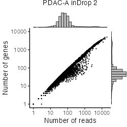
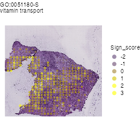
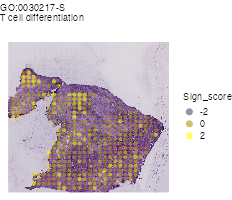

```{r, include = FALSE}
knitr::opts_chunk$set(
  collapse = TRUE,
  comment = "#>"
)
```


# Computational environment
MacBook Pro (Big Sur, 16-inch, 2019), Processor (2.4 GHz 8-Core Intel Core i9),
Memory (64 GB 2667 MHz DDR4).


<br>

# Install libraries
Attach necessary libraries:
```{r, eval = FALSE}
library(ASURAT)
library(SingleCellExperiment)
library(SummarizedExperiment)
```


<br>

# Introduction
In this vignette, we analyze single-cell RNA sequencing (scRNA-seq) and spatial
transcriptome (ST) data obtained from primary tumors of pancreatic ductal
adenocarcinoma (PDAC) patients (Moncada et al., Nat. Biotechnol. 38, 2020).


<br>

# Prepare scRNA-seq and ST data (Moncada et al., 2020)
## scRNA-seq data
The data can be loaded by the following code:
```{r, eval = FALSE}
pdacrna <- readRDS(url("https://figshare.com/ndownloader/files/34112468"))
```
The data are stored in
[DOI:10.6084/m9.figshare.19200254](https://figshare.com/s/866fbf822a4bfab234e6)
and the generating process is described below.

<br>

From [GSE111672](https://www.ncbi.nlm.nih.gov/geo/query/acc.cgi?acc=GSE111672),
we downloaded inDrop data with sample accession numbers GSM3036909, GSM3036910,
GSM3405527, GSM3405528, GSM3405529, and GSM3405530 (PDAC-A inDrop1-inDrop6).
```{r, eval = FALSE}
fn <- c("rawdata/2020_001_Moncada/pdac_indrop/PDACA_1/results/gene_expression.tsv",
        "rawdata/2020_001_Moncada/pdac_indrop/PDACA_2/results/gene_expression.tsv",
        "rawdata/2020_001_Moncada/pdac_indrop/PDACA_3/results/gene_expression.tsv",
        "rawdata/2020_001_Moncada/pdac_indrop/PDACA_4/results/gene_expression.tsv",
        "rawdata/2020_001_Moncada/pdac_indrop/PDACA_5/results/gene_expression.tsv",
        "rawdata/2020_001_Moncada/pdac_indrop/PDACA_6/results/gene_expression.tsv")
pdacrna <- list()
for(i in seq_along(fn)){
  d <- read.table(fn[i], header = TRUE, stringsAsFactors = FALSE, row.names = 1)
  colnames(d) <- paste0("PDAC-A-inDrop", i, "-", colnames(d))
  pdacrna[[i]] <- SingleCellExperiment(assays = list(counts = as.matrix(d)),
                                       rowData = data.frame(gene = rownames(d)),
                                       colData = data.frame(sample = colnames(d)))
}
```

```{r, eval = FALSE, echo = FALSE}
rbind(dim(pdacrna[[1]]), dim(pdacrna[[2]]), dim(pdacrna[[3]]),
      dim(pdacrna[[4]]), dim(pdacrna[[5]]), dim(pdacrna[[6]]))
```
```
      [,1]  [,2]
[1,] 19811 10000
[2,] 19811 10000
[3,] 19811 10000
[4,] 19811 10000
[5,] 19811 10000
[6,] 19811 10000
```

Add metadata for both variables and samples using ASURAT function
`add_metadata()`.
```{r, eval = FALSE}
for(i in seq_along(pdacrna)){
  pdacrna[[i]] <- add_metadata(sce = pdacrna[[i]], mitochondria_symbol = "^MT-")
}
```

Qualities of sample (cell) data are confirmed based on proper visualization of
`colData(sce)`.
```{r, eval = FALSE}
for(i in seq_along(pdacrna)){
  df <- data.frame(x = colData(pdacrna[[i]])$nReads,
                   y = colData(pdacrna[[i]])$nGenes)
  p <- ggplot2::ggplot() +
    ggplot2::geom_point(ggplot2::aes(x = df$x, y = df$y), size = 1, alpha = 1) +
    ggplot2::labs(title = paste0("PDAC-A inDrop ", i),
                  x = "Number of reads", y = "Number of genes") +
    ggplot2::theme_classic(base_size = 20) +
    ggplot2::theme(plot.title = ggplot2::element_text(hjust = 0.5, size = 20)) +
    ggplot2::scale_x_log10(limits = c(1, 20000)) +
    ggplot2::scale_y_log10(limits = c(1, 10000))
  p <- ggExtra::ggMarginal(p, type = "histogram", margins = "both", size = 5,
                           col = "black", fill = "gray")
  filename <- paste0("figures/figure_08_0005_", i, ".png")
  ggplot2::ggsave(file = filename, plot = p, dpi = 50, width = 5, height = 5)
}
```





Confirming that the data qualities are comparable among experimental batches,
concatenate all the objects horizontally.
```{r, eval = FALSE}
# Take intersection of genes.
genes <- Reduce(intersect, list(rownames(pdacrna[[1]]), rownames(pdacrna[[2]]),
                                rownames(pdacrna[[3]]), rownames(pdacrna[[4]]),
                                rownames(pdacrna[[5]]), rownames(pdacrna[[6]])))
for(i in seq_along(pdacrna)){
  pdacrna[[i]] <- pdacrna[[i]][genes, ]
  rowData(pdacrna[[i]])$nSamples <- NULL
}
# Horizontally concatenate SingleCellExperiment objects.
pdacrna <- cbind(pdacrna[[1]], pdacrna[[2]], pdacrna[[3]],
                 pdacrna[[4]], pdacrna[[5]], pdacrna[[6]])
# Add metadata again.
pdacrna <- add_metadata(sce = pdacrna, mitochondria_symbol = "^MT-")
```

```{r, eval = FALSE}
dim(pdacrna)
```
```
[1] 19811 60000
```

```{r, eval = FALSE, echo = FALSE}
# Save data.
saveRDS(pdacrna, file = "backup/08_001_pdacrna_data.rds")

# Load data.
pdacrna <- readRDS("backup/08_001_pdacrna_data.rds")
```


<br>

## ST data
The data can be loaded by the following code:
```{r, eval = FALSE}
pdacst <- readRDS(url("https://figshare.com/ndownloader/files/34112471"))
```
The data are stored in
[DOI:10.6084/m9.figshare.19200254](https://figshare.com/account/projects/132986/articles/19200254) and the generating process is described below.

<br>

Load a raw read count table, convert Ensembl IDs into gene symbols, and change
the column names.
```{r, eval = FALSE}
fn <- "rawdata/2020_001_Moncada/pdac_st/SRR6825057_stdata.tsv"
pdacst <- read.table(fn, header = TRUE, stringsAsFactors = FALSE, row.names = 1)
pdacst <- t(pdacst)
ensembl <- rownames(pdacst)
dictionary <- AnnotationDbi::select(org.Hs.eg.db::org.Hs.eg.db, key = ensembl,
                                    columns = c("SYMBOL", "ENTREZID"),
                                    keytype = "ENSEMBL")
dictionary <- dictionary[!duplicated(dictionary$ENSEMBL), ]
dictionary[which(is.na(dictionary$SYMBOL)),]$SYMBOL <- as.character("NA")
rownames(pdacst) <- make.unique(as.character(dictionary$SYMBOL))
colnames(pdacst) <- paste0("PDAC-A-ST1_", colnames(pdacst))
```

Create a SingleCellExperiment object by inputting the read count table.
```{r, eval = FALSE}
pdacst <- SingleCellExperiment(assays = list(counts = as.matrix(pdacst)),
                               rowData = data.frame(gene = rownames(pdacst)),
                               colData = data.frame(sample = colnames(pdacst)))
```

A Seurat object, including PDAC tissue images, was obtained from the authors of
[DOI:10.1038/s41587-019-0392-8](https://doi.org/10.1038/s41587-019-0392-8) and
[DOI:10.1093/nar/gkab043](https://academic.oup.com/nar/article/49/9/e50/6129341),
and set the tissue image data into the metadata slot.
```{r, eval = FALSE}
fn <- "rawdata/2020_001_Moncada/pdac_st/PDAC-A_ST_list.RDS"
pdacst_surt <- readRDS(file = fn)
pdacst_surt <- pdacst_surt$GSM3036911
metadata(pdacst)$images <- pdacst_surt@images
```

Since the above SingleCellExperiment object includes spatial coordinates
outside of tissues, remove such spots.
```{r, eval = FALSE}
pdacst <- pdacst[, colnames(pdacst_surt)]
identical(colnames(pdacst), colnames(pdacst_surt))
```
```
[1] TRUE
```

```{r, eval = FALSE}
dim(pdacst)
```
```
[1] 25807   428
```

Add metadata for both variables and samples using ASURAT function
`add_metadata()`.
```{r, eval = FALSE}
pdacst <- add_metadata(sce = pdacst, mitochondria_symbol = "^MT-")
```

Qualities of spot data are confirmed based on proper visualization of
`colData(sce)`.
```{r, eval = FALSE}
df <- data.frame(x = colData(pdacst)$nReads, y = colData(pdacst)$nGenes)
p <- ggplot2::ggplot() +
  ggplot2::geom_point(ggplot2::aes(x = df$x, y = df$y), size = 1, alpha = 1) +
  ggplot2::labs(title = "PDAC-A ST", x = "Number of reads", y = "Number of genes") +
  ggplot2::theme_classic(base_size = 18) +
  ggplot2::theme(plot.title = ggplot2::element_text(hjust = 0.5, size = 20)) +
  ggplot2::scale_x_log10(limits = c(-NA, NA)) +
  ggplot2::scale_y_log10(limits = c(-NA, NA))
p <- ggExtra::ggMarginal(p, type = "histogram", margins = "both", size = 5,
                         col = "black", fill = "gray")
filename <- "figures/figure_09_0005.png"
ggplot2::ggsave(file = filename, plot = p, dpi = 50, width = 5, height = 5)
```


```{r, eval = FALSE, echo = FALSE}
# Save data.
saveRDS(pdacst, file = "backup/09_001_pdacst_data.rds")

# Load data.
pdacst <- readRDS("backup/09_001_pdacst_data.rds")
```


<br>

# Preprocessing
## Control data quality
Remove variables (genes) and samples (cells) with low quality,
by processing the following three steps:

1. remove variables based on expression profiles across samples,
2. remove samples based on the numbers of reads and nonzero expressed variables,
3. remove variables based on the mean read counts across samples.


<br>

### Remove variables based on expression profiles
ASURAT function `remove_variables()` removes variable (gene) data such that
the numbers of non-zero expressing samples (cells) are less than `min_nsamples`.
```{r, eval = FALSE}
pdacrna <- remove_variables(sce = pdacrna, min_nsamples = 10)
pdacst <- remove_variables(sce = pdacst, min_nsamples = 10)
```


<br>

### Remove samples based on expression profiles
Qualities of sample (cell) data are confirmed based on proper visualization of
`colData(sce)`.
ASURAT function `plot_dataframe2D()` shows scatter plots of
two-dimensional data (see [here](#visualization_lowdim) for details).
```{r, eval = FALSE}
title <- "PDAC-A inDrop"
df <- data.frame(x = colData(pdacrna)$nReads, y = colData(pdacrna)$nGenes)
p <- ggplot2::ggplot() +
  ggplot2::geom_point(ggplot2::aes(x = df$x, y = df$y), size = 1, alpha = 1) +
  ggplot2::labs(title = title, x = "Number of reads", y = "Number of genes") +
  ggplot2::theme_classic(base_size = 20) +
  ggplot2::theme(plot.title = ggplot2::element_text(hjust = 0.5, size = 20))
filename <- "figures/figure_08_0010.png"
ggplot2::ggsave(file = filename, plot = p, dpi = 50, width = 5, height = 5)
```

```{r, eval = FALSE, echo = FALSE}
title <- "PDAC-A ST"
df <- data.frame(x = colData(pdacst)$nReads, y = colData(pdacst)$nGenes)
p <- ggplot2::ggplot() +
  ggplot2::geom_point(ggplot2::aes(x = df$x, y = df$y), size = 1, alpha = 1) +
  ggplot2::labs(title = title, x = "Number of reads", y = "Number of genes") +
  ggplot2::theme_classic(base_size = 20) +
  ggplot2::theme(plot.title = ggplot2::element_text(hjust = 0.5, size = 20))
filename <- "figures/figure_09_0010.png"
ggplot2::ggsave(file = filename, plot = p, dpi = 50, width = 5, height = 5)
```


```{r, eval = FALSE}
df <- data.frame(x = colData(pdacrna)$nReads, y = colData(pdacrna)$percMT)
title <- "PDAC-A inDrop"
p <- ggplot2::ggplot() +
  ggplot2::geom_point(ggplot2::aes(x = df$x, y = df$y), size = 1, alpha = 1) +
  ggplot2::labs(title = title, x = "Number of reads", y = "Perc of MT reads") +
  ggplot2::theme_classic(base_size = 20) +
  ggplot2::theme(plot.title = ggplot2::element_text(hjust = 0.5))
filename <- "figures/figure_08_0011.png"
ggplot2::ggsave(file = filename, plot = p, dpi = 50, width = 5, height = 5)
```

```{r, eval = FALSE, echo = FALSE}
df <- data.frame(x = colData(pdacst)$nReads, y = colData(pdacst)$percMT)
title <- "PDAC-A ST"
p <- ggplot2::ggplot() +
  ggplot2::geom_point(ggplot2::aes(x = df$x, y = df$y), size = 1, alpha = 1) +
  ggplot2::labs(title = title, x = "Number of reads", y = "Perc of MT reads") +
  ggplot2::theme_classic(base_size = 20) +
  ggplot2::theme(plot.title = ggplot2::element_text(hjust = 0.5))
filename <- "figures/figure_09_0011.png"
ggplot2::ggsave(file = filename, plot = p, dpi = 50, width = 5, height = 5)
```


ASURAT function `remove_samples()` removes sample (cell) data by setting cutoff
values for the metadata.
```{r, eval = FALSE}
pdacrna <- remove_samples(sce = pdacrna, min_nReads = 1000, max_nReads = 10000,
                          min_nGenes = 100, max_nGenes = 1e+10,
                          min_percMT = 0, max_percMT = 20)

pdacst <- remove_samples(sce = pdacst, min_nReads = 0, max_nReads = 1e+10,
                         min_nGenes = 0, max_nGenes = 1e+10,
                         min_percMT = NULL, max_percMT = NULL)
```


<br>

### Remove variables based on the mean read counts {#data_qc}
Qualities of variable (gene) data are confirmed based on proper visualization of
`rowData(sce)`.
ASURAT function `plot_dataframe2D()` shows scatter plots of two-dimensional data.
```{r, eval = FALSE}
title <- "PDAC-A inDrop"
aveexp <- apply(as.matrix(assay(pdacrna, "counts")), 1, mean)
df <- data.frame(x = seq_len(nrow(rowData(pdacrna))),
                 y = sort(aveexp, decreasing = TRUE))
p <- ggplot2::ggplot() + ggplot2::scale_y_log10() +
  ggplot2::geom_point(ggplot2::aes(x = df$x, y = df$y), size = 1, alpha = 1) +
  ggplot2::labs(title = title, x = "Rank of genes", y = "Mean read counts") +
  ggplot2::theme_classic(base_size = 20) +
  ggplot2::theme(plot.title = ggplot2::element_text(hjust = 0.5))
filename <- "figures/figure_08_0015.png"
ggplot2::ggsave(file = filename, plot = p, dpi = 50, width = 5, height = 5)
```

```{r, eval = FALSE}
title <- "PDAC-A ST"
aveexp <- apply(as.matrix(assay(pdacst, "counts")), 1, mean)
df <- data.frame(x = seq_len(nrow(rowData(pdacst))),
                 y = sort(aveexp, decreasing = TRUE))
p <- ggplot2::ggplot() + ggplot2::scale_y_log10() +
  ggplot2::geom_point(ggplot2::aes(x = df$x, y = df$y), size = 1, alpha = 1) +
  ggplot2::labs(title = title, x = "Rank of genes", y = "Mean read counts") +
  ggplot2::theme_classic(base_size = 20) +
  ggplot2::theme(plot.title = ggplot2::element_text(hjust = 0.5))
filename <- "figures/figure_09_0015.png"
ggplot2::ggsave(file = filename, plot = p, dpi = 50, width = 5, height = 5)
```


ASURAT function `remove_variables_second()` removes variable (gene) data
such that the mean read counts across samples are less than `min_meannReads`.
```{r, eval = FALSE}
pdacrna <- remove_variables_second(sce = pdacrna, min_meannReads = 0.01)
pdacst <- remove_variables_second(sce = pdacst, min_meannReads = 0.01)
```

```{r, eval = FALSE}
rbind(dim(pdacrna), dim(pdacst))
```
```
[1,] 12248 2034
[2,] 10364  428
```

Check the number of genes, which commonly exist in both the datasets.
```{r, eval = FALSE}
length(intersect(rownames(pdacrna), rownames(pdacst)))
```
```
[1] 7923
```

Qualities of spot data are confirmed based on proper visualization of
`colData(sce)`.
```{r, eval = FALSE}
# scRNA-seq
df <- data.frame(x = colData(pdacrna)$nReads, y = colData(pdacrna)$nGenes)
p <- ggplot2::ggplot() +
  ggplot2::geom_point(ggplot2::aes(x = df$x, y = df$y), size = 1, alpha = 1) +
  ggplot2::labs(title = "PDAC-A inDrop",
                x = "Number of reads", y = "Number of genes") +
  ggplot2::theme_classic(base_size = 20) +
  ggplot2::theme(plot.title = ggplot2::element_text(hjust = 0.5, size = 20)) +
  ggplot2::scale_x_log10(limits = c(1, 20000)) +
  ggplot2::scale_y_log10(limits = c(1, 10000))
p <- ggExtra::ggMarginal(p, type = "histogram", margins = "both", size = 5,
                         col = "black", fill = "gray")
filename <- "figures/figure_10_0005.png"
ggplot2::ggsave(file = filename, plot = p, dpi = 50, width = 5, height = 5)
# ST
df <- data.frame(x = colData(pdacst)$nReads, y = colData(pdacst)$nGenes)
p <- ggplot2::ggplot() +
  ggplot2::geom_point(ggplot2::aes(x = df$x, y = df$y), size = 1, alpha = 1) +
  ggplot2::labs(title = "PDAC-A ST", x = "Number of reads", y = "Number of genes") +
  ggplot2::theme_classic(base_size = 20) +
  ggplot2::theme(plot.title = ggplot2::element_text(hjust = 0.5, size = 20)) +
  ggplot2::scale_x_log10(limits = c(1, 40000)) +
  ggplot2::scale_y_log10(limits = c(1, 10000))
p <- ggExtra::ggMarginal(p, type = "histogram", margins = "both", size = 5,
                         col = "black", fill = "gray")
filename <- "figures/figure_10_0006.png"
ggplot2::ggsave(file = filename, plot = p, dpi = 50, width = 5, height = 5)
```


```{r, eval = FALSE, echo = FALSE}
# Save data.
saveRDS(pdacrna, file = "backup/08_002_pdacrna_dataqc.rds")
saveRDS(pdacst, file = "backup/09_002_pdacst_dataqc.rds")

# Load data.
pdacrna <- readRDS("backup/08_002_pdacrna_dataqc.rds")
pdacst <- readRDS("backup/09_002_pdacst_dataqc.rds")
```


<br>

## Normalize data {#normalization}
Perform `bayNorm()` (Tang et al., Bioinformatics, 2020) for attenuating
technical biases with respect to zero inflation and variation of capture
efficiencies between samples (cells).
```{r, eval = FALSE}
# pdacrna
bayout <- bayNorm::bayNorm(Data = assay(pdacrna, "counts"), mode_version = TRUE)
assay(pdacrna, "baynorm") <- bayout$Bay_out
# pdacst
bayout <- bayNorm::bayNorm(Data = assay(pdacst, "counts"), mode_version = TRUE)
assay(pdacst, "baynorm") <- bayout$Bay_out
```

Normalize the data using canonical correlation analysis-based method using
Seurat functions (Butler Nat. Biotechnol., 2018).
```{r, eval = FALSE}
surt <- list()
surt[[1]] <- Seurat::as.Seurat(pdacrna, counts = "baynorm", data = "baynorm")
surt[[2]] <- Seurat::as.Seurat(pdacst, counts = "baynorm", data = "baynorm")
names(surt) <- c("inDrop", "ST")
for(i in seq_along(surt)){
  surt[[i]] <- Seurat::NormalizeData(surt[[i]])
  surt[[i]] <- Seurat::FindVariableFeatures(surt[[i]], selection.method = "vst",
                                            nfeatures = 7500)
}
genes <- Seurat::SelectIntegrationFeatures(object.list = surt, nfeatures = 7500)
anchors <- Seurat::FindIntegrationAnchors(object.list = surt,
                                          anchor.features = genes)
surt <- Seurat::IntegrateData(anchorset = anchors,
                              normalization.method = "LogNormalize")
Seurat::DefaultAssay(surt) <- "integrated"
pdac <- Seurat::as.SingleCellExperiment(surt)
rowData(pdac) <- rownames(pdac)
```

Keep the tissue coordinate information.
```{r, eval = FALSE}
pdac@metadata <- pdacst@metadata
```

```{r, eval = FALSE}
dim(pdac)
```
```
[1] 6761 2462
```

Center row data.
```{r, eval = FALSE}
mat <- assay(pdac, "logcounts")
assay(pdac, "centered") <- sweep(mat, 1, apply(mat, 1, mean), FUN = "-")
```

Set gene expression data into `altExp(sce)`.
```{r, eval = FALSE}
altExps(pdac) <- NULL  # For safely using Seurat function as.Seurat() later,
                       # avoid using the same slot names in assayNames and altExpNames.
sname <- "logcounts"
altExp(pdac, sname) <- SummarizedExperiment(list(counts = assay(pdac, sname)))
```

Add ENTREZ Gene IDs to `rowData(sce)`.
```{r, eval = FALSE}
dictionary <- AnnotationDbi::select(org.Hs.eg.db::org.Hs.eg.db,
                                    key = rownames(pdac),
                                    columns = "ENTREZID", keytype = "SYMBOL")
dictionary <- dictionary[!duplicated(dictionary$SYMBOL), ]
rowData(pdac)$geneID <- dictionary$ENTREZID
```

```{r, eval = FALSE, echo = FALSE}
# Save data.
saveRDS(pdac, file = "backup/10_003_pdac_normalized.rds")

# Load data.
pdac <- readRDS("backup/10_003_pdac_normalized.rds")
```


<br>

# Multifaceted sign analysis
Infer cell or disease types, biological functions, and signaling pathway
activity at the single-cell level by inputting related databases.

ASURAT transforms centered read count tables to functional feature matrices,
termed sign-by-sample matrices (SSMs).
Using SSMs, perform unsupervised clustering of samples (cells).


<br>

## Compute correlation matrices
Prepare correlation matrices of gene expressions.
```{r, eval = FALSE}
mat <- t(as.matrix(assay(pdac, "centered")))
cormat <- cor(mat, method = "spearman")
```

```{r, eval = FALSE, echo = FALSE}
# Save data.
saveRDS(cormat, file = "backup/10_003_pdac_cormat.rds")

# Load data.
cormat <- readRDS("backup/10_003_pdac_cormat.rds")
```


<br>

## Load databases
Load databases.
```{r, eval = FALSE}
urlpath <- "https://github.com/keita-iida/ASURATDB/blob/main/genes2bioterm/"
load(url(paste0(urlpath, "20201213_human_DO.rda?raw=TRUE")))         # DO
load(url(paste0(urlpath, "20201213_human_CO.rda?raw=TRUE")))         # CO
load(url(paste0(urlpath, "20220308_human_MSigDB.rda?raw=TRUE")))     # MSigDB
load(url(paste0(urlpath, "20220308_human_CellMarker.rda?raw=TRUE"))) # CellMarker
load(url(paste0(urlpath, "20201213_human_GO_red.rda?raw=TRUE")))     # GO
load(url(paste0(urlpath, "20201213_human_KEGG.rda?raw=TRUE")))       # KEGG
```
The reformatted knowledge-based data were available from the following
repositories:

* [DOI:10.6084/m9.figshare.19102598](https://figshare.com/s/0599d2de970c2deb675c)
* [Github ASURATDB](https://github.com/keita-iida/ASURATDB)

Create a custom-built cell type-related databases by combining different
databases for analyzing human single-cell transcriptome data.
```{r, eval = FALSE}
d <- list(human_DO[["disease"]], human_CO[["cell"]], human_MSigDB[["cell"]],
          human_CellMarker[["cell"]])
human_CB <- list(cell = do.call("rbind", d))
```

Add formatted databases to `metadata(sce)$sign`.
```{r, eval = FALSE}
pdacs <- list(CB = pdac, GO = pdac, KG = pdac)
metadata(pdacs$CB) <- list(sign = human_CB[["cell"]])
metadata(pdacs$GO) <- list(sign = human_GO[["BP"]])
metadata(pdacs$KG) <- list(sign = human_KEGG[["pathway"]])
```


<br>

## Create signs
ASURAT function `remove_signs()` redefines functional gene sets for the
input database by removing genes, which are not included in `rownames(sce)`,
and further removes biological terms including too few or too many genes.
```{r, eval = FALSE}
pdacs$CB <- remove_signs(sce = pdacs$CB, min_ngenes = 2, max_ngenes = 1000)
pdacs$GO <- remove_signs(sce = pdacs$GO, min_ngenes = 2, max_ngenes = 1000)
pdacs$KG <- remove_signs(sce = pdacs$KG, min_ngenes = 2, max_ngenes = 1000)
```

ASURAT function `cluster_genes()` clusters functional gene sets using
a correlation graph-based decomposition method, which produces strongly,
variably, and weakly correlated gene sets (SCG, VCG, and WCG, respectively).
```{r, eval = FALSE}
set.seed(1)
pdacs$CB <- cluster_genesets(sce = pdacs$CB, cormat = cormat,
                             th_posi = 0.22, th_nega = -0.32)
set.seed(1)
pdacs$GO <- cluster_genesets(sce = pdacs$GO, cormat = cormat,
                             th_posi = 0.22, th_nega = -0.22)
set.seed(1)
pdacs$KG <- cluster_genesets(sce = pdacs$KG, cormat = cormat,
                             th_posi = 0.18, th_nega = -0.23)
```

ASURAT function `create_signs()` creates signs by the following criteria:

1. the number of genes in SCG>= `min_cnt_strg` (the default value is 2) and
2. the number of genes in VCG>= `min_cnt_vari` (the default value is 2),

which are independently applied to SCGs and VCGs, respectively.
```{r, eval = FALSE}
pdacs$CB <- create_signs(sce = pdacs$CB, min_cnt_strg = 2, min_cnt_vari = 2)
pdacs$GO <- create_signs(sce = pdacs$GO, min_cnt_strg = 3, min_cnt_vari = 3)
pdacs$KG <- create_signs(sce = pdacs$KG, min_cnt_strg = 3, min_cnt_vari = 3)
```


<br>

## Select signs
If signs have semantic similarity information, one can use ASURAT function
`remove_signs_redundant()` for removing redundant sings using the semantic
similarity matrices.
```{r, eval = FALSE}
simmat <- human_GO$similarity_matrix$BP
pdacs$GO <- remove_signs_redundant(sce = pdacs$GO, similarity_matrix = simmat,
                                   threshold = 0.85, keep_rareID = TRUE)
```

ASURAT function `remove_signs_manually()` removes signs by specifying
IDs (e.g., `GOID:XXX`) or descriptions (e.g., `metabolic`) using `grepl()`.
```{r, eval = FALSE}
keywords <- "Covid|COVID"
pdacs$KG <- remove_signs_manually(sce = pdacs$KG, keywords = keywords)
```


<br>

## Create sign-by-sample matrices
ASURAT function `create_sce_signmatrix()` creates a new SingleCellExperiment
object `new_sce`, consisting of the following information:

* `assayNames(new_sce)`: counts (SSM whose entries are termed sign scores),
* `names(colData(new_sce))`: nReads, nGenes, percMT,
* `names(rowData(new_sce))`: ParentSignID, Description, CorrGene, etc.,
* `names(metadata(new_sce))`: sign_SCG, sign_VCG, etc.,
* `altExpNames(new_sce)`: something if there is data in `altExp(sce)`.
```{r, eval = FALSE}
pdacs$CB <- makeSignMatrix(sce = pdacs$CB, weight_strg = 0.5, weight_vari = 0.5)
pdacs$GO <- makeSignMatrix(sce = pdacs$GO, weight_strg = 0.5, weight_vari = 0.5)
pdacs$KG <- makeSignMatrix(sce = pdacs$KG, weight_strg = 0.5, weight_vari = 0.5)
```


<br>

## Reduce dimensions of sign-by-sample matrices
Perform t-distributed stochastic neighbor embedding.
```{r, eval = FALSE}
for(i in seq_along(pdacs)){
  set.seed(1)
  mat <- t(as.matrix(assay(pdacs[[i]], "counts")))
  res <- Rtsne::Rtsne(mat, dim = 2, pca = TRUE, initial_dims = 100)
  reducedDim(pdacs[[i]], "TSNE") <- res[["Y"]]
}
```

Show the results of dimensional reduction in t-SNE spaces.
```{r, eval = FALSE}
titles <- c("PDAC-A (cell type & disease)", "PDAC-A (function)",
            "PDAC-A (pathway)")
for(i in seq_along(titles)){
  df <- as.data.frame(reducedDim(pdacs[[i]], "TSNE"))
  p <- ggplot2::ggplot() +
    ggplot2::geom_point(ggplot2::aes(x = df[, 1], y = df[, 2]),
                        color = "black", size = 1, alpha = 1) +
    ggplot2::labs(title = titles[i], x = "tSNE_1", y = "tSNE_2") +
    ggplot2::theme_classic(base_size = 20) +
    ggplot2::theme(plot.title = ggplot2::element_text(hjust = 0.5, size = 18))
  filename <- sprintf("figures/figure_10_%04d.png", 19 + i)
  ggplot2::ggsave(file = filename, plot = p, dpi = 50, width = 4.1, height = 4.3)
}
```


```{r, eval = FALSE, echo = FALSE}
# Save data.
saveRDS(pdacs, file = "backup/10_004_pdacs_ssm.rds")

# Load data.
pdacs <- readRDS("backup/10_004_pdacs_ssm.rds")
```


<br>

## Cluster cells
### Use Seurat functions
To date (December, 2021), one of the most useful clustering methods in scRNA-seq
data analysis is a combination of a community detection algorithm and
graph-based unsupervised clustering, developed in Seurat package.

Here, our strategy is as follows:

1. convert SingleCellExperiment objects into Seurat objects
  (note that `rowData()` and `colData()` must have data),
2. perform `ScaleData()`, `RunPCA()`, `FindNeighbors()`, and `FindClusters()`,
3. convert Seurat objects into temporal SingleCellExperiment objects `temp`,
4. add `colData(temp)$seurat_clusters` into `colData(sce)$seurat_clusters`.
```{r, eval = FALSE}
resolutions <- c(0.20, 0.18, 0.15)
dims <- list(seq_len(10), seq_len(30), seq_len(20))
for(i in seq_along(pdacs)){
  surt <- Seurat::as.Seurat(pdacs[[i]], counts = "counts", data = "counts")
  mat <- as.matrix(assay(pdacs[[i]], "counts"))
  surt[["SSM"]] <- Seurat::CreateAssayObject(counts = mat)
  Seurat::DefaultAssay(surt) <- "SSM"
  surt <- Seurat::ScaleData(surt, features = rownames(surt))
  surt <- Seurat::RunPCA(surt, features = rownames(surt))
  surt <- Seurat::FindNeighbors(surt, reduction = "pca", dims = dims[[i]])
  surt <- Seurat::FindClusters(surt, resolution = resolutions[i])
  temp <- Seurat::as.SingleCellExperiment(surt)
  colData(pdacs[[i]])$seurat_clusters <- colData(temp)$seurat_clusters
}
```

Show the clustering results in t-SNE spaces.
```{r, eval = FALSE}
titles <- c("PDAC-A (cell type & disease)", "PDAC-A (function)",
            "PDAC-A (pathway)")
for(i in seq_along(titles)){
  labels <- colData(pdacs[[i]])$seurat_clusters
  df <- as.data.frame(reducedDim(pdacs[[i]], "TSNE"))
  p <- ggplot2::ggplot() +
    ggplot2::geom_point(ggplot2::aes(x = df[, 1], y = df[, 2], color = labels),
                        size = 1, alpha = 1) +
    ggplot2::labs(title = titles[i], x = "tSNE_1", y = "tSNE_2", color = "") +
    ggplot2::theme_classic(base_size = 20) +
    ggplot2::theme(plot.title = ggplot2::element_text(hjust = 0.5, size = 18)) +
    ggplot2::guides(colour = ggplot2::guide_legend(override.aes = list(size = 4)))
  if(i == 1){
    mycolor <- c("0" = "limegreen", "1" = "deepskyblue1", "2" = "grey20",
                 "3" = "red", "4" = "orange")
    p <- p + ggplot2::scale_color_manual(values = mycolor)
  }else if(i == 2){
    mycolor <- c("0" = "limegreen", "1" = "grey20", "2" = "red",
                 "3" = "orange", "4" = "magenta")
    p <- p + ggplot2::scale_color_manual(values = mycolor)
  }else if(i == 3){
    p <- p + ggplot2::scale_color_brewer(palette = "Set2")
  }
  filename <- sprintf("figures/figure_10_%04d.png", 29 + i)
  ggplot2::ggsave(file = filename, plot = p, dpi = 50, width = 5.1, height = 4.3)
}
```


Show labels of experimental batches in the reduced sign space.
```{r, eval = FALSE}
titles <- c("PDAC-A (cell type & disease)", "PDAC-A (function)",
            "PDAC-A (pathway)")
for(i in seq_along(titles)){
  batch <- as.data.frame(colData(pdacs[[i]])) ; batch$batch <- NA
  batch[grepl("ST", batch$orig.ident), ]$batch <- "ST"
  batch[!grepl("ST", batch$orig.ident), ]$batch <- "inDrop"
  labels <- batch$batch
  df <- as.data.frame(reducedDim(pdacs[[i]], "TSNE"))
  p <- ggplot2::ggplot() +
    ggplot2::geom_point(ggplot2::aes(x = df[, 1], y = df[, 2], color = labels),
                        size = 1, alpha = 1) +
    ggplot2::labs(title = titles[i], x = "tSNE_1", y = "tSNE_2", color = "") +
    ggplot2::theme_classic(base_size = 20) +
    ggplot2::theme(plot.title = ggplot2::element_text(hjust = 0.5, size = 18)) +
    ggplot2::scale_color_hue() +
    ggplot2::guides(colour = ggplot2::guide_legend(override.aes = list(size = 4)))
  filename <- sprintf("figures/figure_10_%04d.png", 34 + i)
  ggplot2::ggsave(file = filename, plot = p, dpi = 50, width = 5.6, height = 4.3)
}
```


Show labels of experimental batches of inDrop and ST datasets in the reduced
sign space.
```{r, eval = FALSE}
# Cell type and disease
batch <- as.character(colData(pdacs$CB)$orig.ident)
labels <- factor(batch, levels = unique(batch))
df <- as.data.frame(reducedDim(pdacs$CB, "TSNE"))
p <- ggplot2::ggplot() +
  ggplot2::geom_point(ggplot2::aes(x = df[, 1], y = df[, 2], color = labels),
                      size = 1, alpha = 1) +
  ggplot2::labs(title = "PDAC-A (cell type & disease)",
                x = "tSNE_1", y = "tSNE_2", color = "") +
  ggplot2::theme_classic(base_size = 20) +
  ggplot2::theme(plot.title = ggplot2::element_text(hjust = 0.5, size = 18)) +
  ggplot2::scale_color_hue() +
  ggplot2::guides(colour = ggplot2::guide_legend(override.aes = list(size = 4)))
filename <- "figures/figure_10_0038_a.png"
ggplot2::ggsave(file = filename, plot = p, dpi = 50, width = 7.1, height = 4.3)

# Biological process
batch <- as.character(colData(pdacs$GO)$orig.ident)
labels <- factor(batch, levels = unique(batch))
df <- as.data.frame(reducedDim(pdacs$GO, "TSNE"))
p <- ggplot2::ggplot() +
  ggplot2::geom_point(ggplot2::aes(x = df[, 1], y = df[, 2], color = labels),
                      size = 1, alpha = 1) +
  ggplot2::labs(title = "PDAC-A (function)",
                x = "tSNE_1", y = "tSNE_2", color = "") +
  ggplot2::theme_classic(base_size = 20) +
  ggplot2::theme(plot.title = ggplot2::element_text(hjust = 0.5, size = 18)) +
  ggplot2::scale_color_hue() +
  ggplot2::guides(colour = ggplot2::guide_legend(override.aes = list(size = 4)))
filename <- "figures/figure_10_0038_b.png"
ggplot2::ggsave(file = filename, plot = p, dpi = 50, width = 7.1, height = 4.3)
```


Show the number of reads in the reduced sign space.
```{r, eval = FALSE}
# Cell type and disease
nreads <- log(as.numeric(colData(pdacs$CB)$nReads) + 1)
df <- as.data.frame(reducedDim(pdacs$CB, "TSNE"))
p <- ggplot2::ggplot() +
  ggplot2::geom_point(ggplot2::aes(x = df[, 1], y = df[, 2], color = nreads),
                      size = 1, alpha = 1) +
  ggplot2::labs(title = "PDAC-A (cell type & disease)",
                x = "tSNE_1", y = "tSNE_2", color = "log(nReads + 1)") +
  ggplot2::theme_classic(base_size = 20) +
  ggplot2::theme(plot.title = ggplot2::element_text(hjust = 0.5, size = 18)) +
  ggplot2::scale_color_continuous()
filename <- "figures/figure_10_0039_a.png"
ggplot2::ggsave(file = filename, plot = p, dpi = 50, width = 6.6, height = 4.3)

# Biological process
nreads <- log(as.numeric(colData(pdacs$GO)$nReads) + 1)
df <- as.data.frame(reducedDim(pdacs$GO, "TSNE"))
p <- ggplot2::ggplot() +
  ggplot2::geom_point(ggplot2::aes(x = df[, 1], y = df[, 2], color = nreads),
                      size = 1, alpha = 1) +
  ggplot2::labs(title = "PDAC-A (function)",
                x = "tSNE_1", y = "tSNE_2", color = "log(nReads + 1)") +
  ggplot2::theme_classic(base_size = 20) +
  ggplot2::theme(plot.title = ggplot2::element_text(hjust = 0.5, size = 18)) +
  ggplot2::scale_color_continuous()
filename <- "figures/figure_10_0039_b.png"
ggplot2::ggsave(file = filename, plot = p, dpi = 50, width = 6.6, height = 4.3)
```


<br>

## Investigate significant signs
Significant signs are analogous to differentially expressed genes but bear
biological meanings.
Note that naïve usages of statistical tests should be avoided because the row
vectors of SSMs are centered.

Instead, ASURAT function `compute_sepI_all()` computes separation indices
for each cluster against the others.
Briefly, a separation index "sepI", ranging from -1 to 1, is a nonparametric
measure of significance of a given sign score for a given subpopulation.
The larger (resp. smaller) sepI is, the more reliable the sign is as a positive
(resp. negative) marker for the cluster.
```{r, eval = FALSE}
for(i in seq_along(pdacs)){
  set.seed(1)
  labels <- colData(pdacs[[i]])$seurat_clusters
  pdacs[[i]] <- compute_sepI_all(sce = pdacs[[i]], labels = labels,
                                 nrand_samples = NULL)
}
```

Perform `compute_sepI_all()` for investigating significant signs for the
clustering results of biological process.
```{r, eval = FALSE}
labels <- colData(pdacs$GO)$seurat_clusters

pdacs_LabelGO_SignCB <- pdacs$CB
metadata(pdacs_LabelGO_SignCB)$marker_signs <- NULL
set.seed(1)
pdacs_LabelGO_SignCB <- compute_sepI_all(sce = pdacs_LabelGO_SignCB,
                                         labels = labels, nrand_samples = NULL)

pdacs_LabelGO_SignKG <- pdacs$KG
metadata(pdacs_LabelGO_SignKG)$marker_signs <- NULL
set.seed(1)
pdacs_LabelGO_SignKG <- compute_sepI_all(sce = pdacs_LabelGO_SignKG,
                                         labels = labels, nrand_samples = NULL)
```


<br>

## Investigate significant genes
### Use Seurat function
To date (December, 2021), one of the most useful methods of multiple statistical
tests in scRNA-seq data analysis is to use a Seurat function `FindAllMarkers()`.

If there is gene expression data in `altExp(sce)`, one can investigate
differentially expressed genes by using Seurat functions in the similar manner
as described before.
```{r, eval = FALSE}
set.seed(1)
surt <- Seurat::as.Seurat(pdacs$CB, counts = "counts", data = "counts")
mat <- as.matrix(assay(altExp(pdacs$CB), "counts"))
surt[["GEM"]] <- Seurat::CreateAssayObject(counts = mat)
Seurat::DefaultAssay(surt) <- "GEM"
surt <- Seurat::SetIdent(surt, value = "seurat_clusters")
res <- Seurat::FindAllMarkers(surt, only.pos = TRUE,
                              min.pct = 0.25, logfc.threshold = 0.25)
metadata(pdacs$CB)$marker_genes$all <- res
```

```{r, eval = FALSE, echo = FALSE}
# Save data.
saveRDS(pdacs, file = "backup/10_005_pdacs_desdeg.rds")
saveRDS(pdacs_LabelGO_SignCB, file = "backup/10_005_pdacs_LabelGO_SignCB.rds")
saveRDS(pdacs_LabelGO_SignKG, file = "backup/10_005_pdacs_LabelGO_SignKG.rds")

# Load data.
pdacs <- readRDS("backup/10_005_pdacs_desdeg.rds")
pdacs_LabelGO_SignCB <- readRDS("backup/10_005_pdacs_LabelGO_SignCB.rds")
pdacs_LabelGO_SignKG <- readRDS("backup/10_005_pdacs_LabelGO_SignKG.rds")
```


<br>

## Multifaceted analysis
Simultaneously analyze multiple sign-by-sample matrices, which helps us
characterize individual samples (cells) from multiple biological aspects.

ASURAT function `plot_multiheatmaps()` shows heatmaps (ComplexHeatmap object)
of sign scores and gene expression levels (if there are), where rows and columns
stand for sign (or gene) and sample (cell), respectively.

First, remove unrelated signs by setting keywords, followed by selecting top
significant signs and genes for the clustering results with respect to
separation index and p-value, respectively.
```{r, eval = FALSE}
# Significant signs
marker_signs <- list()
keys <- "foofoo|hogehoge"
for(i in seq_along(pdacs)){
  marker_signs[[i]] <- metadata(pdacs[[i]])$marker_signs$all
  marker_signs[[i]] <- marker_signs[[i]][!grepl(keys, marker_signs[[i]]$Description), ]
  marker_signs[[i]] <- dplyr::group_by(marker_signs[[i]], Ident_1)
  marker_signs[[i]] <- dplyr::slice_max(marker_signs[[i]], sepI, n = 2)
  marker_signs[[i]] <- dplyr::slice_min(marker_signs[[i]], Rank, n = 1)
}
# Significant genes
marker_genes_CB <- metadata(pdacs$GO)$marker_genes$all
marker_genes_CB <- dplyr::group_by(marker_genes_CB, cluster)
marker_genes_CB <- dplyr::slice_min(marker_genes_CB, p_val_adj, n = 2)
marker_genes_CB <- dplyr::slice_max(marker_genes_CB, avg_log2FC, n = 2)
```

Then, prepare arguments.
```{r, eval = FALSE}
# ssm_list
sces_sub <- list() ; ssm_list <- list()
for(i in seq_along(pdacs)){
  sces_sub[[i]] <- pdacs[[i]][rownames(pdacs[[i]]) %in% marker_signs[[i]]$SignID, ]
  ssm_list[[i]] <- assay(sces_sub[[i]], "counts")
}
names(ssm_list) <- c("SSM_cell_disease", "SSM_function", "SSM_pathway")
# gem_list
expr_sub <- altExp(pdacs$CB, "logcounts")
expr_sub <- expr_sub[rownames(expr_sub) %in% marker_genes_CB$gene]
gem_list <- list(x = t(scale(t(as.matrix(assay(expr_sub, "counts"))))))
names(gem_list) <- "Scaled\nLogExpr"
# ssmlabel_list
labels <- list() ; ssmlabel_list <- list()
for(i in seq_along(pdacs)){
  tmp <- colData(sces_sub[[i]])$seurat_clusters
  labels[[i]] <- data.frame(label = tmp)
  n_groups <- length(unique(tmp))
  if(i == 1){
    mycolor <- c("0" = "limegreen", "1" = "deepskyblue1", "2" = "grey20",
                 "3" = "red", "4" = "orange")
    labels[[i]]$color <- mycolor[tmp]
  }else if(i == 2){
    mycolor <- c("0" = "limegreen", "1" = "grey20", "2" = "red",
                 "3" = "orange", "4" = "magenta")
    labels[[i]]$color <- mycolor[tmp]
  }else if(i == 3){
    labels[[i]]$color <- scales::brewer_pal(palette = "Set2")(n_groups)[tmp]
  }
  ssmlabel_list[[i]] <- labels[[i]]
}
names(ssmlabel_list) <- c("Label_cell_disease", "Label_function", "Label_pathway")
```

Finally, plot heatmaps for the selected signs and genes.
```{r, eval = FALSE}
filename <- "figures/figure_10_0040.png"
# png(file = filename, height = 1200, width = 1300, res = 200)
png(file = filename, height = 350, width = 370, res = 60)
set.seed(1)
title <- "PDAC-A"
plot_multiheatmaps(ssm_list = ssm_list, gem_list = gem_list,
                   ssmlabel_list = ssmlabel_list, gemlabel_list = NULL,
                   nrand_samples = 500, show_row_names = TRUE, title = title)
dev.off()
```


Show violin plots for sign score and gene expression distributions across
cell type-related clusters.
```{r, eval = FALSE}
labels <- colData(pdacs$CB)$seurat_clusters
vlist <- list(c("GE", "REG1A", "(Pancreatic cell)\n"),
              c("GE", "CPA5", "(Pancreatic cell)\n"),
              c("CB", "MSigDBID:252-V",
                "...PANCREAS_DUCTAL_CELL\n(SOX9, APOL1, ...)"),
              c("CB", "DOID:3498-S",
                "pancreatic ductal adenocarcinoma\n(S100P, MMP9, ...)"),
              c("CB", "MSigDBID:69-S", "...NK_CELLS\n(GZMB, HCST, ...)"),
              c("CB", "MSigDBID:41-S", "...MACROPHAGE\n(TYROBP, MS4A7, ...)"))
ylabels <- list(GE = "Expression level", CB = "Sign score")
mycolor <- c("0" = "limegreen", "1" = "deepskyblue1", "2" = "grey20", "3" = "red",
             "4" = "orange")
for(i in seq_along(vlist)){
  if(vlist[[i]][1] == "GE"){
    ind <- which(rownames(altExp(pdacs$CB, "logcounts")) == vlist[[i]][2])
    subsce <- altExp(pdacs$CB, "logcounts")[ind, ]
    df <- as.data.frame(t(as.matrix(assay(subsce, "counts"))))
  }else{
    ind <- which(rownames(pdacs[[vlist[[i]][1]]]) == vlist[[i]][2])
    subsce <- pdacs[[vlist[[i]][1]]][ind, ]
    df <- as.data.frame(t(as.matrix(assay(subsce, "counts"))))
  }
  p <- ggplot2::ggplot() +
    ggplot2::geom_violin(ggplot2::aes(x = as.factor(labels), y = df[, 1],
                                      fill = labels), trim = FALSE, size = 0.5) +
    ggplot2::geom_boxplot(ggplot2::aes(x = as.factor(labels), y = df[, 1]),
                          width = 0.15, alpha = 0.6) +
    ggplot2::labs(title = paste0(vlist[[i]][2], "\n", vlist[[i]][3]),
                  x = "Cluster (cell type & disease)",
                  y = ylabels[[vlist[[i]][1]]]) +
    ggplot2::theme_classic(base_size = 25) +
    ggplot2::theme(plot.title = ggplot2::element_text(hjust = 0.5, size = 20),
                   legend.position = "none") +
    ggplot2::scale_fill_manual(values = mycolor)
  filename <- sprintf("figures/figure_10_%04d.png", 49 + i)
  ggplot2::ggsave(file = filename, plot = p, dpi = 50, width = 5, height = 4)
}
```


Show violin plots for sign score and gene expression distributions across
function-related clusters.
```{r, eval = FALSE}
labels <- colData(pdacs$GO)$seurat_clusters
vlist <- list(c("GO", "GO:0034116-S", "...cell-cell adhesion\n(FGG, FGB, ...)"),
              c("GO", "GO:0042730-S", "fibrinolysis\n(THBS1, SERPINE1, ...)"),
              c("GO", "GO:0140507-S", "granzyme-mediated...pathway\n(GZMB, BNIP3, ...)"),
              c("GO", "GO:0006691-V", "leukotriene metabolic...\n(CPA1, PLA2G1B, ...)"),
              c("GO", "GO:2000251-S", "...cytoskeleton reorganization\n(HCK, BCAS3, ...)"))
mycolor <- c("0" = "limegreen", "1" = "grey20", "2" = "red", "3" = "orange",
             "4" = "magenta")
for(i in seq_along(vlist)){
  ind <- which(rownames(pdacs[[vlist[[i]][1]]]) == vlist[[i]][2])
  subsce <- pdacs[[vlist[[i]][1]]][ind, ]
  df <- as.data.frame(t(as.matrix(assay(subsce, "counts"))))
  p <- ggplot2::ggplot() +
    ggplot2::geom_violin(ggplot2::aes(x = as.factor(labels), y = df[, 1],
                                      fill = labels), trim = FALSE, size = 0.5) +
    ggplot2::geom_boxplot(ggplot2::aes(x = as.factor(labels), y = df[, 1]),
                          width = 0.15, alpha = 0.6) +
    ggplot2::labs(title = paste0(vlist[[i]][2], "\n", vlist[[i]][3]),
                  x = "Cluster (biological process)", y = "Sign score") +
    ggplot2::theme_classic(base_size = 25) +
    ggplot2::theme(plot.title = ggplot2::element_text(hjust = 0.5, size = 20),
                   legend.position = "none") +
    ggplot2::scale_fill_manual(values = mycolor)
  filename <- sprintf("figures/figure_10_%04d.png", 59 + i)
  ggplot2::ggsave(file = filename, plot = p, dpi = 50, width = 5, height = 4)
}
```


<br>

## Infer functional state of cells
Classify cells into large cell type categories.
```{r, eval = FALSE}
colData(pdacs$CB)$cell_type <- as.character(colData(pdacs$CB)$seurat_clusters)
colData(pdacs$CB)$cell_type[colData(pdacs$CB)$cell_type == 0] <- "Pancreas-1"
colData(pdacs$CB)$cell_type[colData(pdacs$CB)$cell_type == 1] <- "Duct"
colData(pdacs$CB)$cell_type[colData(pdacs$CB)$cell_type == 2] <- "PDAC"
colData(pdacs$CB)$cell_type[colData(pdacs$CB)$cell_type == 3] <- "Lymphocyte"
colData(pdacs$CB)$cell_type[colData(pdacs$CB)$cell_type == 4] <- "Pancreas-2"
```

Show the annotation results in low-dimensional spaces.
```{r, eval = FALSE}
title <- "PDAC-A (cell type & disease)"
labels <- factor(colData(pdacs$CB)$cell_type, levels = c("Pancreas-1", "Duct",
                                                         "PDAC", "Lymphocyte",
                                                         "Pancreas-2"))
mycolor <- c("Pancreas-1" = "limegreen", "Duct" = "deepskyblue1",
             "PDAC" = "grey20", "Lymphocyte" = "red", "Pancreas-2" = "orange")
df <- as.data.frame(reducedDim(pdacs$CB, "TSNE"))
p <- ggplot2::ggplot() +
  ggplot2::geom_point(ggplot2::aes(x = df[, 1], y = df[, 2], color = labels),
                      size = 1, alpha = 1) +
  ggplot2::labs(title = title, x = "tSNE_1", y = "tSNE_2", color = "Cell state") +
  ggplot2::theme_classic(base_size = 20) +
  ggplot2::theme(plot.title = ggplot2::element_text(hjust = 0.5, size = 18)) +
  ggplot2::scale_color_manual(values = mycolor) +
  ggplot2::guides(colour = ggplot2::guide_legend(override.aes = list(size = 4)))
filename <- "figures/figure_10_0080.png"
ggplot2::ggsave(file = filename, plot = p, dpi = 50, width = 6.2, height = 4.3)
```


```{r, eval = FALSE, echo = FALSE}
# Save data.
saveRDS(pdacs, file = "backup/10_006_pdacs_annotation.rds")

# Load data.
pdacs <- readRDS("backup/10_006_pdacs_annotation.rds")
```


<br>

## Spatial mapping by Spaniel
Load the [normalized data](#normalization) and ST spot information.
```{r, eval = FALSE, echo = FALSE}
pdac <- readRDS("backup/10_003_pdac_normalized.rds")
pdacs <- readRDS("backup/10_006_pdacs_annotation.rds")

# Load customized Spaniel functions.
source("../R/Spaniel/R/spanielPlot.R")
source("../R/Spaniel/R/spanielPlotInternals.R")
source("../R/Spaniel/R/utilities.R")
```

```{r, eval = FALSE}
fn <- "rawdata/2020_001_Moncada/pdac_st/tissue_positions_list_spatial_object.tsv"
```


<br>

### Sign analysis using CB (custom-built cell type-related database)
Create a Seurat object by inputting SSM for CB, keeping ST spot information,
and scale the data.
```{r, eval = FALSE}
pdacs_CB <- pdacs$CB[, grepl("ST", colData(pdacs$CB)$orig.ident)]
ssm <- as.matrix(assay(pdacs_CB, "counts"))
surt <- Spaniel::createSeurat(counts = ssm, barcodeFile = fn,
                              projectName = "PDAC-A", sectionNumber = "1")
surt@images <- metadata(pdac)$images
surt$cell_type <- factor(colData(pdacs_CB)$cell_type)
surt <- Seurat::SetIdent(surt, value = "cell_type")
surt <- Seurat::ScaleData(surt)
```

Show annotation result on tissue images.
```{r, eval = FALSE}
mycolor <- c("Pancreas-1" = "limegreen", "Duct" = "deepskyblue1",
             "PDAC" = "grey20", "Lymphocyte" = "red", "Pancreas-2" = "orange")
p <- spanielPlot(object = surt, grob = surt@images[[1]],
                 plotType = "Cluster", clusterRes = "cell_type", ptSize = 2.5,
                 customTitle = "PDAC-A (cell type & disease)") +
  ggplot2::guides(colour = ggplot2::guide_legend(override.aes = list(size = 4))) +
  ggplot2::scale_color_manual(name = "Cell type", values = mycolor) +
  ggplot2::theme_void() +
  ggplot2::theme(text = ggplot2::element_text(size = 18, family = "Helvetica"))
filename <- "figures/figure_10_0100.png"
ggplot2::ggsave(file = filename, plot = p, dpi = 50, width = 5.46, height = 4)
```


Show sign score distributions on tissue images.
```{r, eval = FALSE}
mycolors <- c("#5f4274", "#5f4274", "#b59c00", "#ffff00", "#ffff00")
signs <- list(c("MSigDBID:77-S", "...EPITHELIAL_CELLS"),
              c("MSigDBID:252-V", "...PANCREAS_DUCTAL_CELL"),
              c("DOID:3498-S", "pancreatic ductal adenocarcinoma"),
              c("MSigDBID:69-S", "...NK_CELLS"))
font <- "Helvetica"
for(i in seq_along(signs)){
  p <- spanielPlot(object = surt, grob = surt@images[[1]], plotType = "Gene",
                   gene = signs[[i]][1], ptSizeMax = 2.5, ptSizeMin = 0,
                   customTitle = paste0(signs[[i]][1], "\n", signs[[i]][2])) +
    ggplot2::guides(color = ggplot2::guide_legend(override.aes = list(size = 4))) +
    ggplot2::scale_color_gradientn(colors = mycolors) + ggplot2::theme_void() +
    ggplot2::theme(plot.title = ggplot2::element_text(size = 14, family = font),
                   legend.title = ggplot2::element_text(size = 14, family = font),
                   legend.text = ggplot2::element_text(size = 14, family = font))
  filename <- sprintf("figures/figure_10_%04d.png", 100 + i)
  ggplot2::ggsave(file = filename, plot = p, dpi = 50, width = 4.9, height = 4)
}
```


```{r, eval = FALSE, echo = FALSE}
# Save data.
saveRDS(surt, file = "backup/10_007_pdacs_celltype.rds")

# Load data.
surt <- readRDS("backup/10_007_pdacs_celltype.rds")
```


<br>

### Sign analysis using GO (function-related database)
Create a Seurat object by inputting SSM for GO, keeping ST spot information,
and scale the data.
```{r, eval = FALSE}
pdacs_GO <- pdacs$GO[, grepl("ST", colData(pdacs$GO)$orig.ident)]
ssm <- as.matrix(assay(pdacs_GO, "counts"))
surt <- Spaniel::createSeurat(counts = ssm, barcodeFile = fn,
                              projectName = "PDAC-A", sectionNumber = "1")
surt@images <- metadata(pdac)$images
surt$seurat_clusters <- factor(colData(pdacs_GO)$seurat_clusters)
surt <- Seurat::SetIdent(surt, value = "seurat_clusters")
surt <- Seurat::ScaleData(surt)
```

Show the clustering result on tissue images.
```{r, eval = FALSE}
mycolor <- c("0" = "limegreen", "1" = "grey20", "2" = "red", "3" = "orange")
p <- spanielPlot(object = surt, grob = surt@images[[1]],
                 plotType = "Cluster", clusterRes = "seurat_clusters",
                 ptSize = 2.5, customTitle = "PDAC-A (function)") +
  ggplot2::guides(colour = ggplot2::guide_legend(override.aes = list(size = 4))) +
  ggplot2::scale_color_manual(name = "Function", values = mycolor) +
  ggplot2::theme_void() +
  ggplot2::theme(text = ggplot2::element_text(size = 18, family = "Helvetica"))
filename <- "figures/figure_10_0120.png"
ggplot2::ggsave(file = filename, plot = p, dpi = 50, width = 4.98, height = 4)
```


Investigate sign scores for multiple signs.
```{r, eval = FALSE, echo = FALSE}
dirname <- "figures_pdac_function"
dir.create(dirname)
signs <- rownames(surt)
# soi <- c(104, 106, 111, 128, 144, 160, 170, 175, 176, 177, 233, 245, 276, 279,
#          302, 313, 350, 396, 403, 467, 479, 487, 515, 517, 535, 597, 622, 648,
#          659, 688, 700, 765, 771, 776, 1031, 1093, 1183, 1184, 1232, 1242, 1432,
#          1567, 1607, 1625, 1753, 1763, 1782, 1945, 2044)
for(i in seq_along(signs)){
  id <- strsplit(signs[i], "-")[[1]][1] ; df <- metadata(pdacs_GO)$sign_all
  description <- df[which(df$SignID == id),]$Description
  txt <- strsplit(description, " ")[[1]] ; cnt <- nchar(txt[[1]][1])
  res <- txt[[1]][1] ; swt <- 0
  if(length(txt) >= 2){
    for(j in 2:length(txt)){
      cnt <- cnt + 1 + nchar(txt[[j]][1], type = "chars")
      if((swt == 0) && (cnt <= 40)){
        res <- paste(res, txt[[j]][1], sep = " ")
      }else if((swt == 0) && (cnt > 40)){
        res <- paste(res, txt[[j]][1], sep = "\n ")
        swt <- 1
      }else if((swt == 1) && (cnt <= 65)){
        res <- paste(res, txt[[j]][1], sep = " ")
      }else if((swt == 1) && (cnt > 65)){
        res <- paste(res, txt[[j]][1], sep = " ")
        res <- paste(res, "...", sep = "")
        break
      }
    }
  }
  if(length(strsplit(res, "\n")[[1]]) == 1){
    res <- paste(res, "", sep = "\n")
  }
  mycolors <- c("#5f4274", "#5f4274", "#b59c00", "#ffff00", "#ffff00")
  fontf = "Helvetica"
  p <- spanielPlot(object = surt, grob = surt@images[[1]], plotType = "Gene",
                   gene = signs[i], ptSizeMax = 2.5, ptSizeMin = 0,
                   customTitle = paste0(signs[i], "\n", res)) +
    ggplot2::guides(color = ggplot2::guide_legend(override.aes = list(size = 4))) +
    ggplot2::scale_color_gradientn(colors = mycolors) + ggplot2::theme_void() +
    ggplot2::theme(plot.title = ggplot2::element_text(size = 14, family = fontf),
                   legend.title = ggplot2::element_text(size = 14, family = fontf),
                   legend.text = ggplot2::element_text(size = 14, family = fontf))
  filename <- paste0(dirname, "/figure_00_", sprintf("%04d", i), ".png", sep = "")
  ggplot2::ggsave(file = filename, plot = p, dpi = 50, width = 4.65, height = 4)
}
```

Below are suggestive results.







```{r, eval = FALSE, echo = FALSE}
# Save data.
saveRDS(surt, file = "backup/10_008_pdacs_function.rds")

# Load data.
surt <- readRDS("backup/10_008_pdacs_function.rds")
```


<br>

### Sign analysis using KEGG (pathway-related database)
Create a Seurat object by inputting SSM for KEGG, keeping ST spot information,
and scale the data.
```{r, eval = FALSE}
pdacs_KG <- pdacs$KG[, grepl("ST", colData(pdacs$KG)$orig.ident)]
ssm <- as.matrix(assay(pdacs_KG, "counts"))
surt <- Spaniel::createSeurat(counts = ssm, barcodeFile = fn,
                              projectName = "PDAC-A", sectionNumber = "1")
surt@images <- metadata(pdac)$images
surt$seurat_clusters <- factor(colData(pdacs_KG)$seurat_clusters)
surt <- Seurat::SetIdent(surt, value = "seurat_clusters")
surt <- Seurat::ScaleData(surt)
```

Show the clustering result on tissue images.
```{r, eval = FALSE}
p <- spanielPlot(object = surt, grob = surt@images[[1]],
                 plotType = "Cluster", clusterRes = "seurat_clusters",
                 ptSize = 2.5, customTitle = "PDAC-A (pathway)") +
  ggplot2::guides(colour = ggplot2::guide_legend(override.aes = list(size = 4))) +
  ggplot2::scale_color_brewer(name = "Pathway", palette = "Set2") +
  ggplot2::theme_void() +
  ggplot2::theme(text = ggplot2::element_text(size = 18, family = "Helvetica"))
filename <- "figures/figure_10_0130.png"
ggplot2::ggsave(file = filename, plot = p, dpi = 50, width = 4.98, height = 4)
```


Investigate sign scores for all the signs.
```{r, eval = FALSE}
dirname <- "figures_pdac_pathway"
dir.create(dirname)
signs <- rownames(surt)
# soi <- c(21, 31, 85, 103, 137, 168, 169, 170, 207, 211, 254, 291, 336, 337, 368, 369)
for(i in seq_along(signs)){
  id <- strsplit(signs[i], "-")[[1]][1] ; df <- metadata(pdacs$KG)$sign_all
  description <- df[which(df$SignID == id),]$Description
  description <- strsplit(description, " - Homo sapiens")[[1]][1]
  txt <- strsplit(description, " ")[[1]] ; cnt <- nchar(txt[[1]][1])
  res <- txt[[1]][1] ; swt <- 0
  if(length(txt) >= 2){
    for(j in 2:length(txt)){
      cnt <- cnt + 1 + nchar(txt[[j]][1], type = "chars")
      if((swt == 0) && (cnt <= 40)){
        res <- paste(res, txt[[j]][1], sep = " ")
      }else if((swt == 0) && (cnt > 40)){
        res <- paste(res, txt[[j]][1], sep = "\n ")
        swt <- 1
      }else if((swt == 1) && (cnt <= 65)){
        res <- paste(res, txt[[j]][1], sep = " ")
      }else if((swt == 1) && (cnt > 65)){
        res <- paste(res, txt[[j]][1], sep = " ")
        res <- paste(res, "...", sep = "")
        break
      }
    }
  }
  if(length(strsplit(res, "\n")[[1]]) == 1){
    res <- paste(res, "", sep = "\n")
  }
  mycolors <- c("#5f4274", "#5f4274", "#b59c00", "#ffff00", "#ffff00")
  #mycolors <- c("#5f4274", "#5f4274", "#5f4274", "#b59c00", "#ffff00", "#ffff00")
  fontf = "Helvetica"
  p <- spanielPlot(object = surt, grob = surt@images[[1]], plotType = "Gene",
                   gene = signs[i], ptSizeMax = 2.5, ptSizeMin = 0,
                   customTitle = paste0("(KEGG) ", signs[i], "\n", res)) +
    ggplot2::guides(color = ggplot2::guide_legend(override.aes = list(size = 4))) +
    ggplot2::scale_color_gradientn(colors = mycolors) + ggplot2::theme_void() +
    ggplot2::theme(plot.title = ggplot2::element_text(size = 14, family = fontf),
                   legend.title = ggplot2::element_text(size = 14, family = fontf),
                   legend.text = ggplot2::element_text(size = 14, family = fontf))
  filename <- paste0(dirname, "/figure_00_", sprintf("%04d", i), ".png", sep = "")
  ggplot2::ggsave(file = filename, plot = p, dpi = 50, width = 4.65, height = 4)
}
```

Below are suggestive results.


```{r, eval = FALSE, echo = FALSE}
# Save data.
saveRDS(surt, file = "backup/10_009_pdacs_pathway.rds")

# Load data.
surt <- readRDS("backup/10_009_pdacs_pathway.rds")
```


<br>

# Using the existing softwares
## Seurat
Load the result of the section
["Remove variables based on the mean read counts"](#data_qc) and
ST spot information.
```{r, eval = FALSE, echo = FALSE}
pdacrna <- readRDS("backup/08_002_pdacrna_dataqc.rds")
pdacst <- readRDS("backup/09_002_pdacst_dataqc.rds")
```
```{r, eval = FALSE}
pdacrna <- readRDS("<file path>")
pdacst <- readRDS("<file path>")
fn <- "rawdata/2020_001_Moncada/pdac_st/tissue_positions_list_spatial_object.tsv"
```

Normalize the data using canonical correlation analysis-based method using
Seurat functions (Butler Nat. Biotechnol., 2018).
```{r, eval = FALSE}
surt <- list()
surt[[1]] <- Seurat::as.Seurat(pdacrna, counts = "counts", data = "counts")
surt[[2]] <- Seurat::as.Seurat(pdacst, counts = "counts", data = "counts")
names(surt) <- c("inDrop", "ST")
for(i in seq_len(length(surt))){
  surt[[i]] <- Seurat::NormalizeData(surt[[i]])
  surt[[i]] <- Seurat::FindVariableFeatures(surt[[i]], selection.method = "vst",
                                            nfeatures = 7500)
}
genes <- Seurat::SelectIntegrationFeatures(object.list = surt, nfeatures = 7500)
anchors <- Seurat::FindIntegrationAnchors(object.list = surt,
                                          anchor.features = genes)
surt <- Seurat::IntegrateData(anchorset = anchors,
                              normalization.method = "LogNormalize")
Seurat::DefaultAssay(surt) <- "integrated"
pdac <- Seurat::as.SingleCellExperiment(surt)
rowData(pdac) <- rownames(pdac)
```

Keep the tissue coordinate information.
```{r, eval = FALSE}
pdac@metadata <- pdacst@metadata
```

Create a Seurat object by inputting normalized expression data, keeping ST spot
information.
```{r, eval = FALSE}
# Create a Seurat object.
gem <- as.matrix(assay(pdac, "logcounts"))
surt <- Spaniel::createSeurat(counts = gem, barcodeFile = fn,
                              projectName = "PDAC-A", sectionNumber = "1")
surt@images <- metadata(pdac)$images
# Set batch information.
info <- as.data.frame(surt[[]])
info$batch <- NA
info[grepl("ST", info$orig.ident),]$batch <- "ST"
info[!grepl("ST", info$orig.ident),]$batch <- "inDrop"
surt <- Seurat::AddMetaData(surt, metadata = info$batch, col.name = "batch")
```


<br>

### Previous result
Show the previous results.
```{e, eval = FALSE}
fn <- "backup/pdac_previous_labels.tsv"
df <- read.csv(fn, header = TRUE, sep = "\t")
surt$previous_labels <- df$previous_labels
surt_st <- surt[, grepl("ST", surt$batch)]
mycolor <- c("Duct" = "deepskyblue1", "Cancer" = "grey20",
             "Stroma" = "limegreen", "Pancreas" = "orange")
p <- spanielPlot(object = surt_st, grob = surt_st@images[[1]],
                          plotType = "Cluster", clusterRes = "previous_labels",
                          ptSize = 2.5, customTitle = "PDAC-A (Previous labels)") +
  ggplot2::guides(colour = ggplot2::guide_legend(override.aes = list(size = 4))) +
  ggplot2::scale_color_manual(name = "Cluster", values = mycolor) +
  ggplot2::theme_void() +
  ggplot2::theme(text = ggplot2::element_text(size = 18, family = "Helvetica"))
filename <- "figures/figure_10_0221.png"
ggplot2::ggsave(file = filename, plot = p, dpi = 50, width = 5.56, height = 4.3)
```


<br>

### Perform Seurat preprocessing
According to the Seurat protocol, perform variance stabilizing transform
by setting the number of variable feature, scale data, and reduce dimension
using principal component analysis.
```{r, eval = FALSE}
# Variance stabilizing transform
n <- round(0.9 * ncol(surt))
surt <- Seurat::FindVariableFeatures(surt, selection.method = "vst", nfeatures = n)
# Scale data
surt <- Seurat::ScaleData(surt)
# Principal component analysis
surt <- Seurat::RunPCA(surt, features = Seurat::VariableFeatures(surt))
```


<br>

### Cluster cells
Compute the cumulative sum of variances, which is used for determining
the number of the principal components (PCs).
```{r, eval = FALSE}
pc <- which(cumsum(surt@reductions[["pca"]]@stdev) /
              sum(surt@reductions[["pca"]]@stdev) > 0.5)[1]
```

Perform cell clustering.
```{r, eval = FALSE}
# Create k-nearest neighbor graph.
surt <- Seurat::FindNeighbors(surt, reduction = "pca", dim = seq_len(pc))
# Cluster cells.
surt <- Seurat::FindClusters(surt, resolution = 0.20)
# Run t-SNE.
surt <- Seurat::RunTSNE(surt, dims.use = seq_len(2), reduction = "pca",
                        dims = seq_len(pc), do.fast = FALSE, perplexity = 30)
```

Show the clustering results in the reduced gene expression space.
```{r, eval = FALSE}
title <- "PDAC-A (Seurat)"
labels <- surt$seurat_clusters
mycolor <- c("0" = "purple", "1" = "deepskyblue1", "2" = "grey20",
             "3" = "limegreen", "4" = "red", "5" = "blue", "6" = "orange")
df <- surt@reductions[["tsne"]]@cell.embeddings
p <- ggplot2::ggplot() +
  ggplot2::geom_point(ggplot2::aes(x = df[, 1], y = df[, 2], color = labels),
                      size = 1, alpha = 1) +
  ggplot2::labs(title = title, x = "tSNE_1", y = "tSNE_2", color = "") +
  ggplot2::theme_classic(base_size = 20) +
  ggplot2::theme(plot.title = ggplot2::element_text(hjust = 0.5, size = 18)) +
  ggplot2::scale_color_manual(values = mycolor) +
  ggplot2::guides(colour = ggplot2::guide_legend(override.aes = list(size = 4)))
filename <- "figures/figure_10_0230.png"
ggplot2::ggsave(file = filename, plot = p, dpi = 50, width = 5.1, height = 4.3)
```


Show batch effects in the reduced gene expression space.
```{r, eval = FALSE}
title <- "PDAC-A (Seurat)"
labels <- surt$batch
df <- surt@reductions[["tsne"]]@cell.embeddings
p <- ggplot2::ggplot() +
  ggplot2::geom_point(ggplot2::aes(x = df[, 1], y = df[, 2], color = labels),
                      size = 1, alpha = 1) +
  ggplot2::labs(title = title, x = "tSNE_1", y = "tSNE_2", color = "") +
  ggplot2::theme_classic(base_size = 20) +
  ggplot2::theme(plot.title = ggplot2::element_text(hjust = 0.5, size = 18)) +
  ggplot2::scale_colour_hue() +
  ggplot2::guides(colour = ggplot2::guide_legend(override.aes = list(size = 4)))
filename <- "figures/figure_10_0235.png"
ggplot2::ggsave(file = filename, plot = p, dpi = 50, width = 5.6, height = 4.3)
```


Show normalized gene expression levels.
```{r, eval = FALSE}
title <- "PDAC-A (Seurat)"
gene <- "FSCN1"
df <- as.data.frame(surt@reductions[["tsne"]]@cell.embeddings)
df$expr <- as.matrix(surt@assays[["RNA"]]@data)[gene, ]
p <- ggplot2::ggplot() +
  ggplot2::geom_point(ggplot2::aes(x = df[, 1], y = df[, 2], color = df[, 3]),
                      size = 1, alpha = 1) +
  ggplot2::labs(title = title, x = "tSNE_1", y = "tSNE_2", color = gene) +
  ggplot2::theme_classic(base_size = 20) +
  ggplot2::theme(plot.title = ggplot2::element_text(hjust = 0.5, size = 18)) +
  ggplot2::scale_color_gradient(low = "grey85", high = "red")
filename <- "figures/figure_10_0240.png"
ggplot2::ggsave(file = filename, plot = p, dpi = 50, width = 5.5, height = 4.3)
```


Show clustering results on tissue images.
```{r, eval = FALSE}
surt_st <- surt[, grepl("ST", surt$batch)]
mycolor <- c("0" = "purple", "1" = "deepskyblue1", "2" = "grey20",
             "3" = "limegreen", "4" = "red")
p <- Spaniel::spanielPlot(object = surt_st, grob = surt_st@images[[1]],
                          plotType = "Cluster", clusterRes = "seurat_clusters",
                          ptSize = 2.5, customTitle = "PDAC-A (Seurat)") +
  ggplot2::guides(colour = ggplot2::guide_legend(override.aes = list(size = 4))) +
  ggplot2::scale_color_manual(name = "Cluster", values = mycolor) +
  ggplot2::theme_void() +
  ggplot2::theme(text = ggplot2::element_text(size = 18, family = "Helvetica"))
filename <- "figures/figure_10_0250.png"
ggplot2::ggsave(file = filename, plot = p, dpi = 50, width = 5.1, height = 4.3)
```


<br>

### Find differentially expressed genes
Find differentially expressed genes.
```{r, eval = FALSE}
surt@misc$stat <- Seurat::FindAllMarkers(surt, only.pos = TRUE, min.pct = 0.25,
                                         logfc.threshold = 0.25)
View(surt@misc$stat[which(surt@misc$stat$p_val_adj < 10^(-100)), ])
```


<br>

### Infer cell states
Defining significant genes as genes with FDR<1e-100, infer cell states
using [GeneCards](https://www.genecards.org/).
```
0: Unspecified      # Only six genes are detected.
1: Pancreatic cell  # REG1A (p_val_adj ~e-191), REG3A (p_val_adj ~e-163)
2: Cancer           # S100P (p_val_adj ~e-191), FSCN1 (p_val_adj ~e-107)
3: Pancreatic cell  # AMY1C (p_val_adj ~e-256), AMY1B (p_val_adj ~e-159)
4: Lymphocyte       # FCGR2A (p_val_adj ~e-134), TYROBP (p_val_adj ~e-113)
                    # SRGN (p_val_adj ~e-109)
5: Unspecified      # No significant genes are detected.
6: Unspecified      # No significant genes are detected.
```

```{r, eval = FALSE}
tmp <- as.integer(as.character(surt$seurat_clusters))
surt$cell_state <- tmp
surt$cell_state[surt$cell_state == 0] <- "Unspecified"
surt$cell_state[surt$cell_state == 1] <- "Pancreas-1"
surt$cell_state[surt$cell_state == 2] <- "Cancer"
surt$cell_state[surt$cell_state == 3] <- "Pancreas-2"
surt$cell_state[surt$cell_state == 4] <- "Lymphocyte"
surt$cell_state[surt$cell_state == 5] <- "Unspecified"
surt$cell_state[surt$cell_state == 6] <- "Unspecified"
```

Show the annotation results in low-dimensional spaces.
```{r, eval = FALSE}
title <- "PDAC (Seurat)"
lv <- c("Pancreas-1", "Pancreas-2", "Cancer", "Lymphocyte", "Unspecified")
labels <- factor(surt$cell_state, levels = lv)
mycolor <- c("Pancreas-1" = "deepskyblue1", "Pancreas-2" = "limegreen",
             "Cancer" = "grey20", "Lymphocyte" = "red", "Unspecified" = "grey80")
df <- surt@reductions[["tsne"]]@cell.embeddings
p <- ggplot2::ggplot() +
  ggplot2::geom_point(ggplot2::aes(x = df[, 1], y = df[, 2], color = labels),
                      size = 1, alpha = 1) +
  ggplot2::labs(title = title, x = "tSNE_1", y = "tSNE_2", color = "Cell state") +
  ggplot2::theme_classic(base_size = 20) +
  ggplot2::theme(plot.title = ggplot2::element_text(hjust = 0.5, size = 18)) +
  ggplot2::scale_color_manual(values = mycolor) +
  ggplot2::guides(colour = ggplot2::guide_legend(override.aes = list(size = 4)))
filename <- "figures/figure_10_0260.png"
ggplot2::ggsave(file = filename, plot = p, dpi = 50, width = 6.2, height = 4.3)
```


Show annotation results on tissue images.
```{r, eval = FALSE}
title <- "PDAC (Seurat)"
lv <- c("Pancreas-1", "Pancreas-2", "Cancer", "Lymphocyte", "Unspecified")
labels <- factor(surt$cell_state, levels = lv)
mycolor <- c("Pancreas-1" = "deepskyblue1", "Pancreas-2" = "limegreen",
             "Cancer" = "grey20", "Lymphocyte" = "red", "Unspecified" = "grey80")
surt_st <- surt[, grepl("ST", surt$batch)]
p <- Spaniel::spanielPlot(object = surt_st, grob = surt_st@images[[1]],
                          plotType = "Cluster", clusterRes = "cell_state",
                          ptSize = 2.5, customTitle = "PDAC-A (Seurat)") +
  ggplot2::guides(colour = ggplot2::guide_legend(override.aes = list(size = 4))) +
  ggplot2::scale_color_manual(name = "Cell state", values = mycolor) +
  ggplot2::theme_void() +
  ggplot2::theme(text = ggplot2::element_text(size = 18, family = "Helvetica"))
filename <- "figures/figure_10_0270.png"
ggplot2::ggsave(file = filename, plot = p, dpi = 50, width = 5.46, height = 4)
```


```{r, eval = FALSE, echo = FALSE}
# Save data.
saveRDS(surt, file = "backup/10_021_pdac_seurat.rds")

# Load data.
surt <- readRDS("backup/10_021_pdac_seurat.rds")
```
