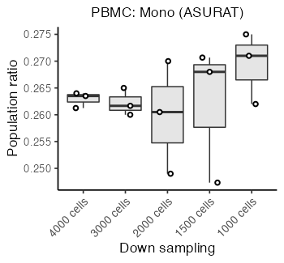
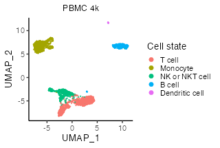
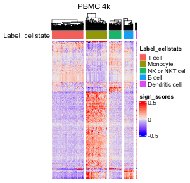
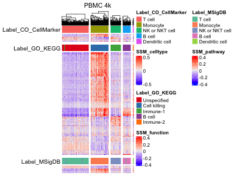

Several computations for PBMC datasets
================
Keita Iida
2022-06-30

-   [1 Computational environment](#1-computational-environment)
-   [2 Install libraries](#2-install-libraries)
-   [3 Introduction](#3-introduction)
-   [4 Compare population ratios among existing
    methods](#4-compare-population-ratios-among-existing-methods)
    -   [4.1 PBMC 4k](#41-pbmc-4k)
    -   [4.2 PBMC 6k](#42-pbmc-6k)
    -   [4.3 Reyes et al., 2020](#43-reyes-et-al-2020)
-   [5 Exhausting parameter search](#5-exhausting-parameter-search)
    -   [5.1 PBMC 4k](#51-pbmc-4k)
-   [6 Investigate the dependency of ASURAT on the number of
    cells](#6-investigate-the-dependency-of-asurat-on-the-number-of-cells)
    -   [6.1 PBMC 4k (try 1)](#61-pbmc-4k-try-1)
    -   [6.2 PBMC 4k (try 2)](#62-pbmc-4k-try-2)
    -   [6.3 PBMC 4k (try 3)](#63-pbmc-4k-try-3)
    -   [6.4 Investigate population ratios across different number of
        cells](#64-investigate-population-ratios-across-different-number-of-cells)
-   [7 Answers to referee’s comments](#7-answers-to-referees-comments)
    -   [7.1 Infer cell types using ASURAT by inputting
        MSigDB](#71-infer-cell-types-using-asurat-by-inputting-msigdb)
    -   [7.2 Infer cell types using ASURAT by inputting CO and
        CellMarker](#72-infer-cell-types-using-asurat-by-inputting-co-and-cellmarker)
    -   [7.3 Infer cell states using ASURAT by inputting GO and
        KEGG](#73-infer-cell-states-using-asurat-by-inputting-go-and-kegg)
    -   [7.4 Perform cell clustering using the combined
        SSM](#74-perform-cell-clustering-using-the-combined-ssm)
    -   [7.5 Perform cell clustering using the SSMs
        separately](#75-perform-cell-clustering-using-the-ssms-separately)

# 1 Computational environment

MacBook Pro (Big Sur, 16-inch, 2019), Processor (2.4 GHz 8-Core Intel
Core i9), Memory (64 GB 2667 MHz DDR4).

<br>

# 2 Install libraries

Attach necessary libraries:

``` r
library(ASURAT)
library(SingleCellExperiment)
library(SummarizedExperiment)
```

<br>

# 3 Introduction

In this vignette, we create figures for the computational results of
PBMC datasets.

<br>

# 4 Compare population ratios among existing methods

Population ratios inferred by the existing methods and ASURAT are
compared.

<br>

## 4.1 PBMC 4k

Load data.

``` r
pbmc_asurat <- readRDS("backup/04_006_pbmcs4k_annotation.rds")
pbmc_scran <- readRDS("backup/04_011_pbmc4k_scran.rds")
pbmc_seurat <- readRDS("backup/04_021_pbmc4k_seurat.rds")
pbmc_sccatch <- readRDS("backup/04_022_pbmc4k_seurat_sccatch.rds")
pbmc_monocle3 <- readRDS("backup/04_031_pbmc4k_monocle3.rds")
pbmc_sc3 <- readRDS("backup/04_041_pbmc4k_sc3.rds")

pbmcs <- list(scran = pbmc_scran, Seurat = pbmc_seurat, scCATCH = pbmc_sccatch,
              Monocle3 = pbmc_monocle3, SC3 = pbmc_sc3, ASURAT = pbmc_asurat$CB)
```

The hypothetical results can be obtained from Cao et al., Front. Genet.
(2020).

``` r
ct <- c("T", "Mono", "B", "NK/NKT", "Megakaryocyte", "DC", "Unspecified")
cr <- c(0.4226, 0.2707, 0.1509, 0.1546, 0.0012, 0, 0)
res <- data.frame(cell_type = ct, ratio = cr, method = "SCSA")
```

Prepare a data frame to be plotted.

``` r
cells <- c("B", "DC", "Megakaryocyte", "Mono", "NK/NKT", "T", "Unspecified")
for(i in seq_along(pbmcs)){
  if(class(pbmcs[[i]]) == "SingleCellExperiment"){
    df <- as.data.frame(colData(pbmcs[[i]]))
  }else if(class(pbmcs[[i]]) == "cell_data_set"){
    df <- as.data.frame(colData(pbmcs[[i]]))
  }else if(class(pbmcs[[i]]) == "Seurat"){
    df <- pbmcs[[i]][[]]
  }
  df <- dplyr::group_by(df, cell_type)
  df <- dplyr::summarise(df, ratio = dplyr::n())
  df$ratio <- as.numeric(df$ratio) / sum(as.numeric(df$ratio))
  df$method <- names(pbmcs)[i]
  for(k in seq_along(cells)){
    if(!(cells[k] %in% df$cell_type)){
      tmp <- data.frame(cell_type = cells[k], ratio = 0, method = names(pbmcs)[i])
      df <- rbind(df, tmp)
    }
  }
  res <- rbind(res, df)
}
```

Change the names of cell types.

``` r
res$cell_type[res$cell_type == "T"] <- "T cell"
res$cell_type[res$cell_type == "Mono"] <- "Monocyte"
res$cell_type[res$cell_type == "NK/NKT"] <- "NK or NKT cell"
res$cell_type[res$cell_type == "B"] <- "B cell"
res$cell_type[res$cell_type == "DC"] <- "Dendritic cell"
```

Show the population ratios.

``` r
res$method <- factor(res$method, levels = unique(res$method))
n_methods <- length(unique(res$method))
mycolors <- c("black", scales::brewer_pal(palette = "Set1")(n_methods))
mycolors[7] <- mycolors[6] ; mycolors[6] <- "#FFFF33"

ymax <- 0.55
p <- ggplot2::ggplot() +
  ggplot2::geom_bar(ggplot2::aes(x = res$cell_type, y = res$ratio,
                                 fill = as.factor(res$method)),
                    stat = "identity", width = 0.8,
                    position = ggplot2::position_dodge2(width = 1)) +
  ggplot2::theme_classic(base_size = 20, base_family = "Helvetica") +
  ggplot2::scale_x_discrete(guide = ggplot2::guide_axis(angle = 45)) +
  ggplot2::ylim(0, ymax) +
  ggplot2::labs(title = "PBMC 4k", x = "", y = "Population ratio", fill = "Method") +
  ggplot2::theme(plot.title = ggplot2::element_text(hjust = 0.5, size = 20),
                 legend.position = "right") +
  ggplot2::scale_fill_manual(values = mycolors)
filename <- "figures/figure_20_0010.png"
ggplot2::ggsave(file = filename, plot = p, dpi = 50, width = 11, height = 5)
```


<br>

## 4.2 PBMC 6k

Load data.

``` r
pbmc_scran <- readRDS("backup/05_011_pbmc6k_scran.rds")
pbmc_seurat <- readRDS("backup/05_021_pbmc6k_seurat.rds")
pbmc_sccatch <- readRDS("backup/05_022_pbmc6k_seurat_sccatch.rds")
pbmc_monocle3 <- readRDS("backup/05_031_pbmc6k_monocle3.rds")
pbmc_sc3 <- readRDS("backup/05_041_pbmc6k_sc3.rds")
pbmc_asurat <- readRDS("backup/05_006_pbmcs6k_annotation.rds")

pbmcs <- list(scran = pbmc_scran, Seurat = pbmc_seurat, scCATCH = pbmc_sccatch,
              Monocle3 = pbmc_monocle3, SC3 = pbmc_sc3, ASURAT = pbmc_asurat$CB)
```

The hypothetical results can be obtained from Cao et al., Front. Genet.
(2020).

``` r
ct <- c("T", "Mono", "B", "NK/NKT", "Megakaryocyte", "DC", "Unspecified")
cr <- c(0.4920, 0.2652, 0.1292, 0.1102, 0.0035, 0, 0)
res <- data.frame(cell_type = ct, ratio = cr, method = "SCSA")
```

Prepare a data frame to be plotted.

``` r
cells <- c("B", "DC", "Megakaryocyte", "Mono", "NK/NKT", "T", "Unspecified")
for(i in seq_along(pbmcs)){
  if(class(pbmcs[[i]]) == "SingleCellExperiment"){
    df <- as.data.frame(colData(pbmcs[[i]]))
  }else if(class(pbmcs[[i]]) == "cell_data_set"){
    df <- as.data.frame(colData(pbmcs[[i]]))
  }else if(class(pbmcs[[i]]) == "Seurat"){
    df <- pbmcs[[i]][[]]
  }
  df <- dplyr::group_by(df, cell_type)
  df <- dplyr::summarise(df, ratio = dplyr::n())
  df$ratio <- as.numeric(df$ratio) / sum(as.numeric(df$ratio))
  df$method <- names(pbmcs)[i]
  for(k in seq_along(cells)){
    if(!(cells[k] %in% df$cell_type)){
      tmp <- data.frame(cell_type = cells[k], ratio = 0, method = names(pbmcs)[i])
      df <- rbind(df, tmp)
    }
  }
  res <- rbind(res, df)
}
```

Change the names of cell types.

``` r
res$cell_type[res$cell_type == "T"] <- "T cell"
res$cell_type[res$cell_type == "Mono"] <- "Monocyte"
res$cell_type[res$cell_type == "NK/NKT"] <- "NK or NKT cell"
res$cell_type[res$cell_type == "B"] <- "B cell"
res$cell_type[res$cell_type == "DC"] <- "Dendritic cell"
```

Show the population ratios.

``` r
res$method <- factor(res$method, levels = unique(res$method))
n_methods <- length(unique(res$method))
mycolors <- c("black", scales::brewer_pal(palette = "Set1")(n_methods))
mycolors[7] <- mycolors[6] ; mycolors[6] <- "#FFFF33"

ymax <- 0.68
p <- ggplot2::ggplot() +
  ggplot2::geom_bar(ggplot2::aes(x = res$cell_type, y = res$ratio,
                                 fill = as.factor(res$method)),
                    stat = "identity", width = 0.8,
                    position = ggplot2::position_dodge2(width = 1)) +
  ggplot2::theme_classic(base_size = 20, base_family = "Helvetica") +
  ggplot2::scale_x_discrete(guide = ggplot2::guide_axis(angle = 45)) +
  ggplot2::ylim(0, ymax) +
  ggplot2::labs(title = "PBMC 6k", x = "", y = "Population ratio",
                fill = "Method") +
  ggplot2::theme(plot.title = ggplot2::element_text(hjust = 0.5, size = 20),
                 legend.position = "right") +
  ggplot2::scale_fill_manual(values = mycolors)
filename <- "figures/figure_20_0020.png"
ggplot2::ggsave(file = filename, plot = p, dpi = 50, width = 11, height = 5)
```


<br>

## 4.3 Reyes et al., 2020

Load data.

``` r
pbmc_scran <- readRDS("backup/06_011_pbmc130k_scran.rds")
pbmc_seurat <- readRDS("backup/06_021_pbmc130k_seurat.rds")
pbmc_sccatch <- readRDS("backup/06_022_pbmc130k_seurat_sccatch.rds")
pbmc_monocle3 <- readRDS("backup/06_031_pbmc130k_monocle3.rds")
#pbmc_sc3 <- readRDS("backup/06_041_pbmc130k_sc3.rds")
pbmc_asurat <- readRDS("backup/06_006_pbmcs130k_annotation.rds")

pbmcs <- list(scran = pbmc_scran, Seurat = pbmc_seurat, scCATCH = pbmc_sccatch,
              Monocle3 = pbmc_monocle3, ASURAT = pbmc_asurat$CB)
```

Load the sample information reported in previous paper (Reyes et al.,
2020).

``` r
info <- read.delim("rawdata/2020_001_Reyes/SCP548/metadata/scp_meta.txt")
info <- info[-1, ] ; rownames(info) <- info$NAME ; info <- info[, -1]
info[which(info$Cell_Type == "NK"), ]$Cell_Type <- "NK/NKT"
tmp <- dplyr::group_by(info, Cell_Type)
tmp <- dplyr::summarise(tmp, ratio = dplyr::n())
tmp$ratio <- as.numeric(tmp$ratio) / sum(as.numeric(tmp$ratio))
df <- data.frame(cell_type = tmp$Cell_Type, ratio = tmp$ratio, method = "Reyes_2020")
res <- rbind(df, c("Unspecified", 0, "Reyes_2020"))
```

Prepare a data frame to be plotted.

``` r
cells <- c("B", "DC", "Megakaryocyte", "Mono", "NK/NKT", "T", "Unspecified")
for(i in seq_along(pbmcs)){
  if(class(pbmcs[[i]]) == "SingleCellExperiment"){
    df <- as.data.frame(colData(pbmcs[[i]]))
  }else if(class(pbmcs[[i]]) == "cell_data_set"){
    df <- as.data.frame(colData(pbmcs[[i]]))
  }else if(class(pbmcs[[i]]) == "Seurat"){
    df <- pbmcs[[i]][[]]
  }
  df <- dplyr::group_by(df, cell_type)
  df <- dplyr::summarise(df, ratio = dplyr::n())
  df$ratio <- as.numeric(df$ratio) / sum(as.numeric(df$ratio))
  df$method <- names(pbmcs)[i]
  for(k in seq_along(cells)){
    if(!(cells[k] %in% df$cell_type)){
      tmp <- data.frame(cell_type = cells[k], ratio = 0, method = names(pbmcs)[i])
      df <- rbind(df, tmp)
    }
  }
  res <- rbind(res, df)
}
res$ratio <- as.numeric(res$ratio)
```

Change the names of cell types.

``` r
res$cell_type[res$cell_type == "T"] <- "T cell"
res$cell_type[res$cell_type == "Mono"] <- "Monocyte"
res$cell_type[res$cell_type == "NK/NKT"] <- "NK or NKT cell"
res$cell_type[res$cell_type == "B"] <- "B cell"
res$cell_type[res$cell_type == "DC"] <- "Dendritic cell"
```

Show the population ratios.

``` r
res$method <- factor(res$method, levels = unique(res$method))
n_methods <- length(unique(res$method))
mycolors <- c("black", scales::brewer_pal(palette = "Set1")(n_methods + 1))
mycolors[7] <- mycolors[6]

ymax <- 0.65
p <- ggplot2::ggplot() +
  ggplot2::geom_bar(ggplot2::aes(x = res$cell_type, y = res$ratio,
                                 fill = as.factor(res$method)),
                    stat = "identity", width = 0.8,
                    position = ggplot2::position_dodge2(width = 1)) +
  ggplot2::theme_classic(base_size = 20, base_family = "Helvetica") +
  ggplot2::scale_x_discrete(guide = ggplot2::guide_axis(angle = 45)) +
  ggplot2::ylim(0, ymax) +
  ggplot2::labs(title = "Reyes 2020", x = "", y = "Population ratio",
                fill = "Method") +
  ggplot2::theme(plot.title = ggplot2::element_text(hjust = 0.5, size = 20),
                 legend.position = "right") +
  ggplot2::scale_fill_manual(values = mycolors)
filename <- "figures/figure_20_0030.png"
ggplot2::ggsave(file = filename, plot = p, dpi = 50, width = 11, height = 5)
```


<br>

# 5 Exhausting parameter search

ASURAT includes multiple parameters for creating signs, such as

-   `min_ngenes` and `max_ngenes` in `remove_signs()`
-   `th_posi` and `th_nega` in `cluster_genesets()`
-   `min_cnt_strg` and `min_cnt_vari` in `create_signs()`
-   `threshold` and `keep_rareID` in `remove_signs_redundant()` (only
    for ontology databases)
-   `keywords` in `remove_signs_manually()`

However, the most crucial parameters for sample (cell) clustering are
`th_posi` and `th_nega`, as well as `min_cnt_strg` and `min_cnt_vari` in
some cases.

Here, an exhaustive parameter searching is demonstrated for PBMC 4k
dataset. This is time-consuming but helpful for obtaining interpretable
results.

<br>

## 5.1 PBMC 4k

load data.

``` r
pbmc <- readRDS("backup/04_003_pbmc4k_normalized.rds")
cormat <- readRDS("backup/04_003_pbmc4k_cormat.rds")
```

Load databases.

``` r
urlpath <- "https://github.com/keita-iida/ASURATDB/blob/main/genes2bioterm/"
load(url(paste0(urlpath, "20201213_human_CO.rda?raw=TRUE")))         # CO
load(url(paste0(urlpath, "20220308_human_MSigDB.rda?raw=TRUE")))     # MSigDB
load(url(paste0(urlpath, "20220308_human_CellMarker.rda?raw=TRUE"))) # CellMarker
```

Create a custom-built cell type-related databases by combining different
databases for analyzing human single-cell transcriptome data.

``` r
d <- list(human_CO[["cell"]], human_MSigDB[["cell"]], human_CellMarker[["cell"]])
human_CB <- list(cell = do.call("rbind", d))
```

Add formatted databases to `metadata(sce)$sign`.

``` r
pbmcs <- list(CB = pbmc)
metadata(pbmcs$CB) <- list(sign = human_CB[["cell"]])
```

Remove biological terms including too few or too many genes.

``` r
pbmcs$CB <- remove_signs(sce = pbmcs$CB, min_ngenes = 2, max_ngenes = 1000)
```

Perform an exhausting parameter search.

``` r
dirname <- "figures_pbmc4k_cell"
dir.create(dirname)
th_posi <- seq(0.20, 0.40, length = 3)
th_nega <- -seq(0.20, 0.40, length = 3)

cnt <- 1
for(i in seq_along(th_posi)){
  for(j in seq_along(th_nega)){
    # Create signs and sign-by-sample matrices.
    set.seed(1)
    sce <- cluster_genesets(sce = pbmcs$CB, cormat = cormat,
                            th_posi = th_posi[i], th_nega = th_nega[j])
    sce <- create_signs(sce = sce, min_cnt_strg = 4, min_cnt_vari = 4)
#    simmat <- human_GO$similarity_matrix$BP
#    sce <- remove_signs_redundant(sce = sce, similarity_matrix = simmat,
#                                  threshold = 0.85, keep_rareID = TRUE)
#    keywords <- "Covid|COVID"
#    sce <- remove_signs_manually(sce = sce, keywords = keywords)
    sce <- makeSignMatrix(sce = sce, weight_strg = 0.5, weight_vari = 0.5)
    # Cluster cells.
    surt <- Seurat::as.Seurat(sce, counts = "counts", data = "counts")
    mat <- as.matrix(assay(sce, "counts"))
    surt[["SSM"]] <- Seurat::CreateAssayObject(counts = mat)
    Seurat::DefaultAssay(surt) <- "SSM"
    surt <- Seurat::ScaleData(surt, features = rownames(surt))
    surt <- Seurat::RunPCA(surt, features = rownames(surt))
    surt <- Seurat::FindNeighbors(surt, reduction = "pca", dims = seq_len(30))
    surt <- Seurat::FindClusters(surt, resolution = 0.11)
    temp <- Seurat::as.SingleCellExperiment(surt)
    labels <- colData(temp)$seurat_clusters
    # Reduce dimension.
    set.seed(1)
    mat <- t(as.matrix(assay(sce, "counts")))
    res <- umap::umap(mat, n_components = 2)
    df <- as.data.frame(res[["layout"]])
    t1 = paste("alpha = ", format(th_posi[i], nsmall = 2), sep = "")
    t2 = paste("beta = ", format(th_nega[j], nsmall = 2), sep = "")    
    p <- ggplot2::ggplot() +
      ggplot2::geom_point(ggplot2::aes(x = df[, 1], y = df[, 2], color = labels),
                          size = 0.5) +
      ggplot2::labs(title = "PBMC 4k", x = "UMAP_1", y = "UMAP_2") +
#      ggplot2::annotate("text", x = -Inf, y = Inf, label = t1, hjust = -0.16,
#                        vjust = 1.5, size = 4, colour = "red") +
#      ggplot2::annotate("text", x = -Inf, y = Inf, label = t2, hjust = -0.17,
#                        vjust = 3.2, size = 4, colour = "red") +
      ggplot2::theme_classic(base_size = 18) +
      ggplot2::guides(colour = ggplot2::guide_legend(override.aes = list(size = 4)))
    filename <- paste0(dirname, "/", sprintf("figure_04_%04d.png", cnt))
    ggplot2::ggsave(file = filename, plot = p, dpi = 50, width = 4.8, height = 4)
    cnt <- cnt + 1
  }
}
```


<br>

# 6 Investigate the dependency of ASURAT on the number of cells

To investigate the dependency of ASURAT on the number of cells,
benchmark ASURAT performance by randomly downsampling cells.

<br>

## 6.1 PBMC 4k (try 1)

### 6.1.1 Load data

load data.

``` r
pbmc <- readRDS("backup/04_003_pbmc4k_normalized.rds")
```

Load databases.

``` r
urlpath <- "https://github.com/keita-iida/ASURATDB/blob/main/genes2bioterm/"
load(url(paste0(urlpath, "20201213_human_CO.rda?raw=TRUE")))         # CO
load(url(paste0(urlpath, "20220308_human_MSigDB.rda?raw=TRUE")))     # MSigDB
load(url(paste0(urlpath, "20220308_human_CellMarker.rda?raw=TRUE"))) # CellMarker
```

Create a custom-built cell type-related databases by combining different
databases for analyzing human single-cell transcriptome data.

``` r
d <- list(human_CO[["cell"]], human_MSigDB[["cell"]], human_CellMarker[["cell"]])
human_CB <- list(cell = do.call("rbind", d))
```

<br>

### 6.1.2 Random downsampling (4000 cells)

Perform random sampling of 4000 cells.

``` r
set.seed(1)
inds <- sample(dim(pbmc)[2], 4000, prob = NULL, replace = FALSE)
subpbmc <- pbmc[, inds]
```

Compute a correlation matrix.

``` r
mat <- t(as.matrix(assay(subpbmc, "centered")))
cormat <- cor(mat, method = "spearman")
```

<br>

#### 6.1.2.1 ASURAT

Run ASURAT protocols.

``` r
# Add formatted databases.
sce <- list(CB = subpbmc)
metadata(sce$CB) <- list(sign = human_CB[["cell"]])
# Remove biological terms including too few or too many genes.
sce$CB <- remove_signs(sce = sce$CB, min_ngenes = 2, max_ngenes = 1000)
# Create signs and sign-by-sample matrices.
set.seed(1)
sce$CB <- cluster_genesets(sce = sce$CB, cormat = cormat,
                           th_posi = 0.2, th_nega = -0.4)
sce$CB <- create_signs(sce = sce$CB, min_cnt_strg = 4, min_cnt_vari = 4)
sce$CB <- makeSignMatrix(sce = sce$CB, weight_strg = 0.5, weight_vari = 0.5)
# Perform dimensional reduction.
set.seed(1)
mat <- t(as.matrix(assay(sce$CB, "counts")))
res <- Rtsne::Rtsne(mat, dim = 2, pca = TRUE, initial_dims = 50)
reducedDim(sce$CB, "TSNE") <- res[["Y"]]
# Perform unsupervised clustering of cells.
surt <- Seurat::as.Seurat(sce$CB, counts = "counts", data = "counts")
mat <- as.matrix(assay(sce$CB, "counts"))
surt[["SSM"]] <- Seurat::CreateAssayObject(counts = mat)
Seurat::DefaultAssay(surt) <- "SSM"
surt <- Seurat::ScaleData(surt, features = rownames(surt))
surt <- Seurat::RunPCA(surt, features = rownames(surt))
surt <- Seurat::FindNeighbors(surt, reduction = "pca", dims = seq_len(40))
surt <- Seurat::FindClusters(surt, resolution = 0.15)
temp <- Seurat::as.SingleCellExperiment(surt)
colData(sce$CB)$seurat_clusters <- colData(temp)$seurat_clusters
# Show the clustering results in low-dimensional spaces.
labels <- colData(sce$CB)$seurat_clusters
df <- as.data.frame(reducedDim(sce$CB, "TSNE"))
p <- ggplot2::ggplot() +
  ggplot2::geom_point(ggplot2::aes(x = df[, 1], y = df[, 2], color = labels),
                      size = 1, alpha = 1) +
  ggplot2::labs(title = "PBMC 4000 cells (cell type)", x = "tSNE_1", y = "tSNE_2",
                color = "") +
  ggplot2::theme_classic(base_size = 20) + ggplot2::scale_colour_hue() +
  ggplot2::theme(plot.title = ggplot2::element_text(hjust = 0.5, size = 18)) +
  ggplot2::guides(colour = ggplot2::guide_legend(override.aes = list(size = 4)))
filename <- "figures/figure_20_0100.png"
ggplot2::ggsave(file = filename, plot = p, dpi = 50, width = 5.1, height = 4.3)
# Investigate significant signs.
set.seed(1)
labels <- colData(sce$CB)$seurat_clusters
sce$CB <- compute_sepI_all(sce = sce$CB, labels = labels, nrand_samples = NULL)
# Investigate significant genes.
set.seed(1)
surt <- Seurat::as.Seurat(sce$CB, counts = "counts", data = "counts")
mat <- as.matrix(assay(altExp(sce$CB), "counts"))
surt[["GEM"]] <- Seurat::CreateAssayObject(counts = mat)
Seurat::DefaultAssay(surt) <- "GEM"
surt <- Seurat::SetIdent(surt, value = "seurat_clusters")
res <- Seurat::FindAllMarkers(surt, only.pos = TRUE,
                              min.pct = 0.25, logfc.threshold = 0.25)
metadata(sce$CB)$marker_genes$all <- res
View(metadata(sce$CB)$marker_signs$all)
View(metadata(sce$CB)$marker_genes$all)
# Infer cell types.
# 0: T cell          # TRAC (p_val_adj ~0), EEF1A1 (p_val_adj ~0)
# 1: Monocyte        # MSigDBID:13-S (...KUPFFER_CELLS_3) (sepI ~0.99)
# 2: NK/NKT          # MSigDBID:1-V (...NK_NKT_CELLS_1) (sepI ~0.99)
# 3: B cell          # MSigDBID:23-V (...B_CELLS) (sepI ~0.94)
# 4: Dendritic cell  # CellMarkerID:72-S (Dendritic cell) (sepI ~0.98)
colData(sce$CB)$cell_type <- as.character(colData(sce$CB)$seurat_clusters)
colData(sce$CB)$cell_type[colData(sce$CB)$cell_type == 0] <- "T"
colData(sce$CB)$cell_type[colData(sce$CB)$cell_type == 1] <- "Mono"
colData(sce$CB)$cell_type[colData(sce$CB)$cell_type == 2] <- "NK/NKT"
colData(sce$CB)$cell_type[colData(sce$CB)$cell_type == 3] <- "B"
colData(sce$CB)$cell_type[colData(sce$CB)$cell_type == 4] <- "DC"
# Save data.
saveRDS(sce, file = "backup/20_001_pbmc4000_asurat.rds")
# Load data.
sce <- readRDS("backup/20_001_pbmc4000_asurat.rds")
```


<br>

#### 6.1.2.2 Seurat

Run Seurat protocols.

``` r
# Create Seurat objects.
surt <- Seurat::CreateSeuratObject(counts = as.matrix(assay(subpbmc, "counts")),
                                   project = "PBMC")
# Normalization
surt <- Seurat::NormalizeData(surt, normalization.method = "LogNormalize")
# Variance stabilizing transform
n <- round(0.9 * ncol(surt))
surt <- Seurat::FindVariableFeatures(surt, selection.method = "vst", nfeatures = n)
# Scale data
surt <- Seurat::ScaleData(surt)
# Principal component analysis
surt <- Seurat::RunPCA(surt, features = Seurat::VariableFeatures(surt))
# Create k-nearest neighbor graph.
surt <- Seurat::FindNeighbors(surt, reduction = "pca", dim = seq_len(40))
# Cluster cells.
surt <- Seurat::FindClusters(surt, resolution = 0.05)
# Run t-SNE.
surt <- Seurat::RunTSNE(surt, dims.use = seq_len(2), reduction = "pca",
                        dims = seq_len(pc), do.fast = FALSE, perplexity = 30)
# Show the clustering results.
title <- "PBMC 4000 cells (Seurat)"
labels <- surt@meta.data[["seurat_clusters"]]
df <- surt@reductions[["tsne"]]@cell.embeddings
p <- ggplot2::ggplot() +
  ggplot2::geom_point(ggplot2::aes(x = df[, 1], y = df[, 2], color = labels),
                      size = 1, alpha = 1) +
  ggplot2::labs(title = title, x = "tSNE_1", y = "tSNE_2", color = "") +
  ggplot2::theme_classic(base_size = 20) +
  ggplot2::theme(plot.title = ggplot2::element_text(hjust = 0.5, size = 18)) +
  ggplot2::scale_colour_hue() +
  ggplot2::guides(colour = ggplot2::guide_legend(override.aes = list(size = 4)))
filename <- "figures/figure_20_0105.png"
ggplot2::ggsave(file = filename, plot = p, dpi = 50, width = 5.1, height = 4.3)
# Find differentially expressed genes.
surt@misc$stat <- Seurat::FindAllMarkers(surt, only.pos = TRUE, min.pct = 0.25,
                                         logfc.threshold = 0.25)
View(surt@misc$stat[which(surt@misc$stat$p_val_adj < 10^(-100)), ])
# Infer cell types
# 0: T cell          # TRAC (p_val_adj ~0), EEF1A1 (p_val_adj ~0)
# 1: Monocyte        # S100A8 (p_val_adj ~0), S100A9 (p_val_adj ~0)
# 2: NK/NKT          # NKG7 (p_val_adj ~0), GZMA (p_val_adj ~0)
# 3: B cell          # CD79A (p_val_adj ~0), CD79B (p_val_adj ~0)
# 4: Dendritic cell  # LILRA4 (p_val_adj ~e-271), LILRB4 (p_val_adj ~e-116)
tmp <- as.integer(as.character(surt@meta.data[["seurat_clusters"]]))
surt@meta.data[["cell_type"]] <- tmp
surt@meta.data[["cell_type"]][surt@meta.data[["cell_type"]] == 0] <- "T"
surt@meta.data[["cell_type"]][surt@meta.data[["cell_type"]] == 1] <- "Mono"
surt@meta.data[["cell_type"]][surt@meta.data[["cell_type"]] == 2] <- "NK/NKT"
surt@meta.data[["cell_type"]][surt@meta.data[["cell_type"]] == 3] <- "B"
surt@meta.data[["cell_type"]][surt@meta.data[["cell_type"]] == 4] <- "DC"
# Save data.
saveRDS(surt, file = "backup/20_001_pbmc4000_seurat.rds")
# Load data.
surt <- readRDS("backup/20_001_pbmc4000_seurat.rds")
```


<br>

### 6.1.3 Random downsampling (3000 cells)

Perform random sampling of 3000 cells.

``` r
set.seed(1)
inds <- sample(dim(pbmc)[2], 3000, prob = NULL, replace = FALSE)
subpbmc <- pbmc[, inds]
```

Compute a correlation matrix.

``` r
mat <- t(as.matrix(assay(subpbmc, "centered")))
cormat <- cor(mat, method = "spearman")
```

<br>

#### 6.1.3.1 ASURAT

Run ASURAT protocols.

``` r
# Add formatted databases.
sce <- list(CB = subpbmc)
metadata(sce$CB) <- list(sign = human_CB[["cell"]])
# Remove biological terms including too few or too many genes.
sce$CB <- remove_signs(sce = sce$CB, min_ngenes = 2, max_ngenes = 1000)
# Create signs and sign-by-sample matrices.
set.seed(1)
sce$CB <- cluster_genesets(sce = sce$CB, cormat = cormat,
                           th_posi = 0.2, th_nega = -0.4)
sce$CB <- create_signs(sce = sce$CB, min_cnt_strg = 4, min_cnt_vari = 4)
sce$CB <- makeSignMatrix(sce = sce$CB, weight_strg = 0.5, weight_vari = 0.5)
# Perform dimensional reduction.
set.seed(1)
mat <- t(as.matrix(assay(sce$CB, "counts")))
res <- Rtsne::Rtsne(mat, dim = 2, pca = TRUE, initial_dims = 50)
reducedDim(sce$CB, "TSNE") <- res[["Y"]]
# Perform unsupervised clustering of cells.
surt <- Seurat::as.Seurat(sce$CB, counts = "counts", data = "counts")
mat <- as.matrix(assay(sce$CB, "counts"))
surt[["SSM"]] <- Seurat::CreateAssayObject(counts = mat)
Seurat::DefaultAssay(surt) <- "SSM"
surt <- Seurat::ScaleData(surt, features = rownames(surt))
surt <- Seurat::RunPCA(surt, features = rownames(surt))
surt <- Seurat::FindNeighbors(surt, reduction = "pca", dims = seq_len(40))
surt <- Seurat::FindClusters(surt, resolution = 0.10)
temp <- Seurat::as.SingleCellExperiment(surt)
colData(sce$CB)$seurat_clusters <- colData(temp)$seurat_clusters
# Show the clustering results in t-SNE spaces.
labels <- colData(sce$CB)$seurat_clusters
df <- as.data.frame(reducedDim(sce$CB, "TSNE"))
p <- ggplot2::ggplot() +
  ggplot2::geom_point(ggplot2::aes(x = df[, 1], y = df[, 2], color = labels),
                      size = 1, alpha = 1) +
  ggplot2::labs(title = "PBMC 3000 cells (cell type)", x = "tSNE_1", y = "tSNE_2",
                color = "") +
  ggplot2::theme_classic(base_size = 20) + ggplot2::scale_colour_hue() +
  ggplot2::theme(plot.title = ggplot2::element_text(hjust = 0.5, size = 18)) +
  ggplot2::guides(colour = ggplot2::guide_legend(override.aes = list(size = 4)))
filename <- "figures/figure_20_0110.png"
ggplot2::ggsave(file = filename, plot = p, dpi = 50, width = 5.1, height = 4.3)
# Investigate significant signs.
set.seed(1)
labels <- colData(sce$CB)$seurat_clusters
sce$CB <- compute_sepI_all(sce = sce$CB, labels = labels, nrand_samples = NULL)
# Investigate significant genes.
set.seed(1)
surt <- Seurat::as.Seurat(sce$CB, counts = "counts", data = "counts")
mat <- as.matrix(assay(altExp(sce$CB), "counts"))
surt[["GEM"]] <- Seurat::CreateAssayObject(counts = mat)
Seurat::DefaultAssay(surt) <- "GEM"
surt <- Seurat::SetIdent(surt, value = "seurat_clusters")
res <- Seurat::FindAllMarkers(surt, only.pos = TRUE,
                              min.pct = 0.25, logfc.threshold = 0.25)
metadata(sce$CB)$marker_genes$all <- res
View(metadata(sce$CB)$marker_signs$all)
View(metadata(sce$CB)$marker_genes$all)
# Infer cell types.
# 0: T cell          # EEF1A1 (p_val_adj ~e-259), TRAC (p_val_adj ~e-243)
# 1: Monocyte        # MSigDBID:13-S (...KUPFFER_CELLS_3) (sepI ~0.99)
# 2: NK/NKT          # MSigDBID:1-V (...NK_NKT_CELLS_1) (sepI ~0.99)
# 3: B cell          # MSigDBID:23-V (...B_CELLS) (sepI ~0.94)
# 4: Dendritic cell  # CellMarkerID:72-S (Dendritic cell) (sepI ~0.98)
colData(sce$CB)$cell_type <- as.character(colData(sce$CB)$seurat_clusters)
colData(sce$CB)$cell_type[colData(sce$CB)$cell_type == 0] <- "T"
colData(sce$CB)$cell_type[colData(sce$CB)$cell_type == 1] <- "Mono"
colData(sce$CB)$cell_type[colData(sce$CB)$cell_type == 2] <- "NK/NKT"
colData(sce$CB)$cell_type[colData(sce$CB)$cell_type == 3] <- "B"
colData(sce$CB)$cell_type[colData(sce$CB)$cell_type == 4] <- "DC"
# Save data.
saveRDS(sce, file = "backup/20_002_pbmc3000_asurat.rds")
# Load data.
sce <- readRDS("backup/20_002_pbmc3000_asurat.rds")
```


<br>

#### 6.1.3.2 Seurat

Run Seurat protocols.

``` r
# Create Seurat objects.
surt <- Seurat::CreateSeuratObject(counts = as.matrix(assay(subpbmc, "counts")),
                                   project = "PBMC")
# Normalization
surt <- Seurat::NormalizeData(surt, normalization.method = "LogNormalize")
# Variance stabilizing transform
n <- round(0.9 * ncol(surt))
surt <- Seurat::FindVariableFeatures(surt, selection.method = "vst", nfeatures = n)
# Scale data
surt <- Seurat::ScaleData(surt)
# Principal component analysis
surt <- Seurat::RunPCA(surt, features = Seurat::VariableFeatures(surt))
# Create k-nearest neighbor graph.
surt <- Seurat::FindNeighbors(surt, reduction = "pca", dim = seq_len(40))
# Cluster cells.
surt <- Seurat::FindClusters(surt, resolution = 0.05)
# Run t-SNE.
surt <- Seurat::RunTSNE(surt, dims.use = seq_len(2), reduction = "pca",
                        dims = seq_len(pc), do.fast = FALSE, perplexity = 30)
# Show the clustering results.
title <- "PBMC 3000 cells (Seurat)"
labels <- surt@meta.data[["seurat_clusters"]]
df <- surt@reductions[["tsne"]]@cell.embeddings
p <- ggplot2::ggplot() +
  ggplot2::geom_point(ggplot2::aes(x = df[, 1], y = df[, 2], color = labels),
                      size = 1, alpha = 1) +
  ggplot2::labs(title = title, x = "tSNE_1", y = "tSNE_2", color = "") +
  ggplot2::theme_classic(base_size = 20) +
  ggplot2::theme(plot.title = ggplot2::element_text(hjust = 0.5, size = 18)) +
  ggplot2::scale_colour_hue() +
  ggplot2::guides(colour = ggplot2::guide_legend(override.aes = list(size = 4)))
filename <- "figures/figure_20_0115.png"
ggplot2::ggsave(file = filename, plot = p, dpi = 50, width = 5.1, height = 4.3)
# Find differentially expressed genes.
surt@misc$stat <- Seurat::FindAllMarkers(surt, only.pos = TRUE, min.pct = 0.25,
                                         logfc.threshold = 0.25)
View(surt@misc$stat[which(surt@misc$stat$p_val_adj < 10^(-100)), ])
# Infer cell types
# 0: T cell          # TRAC (p_val_adj ~e-270), EEF1A1 (p_val_adj ~e-239)
# 1: Monocyte        # S100A8 (p_val_adj ~0), S100A9 (p_val_adj ~0)
# 2: NK/NKT          # NKG7 (p_val_adj ~0), GZMA (p_val_adj ~0)
# 3: B cell          # CD79A (p_val_adj ~0), CD79B (p_val_adj ~0)
# 4: Dendritic cell  # LILRA4 (p_val_adj ~e-204), LILRB4 (p_val_adj ~e-102)
tmp <- as.integer(as.character(surt@meta.data[["seurat_clusters"]]))
surt@meta.data[["cell_type"]] <- tmp
surt@meta.data[["cell_type"]][surt@meta.data[["cell_type"]] == 0] <- "T"
surt@meta.data[["cell_type"]][surt@meta.data[["cell_type"]] == 1] <- "Mono"
surt@meta.data[["cell_type"]][surt@meta.data[["cell_type"]] == 2] <- "NK/NKT"
surt@meta.data[["cell_type"]][surt@meta.data[["cell_type"]] == 3] <- "B"
surt@meta.data[["cell_type"]][surt@meta.data[["cell_type"]] == 4] <- "DC"
# Save data.
saveRDS(surt, file = "backup/20_002_pbmc3000_seurat.rds")
# Load data.
surt <- readRDS("backup/20_002_pbmc3000_seurat.rds")
```


<br>

### 6.1.4 Random downsampling (2000 cells)

Perform random sampling of 2000 cells.

``` r
set.seed(1)
inds <- sample(dim(pbmc)[2], 2000, prob = NULL, replace = FALSE)
subpbmc <- pbmc[, inds]
```

Compute a correlation matrix.

``` r
mat <- t(as.matrix(assay(subpbmc, "centered")))
cormat <- cor(mat, method = "spearman")
```

<br>

#### 6.1.4.1 ASURAT

Run ASURAT protocols.

``` r
# Add formatted databases.
sce <- list(CB = subpbmc)
metadata(sce$CB) <- list(sign = human_CB[["cell"]])
# Remove biological terms including too few or too many genes.
sce$CB <- remove_signs(sce = sce$CB, min_ngenes = 2, max_ngenes = 1000)
# Create signs and sign-by-sample matrices.
set.seed(1)
sce$CB <- cluster_genesets(sce = sce$CB, cormat = cormat,
                           th_posi = 0.2, th_nega = -0.4)
sce$CB <- create_signs(sce = sce$CB, min_cnt_strg = 4, min_cnt_vari = 4)
sce$CB <- makeSignMatrix(sce = sce$CB, weight_strg = 0.5, weight_vari = 0.5)
# Perform dimensional reduction.
set.seed(1)
mat <- t(as.matrix(assay(sce$CB, "counts")))
res <- Rtsne::Rtsne(mat, dim = 2, pca = TRUE, initial_dims = 50)
reducedDim(sce$CB, "TSNE") <- res[["Y"]]
# Perform unsupervised clustering of cells.
surt <- Seurat::as.Seurat(sce$CB, counts = "counts", data = "counts")
mat <- as.matrix(assay(sce$CB, "counts"))
surt[["SSM"]] <- Seurat::CreateAssayObject(counts = mat)
Seurat::DefaultAssay(surt) <- "SSM"
surt <- Seurat::ScaleData(surt, features = rownames(surt))
surt <- Seurat::RunPCA(surt, features = rownames(surt))
surt <- Seurat::FindNeighbors(surt, reduction = "pca", dims = seq_len(10))
surt <- Seurat::FindClusters(surt, resolution = 0.13)
temp <- Seurat::as.SingleCellExperiment(surt)
colData(sce$CB)$seurat_clusters <- colData(temp)$seurat_clusters
# Show the clustering results in t-SNE spaces.
labels <- colData(sce$CB)$seurat_clusters
df <- as.data.frame(reducedDim(sce$CB, "TSNE"))
p <- ggplot2::ggplot() +
  ggplot2::geom_point(ggplot2::aes(x = df[, 1], y = df[, 2], color = labels),
                      size = 1, alpha = 1) +
  ggplot2::labs(title = "PBMC 2000 cells (cell type)", x = "tSNE_1", y = "tSNE_2",
                color = "") +
  ggplot2::theme_classic(base_size = 20) + ggplot2::scale_colour_hue() +
  ggplot2::theme(plot.title = ggplot2::element_text(hjust = 0.5, size = 18)) +
  ggplot2::guides(colour = ggplot2::guide_legend(override.aes = list(size = 4)))
filename <- "figures/figure_20_0120.png"
ggplot2::ggsave(file = filename, plot = p, dpi = 50, width = 5.1, height = 4.3)
# Investigate significant signs.
set.seed(1)
labels <- colData(sce$CB)$seurat_clusters
sce$CB <- compute_sepI_all(sce = sce$CB, labels = labels, nrand_samples = NULL)
# Investigate significant genes.
set.seed(1)
surt <- Seurat::as.Seurat(sce$CB, counts = "counts", data = "counts")
mat <- as.matrix(assay(altExp(sce$CB), "counts"))
surt[["GEM"]] <- Seurat::CreateAssayObject(counts = mat)
Seurat::DefaultAssay(surt) <- "GEM"
surt <- Seurat::SetIdent(surt, value = "seurat_clusters")
res <- Seurat::FindAllMarkers(surt, only.pos = TRUE,
                              min.pct = 0.25, logfc.threshold = 0.25)
metadata(sce$CB)$marker_genes$all <- res
View(metadata(sce$CB)$marker_signs$all)
View(metadata(sce$CB)$marker_genes$all)
# Infer cell types.
# 0: T cell          # EEF1A1 (p_val_adj ~e-178), TRAC (p_val_adj ~e-156)
# 1: Monocyte        # MSigDBID:13-S (...KUPFFER_CELLS_3) (sepI ~0.99)
# 2: NK/NKT          # MSigDBID:1-V (...NK_NKT_CELLS_1) (sepI ~0.97)
# 3: B cell          # MSigDBID:23-V (...B_CELLS) (sepI ~0.94)
# 4: Dendritic cell  # CellMarkerID:72-S (Dendritic cell) (sepI ~0.98)
colData(sce$CB)$cell_type <- as.character(colData(sce$CB)$seurat_clusters)
colData(sce$CB)$cell_type[colData(sce$CB)$cell_type == 0] <- "T"
colData(sce$CB)$cell_type[colData(sce$CB)$cell_type == 1] <- "Mono"
colData(sce$CB)$cell_type[colData(sce$CB)$cell_type == 2] <- "NK/NKT"
colData(sce$CB)$cell_type[colData(sce$CB)$cell_type == 3] <- "B"
colData(sce$CB)$cell_type[colData(sce$CB)$cell_type == 4] <- "DC"
# Save data.
saveRDS(sce, file = "backup/20_003_pbmc2000_asurat.rds")
# Load data.
sce <- readRDS("backup/20_003_pbmc2000_asurat.rds")
```


<br>

#### 6.1.4.2 Seurat

Run Seurat protocols.

``` r
# Create Seurat objects.
surt <- Seurat::CreateSeuratObject(counts = as.matrix(assay(subpbmc, "counts")),
                                   project = "PBMC")
# Normalization
surt <- Seurat::NormalizeData(surt, normalization.method = "LogNormalize")
# Variance stabilizing transform
n <- round(0.9 * ncol(surt))
surt <- Seurat::FindVariableFeatures(surt, selection.method = "vst", nfeatures = n)
# Scale data
surt <- Seurat::ScaleData(surt)
# Principal component analysis
surt <- Seurat::RunPCA(surt, features = Seurat::VariableFeatures(surt))
# Create k-nearest neighbor graph.
surt <- Seurat::FindNeighbors(surt, reduction = "pca", dim = seq_len(10))
# Cluster cells.
surt <- Seurat::FindClusters(surt, resolution = 0.06)
# Run t-SNE.
surt <- Seurat::RunTSNE(surt, dims.use = seq_len(2), reduction = "pca",
                        dims = seq_len(pc), do.fast = FALSE, perplexity = 30)
# Show the clustering results.
title <- "PBMC 2000 cells (Seurat)"
labels <- surt@meta.data[["seurat_clusters"]]
df <- surt@reductions[["tsne"]]@cell.embeddings
p <- ggplot2::ggplot() +
  ggplot2::geom_point(ggplot2::aes(x = df[, 1], y = df[, 2], color = labels),
                      size = 1, alpha = 1) +
  ggplot2::labs(title = title, x = "tSNE_1", y = "tSNE_2", color = "") +
  ggplot2::theme_classic(base_size = 20) +
  ggplot2::theme(plot.title = ggplot2::element_text(hjust = 0.5, size = 18)) +
  ggplot2::scale_colour_hue() +
  ggplot2::guides(colour = ggplot2::guide_legend(override.aes = list(size = 4)))
filename <- "figures/figure_20_0125.png"
ggplot2::ggsave(file = filename, plot = p, dpi = 50, width = 5.1, height = 4.3)
# Find differentially expressed genes.
surt@misc$stat <- Seurat::FindAllMarkers(surt, only.pos = TRUE, min.pct = 0.25,
                                         logfc.threshold = 0.25)
View(surt@misc$stat[which(surt@misc$stat$p_val_adj < 10^(-100)), ])
# Infer cell types
# 0: T cell          # TRAC (p_val_adj ~e-177), EEF1A1 (p_val_adj ~e-158)
# 1: Monocyte        # FCN1 (p_val_adj ~0), MNDA (p_val_adj ~0)
# 2: NK/NKT          # GZMA (p_val_adj ~e-238), NKG7 (p_val_adj ~e-220)
# 3: B cell          # CD79A (p_val_adj ~e-302), MS4A1 (p_val_adj ~e-300)
# 4: Dendritic cell? # LILRA4 (p_val_adj ~e-129)
tmp <- as.integer(as.character(surt@meta.data[["seurat_clusters"]]))
surt@meta.data[["cell_type"]] <- tmp
surt@meta.data[["cell_type"]][surt@meta.data[["cell_type"]] == 0] <- "T"
surt@meta.data[["cell_type"]][surt@meta.data[["cell_type"]] == 1] <- "Mono"
surt@meta.data[["cell_type"]][surt@meta.data[["cell_type"]] == 2] <- "NK/NKT"
surt@meta.data[["cell_type"]][surt@meta.data[["cell_type"]] == 3] <- "B"
surt@meta.data[["cell_type"]][surt@meta.data[["cell_type"]] == 4] <- "DC"
# Save data.
saveRDS(surt, file = "backup/20_003_pbmc2000_seurat.rds")
# Load data.
surt <- readRDS("backup/20_003_pbmc2000_seurat.rds")
```


<br>

### 6.1.5 Random downsampling (1500 cells)

Perform random sampling of 1500 cells.

``` r
set.seed(1)
inds <- sample(dim(pbmc)[2], 1500, prob = NULL, replace = FALSE)
subpbmc <- pbmc[, inds]
```

Compute a correlation matrix.

``` r
mat <- t(as.matrix(assay(subpbmc, "centered")))
cormat <- cor(mat, method = "spearman")
```

<br>

#### 6.1.5.1 ASURAT

Run ASURAT protocols.

``` r
# Add formatted databases.
sce <- list(CB = subpbmc)
metadata(sce$CB) <- list(sign = human_CB[["cell"]])
# Remove biological terms including too few or too many genes.
sce$CB <- remove_signs(sce = sce$CB, min_ngenes = 2, max_ngenes = 1000)
# Create signs and sign-by-sample matrices.
set.seed(1)
sce$CB <- cluster_genesets(sce = sce$CB, cormat = cormat,
                           th_posi = 0.2, th_nega = -0.4)
sce$CB <- create_signs(sce = sce$CB, min_cnt_strg = 4, min_cnt_vari = 4)
sce$CB <- makeSignMatrix(sce = sce$CB, weight_strg = 0.5, weight_vari = 0.5)
# Perform dimensional reduction.
set.seed(1)
mat <- t(as.matrix(assay(sce$CB, "counts")))
res <- Rtsne::Rtsne(mat, dim = 2, pca = TRUE, initial_dims = 50)
reducedDim(sce$CB, "TSNE") <- res[["Y"]]
# Perform unsupervised clustering of cells.
surt <- Seurat::as.Seurat(sce$CB, counts = "counts", data = "counts")
mat <- as.matrix(assay(sce$CB, "counts"))
surt[["SSM"]] <- Seurat::CreateAssayObject(counts = mat)
Seurat::DefaultAssay(surt) <- "SSM"
surt <- Seurat::ScaleData(surt, features = rownames(surt))
surt <- Seurat::RunPCA(surt, features = rownames(surt))
surt <- Seurat::FindNeighbors(surt, reduction = "pca", dims = seq_len(50))
surt <- Seurat::FindClusters(surt, resolution = 0.40)
temp <- Seurat::as.SingleCellExperiment(surt)
colData(sce$CB)$seurat_clusters <- colData(temp)$seurat_clusters
# Show the clustering results in t-SNE spaces.
labels <- colData(sce$CB)$seurat_clusters
df <- as.data.frame(reducedDim(sce$CB, "TSNE"))
p <- ggplot2::ggplot() +
  ggplot2::geom_point(ggplot2::aes(x = df[, 1], y = df[, 2], color = labels),
                      size = 1, alpha = 1) +
  ggplot2::labs(title = "PBMC 1500 cells (cell type)", x = "tSNE_1", y = "tSNE_2",
                color = "") +
  ggplot2::theme_classic(base_size = 20) + ggplot2::scale_colour_hue() +
  ggplot2::theme(plot.title = ggplot2::element_text(hjust = 0.5, size = 18)) +
  ggplot2::guides(colour = ggplot2::guide_legend(override.aes = list(size = 4)))
filename <- "figures/figure_20_0130.png"
ggplot2::ggsave(file = filename, plot = p, dpi = 50, width = 5.1, height = 4.3)
# Investigate significant signs.
set.seed(1)
labels <- colData(sce$CB)$seurat_clusters
sce$CB <- compute_sepI_all(sce = sce$CB, labels = labels, nrand_samples = NULL)
# Investigate significant genes.
set.seed(1)
surt <- Seurat::as.Seurat(sce$CB, counts = "counts", data = "counts")
mat <- as.matrix(assay(altExp(sce$CB), "counts"))
surt[["GEM"]] <- Seurat::CreateAssayObject(counts = mat)
Seurat::DefaultAssay(surt) <- "GEM"
surt <- Seurat::SetIdent(surt, value = "seurat_clusters")
res <- Seurat::FindAllMarkers(surt, only.pos = TRUE,
                              min.pct = 0.25, logfc.threshold = 0.25)
metadata(sce$CB)$marker_genes$all <- res
View(metadata(sce$CB)$marker_signs$all)
View(metadata(sce$CB)$marker_genes$all)
# Infer cell types.
# 0: T cell          # EEF1A1 (p_val_adj ~e-140), TRAC (p_val_adj ~e-121)
# 1: Monocyte        # MSigDBID:20-S (...KUPFFER_CELLS_5) (sepI ~0.96)
# 2: NK/NKT cell     # MSigDBID:1-V (...NK_NKT_CELLS_5) (sepI ~0.97)
# 3: B cell          # MSigDBID:23-V (...B_CELLS) (sepI ~0.95)
# 4: Monocyte          # MSigDBID:65-S (...MACROPHAGES) (sepI ~0.96)
colData(sce$CB)$cell_type <- as.character(colData(sce$CB)$seurat_clusters)
colData(sce$CB)$cell_type[colData(sce$CB)$cell_type == 0] <- "T"
colData(sce$CB)$cell_type[colData(sce$CB)$cell_type == 1] <- "Mono"
colData(sce$CB)$cell_type[colData(sce$CB)$cell_type == 2] <- "NK/NKT"
colData(sce$CB)$cell_type[colData(sce$CB)$cell_type == 3] <- "B"
colData(sce$CB)$cell_type[colData(sce$CB)$cell_type == 4] <- "Mono"
# Save data.
saveRDS(sce, file = "backup/20_004_pbmc1500_asurat.rds")
# Load data.
sce <- readRDS("backup/20_004_pbmc1500_asurat.rds")
```


Run Seurat protocols.

``` r
# Create Seurat objects.
surt <- Seurat::CreateSeuratObject(counts = as.matrix(assay(subpbmc, "counts")),
                                   project = "PBMC")
# Normalization
surt <- Seurat::NormalizeData(surt, normalization.method = "LogNormalize")
# Variance stabilizing transform
n <- round(0.9 * ncol(surt))
surt <- Seurat::FindVariableFeatures(surt, selection.method = "vst", nfeatures = n)
# Scale data
surt <- Seurat::ScaleData(surt)
# Principal component analysis
surt <- Seurat::RunPCA(surt, features = Seurat::VariableFeatures(surt))
# Create k-nearest neighbor graph.
surt <- Seurat::FindNeighbors(surt, reduction = "pca", dim = seq_len(50))
# Cluster cells.
surt <- Seurat::FindClusters(surt, resolution = 0.10)
# Run t-SNE.
surt <- Seurat::RunTSNE(surt, dims.use = seq_len(2), reduction = "pca",
                        dims = seq_len(pc), do.fast = FALSE, perplexity = 30)
# Show the clustering results.
title <- "PBMC 1500 cells (Seurat)"
labels <- surt@meta.data[["seurat_clusters"]]
df <- surt@reductions[["tsne"]]@cell.embeddings
p <- ggplot2::ggplot() +
  ggplot2::geom_point(ggplot2::aes(x = df[, 1], y = df[, 2], color = labels),
                      size = 1, alpha = 1) +
  ggplot2::labs(title = title, x = "tSNE_1", y = "tSNE_2", color = "") +
  ggplot2::theme_classic(base_size = 20) +
  ggplot2::theme(plot.title = ggplot2::element_text(hjust = 0.5, size = 18)) +
  ggplot2::scale_colour_hue() +
  ggplot2::guides(colour = ggplot2::guide_legend(override.aes = list(size = 4)))
filename <- "figures/figure_20_0135.png"
ggplot2::ggsave(file = filename, plot = p, dpi = 50, width = 5.1, height = 4.3)
# Find differentially expressed genes.
surt@misc$stat <- Seurat::FindAllMarkers(surt, only.pos = TRUE, min.pct = 0.25,
                                         logfc.threshold = 0.25)
View(surt@misc$stat[which(surt@misc$stat$p_val_adj < 10^(-100)), ])
# Infer cell types
# 0: T cell          # TRAC (p_val_adj ~e-138), EEF1A1 (p_val_adj ~e-121)
# 1: Monocyte        # MNDA (p_val_adj ~e-228), FCN1 (p_val_adj ~e-217)
# 2: NK/NKT          # GZMA (p_val_adj ~e-173), NKG7 (p_val_adj ~e-164)
# 3: B cell          # CD79A (p_val_adj ~e-231), MS4A1 (p_val_adj ~e-226)
# 4: Dendritic cell? # FCER1A (p_val_adj ~e-176)
tmp <- as.integer(as.character(surt@meta.data[["seurat_clusters"]]))
surt@meta.data[["cell_type"]] <- tmp
surt@meta.data[["cell_type"]][surt@meta.data[["cell_type"]] == 0] <- "T"
surt@meta.data[["cell_type"]][surt@meta.data[["cell_type"]] == 1] <- "Mono"
surt@meta.data[["cell_type"]][surt@meta.data[["cell_type"]] == 2] <- "NK/NKT"
surt@meta.data[["cell_type"]][surt@meta.data[["cell_type"]] == 3] <- "B"
surt@meta.data[["cell_type"]][surt@meta.data[["cell_type"]] == 4] <- "DC"
# Save data.
saveRDS(surt, file = "backup/20_004_pbmc1500_seurat.rds")
# Load data.
surt <- readRDS("backup/20_004_pbmc1500_seurat.rds")
```


<br>

### 6.1.6 Random downsampling (1000 cells)

Perform random sampling of 1000 cells.

``` r
set.seed(1)
inds <- sample(dim(pbmc)[2], 1000, prob = NULL, replace = FALSE)
subpbmc <- pbmc[, inds]
```

Compute a correlation matrix.

``` r
mat <- t(as.matrix(assay(subpbmc, "centered")))
cormat <- cor(mat, method = "spearman")
```

Run ASURAT protocols.

``` r
# Add formatted databases.
sce <- list(CB = subpbmc)
metadata(sce$CB) <- list(sign = human_CB[["cell"]])
# Remove biological terms including too few or too many genes.
sce$CB <- remove_signs(sce = sce$CB, min_ngenes = 2, max_ngenes = 1000)
# Create signs and sign-by-sample matrices.
set.seed(1)
sce$CB <- cluster_genesets(sce = sce$CB, cormat = cormat,
                           th_posi = 0.2, th_nega = -0.4)
sce$CB <- create_signs(sce = sce$CB, min_cnt_strg = 4, min_cnt_vari = 4)
sce$CB <- makeSignMatrix(sce = sce$CB, weight_strg = 0.5, weight_vari = 0.5)
# Perform dimensional reduction.
set.seed(1)
mat <- t(as.matrix(assay(sce$CB, "counts")))
res <- Rtsne::Rtsne(mat, dim = 2, pca = TRUE, initial_dims = 50)
reducedDim(sce$CB, "TSNE") <- res[["Y"]]
# Perform unsupervised clustering of cells.
surt <- Seurat::as.Seurat(sce$CB, counts = "counts", data = "counts")
mat <- as.matrix(assay(sce$CB, "counts"))
surt[["SSM"]] <- Seurat::CreateAssayObject(counts = mat)
Seurat::DefaultAssay(surt) <- "SSM"
surt <- Seurat::ScaleData(surt, features = rownames(surt))
surt <- Seurat::RunPCA(surt, features = rownames(surt))
surt <- Seurat::FindNeighbors(surt, reduction = "pca", dims = seq_len(50))
surt <- Seurat::FindClusters(surt, resolution = 0.50)
temp <- Seurat::as.SingleCellExperiment(surt)
colData(sce$CB)$seurat_clusters <- colData(temp)$seurat_clusters
# Show the clustering results in t-SNE spaces.
labels <- colData(sce$CB)$seurat_clusters
df <- as.data.frame(reducedDim(sce$CB, "TSNE"))
p <- ggplot2::ggplot() +
  ggplot2::geom_point(ggplot2::aes(x = df[, 1], y = df[, 2], color = labels),
                      size = 1, alpha = 1) +
  ggplot2::labs(title = "PBMC 1000 cells (cell type)", x = "tSNE_1", y = "tSNE_2",
                color = "") +
  ggplot2::theme_classic(base_size = 20) + ggplot2::scale_colour_hue() +
  ggplot2::theme(plot.title = ggplot2::element_text(hjust = 0.5, size = 18)) +
  ggplot2::guides(colour = ggplot2::guide_legend(override.aes = list(size = 4)))
filename <- "figures/figure_20_0140.png"
ggplot2::ggsave(file = filename, plot = p, dpi = 50, width = 5.1, height = 4.3)
# Investigate significant signs.
set.seed(1)
labels <- colData(sce$CB)$seurat_clusters
sce$CB <- compute_sepI_all(sce = sce$CB, labels = labels, nrand_samples = NULL)
# Investigate significant genes.
set.seed(1)
surt <- Seurat::as.Seurat(sce$CB, counts = "counts", data = "counts")
mat <- as.matrix(assay(altExp(sce$CB), "counts"))
surt[["GEM"]] <- Seurat::CreateAssayObject(counts = mat)
Seurat::DefaultAssay(surt) <- "GEM"
surt <- Seurat::SetIdent(surt, value = "seurat_clusters")
res <- Seurat::FindAllMarkers(surt, only.pos = TRUE,
                              min.pct = 0.25, logfc.threshold = 0.25)
metadata(sce$CB)$marker_genes$all <- res
View(metadata(sce$CB)$marker_signs$all)
View(metadata(sce$CB)$marker_genes$all)
# Infer cell types.
# 0: Unspecified     # No significant genes are detected.
# 1: Monocyte        # MSigDBID:15-S (...KUPFFER_CELLS_4) (sepI ~0.99)
# 2: NK/NKT          # MSigDBID:1-V (...NK_NKT_CELLS_1) (sepI ~0.93)
# 3: B cell          # MSigDBID:23-V (...B_CELLS) (sepI ~0.95)
colData(sce$CB)$cell_type <- as.character(colData(sce$CB)$seurat_clusters)
colData(sce$CB)$cell_type[colData(sce$CB)$cell_type == 0] <- "Unspecified"
colData(sce$CB)$cell_type[colData(sce$CB)$cell_type == 1] <- "Mono"
colData(sce$CB)$cell_type[colData(sce$CB)$cell_type == 2] <- "NK/NKT"
colData(sce$CB)$cell_type[colData(sce$CB)$cell_type == 3] <- "B"
# Save data.
saveRDS(sce, file = "backup/20_005_pbmc1000_asurat.rds")
# Load data.
sce <- readRDS("backup/20_005_pbmc1000_asurat.rds")
```


Run Seurat protocols.

``` r
# Create Seurat objects.
surt <- Seurat::CreateSeuratObject(counts = as.matrix(assay(subpbmc, "counts")),
                                   project = "PBMC")
# Normalization
surt <- Seurat::NormalizeData(surt, normalization.method = "LogNormalize")
# Variance stabilizing transform
n <- round(0.9 * ncol(surt))
surt <- Seurat::FindVariableFeatures(surt, selection.method = "vst", nfeatures = n)
# Scale data
surt <- Seurat::ScaleData(surt)
# Principal component analysis
surt <- Seurat::RunPCA(surt, features = Seurat::VariableFeatures(surt))
# Create k-nearest neighbor graph.
surt <- Seurat::FindNeighbors(surt, reduction = "pca", dim = seq_len(50))
# Cluster cells.
surt <- Seurat::FindClusters(surt, resolution = 0.12)
# Run t-SNE.
surt <- Seurat::RunTSNE(surt, dims.use = seq_len(2), reduction = "pca",
                        dims = seq_len(pc), do.fast = FALSE, perplexity = 30)
# Show the clustering results.
title <- "PBMC 1000 cells (Seurat)"
labels <- surt@meta.data[["seurat_clusters"]]
df <- surt@reductions[["tsne"]]@cell.embeddings
p <- ggplot2::ggplot() +
  ggplot2::geom_point(ggplot2::aes(x = df[, 1], y = df[, 2], color = labels),
                      size = 1, alpha = 1) +
  ggplot2::labs(title = title, x = "tSNE_1", y = "tSNE_2", color = "") +
  ggplot2::theme_classic(base_size = 20) +
  ggplot2::theme(plot.title = ggplot2::element_text(hjust = 0.5, size = 18)) +
  ggplot2::scale_colour_hue() +
  ggplot2::guides(colour = ggplot2::guide_legend(override.aes = list(size = 4)))
filename <- "figures/figure_20_0145.png"
ggplot2::ggsave(file = filename, plot = p, dpi = 50, width = 5.1, height = 4.3)
# Find differentially expressed genes.
surt@misc$stat <- Seurat::FindAllMarkers(surt, only.pos = TRUE, min.pct = 0.25,
                                         logfc.threshold = 0.25)
View(surt@misc$stat[which(surt@misc$stat$p_val_adj < 10^(-100)), ])
# Infer cell types
# 0: Unspecified     # No significant genes are detected.
# 1: Monocyte        # MNDA (p_val_adj ~e-167), FCN1 (p_val_adj ~e-161)
# 2: NK/NKT          # GZMA (p_val_adj ~e-113), NKG7 (p_val_adj ~e-111)
# 3: B cell          # CD79A (p_val_adj ~e-144), MS4A1 (p_val_adj ~e-132)
tmp <- as.integer(as.character(surt@meta.data[["seurat_clusters"]]))
surt@meta.data[["cell_type"]] <- tmp
surt@meta.data[["cell_type"]][surt@meta.data[["cell_type"]] == 0] <- "Unspecified"
surt@meta.data[["cell_type"]][surt@meta.data[["cell_type"]] == 1] <- "Mono"
surt@meta.data[["cell_type"]][surt@meta.data[["cell_type"]] == 2] <- "NK/NKT"
surt@meta.data[["cell_type"]][surt@meta.data[["cell_type"]] == 3] <- "B"
# Save data.
saveRDS(surt, file = "backup/20_005_pbmc1000_seurat.rds")
# Load data.
surt <- readRDS("backup/20_005_pbmc1000_seurat.rds")
```


<br>

## 6.2 PBMC 4k (try 2)

### 6.2.1 Load data

load data.

``` r
pbmc <- readRDS("backup/04_003_pbmc4k_normalized.rds")
```

Load databases.

``` r
urlpath <- "https://github.com/keita-iida/ASURATDB/blob/main/genes2bioterm/"
load(url(paste0(urlpath, "20201213_human_CO.rda?raw=TRUE")))         # CO
load(url(paste0(urlpath, "20220308_human_MSigDB.rda?raw=TRUE")))     # MSigDB
load(url(paste0(urlpath, "20220308_human_CellMarker.rda?raw=TRUE"))) # CellMarker
```

Create a custom-built cell type-related databases by combining different
databases for analyzing human single-cell transcriptome data.

``` r
d <- list(human_CO[["cell"]], human_MSigDB[["cell"]], human_CellMarker[["cell"]])
human_CB <- list(cell = do.call("rbind", d))
```

<br>

### 6.2.2 Random downsampling (4000 cells)

Perform random sampling of 4000 cells.

``` r
set.seed(2)
inds <- sample(dim(pbmc)[2], 4000, prob = NULL, replace = FALSE)
subpbmc <- pbmc[, inds]
```

Compute a correlation matrix.

``` r
mat <- t(as.matrix(assay(subpbmc, "centered")))
cormat <- cor(mat, method = "spearman")
```

<br>

#### 6.2.2.1 ASURAT

Run ASURAT protocols.

``` r
# Add formatted databases.
sce <- list(CB = subpbmc)
metadata(sce$CB) <- list(sign = human_CB[["cell"]])
# Remove biological terms including too few or too many genes.
sce$CB <- remove_signs(sce = sce$CB, min_ngenes = 2, max_ngenes = 1000)
# Create signs and sign-by-sample matrices.
set.seed(1)
sce$CB <- cluster_genesets(sce = sce$CB, cormat = cormat,
                           th_posi = 0.2, th_nega = -0.4)
sce$CB <- create_signs(sce = sce$CB, min_cnt_strg = 4, min_cnt_vari = 4)
sce$CB <- makeSignMatrix(sce = sce$CB, weight_strg = 0.5, weight_vari = 0.5)
# Perform dimensional reduction.
set.seed(1)
mat <- t(as.matrix(assay(sce$CB, "counts")))
res <- Rtsne::Rtsne(mat, dim = 2, pca = TRUE, initial_dims = 50)
reducedDim(sce$CB, "TSNE") <- res[["Y"]]
# Perform unsupervised clustering of cells.
surt <- Seurat::as.Seurat(sce$CB, counts = "counts", data = "counts")
mat <- as.matrix(assay(sce$CB, "counts"))
surt[["SSM"]] <- Seurat::CreateAssayObject(counts = mat)
Seurat::DefaultAssay(surt) <- "SSM"
surt <- Seurat::ScaleData(surt, features = rownames(surt))
surt <- Seurat::RunPCA(surt, features = rownames(surt))
surt <- Seurat::FindNeighbors(surt, reduction = "pca", dims = seq_len(40))
surt <- Seurat::FindClusters(surt, resolution = 0.15)
temp <- Seurat::as.SingleCellExperiment(surt)
colData(sce$CB)$seurat_clusters <- colData(temp)$seurat_clusters
# Show the clustering results in t-SNE spaces.
labels <- colData(sce$CB)$seurat_clusters
df <- as.data.frame(reducedDim(sce$CB, "TSNE"))
p <- ggplot2::ggplot() +
  ggplot2::geom_point(ggplot2::aes(x = df[, 1], y = df[, 2], color = labels),
                      size = 1, alpha = 1) +
  ggplot2::labs(title = "PBMC 4000 cells (cell type)", x = "tSNE_1", y = "tSNE_2",
                color = "") +
  ggplot2::theme_classic(base_size = 20) + ggplot2::scale_colour_hue() +
  ggplot2::theme(plot.title = ggplot2::element_text(hjust = 0.5, size = 18)) +
  ggplot2::guides(colour = ggplot2::guide_legend(override.aes = list(size = 4)))
filename <- "figures/figure_21_0100.png"
ggplot2::ggsave(file = filename, plot = p, dpi = 50, width = 5.1, height = 4.3)
# Investigate significant signs.
set.seed(1)
labels <- colData(sce$CB)$seurat_clusters
sce$CB <- compute_sepI_all(sce = sce$CB, labels = labels, nrand_samples = NULL)
# Investigate significant genes.
set.seed(1)
surt <- Seurat::as.Seurat(sce$CB, counts = "counts", data = "counts")
mat <- as.matrix(assay(altExp(sce$CB), "counts"))
surt[["GEM"]] <- Seurat::CreateAssayObject(counts = mat)
Seurat::DefaultAssay(surt) <- "GEM"
surt <- Seurat::SetIdent(surt, value = "seurat_clusters")
res <- Seurat::FindAllMarkers(surt, only.pos = TRUE,
                              min.pct = 0.25, logfc.threshold = 0.25)
metadata(sce$CB)$marker_genes$all <- res
View(metadata(sce$CB)$marker_signs$all)
View(metadata(sce$CB)$marker_genes$all)
# Infer cell types.
# 0: T cell          # TRAC (p_val_adj ~0), EEF1A1 (p_val_adj ~0)
# 1: Monocyte        # MSigDBID:13-S (...KUPFFER_CELLS_3) (sepI ~0.99)
# 2: NK/NKT          # MSigDBID:1-V (...NK_NKT_CELLS_1) (sepI ~0.99)
# 3: B cell          # MSigDBID:23-V (...B_CELLS) (sepI ~0.94)
# 4: Dendritic cell  # CellMarkerID:72-S (Dendritic cell) (sepI ~0.98)
colData(sce$CB)$cell_type <- as.character(colData(sce$CB)$seurat_clusters)
colData(sce$CB)$cell_type[colData(sce$CB)$cell_type == 0] <- "T"
colData(sce$CB)$cell_type[colData(sce$CB)$cell_type == 1] <- "Mono"
colData(sce$CB)$cell_type[colData(sce$CB)$cell_type == 2] <- "NK/NKT"
colData(sce$CB)$cell_type[colData(sce$CB)$cell_type == 3] <- "B"
colData(sce$CB)$cell_type[colData(sce$CB)$cell_type == 4] <- "DC"
# Save data.
saveRDS(sce, file = "backup/21_001_pbmc4000_asurat.rds")
# Load data.
sce <- readRDS("backup/21_001_pbmc4000_asurat.rds")
```


<br>

#### 6.2.2.2 Seurat

Run Seurat protocols.

``` r
# Create Seurat objects.
surt <- Seurat::CreateSeuratObject(counts = as.matrix(assay(subpbmc, "counts")),
                                   project = "PBMC")
# Normalization
surt <- Seurat::NormalizeData(surt, normalization.method = "LogNormalize")
# Variance stabilizing transform
n <- round(0.9 * ncol(surt))
surt <- Seurat::FindVariableFeatures(surt, selection.method = "vst", nfeatures = n)
# Scale data
surt <- Seurat::ScaleData(surt)
# Principal component analysis
surt <- Seurat::RunPCA(surt, features = Seurat::VariableFeatures(surt))
# Create k-nearest neighbor graph.
surt <- Seurat::FindNeighbors(surt, reduction = "pca", dim = seq_len(40))
# Cluster cells.
surt <- Seurat::FindClusters(surt, resolution = 0.05)
# Run t-SNE.
surt <- Seurat::RunTSNE(surt, dims.use = seq_len(2), reduction = "pca",
                        dims = seq_len(pc), do.fast = FALSE, perplexity = 30)
# Show the clustering results.
title <- "PBMC 4000 cells (Seurat)"
labels <- surt@meta.data[["seurat_clusters"]]
df <- surt@reductions[["tsne"]]@cell.embeddings
p <- ggplot2::ggplot() +
  ggplot2::geom_point(ggplot2::aes(x = df[, 1], y = df[, 2], color = labels),
                      size = 1, alpha = 1) +
  ggplot2::labs(title = title, x = "tSNE_1", y = "tSNE_2", color = "") +
  ggplot2::theme_classic(base_size = 20) +
  ggplot2::theme(plot.title = ggplot2::element_text(hjust = 0.5, size = 18)) +
  ggplot2::scale_colour_hue() +
  ggplot2::guides(colour = ggplot2::guide_legend(override.aes = list(size = 4)))
filename <- "figures/figure_21_0105.png"
ggplot2::ggsave(file = filename, plot = p, dpi = 50, width = 5.1, height = 4.3)
# Find differentially expressed genes.
surt@misc$stat <- Seurat::FindAllMarkers(surt, only.pos = TRUE, min.pct = 0.25,
                                         logfc.threshold = 0.25)
View(surt@misc$stat[which(surt@misc$stat$p_val_adj < 10^(-100)), ])
# Infer cell types
# 0: T cell          # TRAC (p_val_adj ~0), EEF1A1 (p_val_adj ~0)
# 1: Monocyte        # S100A8 (p_val_adj ~0), S100A9 (p_val_adj ~0)
# 2: NK/NKT          # NKG7 (p_val_adj ~0), GZMA (p_val_adj ~0)
# 3: B cell          # CD79A (p_val_adj ~0), CD79B (p_val_adj ~0)
# 4: Dendritic cell  # LILRA4 (p_val_adj ~e-266), LILRB4 (p_val_adj ~e-113)
tmp <- as.integer(as.character(surt@meta.data[["seurat_clusters"]]))
surt@meta.data[["cell_type"]] <- tmp
surt@meta.data[["cell_type"]][surt@meta.data[["cell_type"]] == 0] <- "T"
surt@meta.data[["cell_type"]][surt@meta.data[["cell_type"]] == 1] <- "Mono"
surt@meta.data[["cell_type"]][surt@meta.data[["cell_type"]] == 2] <- "NK/NKT"
surt@meta.data[["cell_type"]][surt@meta.data[["cell_type"]] == 3] <- "B"
surt@meta.data[["cell_type"]][surt@meta.data[["cell_type"]] == 4] <- "DC"
# Save data.
saveRDS(surt, file = "backup/21_001_pbmc4000_seurat.rds")
# Load data.
surt <- readRDS("backup/21_001_pbmc4000_seurat.rds")
```


<br>

### 6.2.3 Random downsampling (3000 cells)

Perform random sampling of 3000 cells.

``` r
set.seed(2)
inds <- sample(dim(pbmc)[2], 3000, prob = NULL, replace = FALSE)
subpbmc <- pbmc[, inds]
```

Compute a correlation matrix.

``` r
mat <- t(as.matrix(assay(subpbmc, "centered")))
cormat <- cor(mat, method = "spearman")
```

<br>

#### 6.2.3.1 ASURAT

Run ASURAT protocols.

``` r
# Add formatted databases.
sce <- list(CB = subpbmc)
metadata(sce$CB) <- list(sign = human_CB[["cell"]])
# Remove biological terms including too few or too many genes.
sce$CB <- remove_signs(sce = sce$CB, min_ngenes = 2, max_ngenes = 1000)
# Create signs and sign-by-sample matrices.
set.seed(1)
sce$CB <- cluster_genesets(sce = sce$CB, cormat = cormat,
                           th_posi = 0.2, th_nega = -0.4)
sce$CB <- create_signs(sce = sce$CB, min_cnt_strg = 4, min_cnt_vari = 4)
sce$CB <- makeSignMatrix(sce = sce$CB, weight_strg = 0.5, weight_vari = 0.5)
# Perform dimensional reduction.
set.seed(1)
mat <- t(as.matrix(assay(sce$CB, "counts")))
res <- Rtsne::Rtsne(mat, dim = 2, pca = TRUE, initial_dims = 50)
reducedDim(sce$CB, "TSNE") <- res[["Y"]]
# Perform unsupervised clustering of cells.
surt <- Seurat::as.Seurat(sce$CB, counts = "counts", data = "counts")
mat <- as.matrix(assay(sce$CB, "counts"))
surt[["SSM"]] <- Seurat::CreateAssayObject(counts = mat)
Seurat::DefaultAssay(surt) <- "SSM"
surt <- Seurat::ScaleData(surt, features = rownames(surt))
surt <- Seurat::RunPCA(surt, features = rownames(surt))
surt <- Seurat::FindNeighbors(surt, reduction = "pca", dims = seq_len(40))
surt <- Seurat::FindClusters(surt, resolution = 0.12)
temp <- Seurat::as.SingleCellExperiment(surt)
colData(sce$CB)$seurat_clusters <- colData(temp)$seurat_clusters
# Show the clustering results in t-SNE spaces.
labels <- colData(sce$CB)$seurat_clusters
df <- as.data.frame(reducedDim(sce$CB, "TSNE"))
p <- ggplot2::ggplot() +
  ggplot2::geom_point(ggplot2::aes(x = df[, 1], y = df[, 2], color = labels),
                      size = 1, alpha = 1) +
  ggplot2::labs(title = "PBMC 3000 cells (cell type)", x = "tSNE_1", y = "tSNE_2",
                color = "") +
  ggplot2::theme_classic(base_size = 20) + ggplot2::scale_colour_hue() +
  ggplot2::theme(plot.title = ggplot2::element_text(hjust = 0.5, size = 18)) +
  ggplot2::guides(colour = ggplot2::guide_legend(override.aes = list(size = 4)))
filename <- "figures/figure_21_0110.png"
ggplot2::ggsave(file = filename, plot = p, dpi = 50, width = 5.1, height = 4.3)
# Investigate significant signs.
set.seed(1)
labels <- colData(sce$CB)$seurat_clusters
sce$CB <- compute_sepI_all(sce = sce$CB, labels = labels, nrand_samples = NULL)
# Investigate significant genes.
set.seed(1)
surt <- Seurat::as.Seurat(sce$CB, counts = "counts", data = "counts")
mat <- as.matrix(assay(altExp(sce$CB), "counts"))
surt[["GEM"]] <- Seurat::CreateAssayObject(counts = mat)
Seurat::DefaultAssay(surt) <- "GEM"
surt <- Seurat::SetIdent(surt, value = "seurat_clusters")
res <- Seurat::FindAllMarkers(surt, only.pos = TRUE,
                              min.pct = 0.25, logfc.threshold = 0.25)
metadata(sce$CB)$marker_genes$all <- res
View(metadata(sce$CB)$marker_signs$all)
View(metadata(sce$CB)$marker_genes$all)
# Infer cell types.
# 0: T cell          # EEF1A1 (p_val_adj ~e-266), TRAC (p_val_adj ~e-225)
# 1: Monocyte        # MSigDBID:13-S (...KUPFFER_CELLS_3) (sepI ~0.99)
# 2: NK/NKT          # MSigDBID:1-V (...NK_NKT_CELLS_1) (sepI ~0.98)
# 3: B cell          # MSigDBID:23-V (...B_CELLS) (sepI ~0.94)
# 4: Dendritic cell  # CellMarkerID:72-S (Dendritic cell) (sepI ~0.97)
colData(sce$CB)$cell_type <- as.character(colData(sce$CB)$seurat_clusters)
colData(sce$CB)$cell_type[colData(sce$CB)$cell_type == 0] <- "T"
colData(sce$CB)$cell_type[colData(sce$CB)$cell_type == 1] <- "Mono"
colData(sce$CB)$cell_type[colData(sce$CB)$cell_type == 2] <- "NK/NKT"
colData(sce$CB)$cell_type[colData(sce$CB)$cell_type == 3] <- "B"
colData(sce$CB)$cell_type[colData(sce$CB)$cell_type == 4] <- "DC"
# Save data.
saveRDS(sce, file = "backup/21_002_pbmc3000_asurat.rds")
# Load data.
sce <- readRDS("backup/21_002_pbmc3000_asurat.rds")
```


<br>

#### 6.2.3.2 Seurat

Run Seurat protocols.

``` r
# Create Seurat objects.
surt <- Seurat::CreateSeuratObject(counts = as.matrix(assay(subpbmc, "counts")),
                                   project = "PBMC")
# Normalization
surt <- Seurat::NormalizeData(surt, normalization.method = "LogNormalize")
# Variance stabilizing transform
n <- round(0.9 * ncol(surt))
surt <- Seurat::FindVariableFeatures(surt, selection.method = "vst", nfeatures = n)
# Scale data
surt <- Seurat::ScaleData(surt)
# Principal component analysis
surt <- Seurat::RunPCA(surt, features = Seurat::VariableFeatures(surt))
# Create k-nearest neighbor graph.
surt <- Seurat::FindNeighbors(surt, reduction = "pca", dim = seq_len(50))
# Cluster cells.
surt <- Seurat::FindClusters(surt, resolution = 0.06)
# Run t-SNE.
surt <- Seurat::RunTSNE(surt, dims.use = seq_len(2), reduction = "pca",
                        dims = seq_len(pc), do.fast = FALSE, perplexity = 30)
# Show the clustering results.
title <- "PBMC 3000 cells (Seurat)"
labels <- surt@meta.data[["seurat_clusters"]]
df <- surt@reductions[["tsne"]]@cell.embeddings
p <- ggplot2::ggplot() +
  ggplot2::geom_point(ggplot2::aes(x = df[, 1], y = df[, 2], color = labels),
                      size = 1, alpha = 1) +
  ggplot2::labs(title = title, x = "tSNE_1", y = "tSNE_2", color = "") +
  ggplot2::theme_classic(base_size = 20) +
  ggplot2::theme(plot.title = ggplot2::element_text(hjust = 0.5, size = 18)) +
  ggplot2::scale_colour_hue() +
  ggplot2::guides(colour = ggplot2::guide_legend(override.aes = list(size = 4)))
filename <- "figures/figure_21_0115.png"
ggplot2::ggsave(file = filename, plot = p, dpi = 50, width = 5.1, height = 4.3)
# Find differentially expressed genes.
surt@misc$stat <- Seurat::FindAllMarkers(surt, only.pos = TRUE, min.pct = 0.25,
                                         logfc.threshold = 0.25)
View(surt@misc$stat[which(surt@misc$stat$p_val_adj < 10^(-100)), ])
# Infer cell types
# 0: NK/NKT          # GZMA (p_val_adj ~e-268), NKG7 (p_val_adj ~e-162)
# 1: T cell          # EEF1A1 (p_val_adj ~e-164), TRAC (p_val_adj ~e-126)
# 2: Monocyte        # S100A8 (p_val_adj ~0), S100A9 (p_val_adj ~0)
# 3: B cell          # CD79A (p_val_adj ~0), CD79B (p_val_adj ~0)
# 4: Dendritic cell  # LILRA4 (p_val_adj ~e-178)
tmp <- as.integer(as.character(surt@meta.data[["seurat_clusters"]]))
surt@meta.data[["cell_type"]] <- tmp
surt@meta.data[["cell_type"]][surt@meta.data[["cell_type"]] == 0] <- "NK/NKT"
surt@meta.data[["cell_type"]][surt@meta.data[["cell_type"]] == 1] <- "T"
surt@meta.data[["cell_type"]][surt@meta.data[["cell_type"]] == 2] <- "Mono"
surt@meta.data[["cell_type"]][surt@meta.data[["cell_type"]] == 3] <- "B"
surt@meta.data[["cell_type"]][surt@meta.data[["cell_type"]] == 4] <- "DC"
# Save data.
saveRDS(surt, file = "backup/21_002_pbmc3000_seurat.rds")
# Load data.
surt <- readRDS("backup/21_002_pbmc3000_seurat.rds")
```


<br>

### 6.2.4 Random downsampling (2000 cells)

Perform random sampling of 2000 cells.

``` r
set.seed(2)
inds <- sample(dim(pbmc)[2], 2000, prob = NULL, replace = FALSE)
subpbmc <- pbmc[, inds]
```

Compute a correlation matrix.

``` r
mat <- t(as.matrix(assay(subpbmc, "centered")))
cormat <- cor(mat, method = "spearman")
```

<br>

#### 6.2.4.1 ASURAT

Run ASURAT protocols.

``` r
# Add formatted databases.
sce <- list(CB = subpbmc)
metadata(sce$CB) <- list(sign = human_CB[["cell"]])
# Remove biological terms including too few or too many genes.
sce$CB <- remove_signs(sce = sce$CB, min_ngenes = 2, max_ngenes = 1000)
# Create signs and sign-by-sample matrices.
set.seed(1)
sce$CB <- cluster_genesets(sce = sce$CB, cormat = cormat,
                           th_posi = 0.2, th_nega = -0.4)
sce$CB <- create_signs(sce = sce$CB, min_cnt_strg = 4, min_cnt_vari = 4)
sce$CB <- makeSignMatrix(sce = sce$CB, weight_strg = 0.5, weight_vari = 0.5)
# Perform dimensional reduction.
set.seed(1)
mat <- t(as.matrix(assay(sce$CB, "counts")))
res <- Rtsne::Rtsne(mat, dim = 2, pca = TRUE, initial_dims = 50)
reducedDim(sce$CB, "TSNE") <- res[["Y"]]
# Perform unsupervised clustering of cells.
surt <- Seurat::as.Seurat(sce$CB, counts = "counts", data = "counts")
mat <- as.matrix(assay(sce$CB, "counts"))
surt[["SSM"]] <- Seurat::CreateAssayObject(counts = mat)
Seurat::DefaultAssay(surt) <- "SSM"
surt <- Seurat::ScaleData(surt, features = rownames(surt))
surt <- Seurat::RunPCA(surt, features = rownames(surt))
surt <- Seurat::FindNeighbors(surt, reduction = "pca", dims = seq_len(10))
surt <- Seurat::FindClusters(surt, resolution = 0.18)
temp <- Seurat::as.SingleCellExperiment(surt)
colData(sce$CB)$seurat_clusters <- colData(temp)$seurat_clusters
# Show the clustering results in t-SNE spaces.
labels <- colData(sce$CB)$seurat_clusters
df <- as.data.frame(reducedDim(sce$CB, "TSNE"))
p <- ggplot2::ggplot() +
  ggplot2::geom_point(ggplot2::aes(x = df[, 1], y = df[, 2], color = labels),
                      size = 1, alpha = 1) +
  ggplot2::labs(title = "PBMC 2000 cells (cell type)", x = "tSNE_1", y = "tSNE_2",
                color = "") +
  ggplot2::theme_classic(base_size = 20) + ggplot2::scale_colour_hue() +
  ggplot2::theme(plot.title = ggplot2::element_text(hjust = 0.5, size = 18)) +
  ggplot2::guides(colour = ggplot2::guide_legend(override.aes = list(size = 4)))
filename <- "figures/figure_21_0120.png"
ggplot2::ggsave(file = filename, plot = p, dpi = 50, width = 5.1, height = 4.3)
# Investigate significant signs.
set.seed(1)
labels <- colData(sce$CB)$seurat_clusters
sce$CB <- compute_sepI_all(sce = sce$CB, labels = labels, nrand_samples = NULL)
# Investigate significant genes.
set.seed(1)
surt <- Seurat::as.Seurat(sce$CB, counts = "counts", data = "counts")
mat <- as.matrix(assay(altExp(sce$CB), "counts"))
surt[["GEM"]] <- Seurat::CreateAssayObject(counts = mat)
Seurat::DefaultAssay(surt) <- "GEM"
surt <- Seurat::SetIdent(surt, value = "seurat_clusters")
res <- Seurat::FindAllMarkers(surt, only.pos = TRUE,
                              min.pct = 0.25, logfc.threshold = 0.25)
metadata(sce$CB)$marker_genes$all <- res
View(metadata(sce$CB)$marker_signs$all)
View(metadata(sce$CB)$marker_genes$all)
# Infer cell types.
# 0: T cell          # EEF1A1 (p_val_adj ~e-169), TRAC (p_val_adj ~e-149)
# 1: Monocyte        # MSigDBID:13-S (...KUPFFER_CELLS_3) (sepI ~0.99)
# 2: NK/NKT          # MSigDBID:1-V (...NK_NKT_CELLS_1) (sepI ~0.97)
# 3: B cell          # MSigDBID:23-V (...B_CELLS) (sepI ~0.94)
# 4: Dendritic cell  # CellMarkerID:72-S (Dendritic cell) (sepI ~0.97)
colData(sce$CB)$cell_type <- as.character(colData(sce$CB)$seurat_clusters)
colData(sce$CB)$cell_type[colData(sce$CB)$cell_type == 0] <- "T"
colData(sce$CB)$cell_type[colData(sce$CB)$cell_type == 1] <- "Mono"
colData(sce$CB)$cell_type[colData(sce$CB)$cell_type == 2] <- "NK/NKT"
colData(sce$CB)$cell_type[colData(sce$CB)$cell_type == 3] <- "B"
colData(sce$CB)$cell_type[colData(sce$CB)$cell_type == 4] <- "DC"
# Save data.
saveRDS(sce, file = "backup/21_003_pbmc2000_asurat.rds")
# Load data.
sce <- readRDS("backup/21_003_pbmc2000_asurat.rds")
```


<br>

#### 6.2.4.2 Seurat

Run Seurat protocols.

``` r
# Create Seurat objects.
surt <- Seurat::CreateSeuratObject(counts = as.matrix(assay(subpbmc, "counts")),
                                   project = "PBMC")
# Normalization
surt <- Seurat::NormalizeData(surt, normalization.method = "LogNormalize")
# Variance stabilizing transform
n <- round(0.9 * ncol(surt))
surt <- Seurat::FindVariableFeatures(surt, selection.method = "vst", nfeatures = n)
# Scale data
surt <- Seurat::ScaleData(surt)
# Principal component analysis
surt <- Seurat::RunPCA(surt, features = Seurat::VariableFeatures(surt))
# Create k-nearest neighbor graph.
surt <- Seurat::FindNeighbors(surt, reduction = "pca", dim = seq_len(10))
# Cluster cells.
surt <- Seurat::FindClusters(surt, resolution = 0.06)
# Run t-SNE.
surt <- Seurat::RunTSNE(surt, dims.use = seq_len(2), reduction = "pca",
                        dims = seq_len(pc), do.fast = FALSE, perplexity = 30)
# Show the clustering results.
title <- "PBMC 2000 cells (Seurat)"
labels <- surt@meta.data[["seurat_clusters"]]
df <- surt@reductions[["tsne"]]@cell.embeddings
p <- ggplot2::ggplot() +
  ggplot2::geom_point(ggplot2::aes(x = df[, 1], y = df[, 2], color = labels),
                      size = 1, alpha = 1) +
  ggplot2::labs(title = title, x = "tSNE_1", y = "tSNE_2", color = "") +
  ggplot2::theme_classic(base_size = 20) +
  ggplot2::theme(plot.title = ggplot2::element_text(hjust = 0.5, size = 18)) +
  ggplot2::scale_colour_hue() +
  ggplot2::guides(colour = ggplot2::guide_legend(override.aes = list(size = 4)))
filename <- "figures/figure_21_0125.png"
ggplot2::ggsave(file = filename, plot = p, dpi = 50, width = 5.1, height = 4.3)
# Find differentially expressed genes.
surt@misc$stat <- Seurat::FindAllMarkers(surt, only.pos = TRUE, min.pct = 0.25,
                                         logfc.threshold = 0.25)
View(surt@misc$stat[which(surt@misc$stat$p_val_adj < 10^(-100)), ])
# Infer cell types
# 0: T cell          # TRAC (p_val_adj ~e-164), EEF1A1 (p_val_adj ~e-152)
# 1: Monocyte        # FCN1 (p_val_adj ~0), MNDA (p_val_adj ~0)
# 2: NK/NKT          # GZMA (p_val_adj ~e-241), NKG7 (p_val_adj ~e-225)
# 3: B cell          # CD79A (p_val_adj ~e-304), MS4A1 (p_val_adj ~e-303)
# 4: Dendritic cell? # LILRA4 (p_val_adj ~e-146)
tmp <- as.integer(as.character(surt@meta.data[["seurat_clusters"]]))
surt@meta.data[["cell_type"]] <- tmp
surt@meta.data[["cell_type"]][surt@meta.data[["cell_type"]] == 0] <- "T"
surt@meta.data[["cell_type"]][surt@meta.data[["cell_type"]] == 1] <- "Mono"
surt@meta.data[["cell_type"]][surt@meta.data[["cell_type"]] == 2] <- "NK/NKT"
surt@meta.data[["cell_type"]][surt@meta.data[["cell_type"]] == 3] <- "B"
surt@meta.data[["cell_type"]][surt@meta.data[["cell_type"]] == 4] <- "DC"
# Save data.
saveRDS(surt, file = "backup/21_003_pbmc2000_seurat.rds")
# Load data.
surt <- readRDS("backup/21_003_pbmc2000_seurat.rds")
```


<br>

### 6.2.5 Random downsampling (1500 cells)

Perform random sampling of 1500 cells.

``` r
set.seed(2)
inds <- sample(dim(pbmc)[2], 1500, prob = NULL, replace = FALSE)
subpbmc <- pbmc[, inds]
```

Compute a correlation matrix.

``` r
mat <- t(as.matrix(assay(subpbmc, "centered")))
cormat <- cor(mat, method = "spearman")
```

<br>

#### 6.2.5.1 ASURAT

Run ASURAT protocols.

``` r
# Add formatted databases.
sce <- list(CB = subpbmc)
metadata(sce$CB) <- list(sign = human_CB[["cell"]])
# Remove biological terms including too few or too many genes.
sce$CB <- remove_signs(sce = sce$CB, min_ngenes = 2, max_ngenes = 1000)
# Create signs and sign-by-sample matrices.
set.seed(1)
sce$CB <- cluster_genesets(sce = sce$CB, cormat = cormat,
                           th_posi = 0.2, th_nega = -0.4)
sce$CB <- create_signs(sce = sce$CB, min_cnt_strg = 4, min_cnt_vari = 4)
sce$CB <- makeSignMatrix(sce = sce$CB, weight_strg = 0.5, weight_vari = 0.5)
# Perform dimensional reduction.
set.seed(1)
mat <- t(as.matrix(assay(sce$CB, "counts")))
res <- Rtsne::Rtsne(mat, dim = 2, pca = TRUE, initial_dims = 50)
reducedDim(sce$CB, "TSNE") <- res[["Y"]]
# Perform unsupervised clustering of cells.
surt <- Seurat::as.Seurat(sce$CB, counts = "counts", data = "counts")
mat <- as.matrix(assay(sce$CB, "counts"))
surt[["SSM"]] <- Seurat::CreateAssayObject(counts = mat)
Seurat::DefaultAssay(surt) <- "SSM"
surt <- Seurat::ScaleData(surt, features = rownames(surt))
surt <- Seurat::RunPCA(surt, features = rownames(surt))
surt <- Seurat::FindNeighbors(surt, reduction = "pca", dims = seq_len(20))
surt <- Seurat::FindClusters(surt, resolution = 0.30)
temp <- Seurat::as.SingleCellExperiment(surt)
colData(sce$CB)$seurat_clusters <- colData(temp)$seurat_clusters
# Show the clustering results in t-SNE spaces.
labels <- colData(sce$CB)$seurat_clusters
df <- as.data.frame(reducedDim(sce$CB, "TSNE"))
p <- ggplot2::ggplot() +
  ggplot2::geom_point(ggplot2::aes(x = df[, 1], y = df[, 2], color = labels),
                      size = 1, alpha = 1) +
  ggplot2::labs(title = "PBMC 1500 cells (cell type)", x = "tSNE_1", y = "tSNE_2",
                color = "") +
  ggplot2::theme_classic(base_size = 20) + ggplot2::scale_colour_hue() +
  ggplot2::theme(plot.title = ggplot2::element_text(hjust = 0.5, size = 18)) +
  ggplot2::guides(colour = ggplot2::guide_legend(override.aes = list(size = 4)))
filename <- "figures/figure_21_0130.png"
ggplot2::ggsave(file = filename, plot = p, dpi = 50, width = 5.1, height = 4.3)
# Investigate significant signs.
set.seed(1)
labels <- colData(sce$CB)$seurat_clusters
sce$CB <- compute_sepI_all(sce = sce$CB, labels = labels, nrand_samples = NULL)
# Investigate significant genes.
set.seed(1)
surt <- Seurat::as.Seurat(sce$CB, counts = "counts", data = "counts")
mat <- as.matrix(assay(altExp(sce$CB), "counts"))
surt[["GEM"]] <- Seurat::CreateAssayObject(counts = mat)
Seurat::DefaultAssay(surt) <- "GEM"
surt <- Seurat::SetIdent(surt, value = "seurat_clusters")
res <- Seurat::FindAllMarkers(surt, only.pos = TRUE,
                              min.pct = 0.25, logfc.threshold = 0.25)
metadata(sce$CB)$marker_genes$all <- res
View(metadata(sce$CB)$marker_signs$all)
View(metadata(sce$CB)$marker_genes$all)
# Infer cell types.
# 0: T cell          # EEF1A1 (p_val_adj ~e-133), TRAC (p_val_adj ~e-103)
# 1: Monocyte        # MSigDBID:13-S (...KUPFFER_CELLS_3) (sepI ~0.99)
# 2: NK/NKT          # MSigDBID:1-V (...NK_NKT_CELLS_1) (sepI ~0.94)
# 3: B cell          # CellMarkerID:16-V (B cell...) (sepI ~0.95)
# 4: Dendritic cell  # CellMarkerID:72-S (Dendritic cell) (sepI ~0.97)
colData(sce$CB)$cell_type <- as.character(colData(sce$CB)$seurat_clusters)
colData(sce$CB)$cell_type[colData(sce$CB)$cell_type == 0] <- "T"
colData(sce$CB)$cell_type[colData(sce$CB)$cell_type == 1] <- "Mono"
colData(sce$CB)$cell_type[colData(sce$CB)$cell_type == 2] <- "NK/NKT"
colData(sce$CB)$cell_type[colData(sce$CB)$cell_type == 3] <- "B"
colData(sce$CB)$cell_type[colData(sce$CB)$cell_type == 4] <- "DC"
# Save data.
saveRDS(sce, file = "backup/21_004_pbmc1500_asurat.rds")
# Load data.
sce <- readRDS("backup/21_004_pbmc1500_asurat.rds")
```


<br> \#### Seurat Run Seurat protocols.

``` r
# Create Seurat objects.
surt <- Seurat::CreateSeuratObject(counts = as.matrix(assay(subpbmc, "counts")),
                                   project = "PBMC")
# Normalization
surt <- Seurat::NormalizeData(surt, normalization.method = "LogNormalize")
# Variance stabilizing transform
n <- round(0.9 * ncol(surt))
surt <- Seurat::FindVariableFeatures(surt, selection.method = "vst", nfeatures = n)
# Scale data
surt <- Seurat::ScaleData(surt)
# Principal component analysis
surt <- Seurat::RunPCA(surt, features = Seurat::VariableFeatures(surt))
# Create k-nearest neighbor graph.
surt <- Seurat::FindNeighbors(surt, reduction = "pca", dim = seq_len(20))
# Cluster cells.
surt <- Seurat::FindClusters(surt, resolution = 0.05)
# Run t-SNE.
surt <- Seurat::RunTSNE(surt, dims.use = seq_len(2), reduction = "pca",
                        dims = seq_len(pc), do.fast = FALSE, perplexity = 30)
# Show the clustering results.
title <- "PBMC 1500 cells (Seurat)"
labels <- surt@meta.data[["seurat_clusters"]]
df <- surt@reductions[["tsne"]]@cell.embeddings
p <- ggplot2::ggplot() +
  ggplot2::geom_point(ggplot2::aes(x = df[, 1], y = df[, 2], color = labels),
                      size = 1, alpha = 1) +
  ggplot2::labs(title = title, x = "tSNE_1", y = "tSNE_2", color = "") +
  ggplot2::theme_classic(base_size = 20) +
  ggplot2::theme(plot.title = ggplot2::element_text(hjust = 0.5, size = 18)) +
  ggplot2::scale_colour_hue() +
  ggplot2::guides(colour = ggplot2::guide_legend(override.aes = list(size = 4)))
filename <- "figures/figure_21_0135.png"
ggplot2::ggsave(file = filename, plot = p, dpi = 50, width = 5.1, height = 4.3)
# Find differentially expressed genes.
surt@misc$stat <- Seurat::FindAllMarkers(surt, only.pos = TRUE, min.pct = 0.25,
                                         logfc.threshold = 0.25)
View(surt@misc$stat[which(surt@misc$stat$p_val_adj < 10^(-100)), ])
# Infer cell types
# 0: T cell          # TRAC (p_val_adj ~e-121), EEF1A1 (p_val_adj ~e-112)
# 1: Monocyte        # MNDA (p_val_adj ~e-255), FCN1 (p_val_adj ~e-232)
# 2: NK/NKT          # GZMA (p_val_adj ~e-189), NKG7 (p_val_adj ~e-175)
# 3: B cell          # CD79A (p_val_adj ~e-229), MS4A1 (p_val_adj ~e-222)
# 4: Dendritic cell? # LILRA4 (p_val_adj ~e-117)
tmp <- as.integer(as.character(surt@meta.data[["seurat_clusters"]]))
surt@meta.data[["cell_type"]] <- tmp
surt@meta.data[["cell_type"]][surt@meta.data[["cell_type"]] == 0] <- "T"
surt@meta.data[["cell_type"]][surt@meta.data[["cell_type"]] == 1] <- "Mono"
surt@meta.data[["cell_type"]][surt@meta.data[["cell_type"]] == 2] <- "NK/NKT"
surt@meta.data[["cell_type"]][surt@meta.data[["cell_type"]] == 3] <- "B"
surt@meta.data[["cell_type"]][surt@meta.data[["cell_type"]] == 4] <- "DC"
# Save data.
saveRDS(surt, file = "backup/21_004_pbmc1500_seurat.rds")
# Load data.
surt <- readRDS("backup/21_004_pbmc1500_seurat.rds")
```


<br>

### 6.2.6 Random downsampling (1000 cells)

Perform random sampling of 1000 cells.

``` r
set.seed(2)
inds <- sample(dim(pbmc)[2], 1000, prob = NULL, replace = FALSE)
subpbmc <- pbmc[, inds]
```

Compute a correlation matrix.

``` r
mat <- t(as.matrix(assay(subpbmc, "centered")))
cormat <- cor(mat, method = "spearman")
```

<br>

#### 6.2.6.1 ASURAT

Run ASURAT protocols.

``` r
# Add formatted databases.
sce <- list(CB = subpbmc)
metadata(sce$CB) <- list(sign = human_CB[["cell"]])
# Remove biological terms including too few or too many genes.
sce$CB <- remove_signs(sce = sce$CB, min_ngenes = 2, max_ngenes = 1000)
# Create signs and sign-by-sample matrices.
set.seed(1)
sce$CB <- cluster_genesets(sce = sce$CB, cormat = cormat,
                           th_posi = 0.2, th_nega = -0.4)
sce$CB <- create_signs(sce = sce$CB, min_cnt_strg = 4, min_cnt_vari = 4)
sce$CB <- makeSignMatrix(sce = sce$CB, weight_strg = 0.5, weight_vari = 0.5)
# Perform dimensional reduction.
set.seed(1)
mat <- t(as.matrix(assay(sce$CB, "counts")))
res <- Rtsne::Rtsne(mat, dim = 2, pca = TRUE, initial_dims = 50)
reducedDim(sce$CB, "TSNE") <- res[["Y"]]
# Perform unsupervised clustering of cells.
surt <- Seurat::as.Seurat(sce$CB, counts = "counts", data = "counts")
mat <- as.matrix(assay(sce$CB, "counts"))
surt[["SSM"]] <- Seurat::CreateAssayObject(counts = mat)
Seurat::DefaultAssay(surt) <- "SSM"
surt <- Seurat::ScaleData(surt, features = rownames(surt))
surt <- Seurat::RunPCA(surt, features = rownames(surt))
surt <- Seurat::FindNeighbors(surt, reduction = "pca", dims = seq_len(30))
surt <- Seurat::FindClusters(surt, resolution = 0.30)
temp <- Seurat::as.SingleCellExperiment(surt)
colData(sce$CB)$seurat_clusters <- colData(temp)$seurat_clusters
# Show the clustering results in t-SNE spaces.
labels <- colData(sce$CB)$seurat_clusters
df <- as.data.frame(reducedDim(sce$CB, "TSNE"))
p <- ggplot2::ggplot() +
  ggplot2::geom_point(ggplot2::aes(x = df[, 1], y = df[, 2], color = labels),
                      size = 1, alpha = 1) +
  ggplot2::labs(title = "PBMC 1000 cells (cell type)", x = "tSNE_1", y = "tSNE_2",
                color = "") +
  ggplot2::theme_classic(base_size = 20) + ggplot2::scale_colour_hue() +
  ggplot2::theme(plot.title = ggplot2::element_text(hjust = 0.5, size = 18)) +
  ggplot2::guides(colour = ggplot2::guide_legend(override.aes = list(size = 4)))
filename <- "figures/figure_21_0140.png"
ggplot2::ggsave(file = filename, plot = p, dpi = 50, width = 5.1, height = 4.3)
# Investigate significant signs.
set.seed(1)
labels <- colData(sce$CB)$seurat_clusters
sce$CB <- compute_sepI_all(sce = sce$CB, labels = labels, nrand_samples = NULL)
# Investigate significant genes.
set.seed(1)
surt <- Seurat::as.Seurat(sce$CB, counts = "counts", data = "counts")
mat <- as.matrix(assay(altExp(sce$CB), "counts"))
surt[["GEM"]] <- Seurat::CreateAssayObject(counts = mat)
Seurat::DefaultAssay(surt) <- "GEM"
surt <- Seurat::SetIdent(surt, value = "seurat_clusters")
res <- Seurat::FindAllMarkers(surt, only.pos = TRUE,
                              min.pct = 0.25, logfc.threshold = 0.25)
metadata(sce$CB)$marker_genes$all <- res
View(metadata(sce$CB)$marker_signs$all)
View(metadata(sce$CB)$marker_genes$all)
# Infer cell types.
# 0: Unspecified     # No significant signs and genes are detected.
# 1: Monocyte        # MSigDBID:28-S (...KUPFFER_CELLS_2) (sepI ~0.99)
# 2: NK/NKT          # MSigDBID:1-V (...NK_NKT_CELLS_1) (sepI ~0.97)
# 3: B cell          # CellMarkerID:16-V (...B_CELLS) (sepI ~0.94)
colData(sce$CB)$cell_type <- as.character(colData(sce$CB)$seurat_clusters)
colData(sce$CB)$cell_type[colData(sce$CB)$cell_type == 0] <- "Unspecified"
colData(sce$CB)$cell_type[colData(sce$CB)$cell_type == 1] <- "Mono"
colData(sce$CB)$cell_type[colData(sce$CB)$cell_type == 2] <- "NK/NKT"
colData(sce$CB)$cell_type[colData(sce$CB)$cell_type == 3] <- "B"
# Save data.
saveRDS(sce, file = "backup/21_005_pbmc1000_asurat.rds")
# Load data.
sce <- readRDS("backup/21_005_pbmc1000_asurat.rds")
```


<br>

#### 6.2.6.2 Seurat

Run Seurat protocols.

``` r
# Create Seurat objects.
surt <- Seurat::CreateSeuratObject(counts = as.matrix(assay(subpbmc, "counts")),
                                   project = "PBMC")
# Normalization
surt <- Seurat::NormalizeData(surt, normalization.method = "LogNormalize")
# Variance stabilizing transform
n <- round(0.9 * ncol(surt))
surt <- Seurat::FindVariableFeatures(surt, selection.method = "vst", nfeatures = n)
# Scale data
surt <- Seurat::ScaleData(surt)
# Principal component analysis
surt <- Seurat::RunPCA(surt, features = Seurat::VariableFeatures(surt))
# Create k-nearest neighbor graph.
surt <- Seurat::FindNeighbors(surt, reduction = "pca", dim = seq_len(20))
# Cluster cells.
surt <- Seurat::FindClusters(surt, resolution = 0.15)
# Run t-SNE.
surt <- Seurat::RunTSNE(surt, dims.use = seq_len(2), reduction = "pca",
                        dims = seq_len(pc), do.fast = FALSE, perplexity = 30)
# Show the clustering results.
title <- "PBMC 1000 cells (Seurat)"
labels <- surt@meta.data[["seurat_clusters"]]
df <- surt@reductions[["tsne"]]@cell.embeddings
p <- ggplot2::ggplot() +
  ggplot2::geom_point(ggplot2::aes(x = df[, 1], y = df[, 2], color = labels),
                      size = 1, alpha = 1) +
  ggplot2::labs(title = title, x = "tSNE_1", y = "tSNE_2", color = "") +
  ggplot2::theme_classic(base_size = 20) +
  ggplot2::theme(plot.title = ggplot2::element_text(hjust = 0.5, size = 18)) +
  ggplot2::scale_colour_hue() +
  ggplot2::guides(colour = ggplot2::guide_legend(override.aes = list(size = 4)))
filename <- "figures/figure_21_0145.png"
ggplot2::ggsave(file = filename, plot = p, dpi = 50, width = 5.1, height = 4.3)
# Find differentially expressed genes.
surt@misc$stat <- Seurat::FindAllMarkers(surt, only.pos = TRUE, min.pct = 0.25,
                                         logfc.threshold = 0.25)
View(surt@misc$stat[which(surt@misc$stat$p_val_adj < 10^(-100)), ])
# Infer cell types
# 0: Unspecified     # No significant genes are detected.
# 1: Monocyte        # MNDA (p_val_adj ~e-152), FCN1 (p_val_adj ~e-143)
# 2: NK/NKT          # GZMA (p_val_adj ~e-127), NKG7 (p_val_adj ~e-121)
# 3: B cell          # MS4A1 (p_val_adj ~e-155), CD79A (p_val_adj ~e-154)
# 4: Dendritic cell  # FCER1A (p_val_adj ~e-102)
tmp <- as.integer(as.character(surt@meta.data[["seurat_clusters"]]))
surt@meta.data[["cell_type"]] <- tmp
surt@meta.data[["cell_type"]][surt@meta.data[["cell_type"]] == 0] <- "Unspecified"
surt@meta.data[["cell_type"]][surt@meta.data[["cell_type"]] == 1] <- "Mono"
surt@meta.data[["cell_type"]][surt@meta.data[["cell_type"]] == 2] <- "NK/NKT"
surt@meta.data[["cell_type"]][surt@meta.data[["cell_type"]] == 3] <- "B"
surt@meta.data[["cell_type"]][surt@meta.data[["cell_type"]] == 4] <- "DC"
# Save data.
saveRDS(surt, file = "backup/21_005_pbmc1000_seurat.rds")
# Load data.
surt <- readRDS("backup/21_005_pbmc1000_seurat.rds")
```


<br>

## 6.3 PBMC 4k (try 3)

### 6.3.1 Load data

load data.

``` r
pbmc <- readRDS("backup/04_003_pbmc4k_normalized.rds")
```

Load databases.

``` r
urlpath <- "https://github.com/keita-iida/ASURATDB/blob/main/genes2bioterm/"
load(url(paste0(urlpath, "20201213_human_CO.rda?raw=TRUE")))         # CO
load(url(paste0(urlpath, "20220308_human_MSigDB.rda?raw=TRUE")))     # MSigDB
load(url(paste0(urlpath, "20220308_human_CellMarker.rda?raw=TRUE"))) # CellMarker
```

Create a custom-built cell type-related databases by combining different
databases for analyzing human single-cell transcriptome data.

``` r
d <- list(human_CO[["cell"]], human_MSigDB[["cell"]], human_CellMarker[["cell"]])
human_CB <- list(cell = do.call("rbind", d))
```

<br>

### 6.3.2 Random downsampling (4000 cells)

Perform random sampling of 4000 cells.

``` r
set.seed(3)
inds <- sample(dim(pbmc)[2], 4000, prob = NULL, replace = FALSE)
subpbmc <- pbmc[, inds]
```

Compute a correlation matrix.

``` r
mat <- t(as.matrix(assay(subpbmc, "centered")))
cormat <- cor(mat, method = "spearman")
```

<br>

#### 6.3.2.1 ASURAT

Run ASURAT protocols.

``` r
# Add formatted databases.
sce <- list(CB = subpbmc)
metadata(sce$CB) <- list(sign = human_CB[["cell"]])
# Remove biological terms including too few or too many genes.
sce$CB <- remove_signs(sce = sce$CB, min_ngenes = 2, max_ngenes = 1000)
# Create signs and sign-by-sample matrices.
set.seed(1)
sce$CB <- cluster_genesets(sce = sce$CB, cormat = cormat,
                           th_posi = 0.2, th_nega = -0.4)
sce$CB <- create_signs(sce = sce$CB, min_cnt_strg = 4, min_cnt_vari = 4)
sce$CB <- makeSignMatrix(sce = sce$CB, weight_strg = 0.5, weight_vari = 0.5)
# Perform dimensional reduction.
set.seed(1)
mat <- t(as.matrix(assay(sce$CB, "counts")))
res <- Rtsne::Rtsne(mat, dim = 2, pca = TRUE, initial_dims = 50)
reducedDim(sce$CB, "TSNE") <- res[["Y"]]
# Perform unsupervised clustering of cells.
surt <- Seurat::as.Seurat(sce$CB, counts = "counts", data = "counts")
mat <- as.matrix(assay(sce$CB, "counts"))
surt[["SSM"]] <- Seurat::CreateAssayObject(counts = mat)
Seurat::DefaultAssay(surt) <- "SSM"
surt <- Seurat::ScaleData(surt, features = rownames(surt))
surt <- Seurat::RunPCA(surt, features = rownames(surt))
surt <- Seurat::FindNeighbors(surt, reduction = "pca", dims = seq_len(40))
surt <- Seurat::FindClusters(surt, resolution = 0.15)
temp <- Seurat::as.SingleCellExperiment(surt)
colData(sce$CB)$seurat_clusters <- colData(temp)$seurat_clusters
# Show the clustering results in t-SNE spaces.
labels <- colData(sce$CB)$seurat_clusters
df <- as.data.frame(reducedDim(sce$CB, "TSNE"))
p <- ggplot2::ggplot() +
  ggplot2::geom_point(ggplot2::aes(x = df[, 1], y = df[, 2], color = labels),
                      size = 1, alpha = 1) +
  ggplot2::labs(title = "PBMC 4000 cells (cell type)", x = "tSNE_1", y = "tSNE_2",
                color = "") +
  ggplot2::theme_classic(base_size = 20) + ggplot2::scale_colour_hue() +
  ggplot2::theme(plot.title = ggplot2::element_text(hjust = 0.5, size = 18)) +
  ggplot2::guides(colour = ggplot2::guide_legend(override.aes = list(size = 4)))
filename <- "figures/figure_22_0100.png"
ggplot2::ggsave(file = filename, plot = p, dpi = 50, width = 5.1, height = 4.3)
# Investigate significant signs.
set.seed(1)
labels <- colData(sce$CB)$seurat_clusters
sce$CB <- compute_sepI_all(sce = sce$CB, labels = labels, nrand_samples = NULL)
# Investigate significant genes.
set.seed(1)
surt <- Seurat::as.Seurat(sce$CB, counts = "counts", data = "counts")
mat <- as.matrix(assay(altExp(sce$CB), "counts"))
surt[["GEM"]] <- Seurat::CreateAssayObject(counts = mat)
Seurat::DefaultAssay(surt) <- "GEM"
surt <- Seurat::SetIdent(surt, value = "seurat_clusters")
res <- Seurat::FindAllMarkers(surt, only.pos = TRUE,
                              min.pct = 0.25, logfc.threshold = 0.25)
metadata(sce$CB)$marker_genes$all <- res
View(metadata(sce$CB)$marker_signs$all)
View(metadata(sce$CB)$marker_genes$all)
# Infer cell types.
# 0: T cell          # TRAC (p_val_adj ~0), EEF1A1 (p_val_adj ~0)
# 1: Monocyte        # MSigDBID:13-S (...KUPFFER_CELLS_3) (sepI ~0.99)
# 2: NK/NKT          # MSigDBID:1-V (...NK_NKT_CELLS_1) (sepI ~0.99)
# 3: B cell          # MSigDBID:23-V (...B_CELLS) (sepI ~0.94)
# 4: Dendritic cell  # CellMarkerID:72-S (Dendritic cell) (sepI ~0.98)
colData(sce$CB)$cell_type <- as.character(colData(sce$CB)$seurat_clusters)
colData(sce$CB)$cell_type[colData(sce$CB)$cell_type == 0] <- "T"
colData(sce$CB)$cell_type[colData(sce$CB)$cell_type == 1] <- "Mono"
colData(sce$CB)$cell_type[colData(sce$CB)$cell_type == 2] <- "NK/NKT"
colData(sce$CB)$cell_type[colData(sce$CB)$cell_type == 3] <- "B"
colData(sce$CB)$cell_type[colData(sce$CB)$cell_type == 4] <- "DC"
# Save data.
saveRDS(sce, file = "backup/22_001_pbmc4000_asurat.rds")
# Load data.
sce <- readRDS("backup/22_001_pbmc4000_asurat.rds")
```


<br>

#### 6.3.2.2 Seurat

Run Seurat protocols.

``` r
# Create Seurat objects.
surt <- Seurat::CreateSeuratObject(counts = as.matrix(assay(subpbmc, "counts")),
                                   project = "PBMC")
# Normalization
surt <- Seurat::NormalizeData(surt, normalization.method = "LogNormalize")
# Variance stabilizing transform
n <- round(0.9 * ncol(surt))
surt <- Seurat::FindVariableFeatures(surt, selection.method = "vst", nfeatures = n)
# Scale data
surt <- Seurat::ScaleData(surt)
# Principal component analysis
surt <- Seurat::RunPCA(surt, features = Seurat::VariableFeatures(surt))
# Create k-nearest neighbor graph.
surt <- Seurat::FindNeighbors(surt, reduction = "pca", dim = seq_len(40))
# Cluster cells.
surt <- Seurat::FindClusters(surt, resolution = 0.05)
# Run t-SNE.
surt <- Seurat::RunTSNE(surt, dims.use = seq_len(2), reduction = "pca",
                        dims = seq_len(pc), do.fast = FALSE, perplexity = 30)
# Show the clustering results.
title <- "PBMC 4000 cells (Seurat)"
labels <- surt@meta.data[["seurat_clusters"]]
df <- surt@reductions[["tsne"]]@cell.embeddings
p <- ggplot2::ggplot() +
  ggplot2::geom_point(ggplot2::aes(x = df[, 1], y = df[, 2], color = labels),
                      size = 1, alpha = 1) +
  ggplot2::labs(title = title, x = "tSNE_1", y = "tSNE_2", color = "") +
  ggplot2::theme_classic(base_size = 20) +
  ggplot2::theme(plot.title = ggplot2::element_text(hjust = 0.5, size = 18)) +
  ggplot2::scale_colour_hue() +
  ggplot2::guides(colour = ggplot2::guide_legend(override.aes = list(size = 4)))
filename <- "figures/figure_22_0105.png"
ggplot2::ggsave(file = filename, plot = p, dpi = 50, width = 5.1, height = 4.3)
# Find differentially expressed genes.
surt@misc$stat <- Seurat::FindAllMarkers(surt, only.pos = TRUE, min.pct = 0.25,
                                         logfc.threshold = 0.25)
View(surt@misc$stat[which(surt@misc$stat$p_val_adj < 10^(-100)), ])
# Infer cell types
# 0: T cell          # TRAC (p_val_adj ~0), EEF1A1 (p_val_adj ~0)
# 1: Monocyte        # S100A8 (p_val_adj ~0), S100A9 (p_val_adj ~0)
# 2: NK/NKT          # NKG7 (p_val_adj ~0), GZMA (p_val_adj ~0)
# 3: B cell          # CD79A (p_val_adj ~0), CD79B (p_val_adj ~0)
# 4: Dendritic cell  # LILRA4 (p_val_adj ~e-273), LILRB4 (p_val_adj ~e-116)
tmp <- as.integer(as.character(surt@meta.data[["seurat_clusters"]]))
surt@meta.data[["cell_type"]] <- tmp
surt@meta.data[["cell_type"]][surt@meta.data[["cell_type"]] == 0] <- "T"
surt@meta.data[["cell_type"]][surt@meta.data[["cell_type"]] == 1] <- "Mono"
surt@meta.data[["cell_type"]][surt@meta.data[["cell_type"]] == 2] <- "NK/NKT"
surt@meta.data[["cell_type"]][surt@meta.data[["cell_type"]] == 3] <- "B"
surt@meta.data[["cell_type"]][surt@meta.data[["cell_type"]] == 4] <- "DC"
# Save data.
saveRDS(surt, file = "backup/22_001_pbmc4000_seurat.rds")
# Load data.
surt <- readRDS("backup/22_001_pbmc4000_seurat.rds")
```


<br>

### 6.3.3 Random downsampling (3000 cells)

Perform random sampling of 3000 cells.

``` r
set.seed(3)
inds <- sample(dim(pbmc)[2], 3000, prob = NULL, replace = FALSE)
subpbmc <- pbmc[, inds]
```

Compute a correlation matrix.

``` r
mat <- t(as.matrix(assay(subpbmc, "centered")))
cormat <- cor(mat, method = "spearman")
```

<br>

#### 6.3.3.1 ASURAT

Run ASURAT protocols.

``` r
# Add formatted databases.
sce <- list(CB = subpbmc)
metadata(sce$CB) <- list(sign = human_CB[["cell"]])
# Remove biological terms including too few or too many genes.
sce$CB <- remove_signs(sce = sce$CB, min_ngenes = 2, max_ngenes = 1000)
# Create signs and sign-by-sample matrices.
set.seed(1)
sce$CB <- cluster_genesets(sce = sce$CB, cormat = cormat,
                           th_posi = 0.2, th_nega = -0.4)
sce$CB <- create_signs(sce = sce$CB, min_cnt_strg = 4, min_cnt_vari = 4)
sce$CB <- makeSignMatrix(sce = sce$CB, weight_strg = 0.5, weight_vari = 0.5)
# Perform dimensional reduction.
set.seed(1)
mat <- t(as.matrix(assay(sce$CB, "counts")))
res <- Rtsne::Rtsne(mat, dim = 2, pca = TRUE, initial_dims = 50)
reducedDim(sce$CB, "TSNE") <- res[["Y"]]
# Perform unsupervised clustering of cells.
surt <- Seurat::as.Seurat(sce$CB, counts = "counts", data = "counts")
mat <- as.matrix(assay(sce$CB, "counts"))
surt[["SSM"]] <- Seurat::CreateAssayObject(counts = mat)
Seurat::DefaultAssay(surt) <- "SSM"
surt <- Seurat::ScaleData(surt, features = rownames(surt))
surt <- Seurat::RunPCA(surt, features = rownames(surt))
surt <- Seurat::FindNeighbors(surt, reduction = "pca", dims = seq_len(40))
surt <- Seurat::FindClusters(surt, resolution = 0.12)
temp <- Seurat::as.SingleCellExperiment(surt)
colData(sce$CB)$seurat_clusters <- colData(temp)$seurat_clusters
# Show the clustering results in t-SNE spaces.
labels <- colData(sce$CB)$seurat_clusters
df <- as.data.frame(reducedDim(sce$CB, "TSNE"))
p <- ggplot2::ggplot() +
  ggplot2::geom_point(ggplot2::aes(x = df[, 1], y = df[, 2], color = labels),
                      size = 1, alpha = 1) +
  ggplot2::labs(title = "PBMC 3000 cells (cell type)", x = "tSNE_1", y = "tSNE_2",
                color = "") +
  ggplot2::theme_classic(base_size = 20) + ggplot2::scale_colour_hue() +
  ggplot2::theme(plot.title = ggplot2::element_text(hjust = 0.5, size = 18)) +
  ggplot2::guides(colour = ggplot2::guide_legend(override.aes = list(size = 4)))
filename <- "figures/figure_22_0110.png"
ggplot2::ggsave(file = filename, plot = p, dpi = 50, width = 5.1, height = 4.3)
# Investigate significant signs.
set.seed(1)
labels <- colData(sce$CB)$seurat_clusters
sce$CB <- compute_sepI_all(sce = sce$CB, labels = labels, nrand_samples = NULL)
# Investigate significant genes.
set.seed(1)
surt <- Seurat::as.Seurat(sce$CB, counts = "counts", data = "counts")
mat <- as.matrix(assay(altExp(sce$CB), "counts"))
surt[["GEM"]] <- Seurat::CreateAssayObject(counts = mat)
Seurat::DefaultAssay(surt) <- "GEM"
surt <- Seurat::SetIdent(surt, value = "seurat_clusters")
res <- Seurat::FindAllMarkers(surt, only.pos = TRUE,
                              min.pct = 0.25, logfc.threshold = 0.25)
metadata(sce$CB)$marker_genes$all <- res
View(metadata(sce$CB)$marker_signs$all)
View(metadata(sce$CB)$marker_genes$all)
# Infer cell types.
# 0: T cell          # EEF1A1 (p_val_adj ~e-260), TRAC (p_val_adj ~e-236)
# 1: Monocyte        # MSigDBID:13-S (...KUPFFER_CELLS_3) (sepI ~0.99)
# 2: NK/NKT          # MSigDBID:1-V (...NK_NKT_CELLS_1) (sepI ~0.99)
# 3: B cell          # CellMarkerID:16-S (B cell...) (sepI ~0.96)
# 4: Dendritic cell  # CellMarkerID:72-S (Dendritic cell) (sepI ~0.98)
colData(sce$CB)$cell_type <- as.character(colData(sce$CB)$seurat_clusters)
colData(sce$CB)$cell_type[colData(sce$CB)$cell_type == 0] <- "T"
colData(sce$CB)$cell_type[colData(sce$CB)$cell_type == 1] <- "Mono"
colData(sce$CB)$cell_type[colData(sce$CB)$cell_type == 2] <- "NK/NKT"
colData(sce$CB)$cell_type[colData(sce$CB)$cell_type == 3] <- "B"
colData(sce$CB)$cell_type[colData(sce$CB)$cell_type == 4] <- "DC"
# Save data.
saveRDS(sce, file = "backup/22_002_pbmc3000_asurat.rds")
# Load data.
sce <- readRDS("backup/22_002_pbmc3000_asurat.rds")
```


<br>

#### 6.3.3.2 Seurat

Run Seurat protocols.

``` r
# Create Seurat objects.
surt <- Seurat::CreateSeuratObject(counts = as.matrix(assay(subpbmc, "counts")),
                                   project = "PBMC")
# Normalization
surt <- Seurat::NormalizeData(surt, normalization.method = "LogNormalize")
# Variance stabilizing transform
n <- round(0.9 * ncol(surt))
surt <- Seurat::FindVariableFeatures(surt, selection.method = "vst", nfeatures = n)
# Scale data
surt <- Seurat::ScaleData(surt)
# Principal component analysis
surt <- Seurat::RunPCA(surt, features = Seurat::VariableFeatures(surt))
# Create k-nearest neighbor graph.
surt <- Seurat::FindNeighbors(surt, reduction = "pca", dim = seq_len(50))
# Cluster cells.
surt <- Seurat::FindClusters(surt, resolution = 0.06)
# Run t-SNE.
surt <- Seurat::RunTSNE(surt, dims.use = seq_len(2), reduction = "pca",
                        dims = seq_len(pc), do.fast = FALSE, perplexity = 30)
# Show the clustering results.
title <- "PBMC 3000 cells (Seurat)"
labels <- surt@meta.data[["seurat_clusters"]]
df <- surt@reductions[["tsne"]]@cell.embeddings
p <- ggplot2::ggplot() +
  ggplot2::geom_point(ggplot2::aes(x = df[, 1], y = df[, 2], color = labels),
                      size = 1, alpha = 1) +
  ggplot2::labs(title = title, x = "tSNE_1", y = "tSNE_2", color = "") +
  ggplot2::theme_classic(base_size = 20) +
  ggplot2::theme(plot.title = ggplot2::element_text(hjust = 0.5, size = 18)) +
  ggplot2::scale_colour_hue() +
  ggplot2::guides(colour = ggplot2::guide_legend(override.aes = list(size = 4)))
filename <- "figures/figure_22_0115.png"
ggplot2::ggsave(file = filename, plot = p, dpi = 50, width = 5.1, height = 4.3)
# Find differentially expressed genes.
surt@misc$stat <- Seurat::FindAllMarkers(surt, only.pos = TRUE, min.pct = 0.25,
                                         logfc.threshold = 0.25)
View(surt@misc$stat[which(surt@misc$stat$p_val_adj < 10^(-100)), ])
# Infer cell types
# 0: T cell          # TRAC (p_val_adj ~e-260), EEF1A1 (p_val_adj ~e-242)
# 1: Monocyte        # S100A8 (p_val_adj ~0), S100A9 (p_val_adj ~0)
# 2: NK/NKT          # GZMA (p_val_adj ~0), NKG7 (p_val_adj ~0)
# 3: B cell          # CD79A (p_val_adj ~0), CD79B (p_val_adj ~0)
# 4: Dendritic cell  # LILRA4 (p_val_adj ~e-198)
tmp <- as.integer(as.character(surt@meta.data[["seurat_clusters"]]))
surt@meta.data[["cell_type"]] <- tmp
surt@meta.data[["cell_type"]][surt@meta.data[["cell_type"]] == 0] <- "T"
surt@meta.data[["cell_type"]][surt@meta.data[["cell_type"]] == 1] <- "Mono"
surt@meta.data[["cell_type"]][surt@meta.data[["cell_type"]] == 2] <- "NK/NKT"
surt@meta.data[["cell_type"]][surt@meta.data[["cell_type"]] == 3] <- "B"
surt@meta.data[["cell_type"]][surt@meta.data[["cell_type"]] == 4] <- "DC"
# Save data.
saveRDS(surt, file = "backup/22_002_pbmc3000_seurat.rds")
# Load data.
surt <- readRDS("backup/22_002_pbmc3000_seurat.rds")
```


<br>

### 6.3.4 Random downsampling (2000 cells)

Perform random sampling of 2000 cells.

``` r
set.seed(3)
inds <- sample(dim(pbmc)[2], 2000, prob = NULL, replace = FALSE)
subpbmc <- pbmc[, inds]
```

Compute a correlation matrix.

``` r
mat <- t(as.matrix(assay(subpbmc, "centered")))
cormat <- cor(mat, method = "spearman")
```

<br>

#### 6.3.4.1 ASURAT

Run ASURAT protocols.

``` r
# Add formatted databases.
sce <- list(CB = subpbmc)
metadata(sce$CB) <- list(sign = human_CB[["cell"]])
# Remove biological terms including too few or too many genes.
sce$CB <- remove_signs(sce = sce$CB, min_ngenes = 2, max_ngenes = 1000)
# Create signs and sign-by-sample matrices.
set.seed(1)
sce$CB <- cluster_genesets(sce = sce$CB, cormat = cormat,
                           th_posi = 0.2, th_nega = -0.4)
sce$CB <- create_signs(sce = sce$CB, min_cnt_strg = 4, min_cnt_vari = 4)
sce$CB <- makeSignMatrix(sce = sce$CB, weight_strg = 0.5, weight_vari = 0.5)
# Perform dimensional reduction.
set.seed(1)
mat <- t(as.matrix(assay(sce$CB, "counts")))
res <- Rtsne::Rtsne(mat, dim = 2, pca = TRUE, initial_dims = 50)
reducedDim(sce$CB, "TSNE") <- res[["Y"]]
# Perform unsupervised clustering of cells.
surt <- Seurat::as.Seurat(sce$CB, counts = "counts", data = "counts")
mat <- as.matrix(assay(sce$CB, "counts"))
surt[["SSM"]] <- Seurat::CreateAssayObject(counts = mat)
Seurat::DefaultAssay(surt) <- "SSM"
surt <- Seurat::ScaleData(surt, features = rownames(surt))
surt <- Seurat::RunPCA(surt, features = rownames(surt))
surt <- Seurat::FindNeighbors(surt, reduction = "pca", dims = seq_len(50))
surt <- Seurat::FindClusters(surt, resolution = 0.25)
temp <- Seurat::as.SingleCellExperiment(surt)
colData(sce$CB)$seurat_clusters <- colData(temp)$seurat_clusters
# Show the clustering results in t-SNE spaces.
labels <- colData(sce$CB)$seurat_clusters
df <- as.data.frame(reducedDim(sce$CB, "TSNE"))
p <- ggplot2::ggplot() +
  ggplot2::geom_point(ggplot2::aes(x = df[, 1], y = df[, 2], color = labels),
                      size = 1, alpha = 1) +
  ggplot2::labs(title = "PBMC 2000 cells (cell type)", x = "tSNE_1", y = "tSNE_2",
                color = "") +
  ggplot2::theme_classic(base_size = 20) + ggplot2::scale_colour_hue() +
  ggplot2::theme(plot.title = ggplot2::element_text(hjust = 0.5, size = 18)) +
  ggplot2::guides(colour = ggplot2::guide_legend(override.aes = list(size = 4)))
filename <- "figures/figure_22_0120.png"
ggplot2::ggsave(file = filename, plot = p, dpi = 50, width = 5.1, height = 4.3)
# Investigate significant signs.
set.seed(1)
labels <- colData(sce$CB)$seurat_clusters
sce$CB <- compute_sepI_all(sce = sce$CB, labels = labels, nrand_samples = NULL)
# Investigate significant genes.
set.seed(1)
surt <- Seurat::as.Seurat(sce$CB, counts = "counts", data = "counts")
mat <- as.matrix(assay(altExp(sce$CB), "counts"))
surt[["GEM"]] <- Seurat::CreateAssayObject(counts = mat)
Seurat::DefaultAssay(surt) <- "GEM"
surt <- Seurat::SetIdent(surt, value = "seurat_clusters")
res <- Seurat::FindAllMarkers(surt, only.pos = TRUE,
                              min.pct = 0.25, logfc.threshold = 0.25)
metadata(sce$CB)$marker_genes$all <- res
View(metadata(sce$CB)$marker_signs$all)
View(metadata(sce$CB)$marker_genes$all)
# Infer cell types.
# 0: T cell          # EEF1A1 (p_val_adj ~e-169), TRAC (p_val_adj ~e-149)
# 1: Monocyte        # MSigDBID:13-S (...KUPFFER_CELLS_3) (sepI ~0.99)
# 2: NK/NKT          # MSigDBID:1-V (...NK_NKT_CELLS_1) (sepI ~0.98)
# 3: B cell          # MSigDBID:23-V (...B_CELLS) (sepI ~0.95)
# 4: Dendritic cell  # CellMarkerID:72-S (Dendritic cell) (sepI ~0.98)
colData(sce$CB)$cell_type <- as.character(colData(sce$CB)$seurat_clusters)
colData(sce$CB)$cell_type[colData(sce$CB)$cell_type == 0] <- "T"
colData(sce$CB)$cell_type[colData(sce$CB)$cell_type == 1] <- "Mono"
colData(sce$CB)$cell_type[colData(sce$CB)$cell_type == 2] <- "NK/NKT"
colData(sce$CB)$cell_type[colData(sce$CB)$cell_type == 3] <- "B"
colData(sce$CB)$cell_type[colData(sce$CB)$cell_type == 4] <- "DC"
# Save data.
saveRDS(sce, file = "backup/22_003_pbmc2000_asurat.rds")
# Load data.
sce <- readRDS("backup/22_003_pbmc2000_asurat.rds")
```


<br>

#### 6.3.4.2 Seurat

Run Seurat protocols.

``` r
# Create Seurat objects.
surt <- Seurat::CreateSeuratObject(counts = as.matrix(assay(subpbmc, "counts")),
                                   project = "PBMC")
# Normalization
surt <- Seurat::NormalizeData(surt, normalization.method = "LogNormalize")
# Variance stabilizing transform
n <- round(0.9 * ncol(surt))
surt <- Seurat::FindVariableFeatures(surt, selection.method = "vst", nfeatures = n)
# Scale data
surt <- Seurat::ScaleData(surt)
# Principal component analysis
surt <- Seurat::RunPCA(surt, features = Seurat::VariableFeatures(surt))
# Create k-nearest neighbor graph.
surt <- Seurat::FindNeighbors(surt, reduction = "pca", dim = seq_len(50))
# Cluster cells.
surt <- Seurat::FindClusters(surt, resolution = 0.10)
# Run t-SNE.
surt <- Seurat::RunTSNE(surt, dims.use = seq_len(2), reduction = "pca",
                        dims = seq_len(pc), do.fast = FALSE, perplexity = 30)
# Show the clustering results.
title <- "PBMC 2000 cells (Seurat)"
labels <- surt@meta.data[["seurat_clusters"]]
df <- surt@reductions[["tsne"]]@cell.embeddings
p <- ggplot2::ggplot() +
  ggplot2::geom_point(ggplot2::aes(x = df[, 1], y = df[, 2], color = labels),
                      size = 1, alpha = 1) +
  ggplot2::labs(title = title, x = "tSNE_1", y = "tSNE_2", color = "") +
  ggplot2::theme_classic(base_size = 20) +
  ggplot2::theme(plot.title = ggplot2::element_text(hjust = 0.5, size = 18)) +
  ggplot2::scale_colour_hue() +
  ggplot2::guides(colour = ggplot2::guide_legend(override.aes = list(size = 4)))
filename <- "figures/figure_22_0125.png"
ggplot2::ggsave(file = filename, plot = p, dpi = 50, width = 5.1, height = 4.3)
# Find differentially expressed genes.
surt@misc$stat <- Seurat::FindAllMarkers(surt, only.pos = TRUE, min.pct = 0.25,
                                         logfc.threshold = 0.25)
View(surt@misc$stat[which(surt@misc$stat$p_val_adj < 10^(-100)), ])
# Infer cell types
# 0: T cell          # LEF1 (p_val_adj ~e-118), EEF1A1 (p_val_adj ~e-112)
# 1: NK/NKT          # GZMA (p_val_adj ~e-169), NKG7 (p_val_adj ~e-108)
# 2: Monocyte        # MNDA (p_val_adj ~0), FCN1 (p_val_adj ~e-301)
# 3: B cell          # CD79A (p_val_adj ~0), MS4A1 (p_val_adj ~0)
# 4: Dendritic cell? # LILRA4 (p_val_adj ~e-120)
tmp <- as.integer(as.character(surt@meta.data[["seurat_clusters"]]))
surt@meta.data[["cell_type"]] <- tmp
surt@meta.data[["cell_type"]][surt@meta.data[["cell_type"]] == 0] <- "T"
surt@meta.data[["cell_type"]][surt@meta.data[["cell_type"]] == 1] <- "NK/NKT"
surt@meta.data[["cell_type"]][surt@meta.data[["cell_type"]] == 2] <- "Mono"
surt@meta.data[["cell_type"]][surt@meta.data[["cell_type"]] == 3] <- "B"
surt@meta.data[["cell_type"]][surt@meta.data[["cell_type"]] == 4] <- "DC"
# Save data.
saveRDS(surt, file = "backup/22_003_pbmc2000_seurat.rds")
# Load data.
surt <- readRDS("backup/22_003_pbmc2000_seurat.rds")
```


<br>

### 6.3.5 Random downsampling (1500 cells)

Perform random sampling of 1500 cells.

``` r
set.seed(3)
inds <- sample(dim(pbmc)[2], 1500, prob = NULL, replace = FALSE)
subpbmc <- pbmc[, inds]
```

Compute a correlation matrix.

``` r
mat <- t(as.matrix(assay(subpbmc, "centered")))
cormat <- cor(mat, method = "spearman")
```

<br>

#### 6.3.5.1 ASURAT

Run ASURAT protocols.

``` r
# Add formatted databases.
sce <- list(CB = subpbmc)
metadata(sce$CB) <- list(sign = human_CB[["cell"]])
# Remove biological terms including too few or too many genes.
sce$CB <- remove_signs(sce = sce$CB, min_ngenes = 2, max_ngenes = 1000)
# Create signs and sign-by-sample matrices.
set.seed(1)
sce$CB <- cluster_genesets(sce = sce$CB, cormat = cormat,
                           th_posi = 0.2, th_nega = -0.4)
sce$CB <- create_signs(sce = sce$CB, min_cnt_strg = 4, min_cnt_vari = 4)
sce$CB <- makeSignMatrix(sce = sce$CB, weight_strg = 0.5, weight_vari = 0.5)
# Perform dimensional reduction.
set.seed(1)
mat <- t(as.matrix(assay(sce$CB, "counts")))
res <- Rtsne::Rtsne(mat, dim = 2, pca = TRUE, initial_dims = 50)
reducedDim(sce$CB, "TSNE") <- res[["Y"]]
# Perform unsupervised clustering of cells.
surt <- Seurat::as.Seurat(sce$CB, counts = "counts", data = "counts")
mat <- as.matrix(assay(sce$CB, "counts"))
surt[["SSM"]] <- Seurat::CreateAssayObject(counts = mat)
Seurat::DefaultAssay(surt) <- "SSM"
surt <- Seurat::ScaleData(surt, features = rownames(surt))
surt <- Seurat::RunPCA(surt, features = rownames(surt))
surt <- Seurat::FindNeighbors(surt, reduction = "pca", dims = seq_len(20))
surt <- Seurat::FindClusters(surt, resolution = 0.30)
temp <- Seurat::as.SingleCellExperiment(surt)
colData(sce$CB)$seurat_clusters <- colData(temp)$seurat_clusters
# Show the clustering results in t-SNE spaces.
labels <- colData(sce$CB)$seurat_clusters
df <- as.data.frame(reducedDim(sce$CB, "TSNE"))
p <- ggplot2::ggplot() +
  ggplot2::geom_point(ggplot2::aes(x = df[, 1], y = df[, 2], color = labels),
                      size = 1, alpha = 1) +
  ggplot2::labs(title = "PBMC 1500 cells (cell type)", x = "tSNE_1", y = "tSNE_2",
                color = "") +
  ggplot2::theme_classic(base_size = 20) + ggplot2::scale_colour_hue() +
  ggplot2::theme(plot.title = ggplot2::element_text(hjust = 0.5, size = 18)) +
  ggplot2::guides(colour = ggplot2::guide_legend(override.aes = list(size = 4)))
filename <- "figures/figure_22_0130.png"
ggplot2::ggsave(file = filename, plot = p, dpi = 50, width = 5.1, height = 4.3)
# Investigate significant signs.
set.seed(1)
labels <- colData(sce$CB)$seurat_clusters
sce$CB <- compute_sepI_all(sce = sce$CB, labels = labels, nrand_samples = NULL)
# Investigate significant genes.
set.seed(1)
surt <- Seurat::as.Seurat(sce$CB, counts = "counts", data = "counts")
mat <- as.matrix(assay(altExp(sce$CB), "counts"))
surt[["GEM"]] <- Seurat::CreateAssayObject(counts = mat)
Seurat::DefaultAssay(surt) <- "GEM"
surt <- Seurat::SetIdent(surt, value = "seurat_clusters")
res <- Seurat::FindAllMarkers(surt, only.pos = TRUE,
                              min.pct = 0.25, logfc.threshold = 0.25)
metadata(sce$CB)$marker_genes$all <- res
View(metadata(sce$CB)$marker_signs$all)
View(metadata(sce$CB)$marker_genes$all)
# Infer cell types.
# 0: T cell          # EEF1A1 (p_val_adj ~e-136), TRAC (p_val_adj ~e-119)
# 1: Monocyte        # MSigDBID:15-S (...KUPFFER_CELLS_4) (sepI ~0.99)
# 2: NK/NKT          # MSigDBID:1-V (...NK_NKT_CELLS_1) (sepI ~0.98)
# 3: B cell          # MSigDBID:23-V (...B_CELLS) (sepI ~0.94)
colData(sce$CB)$cell_type <- as.character(colData(sce$CB)$seurat_clusters)
colData(sce$CB)$cell_type[colData(sce$CB)$cell_type == 0] <- "T"
colData(sce$CB)$cell_type[colData(sce$CB)$cell_type == 1] <- "Mono"
colData(sce$CB)$cell_type[colData(sce$CB)$cell_type == 2] <- "NK/NKT"
colData(sce$CB)$cell_type[colData(sce$CB)$cell_type == 3] <- "B"
# Save data.
saveRDS(sce, file = "backup/22_004_pbmc1500_asurat.rds")
# Load data.
sce <- readRDS("backup/22_004_pbmc1500_asurat.rds")
```


<br> \#### Seurat Run Seurat protocols.

``` r
# Create Seurat objects.
surt <- Seurat::CreateSeuratObject(counts = as.matrix(assay(subpbmc, "counts")),
                                   project = "PBMC")
# Normalization
surt <- Seurat::NormalizeData(surt, normalization.method = "LogNormalize")
# Variance stabilizing transform
n <- round(0.9 * ncol(surt))
surt <- Seurat::FindVariableFeatures(surt, selection.method = "vst", nfeatures = n)
# Scale data
surt <- Seurat::ScaleData(surt)
# Principal component analysis
surt <- Seurat::RunPCA(surt, features = Seurat::VariableFeatures(surt))
# Create k-nearest neighbor graph.
surt <- Seurat::FindNeighbors(surt, reduction = "pca", dim = seq_len(20))
# Cluster cells.
surt <- Seurat::FindClusters(surt, resolution = 0.15)
# Run t-SNE.
surt <- Seurat::RunTSNE(surt, dims.use = seq_len(2), reduction = "pca",
                        dims = seq_len(pc), do.fast = FALSE, perplexity = 30)
# Show the clustering results.
title <- "PBMC 1500 cells (Seurat)"
labels <- surt@meta.data[["seurat_clusters"]]
df <- surt@reductions[["tsne"]]@cell.embeddings
p <- ggplot2::ggplot() +
  ggplot2::geom_point(ggplot2::aes(x = df[, 1], y = df[, 2], color = labels),
                      size = 1, alpha = 1) +
  ggplot2::labs(title = title, x = "tSNE_1", y = "tSNE_2", color = "") +
  ggplot2::theme_classic(base_size = 20) +
  ggplot2::theme(plot.title = ggplot2::element_text(hjust = 0.5, size = 18)) +
  ggplot2::scale_colour_hue() +
  ggplot2::guides(colour = ggplot2::guide_legend(override.aes = list(size = 4)))
filename <- "figures/figure_22_0135.png"
ggplot2::ggsave(file = filename, plot = p, dpi = 50, width = 5.1, height = 4.3)
# Find differentially expressed genes.
surt@misc$stat <- Seurat::FindAllMarkers(surt, only.pos = TRUE, min.pct = 0.25,
                                         logfc.threshold = 0.25)
View(surt@misc$stat[which(surt@misc$stat$p_val_adj < 10^(-100)), ])
# Infer cell types
# 0: T cell          # TRAC (p_val_adj ~e-133), EEF1A1 (p_val_adj ~e-125)
# 1: Monocyte        # MNDA (p_val_adj ~e-222), FCN1 (p_val_adj ~e-209)
# 2: NK/NKT          # GZMA (p_val_adj ~e-178), NKG7 (p_val_adj ~e-168)
# 3: B cell          # CD79A (p_val_adj ~e-231), MS4A1 (p_val_adj ~e-222)
# 4: Dendritic cell? # LILRA4 (p_val_adj ~e-150)
tmp <- as.integer(as.character(surt@meta.data[["seurat_clusters"]]))
surt@meta.data[["cell_type"]] <- tmp
surt@meta.data[["cell_type"]][surt@meta.data[["cell_type"]] == 0] <- "T"
surt@meta.data[["cell_type"]][surt@meta.data[["cell_type"]] == 1] <- "Mono"
surt@meta.data[["cell_type"]][surt@meta.data[["cell_type"]] == 2] <- "NK/NKT"
surt@meta.data[["cell_type"]][surt@meta.data[["cell_type"]] == 3] <- "B"
surt@meta.data[["cell_type"]][surt@meta.data[["cell_type"]] == 4] <- "DC"
# Save data.
saveRDS(surt, file = "backup/22_004_pbmc1500_seurat.rds")
# Load data.
surt <- readRDS("backup/22_004_pbmc1500_seurat.rds")
```


<br>

### 6.3.6 Random downsampling (1000 cells)

Perform random sampling of 1000 cells.

``` r
set.seed(3)
inds <- sample(dim(pbmc)[2], 1000, prob = NULL, replace = FALSE)
subpbmc <- pbmc[, inds]
```

Compute a correlation matrix.

``` r
mat <- t(as.matrix(assay(subpbmc, "centered")))
cormat <- cor(mat, method = "spearman")
```

<br>

#### 6.3.6.1 ASURAT

Run ASURAT protocols.

``` r
# Add formatted databases.
sce <- list(CB = subpbmc)
metadata(sce$CB) <- list(sign = human_CB[["cell"]])
# Remove biological terms including too few or too many genes.
sce$CB <- remove_signs(sce = sce$CB, min_ngenes = 2, max_ngenes = 1000)
# Create signs and sign-by-sample matrices.
set.seed(1)
sce$CB <- cluster_genesets(sce = sce$CB, cormat = cormat,
                           th_posi = 0.2, th_nega = -0.4)
sce$CB <- create_signs(sce = sce$CB, min_cnt_strg = 4, min_cnt_vari = 4)
sce$CB <- makeSignMatrix(sce = sce$CB, weight_strg = 0.5, weight_vari = 0.5)
# Perform dimensional reduction.
set.seed(1)
mat <- t(as.matrix(assay(sce$CB, "counts")))
res <- Rtsne::Rtsne(mat, dim = 2, pca = TRUE, initial_dims = 50)
reducedDim(sce$CB, "TSNE") <- res[["Y"]]
# Perform unsupervised clustering of cells.
surt <- Seurat::as.Seurat(sce$CB, counts = "counts", data = "counts")
mat <- as.matrix(assay(sce$CB, "counts"))
surt[["SSM"]] <- Seurat::CreateAssayObject(counts = mat)
Seurat::DefaultAssay(surt) <- "SSM"
surt <- Seurat::ScaleData(surt, features = rownames(surt))
surt <- Seurat::RunPCA(surt, features = rownames(surt))
surt <- Seurat::FindNeighbors(surt, reduction = "pca", dims = seq_len(30))
surt <- Seurat::FindClusters(surt, resolution = 0.30)
temp <- Seurat::as.SingleCellExperiment(surt)
colData(sce$CB)$seurat_clusters <- colData(temp)$seurat_clusters
# Show the clustering results in t-SNE spaces.
labels <- colData(sce$CB)$seurat_clusters
df <- as.data.frame(reducedDim(sce$CB, "TSNE"))
p <- ggplot2::ggplot() +
  ggplot2::geom_point(ggplot2::aes(x = df[, 1], y = df[, 2], color = labels),
                      size = 1, alpha = 1) +
  ggplot2::labs(title = "PBMC 1000 cells (cell type)", x = "tSNE_1", y = "tSNE_2",
                color = "") +
  ggplot2::theme_classic(base_size = 20) + ggplot2::scale_colour_hue() +
  ggplot2::theme(plot.title = ggplot2::element_text(hjust = 0.5, size = 18)) +
  ggplot2::guides(colour = ggplot2::guide_legend(override.aes = list(size = 4)))
filename <- "figures/figure_22_0140.png"
ggplot2::ggsave(file = filename, plot = p, dpi = 50, width = 5.1, height = 4.3)
# Investigate significant signs.
set.seed(1)
labels <- colData(sce$CB)$seurat_clusters
sce$CB <- compute_sepI_all(sce = sce$CB, labels = labels, nrand_samples = NULL)
# Investigate significant genes.
set.seed(1)
surt <- Seurat::as.Seurat(sce$CB, counts = "counts", data = "counts")
mat <- as.matrix(assay(altExp(sce$CB), "counts"))
surt[["GEM"]] <- Seurat::CreateAssayObject(counts = mat)
Seurat::DefaultAssay(surt) <- "GEM"
surt <- Seurat::SetIdent(surt, value = "seurat_clusters")
res <- Seurat::FindAllMarkers(surt, only.pos = TRUE,
                              min.pct = 0.25, logfc.threshold = 0.25)
metadata(sce$CB)$marker_genes$all <- res
View(metadata(sce$CB)$marker_signs$all)
View(metadata(sce$CB)$marker_genes$all)
# Infer cell types.
# 0: T cell          # CellMarkerID:182-V (Naive CD8+ T cell) (sepI ~0.91)
# 1: Monocyte        # MSigDBID:15-S (...KUPFFER_CELLS_4) (sepI ~0.99)
# 2: NK/NKT          # MSigDBID:1-V (...NK_NKT_CELLS_1) (sepI ~0.97)
# 3: B cell          # MSigDBID:23-V (...B_CELLS) (sepI ~0.94)
colData(sce$CB)$cell_type <- as.character(colData(sce$CB)$seurat_clusters)
colData(sce$CB)$cell_type[colData(sce$CB)$cell_type == 0] <- "T"
colData(sce$CB)$cell_type[colData(sce$CB)$cell_type == 1] <- "Mono"
colData(sce$CB)$cell_type[colData(sce$CB)$cell_type == 2] <- "NK/NKT"
colData(sce$CB)$cell_type[colData(sce$CB)$cell_type == 3] <- "B"
# Save data.
saveRDS(sce, file = "backup/22_005_pbmc1000_asurat.rds")
# Load data.
sce <- readRDS("backup/22_005_pbmc1000_asurat.rds")
```


<br>

#### 6.3.6.2 Seurat

Run Seurat protocols.

``` r
# Create Seurat objects.
surt <- Seurat::CreateSeuratObject(counts = as.matrix(assay(subpbmc, "counts")),
                                   project = "PBMC")
# Normalization
surt <- Seurat::NormalizeData(surt, normalization.method = "LogNormalize")
# Variance stabilizing transform
n <- round(0.9 * ncol(surt))
surt <- Seurat::FindVariableFeatures(surt, selection.method = "vst", nfeatures = n)
# Scale data
surt <- Seurat::ScaleData(surt)
# Principal component analysis
surt <- Seurat::RunPCA(surt, features = Seurat::VariableFeatures(surt))
# Create k-nearest neighbor graph.
surt <- Seurat::FindNeighbors(surt, reduction = "pca", dim = seq_len(50))
# Cluster cells.
surt <- Seurat::FindClusters(surt, resolution = 0.20)
# Run t-SNE.
surt <- Seurat::RunTSNE(surt, dims.use = seq_len(2), reduction = "pca",
                        dims = seq_len(pc), do.fast = FALSE, perplexity = 30)
# Show the clustering results.
title <- "PBMC 1000 cells (Seurat)"
labels <- surt@meta.data[["seurat_clusters"]]
df <- surt@reductions[["tsne"]]@cell.embeddings
p <- ggplot2::ggplot() +
  ggplot2::geom_point(ggplot2::aes(x = df[, 1], y = df[, 2], color = labels),
                      size = 1, alpha = 1) +
  ggplot2::labs(title = title, x = "tSNE_1", y = "tSNE_2", color = "") +
  ggplot2::theme_classic(base_size = 20) +
  ggplot2::theme(plot.title = ggplot2::element_text(hjust = 0.5, size = 18)) +
  ggplot2::scale_colour_hue() +
  ggplot2::guides(colour = ggplot2::guide_legend(override.aes = list(size = 4)))
filename <- "figures/figure_22_0145.png"
ggplot2::ggsave(file = filename, plot = p, dpi = 50, width = 5.1, height = 4.3)
# Find differentially expressed genes.
surt@misc$stat <- Seurat::FindAllMarkers(surt, only.pos = TRUE, min.pct = 0.25,
                                         logfc.threshold = 0.25)
View(surt@misc$stat[which(surt@misc$stat$p_val_adj < 10^(-100)), ])
# Infer cell types
# 0: Unspecified     # No significant genes are detected.
# 1: Monocyte        # MNDA (p_val_adj ~e-164), FCN1 (p_val_adj ~e-141)
# 2: NK/NKT          # GZMA (p_val_adj ~e-127), NKG7 (p_val_adj ~e-121)
# 3: B cell          # CD79A (p_val_adj ~e-152), MS4A1 (p_val_adj ~e-148)
tmp <- as.integer(as.character(surt@meta.data[["seurat_clusters"]]))
surt@meta.data[["cell_type"]] <- tmp
surt@meta.data[["cell_type"]][surt@meta.data[["cell_type"]] == 0] <- "Unspecified"
surt@meta.data[["cell_type"]][surt@meta.data[["cell_type"]] == 1] <- "Mono"
surt@meta.data[["cell_type"]][surt@meta.data[["cell_type"]] == 2] <- "NK/NKT"
surt@meta.data[["cell_type"]][surt@meta.data[["cell_type"]] == 3] <- "B"
# Save data.
saveRDS(surt, file = "backup/22_005_pbmc1000_seurat.rds")
# Load data.
surt <- readRDS("backup/22_005_pbmc1000_seurat.rds")
```


<br>

## 6.4 Investigate population ratios across different number of cells

Investigate population ratios, assuming that the existing cells are T
cell, B cell, NK/NKT cell, monocyte, dendritic cell, and unspecified
one.

<br>

### 6.4.1 PBMC 4k

load data.

``` r
ncells <- c(4000, 3000, 2000, 1500, 1000)

asurats <- list()
for(i in seq_len(5)){
  asurats[[as.character(ncells[i])]] <- list()
  for(j in seq_len(3)){
    fname <- sprintf("backup/2%d_%03d_pbmc%04d_asurat.rds", j - 1, i, ncells[i])
    asurats[[as.character(ncells[i])]][[paste0("try_", j)]] <- readRDS(fname)
  }
}

seurats <- list()
for(i in seq_len(5)){
  seurats[[as.character(ncells[i])]] <- list()
  for(j in seq_len(3)){
    fname <- sprintf("backup/2%d_%03d_pbmc%04d_seurat.rds", j - 1, i, ncells[i])
    seurats[[as.character(ncells[i])]][[paste0("try_", j)]] <- readRDS(fname)
  }
}
```

Below are the results of ASURAT.

``` r
res <- c()
cells <- c("B", "DC", "Mono", "NK/NKT", "T", "Unspecified")
for(i in seq_along(asurats)){
  for(j in seq_along(asurats[[i]])){
    df <- as.data.frame(colData(asurats[[i]][[j]]$CB))
    ncell <- paste0(nrow(df), " cells")
    df <- dplyr::group_by(df, cell_type)
    df <- dplyr::summarise(df, n = dplyr::n()) ; df$ratio <- df$n / sum(df$n)
    df$ncells <- ncell
    df$sample <- names(asurats[[i]])[j]
    for(k in seq_along(cells)){
      if(!(cells[k] %in% df$cell_type)){
        tmp <- data.frame(cell_type = cells[k], n = 0, ratio = 0,
                          ncells = paste0(names(asurats)[i], " cells"),
                          sample = names(asurats[[i]])[j])
        df <- rbind(df, tmp)
      }
    }
    res <- rbind(res, df)
  }
}

for(i in seq_along(cells)){
  title <- paste0("PBMC: ", cells[i], " (ASURAT)")
  res_cell <- res[which(res$cell_type == cells[i]), ]
  p <- ggplot2::ggplot(res_cell) +
    ggplot2::geom_boxplot(ggplot2::aes(x = ncells, y = ratio),
                          fill = "grey90", lwd = 1) +
    ggplot2::geom_jitter(ggplot2::aes(x = ncells, y = ratio), size = 2.5, stroke = 2,
                         shape = 21, alpha = 1, color = "black", fill = "white",
                         position = ggplot2::position_jitter(w = 0.2, h = 0)) +
    ggplot2::scale_x_discrete(limit = unique(res_cell$ncells),
                              guide = ggplot2::guide_axis(angle = 45)) +
    ggplot2::labs(title = title, x = "Down sampling", y = "Population ratio") +
    ggplot2::theme_classic(base_size = 25) +# ggplot2::ylim(0.375, 0.425) +
    ggplot2::theme(plot.title = ggplot2::element_text(hjust = 0.5, size = 25),
                   legend.position = "none")
  filename <- sprintf("figures/figure_23_%04d.png", 9 + i)
  ggplot2::ggsave(file = filename, plot = p, dpi = 50, width = 7, height = 6.5)
}
```





Below are the results of Seurat.

``` r
res <- c()
cells <- c("B", "DC", "Mono", "NK/NKT", "T", "Unspecified")
for(i in seq_along(seurats)){
  for(j in seq_along(seurats[[i]])){
    df <- seurats[[i]][[j]][[]]
    ncell <- paste0(nrow(df), " cells")
    df <- dplyr::group_by(df, cell_type)
    df <- dplyr::summarise(df, n = dplyr::n()) ; df$ratio <- df$n / sum(df$n)
    df$ncells <- ncell
    df$sample <- names(seurats[[i]])[j]
    for(k in seq_along(cells)){
      if(!(cells[k] %in% df$cell_type)){
        tmp <- data.frame(cell_type = cells[k], n = 0, ratio = 0,
                          ncells = paste0(names(seurats)[i], " cells"),
                          sample = names(seurats[[i]])[j])
        df <- rbind(df, tmp)
      }
    }
    res <- rbind(res, df)
  }
}

for(i in seq_along(cells)){
  title <- paste0("PBMC: ", cells[i], " (Seurat)")
  res_cell <- res[which(res$cell_type == cells[i]), ]
  p <- ggplot2::ggplot(res_cell) +
    ggplot2::geom_boxplot(ggplot2::aes(x = ncells, y = ratio),
                          fill = "grey90", lwd = 1) +
    ggplot2::geom_jitter(ggplot2::aes(x = ncells, y = ratio), size = 2.5, stroke = 2,
                         shape = 21, alpha = 1, color = "black", fill = "white",
                         position = ggplot2::position_jitter(w = 0.2, h = 0)) +
    ggplot2::scale_x_discrete(limit = unique(res_cell$ncells),
                              guide = ggplot2::guide_axis(angle = 45)) +
    ggplot2::labs(title = title, x = "Down sampling", y = "Population ratio") +
    ggplot2::theme_classic(base_size = 25) +# ggplot2::ylim(0.375, 0.425) +
    ggplot2::theme(plot.title = ggplot2::element_text(hjust = 0.5, size = 25),
                   legend.position = "none")
  filename <- sprintf("figures/figure_24_%04d.png", 9 + i)
  ggplot2::ggsave(file = filename, plot = p, dpi = 50, width = 7, height = 6.5)
}
```


<br>

# 7 Answers to referee’s comments

Apply ASURAT on the combination of CO and CellMarker, GO and KEGG, and
MSigDB at the same time and show the performance instead of apply it
separately.

<br>

## 7.1 Infer cell types using ASURAT by inputting MSigDB

Load the normalized data (see [here](#normalization)) and correlation
matrix.

``` r
pbmc <- readRDS("backup/04_003_pbmc4k_normalized.rds")
cormat <- readRDS("backup/04_003_pbmc4k_cormat.rds")
```

Load the MSigDB.

``` r
urlpath <- "https://github.com/keita-iida/ASURATDB/blob/main/genes2bioterm/"
load(url(paste0(urlpath, "20220308_human_MSigDB.rda?raw=TRUE"))) # MSigDB
```

Perform ASURAT protocols.

``` r
# Create a sign-by-sample matrix.
pbmcs <- list(CB = pbmc)
metadata(pbmcs$CB) <- list(sign = human_MSigDB$cell)
pbmcs$CB <- remove_signs(sce = pbmcs$CB, min_ngenes = 2, max_ngenes = 1000)
set.seed(1)
pbmcs$CB <- cluster_genesets(sce = pbmcs$CB, cormat = cormat,
                             th_posi = 0.20, th_nega = -0.40)
pbmcs$CB <- create_signs(sce = pbmcs$CB, min_cnt_strg = 4, min_cnt_vari = 4)
pbmcs$CB <- makeSignMatrix(sce = pbmcs$CB, weight_strg = 0.5, weight_vari = 0.5)
# Perform dimension reduction (t-SNE).
set.seed(1)
mat <- t(as.matrix(assay(pbmcs$CB, "counts")))
res <- Rtsne::Rtsne(mat, dim = 2, pca = TRUE, initial_dims = 50)
reducedDim(pbmcs$CB, "TSNE") <- res[["Y"]]
# Perform dimension reduction (UMAP).
set.seed(1)
mat <- t(as.matrix(assay(pbmcs$CB, "counts")))
res <- umap::umap(mat, n_components = 2)
reducedDim(pbmcs$CB, "UMAP") <- res[["layout"]]
# Perform a cell clustering.
surt <- Seurat::as.Seurat(pbmcs$CB, counts = "counts", data = "counts")
mat <- as.matrix(assay(pbmcs$CB, "counts"))
surt[["SSM"]] <- Seurat::CreateAssayObject(counts = mat)
Seurat::DefaultAssay(surt) <- "SSM"
surt <- Seurat::ScaleData(surt, features = rownames(surt))
surt <- Seurat::RunPCA(surt, features = rownames(surt))
surt <- Seurat::FindNeighbors(surt, reduction = "pca", dims = seq_len(40))
surt <- Seurat::FindClusters(surt, resolution = 0.15)
temp <- Seurat::as.SingleCellExperiment(surt)
colData(pbmcs$CB)$seurat_clusters <- colData(temp)$seurat_clusters
# Show the clustering results in low-dimensional spaces.
labels <- colData(pbmcs$CB)$seurat_clusters
df <- as.data.frame(reducedDim(pbmcs$CB, "UMAP"))
p <- ggplot2::ggplot() +
  ggplot2::geom_point(ggplot2::aes(x = df[, 1], y = df[, 2], color = labels),
                      size = 1, alpha = 1) +
  ggplot2::labs(title = "PBMC 4k (ASURAT using MSigDB)",
                x = "UMAP_1", y = "UMAP_2", color = "") +
  ggplot2::theme_classic(base_size = 20) +
  ggplot2::theme(plot.title = ggplot2::element_text(hjust = 0.5, size = 18)) +
  ggplot2::guides(colour = ggplot2::guide_legend(override.aes = list(size = 4)))
# Compute separation indices for each cluster against the others.
set.seed(1)
labels <- colData(pbmcs$CB)$seurat_clusters
pbmcs$CB <- compute_sepI_all(sce = pbmcs$CB, labels = labels, nrand_samples = NULL)
# Compute differentially expressed genes.
set.seed(1)
surt <- Seurat::as.Seurat(pbmcs$CB, counts = "counts", data = "counts")
mat <- as.matrix(assay(altExp(pbmcs$CB), "counts"))
surt[["GEM"]] <- Seurat::CreateAssayObject(counts = mat)
Seurat::DefaultAssay(surt) <- "GEM"
surt <- Seurat::SetIdent(surt, value = "seurat_clusters")
res <- Seurat::FindAllMarkers(surt, only.pos = TRUE,
                              min.pct = 0.25, logfc.threshold = 0.25)
metadata(pbmcs$CB)$marker_genes$all <- res
```

Investigating significant signs, we inferred signaling pathway states as
follows:

    0: T              # EEF1A1 (p_val_adj = 0), TRAC (p_val_adj = e-227)
    1: Monocyte       # MSigDBID:13-S (AIZARANI_LIVER_C23_KUPFFER_CELLS_3) (I = 0.998)
    2: NK/NKT         # MSigDBID:1-V (AIZARANI_LIVER_C1_NK_NKT_CELLS_1) (I = 0.937)
    3: B cell         # MSigDBID:23-V (AIZARANI_LIVER_C34_MHC_II_POS_B_CELLS) (I = 0.958)
    4: Dendritic cell # LILRA4 (p_val_adj = e-248), LILRB (p_val_adj = e-106)

``` r
colData(pbmcs$CB)$path_state <- as.character(colData(pbmcs$CB)$seurat_clusters)
colData(pbmcs$CB)$path_state[colData(pbmcs$CB)$path_state == 0] <- "T cell"
colData(pbmcs$CB)$path_state[colData(pbmcs$CB)$path_state == 1] <- "Monocyte"
colData(pbmcs$CB)$path_state[colData(pbmcs$CB)$path_state == 2] <- "NK or NKT cell"
colData(pbmcs$CB)$path_state[colData(pbmcs$CB)$path_state == 3] <- "B cell"
colData(pbmcs$CB)$path_state[colData(pbmcs$CB)$path_state == 4] <- "Dendritic cell"
```

Show the annotation results in low-dimensional spaces.

``` r
title <- "PBMC 4k (MSigDB)"
labels <- factor(colData(pbmcs$CB)$path_state,
                 levels = c("T cell", "Monocyte", "NK or NKT cell", "B cell",
                            "Dendritic cell"))
df <- as.data.frame(reducedDim(pbmcs$CB, "UMAP"))
mycolor <- scales::brewer_pal(palette = "Set2")(5)
mycolor <- c("T cell" = mycolor[1], "Monocyte" = mycolor[2],
             "NK or NKT cell" = mycolor[3], "B cell" = mycolor[4],
             "Dendritic cell" = mycolor[5])
p <- ggplot2::ggplot() +
  ggplot2::geom_point(ggplot2::aes(x = df[, 1], y = df[, 2], color = labels),
                      size = 1, alpha = 1) +
  ggplot2::labs(title = title, x = "UMAP_1", y = "UMAP_2", color = "Cell state") +
  ggplot2::theme_classic(base_size = 20) +
  ggplot2::theme(plot.title = ggplot2::element_text(hjust = 0.5, size = 18)) +
  ggplot2::scale_color_manual(values = mycolor) +
  ggplot2::guides(colour = ggplot2::guide_legend(override.aes = list(size = 4)))
filename <- "figures/figure_30_0010.png"
ggplot2::ggsave(file = filename, plot = p, dpi = 50, width = 6.4, height = 4.3)
```


``` r
# Save data.
saveRDS(pbmcs, file = "backup/30_001_pbmc4k_asurat_MSigDB.rds")

# Load data.
pbmcs <- readRDS("backup/30_001_pbmc4k_asurat_MSigDB.rds")
```

<br>

## 7.2 Infer cell types using ASURAT by inputting CO and CellMarker

Load the normalized data (see [here](#normalization)) and correlation
matrix.

``` r
pbmc <- readRDS("backup/04_003_pbmc4k_normalized.rds")
cormat <- readRDS("backup/04_003_pbmc4k_cormat.rds")
```

Load the MSigDB.

``` r
urlpath <- "https://github.com/keita-iida/ASURATDB/blob/main/genes2bioterm/"
load(url(paste0(urlpath, "20201213_human_CO.rda?raw=TRUE")))         # CO
load(url(paste0(urlpath, "20220308_human_CellMarker.rda?raw=TRUE"))) # CellMarker
```

Perform ASURAT protocols.

``` r
# Create a sign-by-sample matrix.
d <- list(human_CO[["cell"]], human_CellMarker[["cell"]])
human_CB <- list(cell = do.call("rbind", d))
pbmcs <- list(CB = pbmc)
metadata(pbmcs$CB) <- list(sign = human_CB$cell)
pbmcs$CB <- remove_signs(sce = pbmcs$CB, min_ngenes = 2, max_ngenes = 1000)
set.seed(1)
pbmcs$CB <- cluster_genesets(sce = pbmcs$CB, cormat = cormat,
                             th_posi = 0.25, th_nega = -0.30)
pbmcs$CB <- create_signs(sce = pbmcs$CB, min_cnt_strg = 3, min_cnt_vari = 3)
pbmcs$CB <- makeSignMatrix(sce = pbmcs$CB, weight_strg = 0.5, weight_vari = 0.5)
set.seed(1)
mat <- t(as.matrix(assay(pbmcs$CB, "counts")))
res <- umap::umap(mat, n_components = 2)
reducedDim(pbmcs$CB, "UMAP") <- res[["layout"]]
# Perform a cell clustering.
surt <- Seurat::as.Seurat(pbmcs$CB, counts = "counts", data = "counts")
mat <- as.matrix(assay(pbmcs$CB, "counts"))
surt[["SSM"]] <- Seurat::CreateAssayObject(counts = mat)
Seurat::DefaultAssay(surt) <- "SSM"
surt <- Seurat::ScaleData(surt, features = rownames(surt))
surt <- Seurat::RunPCA(surt, features = rownames(surt))
surt <- Seurat::FindNeighbors(surt, reduction = "pca", dims = seq_len(15))
surt <- Seurat::FindClusters(surt, resolution = 0.20)
temp <- Seurat::as.SingleCellExperiment(surt)
colData(pbmcs$CB)$seurat_clusters <- colData(temp)$seurat_clusters
# Show the clustering results in low-dimensional spaces.
labels <- colData(pbmcs$CB)$seurat_clusters
df <- as.data.frame(reducedDim(pbmcs$CB, "UMAP"))
p <- ggplot2::ggplot() +
  ggplot2::geom_point(ggplot2::aes(x = df[, 1], y = df[, 2], color = labels),
                      size = 1, alpha = 1) +
  ggplot2::labs(title = "PBMC 4k (ASURAT using CO & CellMarker)",
                x = "UMAP_1", y = "UMAP_2", color = "") +
  ggplot2::theme_classic(base_size = 20) +
  ggplot2::theme(plot.title = ggplot2::element_text(hjust = 0.5, size = 18)) +
  ggplot2::guides(colour = ggplot2::guide_legend(override.aes = list(size = 4)))
# Compute separation indices for each cluster against the others.
set.seed(1)
labels <- colData(pbmcs$CB)$seurat_clusters
pbmcs$CB <- compute_sepI_all(sce = pbmcs$CB, labels = labels, nrand_samples = NULL)
# Compute differentially expressed genes.
set.seed(1)
surt <- Seurat::as.Seurat(pbmcs$CB, counts = "counts", data = "counts")
mat <- as.matrix(assay(altExp(pbmcs$CB), "counts"))
surt[["GEM"]] <- Seurat::CreateAssayObject(counts = mat)
Seurat::DefaultAssay(surt) <- "GEM"
surt <- Seurat::SetIdent(surt, value = "seurat_clusters")
res <- Seurat::FindAllMarkers(surt, only.pos = TRUE,
                              min.pct = 0.25, logfc.threshold = 0.25)
metadata(pbmcs$CB)$marker_genes$all <- res
```

Investigating significant signs and differentially expressed genes, we
inferred cell types as follows:

    0: T              # CellMarkerID:60-S (CD4+ T cell) (I = 0.759)
    1: Monocyte       # S100A8 (p_val_adj = 0), S100A9 (p_val_adj = 0)
    2: NK/NKT         # CellMarkerID:184-V (Natural killer cell) (I = 0.942)
    3: B cell         # CD79A (p_val_adj = 0), CD79B (p_val_adj = 0)
    4: Dendritic cell # CellMarkerID:72-S (Dendritic cell) (I = 0.789)
                      # LILRA4 (p_val_adj = e-247)

``` r
colData(pbmcs$CB)$cell_type <- as.character(colData(pbmcs$CB)$seurat_clusters)
colData(pbmcs$CB)$cell_type[colData(pbmcs$CB)$cell_type == 0] <- "T cell"
colData(pbmcs$CB)$cell_type[colData(pbmcs$CB)$cell_type == 1] <- "Monocyte"
colData(pbmcs$CB)$cell_type[colData(pbmcs$CB)$cell_type == 2] <- "NK or NKT cell"
colData(pbmcs$CB)$cell_type[colData(pbmcs$CB)$cell_type == 3] <- "B cell"
colData(pbmcs$CB)$cell_type[colData(pbmcs$CB)$cell_type == 4] <- "Dendritic cell"
```

Show the annotation results in low-dimensional spaces.

``` r
title <- "PBMC 4k (CO and CellMarker)"
labels <- factor(colData(pbmcs$CB)$cell_type,
                 levels = c("T cell", "Monocyte", "NK or NKT cell", "B cell",
                            "Dendritic cell"))
df <- as.data.frame(reducedDim(pbmcs$CB, "UMAP"))
mycolor <- scales::hue_pal()(5)
mycolor <- c("T cell" = mycolor[1], "Monocyte" = mycolor[2],
             "NK or NKT cell" = mycolor[3], "B cell" = mycolor[4],
             "Dendritic cell" = mycolor[5])
p <- ggplot2::ggplot() +
  ggplot2::geom_point(ggplot2::aes(x = df[, 1], y = df[, 2], color = labels),
                      size = 1, alpha = 1) +
  ggplot2::labs(title = title, x = "UMAP_1", y = "UMAP_2", color = "Cell state") +
  ggplot2::theme_classic(base_size = 20) +
  ggplot2::theme(plot.title = ggplot2::element_text(hjust = 0.5, size = 18)) +
  ggplot2::scale_colour_hue() +
  ggplot2::guides(colour = ggplot2::guide_legend(override.aes = list(size = 4)))
filename <- "figures/figure_30_0020.png"
ggplot2::ggsave(file = filename, plot = p, dpi = 50, width = 6.4, height = 4.3)
```


``` r
# Save data.
saveRDS(pbmcs, file = "backup/30_002_pbmc4k_asurat_COCellMarker.rds")

# Load data.
pbmcs <- readRDS("backup/30_002_pbmc4k_asurat_COCellMarker.rds")
```

<br>

## 7.3 Infer cell states using ASURAT by inputting GO and KEGG

Load the normalized data (see [here](#normalization)) and correlation
matrix.

``` r
pbmc <- readRDS("backup/04_003_pbmc4k_normalized.rds")
cormat <- readRDS("backup/04_003_pbmc4k_cormat.rds")
```

Load the MSigDB.

``` r
urlpath <- "https://github.com/keita-iida/ASURATDB/blob/main/genes2bioterm/"
load(url(paste0(urlpath, "20201213_human_GO_red.rda?raw=TRUE")))     # GO
load(url(paste0(urlpath, "20201213_human_KEGG.rda?raw=TRUE")))       # KEGG
```

Perform ASURAT protocols.

``` r
# Create a sign-by-sample matrix.
d <- list(human_GO[["BP"]], human_KEGG[["pathway"]])
human_CB <- list(cell = do.call("rbind", d))
pbmcs <- list(CB = pbmc)
metadata(pbmcs$CB) <- list(sign = human_CB$cell)
pbmcs$CB <- remove_signs(sce = pbmcs$CB, min_ngenes = 2, max_ngenes = 1000)
set.seed(1)
pbmcs$CB <- cluster_genesets(sce = pbmcs$CB, cormat = cormat,
                             th_posi = 0.20, th_nega = -0.25)
pbmcs$CB <- create_signs(sce = pbmcs$CB, min_cnt_strg = 4, min_cnt_vari = 4)
keywords <- "Covid|COVID"
pbmcs$CB <- remove_signs_manually(sce = pbmcs$CB, keywords = keywords)
pbmcs$CB <- makeSignMatrix(sce = pbmcs$CB, weight_strg = 0.5, weight_vari = 0.5)
set.seed(1)
mat <- t(as.matrix(assay(pbmcs$CB, "counts")))
res <- umap::umap(mat, n_components = 2)
reducedDim(pbmcs$CB, "UMAP") <- res[["layout"]]
# Perform a cell clustering.
surt <- Seurat::as.Seurat(pbmcs$CB, counts = "counts", data = "counts")
mat <- as.matrix(assay(pbmcs$CB, "counts"))
surt[["SSM"]] <- Seurat::CreateAssayObject(counts = mat)
Seurat::DefaultAssay(surt) <- "SSM"
surt <- Seurat::ScaleData(surt, features = rownames(surt))
surt <- Seurat::RunPCA(surt, features = rownames(surt))
surt <- Seurat::FindNeighbors(surt, reduction = "pca", dims = seq_len(50))
surt <- Seurat::FindClusters(surt, resolution = 0.15)
temp <- Seurat::as.SingleCellExperiment(surt)
colData(pbmcs$CB)$seurat_clusters <- colData(temp)$seurat_clusters
# Show the clustering results in low-dimensional spaces.
labels <- colData(pbmcs$CB)$seurat_clusters
df <- as.data.frame(reducedDim(pbmcs$CB, "UMAP"))
p <- ggplot2::ggplot() +
  ggplot2::geom_point(ggplot2::aes(x = df[, 1], y = df[, 2], color = labels),
                      size = 1, alpha = 1) +
  ggplot2::labs(title = "PBMC 4k (ASURAT using GO & KEGG)",
                x = "UMAP_1", y = "UMAP_2", color = "") +
  ggplot2::theme_classic(base_size = 20) +
  ggplot2::theme(plot.title = ggplot2::element_text(hjust = 0.5, size = 18)) +
  ggplot2::guides(colour = ggplot2::guide_legend(override.aes = list(size = 4)))
# Compute separation indices for each cluster against the others.
set.seed(1)
labels <- colData(pbmcs$CB)$seurat_clusters
pbmcs$CB <- compute_sepI_all(sce = pbmcs$CB, labels = labels, nrand_samples = NULL)
# Compute differentially expressed genes.
set.seed(1)
surt <- Seurat::as.Seurat(pbmcs$CB, counts = "counts", data = "counts")
mat <- as.matrix(assay(altExp(pbmcs$CB), "counts"))
surt[["GEM"]] <- Seurat::CreateAssayObject(counts = mat)
Seurat::DefaultAssay(surt) <- "GEM"
surt <- Seurat::SetIdent(surt, value = "seurat_clusters")
res <- Seurat::FindAllMarkers(surt, only.pos = TRUE,
                              min.pct = 0.25, logfc.threshold = 0.25)
metadata(pbmcs$CB)$marker_genes$all <- res
```

Investigating significant signs, we inferred cellular functional states
as follows:

    0: T?              # GO:0065003-S (protein-containing complex assembly) (I = 0.885)
                       # GO:0010629-S (negative regulation of gene expression) (I = 0.873)
    1: Monocyte?       # GO:0030595-S (leukocyte chemotaxis) (I = 0.998)
                       # GO:0001906-S (cell killing) (I = 0.998)
    2: NK/NKT?         # GO:0071347-V (cellular response to interleukin-1) (I = 0.962)
                       # GO:0045089-V (positive regulation of innate immune response)
                       #              (I = 0.951)
    3: B cell?         # GO:0050853-V (B cell receptor signaling pathway) (I = 0.991)
                       # GO:0002455-S (humoral immune response mediated by circulating
                       #               immunoglobulin) (I = 0.979)
    4: Dendritic cell? # GO:0070972-V (protein localization to endoplasmic reticulum)
                       #              (I = 0.977)
                       # GO:0002532-S (production of molecular mediator involved in
                       #               inflammatory response)
                       #              (I = 0.943)

``` r
colData(pbmcs$CB)$func_state <- as.character(colData(pbmcs$CB)$seurat_clusters)
colData(pbmcs$CB)$func_state[colData(pbmcs$CB)$func_state == 0] <- "Unspecified"
colData(pbmcs$CB)$func_state[colData(pbmcs$CB)$func_state == 1] <- "Cell killing"
colData(pbmcs$CB)$func_state[colData(pbmcs$CB)$func_state == 2] <- "Immune-1"
colData(pbmcs$CB)$func_state[colData(pbmcs$CB)$func_state == 3] <- "B cell"
colData(pbmcs$CB)$func_state[colData(pbmcs$CB)$func_state == 4] <- "Immune-2"
```

Show the annotation results in low-dimensional spaces.

``` r
title <- "PBMC 4k (GO and KEGG)"
labels <- factor(colData(pbmcs$CB)$func_state,
                 levels = c("Unspecified", "Cell killing", "Immune-1", "B cell",
                            "Immune-2"))
df <- as.data.frame(reducedDim(pbmcs$CB, "UMAP"))
mycolor <- scales::brewer_pal(palette = "Set1")(5)
mycolor <- c("Unspecified" = mycolor[1], "Cell killing" = mycolor[2],
             "Immune-1" = mycolor[3], "B cell" = mycolor[4],
             "Immune-2" = mycolor[5])
p <- ggplot2::ggplot() +
  ggplot2::geom_point(ggplot2::aes(x = df[, 1], y = df[, 2], color = labels),
                      size = 1, alpha = 1) +
  ggplot2::labs(title = title, x = "UMAP_1", y = "UMAP_2", color = "Cell state") +
  ggplot2::theme_classic(base_size = 20) +
  ggplot2::theme(plot.title = ggplot2::element_text(hjust = 0.5, size = 18)) +
  ggplot2::scale_color_manual(values = mycolor) +
  ggplot2::guides(colour = ggplot2::guide_legend(override.aes = list(size = 4)))
filename <- "figures/figure_30_0030.png"
ggplot2::ggsave(file = filename, plot = p, dpi = 50, width = 6.1, height = 4.3)
```


``` r
# Save data.
saveRDS(pbmcs, file = "backup/30_003_pbmc4k_asurat_GOKEGG.rds")

# Load data.
pbmcs <- readRDS("backup/30_003_pbmc4k_asurat_GOKEGG.rds")
```

<br>

## 7.4 Perform cell clustering using the combined SSM

Using PBMC 4k data, cluster cells based on an SSM, which is created from
CO, CellMarker, MSigDB, GO, and KEGG databases.

Load data.

``` r
pbmcs <- readRDS("backup/04_004_pbmcs4k_ssm.rds")
```

Combine the SSMs by row to create a SingleCellExperiment object.

``` r
reducedDims(pbmcs$CB) <- NULL ; reducedDims(pbmcs$GO) <- NULL
reducedDims(pbmcs$KG) <- NULL
metadata(pbmcs$CB) <- list() ; metadata(pbmcs$GO) <- list()
metadata(pbmcs$KG) <- list()
pbmc <- list(pbmcs$CB, pbmcs$GO, pbmcs$KG)
pbmc <- do.call("rbind", pbmc)
```

Perform Uniform Manifold Approximation and Projection.

``` r
set.seed(1)
mat <- t(as.matrix(assay(pbmc, "counts")))
res <- umap::umap(mat, n_components = 2)
reducedDim(pbmc, "UMAP") <- res[["layout"]]
```

Show the results of dimensional reduction in low-dimensional spaces.

``` r
df <- as.data.frame(reducedDim(pbmc, "UMAP"))
p <- ggplot2::ggplot() +
  ggplot2::geom_point(ggplot2::aes(x = df[, 1], y = df[, 2]),
                      color = "black", size = 1, alpha = 1) +
  ggplot2::labs(title = "PBMC 4k (combined)", x = "UMAP_1", y = "UMAP_2") +
  ggplot2::theme_classic(base_size = 20) +
  ggplot2::theme(plot.title = ggplot2::element_text(hjust = 0.5, size = 18))
filename <- "figures/figure_30_0040.png"
ggplot2::ggsave(file = filename, plot = p, dpi = 50, width = 4.1, height = 4.3)
```


Cluster cells using Seurat.

``` r
resolutions <- 0.15
dims <- seq_len(40)
surt <- Seurat::as.Seurat(pbmc, counts = "counts", data = "counts")
mat <- as.matrix(assay(pbmc, "counts"))
surt[["SSM"]] <- Seurat::CreateAssayObject(counts = mat)
Seurat::DefaultAssay(surt) <- "SSM"
surt <- Seurat::ScaleData(surt, features = rownames(surt))
surt <- Seurat::RunPCA(surt, features = rownames(surt))
surt <- Seurat::FindNeighbors(surt, reduction = "pca", dims = dims)
surt <- Seurat::FindClusters(surt, resolution = resolutions)
temp <- Seurat::as.SingleCellExperiment(surt)
colData(pbmc)$seurat_clusters <- colData(temp)$seurat_clusters
```

Investigate significant signs.

``` r
set.seed(1)
labels <- colData(pbmc)$seurat_clusters
pbmc <- compute_sepI_all(sce = pbmc, labels = labels, nrand_samples = NULL)
```

Investigate significant genes.

``` r
set.seed(1)
surt <- Seurat::as.Seurat(pbmc, counts = "counts", data = "counts")
mat <- as.matrix(assay(altExp(pbmc), "counts"))
surt[["GEM"]] <- Seurat::CreateAssayObject(counts = mat)
Seurat::DefaultAssay(surt) <- "GEM"
surt <- Seurat::SetIdent(surt, value = "seurat_clusters")
res <- Seurat::FindAllMarkers(surt, only.pos = TRUE,
                              min.pct = 0.25, logfc.threshold = 0.25)
metadata(pbmc)$marker_genes$all <- res
```

Investigating significant signs and differentially expressed genes, we
inferred cell types as follows:

    0: T              # TRAC (p_val_adj ~0), EEF1A1 (p_val_adj ~0)
    1: Monocyte       # MSigDBID:13-S (AIZARANI_LIVER_C23_KUPFFER_CELLS_3) (I = 0.999)
    2: NK/NKT         # MSigDBID:1-V (AIZARANI_LIVER_C1_NK_NKT_CELLS_1) (I = 0.978)
    3: B cell         # GO:0050853-V (B cell receptor signaling pathway) (I = 0.974)
    4: Dendritic cell # CellMarkerID:72-S (Dendritic cell) (I = 0.982)

``` r
colData(pbmc)$cell_type <- as.character(colData(pbmc)$seurat_clusters)
colData(pbmc)$cell_type[colData(pbmc)$cell_type == 0] <- "T cell"
colData(pbmc)$cell_type[colData(pbmc)$cell_type == 1] <- "Monocyte"
colData(pbmc)$cell_type[colData(pbmc)$cell_type == 2] <- "NK or NKT cell"
colData(pbmc)$cell_type[colData(pbmc)$cell_type == 3] <- "B cell"
colData(pbmc)$cell_type[colData(pbmc)$cell_type == 4] <- "Dendritic cell"
```

Show the annotation results in low-dimensional spaces.

``` r
title <- "PBMC 4k"
labels <- factor(colData(pbmc)$cell_type,
                 levels = c("T cell", "Monocyte", "NK or NKT cell", "B cell",
                            "Dendritic cell"))
df <- as.data.frame(reducedDim(pbmc, "UMAP"))
mycolor <- scales::hue_pal()(5)
mycolor <- c("T cell" = mycolor[1], "Monocyte" = mycolor[2],
             "NK or NKT cell" = mycolor[3], "B cell" = mycolor[4],
             "Dendritic cell" = mycolor[5])
p <- ggplot2::ggplot() +
  ggplot2::geom_point(ggplot2::aes(x = df[, 1], y = df[, 2], color = labels),
                      size = 1, alpha = 1) +
  ggplot2::labs(title = title, x = "UMAP_1", y = "UMAP_2", color = "Cell state") +
  ggplot2::theme_classic(base_size = 20) +
  ggplot2::theme(plot.title = ggplot2::element_text(hjust = 0.5, size = 18)) +
  ggplot2::scale_color_manual(values = mycolor) +
  ggplot2::guides(colour = ggplot2::guide_legend(override.aes = list(size = 4)))
filename <- "figures/figure_30_0050.png"
ggplot2::ggsave(file = filename, plot = p, dpi = 50, width = 6.4, height = 4.3)
```



Plot heatmaps for the selected signs.

``` r
# Significant signs
marker_signs <- list()
keys <- "foofoo|hogehoge"
i = 1
marker_signs[[i]] <- metadata(pbmc)$marker_signs$all
marker_signs[[i]] <- marker_signs[[i]][!grepl(keys, marker_signs[[i]]$Description), ]
marker_signs[[i]] <- dplyr::group_by(marker_signs[[i]], Ident_1)
#marker_signs[[i]] <- dplyr::slice_max(marker_signs[[i]], sepI, n = 3)
#marker_signs[[i]] <- dplyr::slice_min(marker_signs[[i]], Rank, n = 3)
# ssm_list
sces_sub <- list() ; ssm_list <- list()
i = 1
sces_sub[[i]] <- pbmc[rownames(pbmc) %in% marker_signs[[i]]$SignID, ]
ssm_list[[i]] <- assay(sces_sub[[i]], "counts")
names(ssm_list) <- c("sign_scores")
# ssmlabel_list
labels <- list() ; ssmlabel_list <- list()
i = 1
tmp <- factor(colData(pbmcs[[i]])$cell_type,
              levels = c("T cell", "Monocyte", "NK or NKT cell", "B cell",
                         "Dendritic cell"))
labels[[i]] <- data.frame(label = tmp)
n_groups <- length(unique(tmp))
labels[[i]]$color <- scales::hue_pal()(n_groups)[tmp]
ssmlabel_list[[i]] <- labels[[i]]
names(ssmlabel_list) <- c("Label_cellstate")
# Plot heatmaps for the selected signs.
filename <- "figures/figure_30_0060.png"
#png(file = filename, height = 600, width = 540, res = 120)
png(file = filename, height = 260, width = 270, res = 60)
set.seed(1)
title <- "PBMC 4k"
plot_multiheatmaps(ssm_list = ssm_list, gem_list = NULL,
                   ssmlabel_list = ssmlabel_list, gemlabel_list = NULL,
                   nrand_samples = 500, show_row_names = FALSE, title = title)
dev.off()
```



``` r
# Save data.
saveRDS(pbmc, file = "backup/30_005_pbmc4k_combined.rds")

# Load data.
pbmc <- readRDS("backup/30_005_pbmc4k_combined.rds")
```

<br>

## 7.5 Perform cell clustering using the SSMs separately

Using PBMC 4k data, cluster cells based on SSMs, which are separately
created from CO and CellMarker, GO and KEGG, and MSigDB databases.

Load data.

``` r
pbmcs_MS <- readRDS("backup/30_001_pbmc4k_asurat_MSigDB.rds")
pbmcs_CM <- readRDS("backup/30_002_pbmc4k_asurat_COCellMarker.rds")
pbmcs_GK <- readRDS("backup/30_003_pbmc4k_asurat_GOKEGG.rds")
pbmcs <- list(CM = pbmcs_CM[["CB"]], GK = pbmcs_GK[["CB"]], MS = pbmcs_MS[["CB"]])
```

Plot heatmaps for the selected signs.

``` r
# Significant signs
marker_signs <- list()
keys <- "foofoo|hogehoge"
for(i in seq_along(pbmcs)){
  marker_signs[[i]] <- metadata(pbmcs[[i]])$marker_signs$all
  marker_signs[[i]] <- marker_signs[[i]][!grepl(keys, marker_signs[[i]]$Description), ]
  marker_signs[[i]] <- dplyr::group_by(marker_signs[[i]], Ident_1)
#  marker_signs[[i]] <- dplyr::slice_max(marker_signs[[i]], sepI, n = 3)
#  marker_signs[[i]] <- dplyr::slice_min(marker_signs[[i]], Rank, n = 3)
}
# ssm_list
sces_sub <- list() ; ssm_list <- list()
for(i in seq_along(pbmcs)){
  sces_sub[[i]] <- pbmcs[[i]][rownames(pbmcs[[i]]) %in% marker_signs[[i]]$SignID, ]
  ssm_list[[i]] <- assay(sces_sub[[i]], "counts")
}
names(ssm_list) <- c("SSM_celltype", "SSM_function", "SSM_pathway")
# ssmlabel_list
labels <- list() ; ssmlabel_list <- list()
for(i in seq_along(pbmcs)){
  if(i == 1){
    tmp <- factor(colData(pbmcs[[i]])$cell_type,
                  levels = c("T cell", "Monocyte", "NK or NKT cell", "B cell",
                             "Dendritic cell"))
  }else if(i == 2){
    tmp <- factor(colData(pbmcs[[i]])$func_state,
                   levels = c("Unspecified", "Cell killing", "Immune-1", "B cell",
                            "Immune-2"))
  }else if(i == 3){
    tmp <- factor(colData(pbmcs[[i]])$path_state,
                  levels = c("T cell", "Monocyte", "NK or NKT cell", "B cell",
                             "Dendritic cell"))
  }
  labels[[i]] <- data.frame(label = tmp)
  n_groups <- length(unique(tmp))
  if(i == 1){
    labels[[i]]$color <- scales::hue_pal()(n_groups)[tmp]
  }else if(i == 2){
    labels[[i]]$color <- scales::brewer_pal(palette = "Set1")(n_groups)[tmp]
  }else if(i == 3){
    labels[[i]]$color <- scales::brewer_pal(palette = "Set2")(n_groups)[tmp]
  }
  ssmlabel_list[[i]] <- labels[[i]]
}
names(ssmlabel_list) <- c("Label_CO_CellMarker", "Label_GO_KEGG", "Label_MSigDB")
# Plot heatmaps for the selected signs.
filename <- "figures/figure_30_0070.png"
#png(file = filename, height = 600, width = 800, res = 120)
png(file = filename, height = 300, width = 400, res = 60)
set.seed(1)
title <- "PBMC 4k"
plot_multiheatmaps(ssm_list = ssm_list, gem_list = NULL,
                   ssmlabel_list = ssmlabel_list, gemlabel_list = NULL,
                   nrand_samples = 500, show_row_names = FALSE, title = title)
dev.off()
```



``` r
# Save data.
saveRDS(pbmcs, file = "backup/30_006_pbmcs4k_annotations.rds")

# Load data.
pbmcs <- readRDS("backup/30_006_pbmcs4k_annotations.rds")
```
