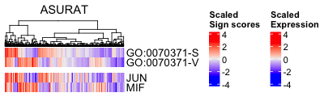
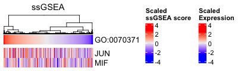
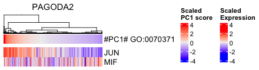

```{r, include = FALSE}
knitr::opts_chunk$set(
  collapse = TRUE,
  comment = "#>"
)
```


# Computational environment
MacBook Pro (Big Sur, 16-inch, 2019), Processor (2.4 GHz 8-Core Intel Core i9),
Memory (64 GB 2667 MHz DDR4).


<br>

# Install libraries
Attach necessary libraries:
```{r, eval = FALSE}
library(ASURAT)
library(SingleCellExperiment)
library(SummarizedExperiment)
```


<br>

# Investigate gene expression correlations
## ASURAT
Select GO IDs of interest.
```{r, eval = FALSE}
GOOI <- c("GO:0070371",  # ERK1 and ERK2 cascade
          "GO:1904666",  # regulation of ubiquitin protein ligase activity
          "GO:0032070")  # regulation of deoxyribonuclease activity
```

Load the result of the section "Normalize data" in
[SCLC data analyses](https://keita-iida.github.io/ASURATBI/01-sclc.html).
```{r, eval = FALSE, echo = FALSE}
sclc <- readRDS("backup/01_003_sclc_normalized.rds")
```
```{r, eval = FALSE}
sclc <- readRDS("<file path>")
```

Load the result of the section "Compute correlation matrices" in
[SCLC data analyses](https://keita-iida.github.io/ASURATBI/01-sclc.html).
```{r, eval = FALSE, echo = FALSE}
cormat <- readRDS("backup/01_003_sclc_cormat.rds")
```
```{r, eval = FALSE}
cormat <- readRDS("<file path>")
```

Load databases.
```{r, eval = FALSE}
urlpath <- "https://github.com/keita-iida/ASURATDB/blob/main/genes2bioterm/"
load(url(paste0(urlpath, "20201213_human_GO_red.rda?raw=TRUE")))     # GO
```
The reformatted knowledge-based data were available from the following
repositories:

* [DOI:10.6084/m9.figshare.19102598](https://figshare.com/s/0599d2de970c2deb675c)
* [Github ASURATDB](https://github.com/keita-iida/ASURATDB)

Add formatted databases to `metadata(sce)$sign`.
```{r, eval = FALSE}
sclcs <- list(GO = sclc)
metadata(sclcs$GO) <- list(sign = human_GO[["BP"]])
```

Redefines functional gene sets for the input database by removing genes,
which are not included in `rownames(sce)`, and further removes biological terms
including too few or too many genes.
```{r, eval = FALSE}
sclcs$GO <- remove_signs(sce = sclcs$GO, min_ngenes = 2, max_ngenes = 1000)
```

Clusters functional gene sets using a correlation graph-based decomposition
method, producing strongly, variably, and weakly correlated gene sets (SCG, VCG,
and WCG, respectively).
```{r, eval = FALSE}
set.seed(1)
sclcs$GO <- cluster_genesets(sce = sclcs$GO, cormat = cormat,
                             th_posi = 0.20, th_nega = -0.20)
```

Select IDs and prepare a correlation submatrix.
```{r, eval = FALSE}
goid <- GOOI[1]
df <- metadata(sclcs$GO)$sign
goi_strg <- unlist(strsplit(df[df$SignID == goid, ]$StrgCorrGene, "/"))
goi_vari <- unlist(strsplit(df[df$SignID == goid, ]$VariCorrGene, "/"))
goi_weak <- unlist(strsplit(df[df$SignID == goid, ]$WeakCorrGene, "/"))
goi_strg <- goi_strg[seq_len(6)]
goi_weak <- goi_weak[seq_len(10)]
goi_all <- c(goi_weak[1], goi_weak[2], goi_strg[1:6], goi_weak[3:7],
             goi_vari[1:2], goi_weak[8:10])
#goi_all <- unique(c(goi_strg, goi_vari, goi_weak))

cmat <- cormat[goi_all, goi_all]
diag(cmat) <- 0
```

Plot the correlation graph.
```{r, eval = FALSE}
label <- goi_all
label[which(goi_all %in% goi_strg)] <- 1
label[which(goi_all %in% goi_vari)] <- 2
label[which(goi_all %in% goi_weak)] <- 3
colors <- label
colors[which(colors == 1)] <- "grey50"
colors[which(colors == 2)] <- "grey80"
colors[which(colors == 3)] <- "white"
text_colors <- "black"
node_sizes <- 9

title <- "GO:0070371 (ERK1 and ERK2 cascade)"
filename <- "figures/figure_90_0001"
qgraph::qgraph(input = cmat, title = title, title.cex = 0.6, filename = filename,
               filetype = "png", height = 2, width = 2,
               color = colors, vsize = node_sizes, label.color = text_colors,
               border.width = 3, edge.labels = FALSE,
               posCol = "red", negCol = "blue", threshold = 0)
```
where the average correlation coefficients of SCG, VCG, and WCG are
0.3389764, 0.2280671, and 0.011150431, respectively.


Perform the following ASURAT functions.
```{r, eval = FALSE}
# Keep only GO terms of interest.
df <- metadata(sclcs$GO)$sign
df <- df[which(df$SignID %in% GOOI), ]
metadata(sclcs$GO)$sign <- df

# Creates signs.
sclcs$GO <- create_signs(sce = sclcs$GO, min_cnt_strg = 2, min_cnt_vari = 2)

# Create sign-by-sample matrices.
sclcs$GO <- makeSignMatrix(sce = sclcs$GO, weight_strg = 0.5, weight_vari = 0.5)
```

```{r, eval = FALSE, echo = FALSE}
# Save data.
saveRDS(sclcs, file = "backup/90_001_sclc_asurat.rds")

# Load data.
sclcs <- readRDS("backup/90_001_sclc_asurat.rds")
```


<br>

## ssGSEA
Install an escape package v1.5, which requires R (>= 4.1).
```{r, eval = FALSE}
# devtools::install_github("ncborcherding/escape")
packageVersion("escape")
```
```
[1] ‘1.5.1’
```

Set a GO term of interest.
```{r, eval = FALSE}
GOOI <- c("GOBP_ERK1_AND_ERK2_CASCADE",
          "GOBP_REGULATION_OF_UBIQUITIN_PROTEIN_LIGASE_ACTIVITY",
          "GOBP_REGULATION_OF_DEOXYRIBONUCLEASE_ACTIVITY")
```

Load the result of the section "Normalize data" in
[SCLC data analyses](https://keita-iida.github.io/ASURATBI/01-sclc.html).
```{r, eval = FALSE, echo = FALSE}
sclc <- readRDS("backup/01_003_sclc_normalized.rds")
```
```{r, eval = FALSE}
sclc <- readRDS("<file path>")
```

Create Seurat objects.
```{r, eval = FALSE}
sclc <- Seurat::CreateSeuratObject(counts = as.matrix(assay(sclc, "normalized")),
                                   project = "SCLC")
```

Perform `getGeneSets()` with an argument `library = "C5"`
("ontology gene sets" in
[MSigDB](https://www.gsea-msigdb.org/gsea/msigdb/collections.jsp)) and
select GO terms of interest.
```{r, eval = FALSE}
sclc@misc[["getGeneSets"]] <- escape::getGeneSets(species = "Homo sapiens",
                                                  library = "C5")
df <- sclc@misc[["getGeneSets"]]
df <- df[grepl("GOBP", names(df))]
sclc@misc[["getGeneSets"]] <- df
sclc@misc[["GO_TERMS"]] <- df[grepl(paste(GOOI, collapse="|"), names(df))]
```

Perform `enrichIt()`, estimating ssGSEA scores, in which the arguments are
the same with those in the vignettes in escape package.
```{r, eval = FALSE}
set.seed(1)
ES <- escape::enrichIt(obj = sclc, gene.sets = sclc@misc[["GO_TERMS"]],
                       groups = 1000, cores = 4)
sclc@misc[["enrichIt"]] <- ES
```
```
[1] "Using sets of 1000 cells. Running 3 times."
Setting parallel calculations through a SnowParam back-end
with workers=4 and tasks=100.
Estimating ssGSEA scores for 3 gene sets.
[1] "Calculating ranks..."
[1] "Calculating absolute values from ranks..."
Setting parallel calculations through a SnowParam back-end
with workers=4 and tasks=100.
Estimating ssGSEA scores for 3 gene sets.
[1] "Calculating ranks..."
[1] "Calculating absolute values from ranks..."
Setting parallel calculations through a SnowParam back-end
with workers=4 and tasks=100.
Estimating ssGSEA scores for 3 gene sets.
[1] "Calculating ranks..."
[1] "Calculating absolute values from ranks..."
```

```{r, eval = FALSE, echo = FALSE}
# Save data.
saveRDS(sclc, file = "backup/90_002_sclc_ssGSEA.rds")

# Load data.
sclc <- readRDS("backup/90_002_sclc_ssGSEA.rds")
```


<br>

## PAGODA
```{r, eval = FALSE}
packageVersion("pagoda2")
```
```
[1] ‘1.0.10’
```

Set GO terms of interest.
```{r, eval = FALSE}
GOOI <- c("GO:0070371",  # ERK1 and ERK2 cascade
          "GO:1904666",  # regulation of ubiquitin protein ligase activity
          "GO:0032070")  # regulation of deoxyribonuclease activity
```

Load the result of the section "Normalize data" in
[SCLC data analyses](https://keita-iida.github.io/ASURATBI/01-sclc.html).
```{r, eval = FALSE, echo = FALSE}
sclc <- readRDS("backup/01_003_sclc_normalized.rds")
```
```{r, eval = FALSE}
sclc <- readRDS("<file path>")
```

Create a pagoda2 object.
```{r, eval = FALSE}
mat <- as.matrix(assay(sclc, "normalized"))
sclc <- pagoda2::Pagoda2$new(x = mat, modelType = "plain", n.cores = 1,
                             log.scale = TRUE, min.cells.per.gene = 0)
```
```
2283 cells, 6346 genes; normalizing ... 
Using plain model 
log scale ... 
done.
```

Adjust the variance.
```{r, eval = FALSE}
sclc$adjustVariance(plot = FALSE)
```
```
calculating variance fit ...
 using gam 
1278 overdispersed genes ... 1278
persisting ... 
done.
```

Perform principal component analysis, where `n.odgenes` is the number of
overdispersed genes.
```{r, eval = FALSE}
sclc$calculatePcaReduction(nPcs = 50, n.odgenes = 1278)
```
```
running PCA using 1278 OD genes .
.
.
.
 done
```

Perform pathway overdispersion analysis.
Here, computations were partially performed on the IPR server at Institute for
Protein Research, Osaka University.
```{r, eval = FALSE}
# Translate gene names to ids.
suppressMessages(library(org.Hs.eg.db))
ids <- unlist(lapply(mget(colnames(sclc$counts), org.Hs.egALIAS2EG,
                          ifnotfound = NA), function(x) x[1]))

# Reverse map
rids <- names(ids)
names(rids) <- ids

# List all the ids per GO category.
go.env <- list2env(eapply(org.Hs.egGO2ALLEGS,
                          function(x) as.character(na.omit(rids[x]))))

# Remove unused GO terms.
goterms <- names(go.env)
for(i in seq_along(goterms)){
  if(goterms[i] %in% GOOI){
    next
  }else{
    rlang::env_unbind(go.env, goterms[i])
  }
}

# Pathway overdispersion analysis
sclc$testPathwayOverdispersion(setenv = go.env, verbose = TRUE,
                               correlation.distance.threshold = 0.8,
                               min.pathway.size = 1, max.pathway.size = 100,
                               recalculate.pca = FALSE)
```
```
determining valid pathways
processing 3 valid pathways
scoring pathway od signifcance
compiling pathway reduction
clustering aspects based on gene loading ... 3 aspects remaining
clustering aspects based on pattern similarity ... 3 aspects remaining
```

```{r, eval = FALSE, echo = FALSE}
# Save data.
saveRDS(sclc, file = "backup/90_003_sclc_pagoda2.rds")

# Load data.
sclc <- readRDS("backup/90_003_sclc_pagoda2.rds")
```


<br>

## Compare the results
Load the above computational results.
```{r, eval = FALSE, echo = FALSE}
sclc_asurat <- readRDS("backup/90_001_sclc_asurat.rds")
sclc_ssgsea <- readRDS("backup/90_002_sclc_ssGSEA.rds")
sclc_pagoda <- readRDS("backup/90_003_sclc_pagoda2.rds")
```
```{r, eval = FALSE}
sclc_asurat <- readRDS("<file path>")
sclc_ssgsea <- readRDS("<file path>")
sclc_pagoda <- readRDS("<file path>")
```

Create score-by-sample matrices.
```{r, eval = FALSE}
mat_asurat <- as.matrix(assay(sclc_asurat$GO, "counts"))
mat_ssgsea <- t(as.matrix(sclc_ssgsea@misc[["enrichIt"]]))
mat_pagoda <- sclc_pagoda[["misc"]][["pathwayOD"]][["xv"]]
rownames(mat_ssgsea) <- c("GO:0070371", "GO:0032070", "GO:1904666")
rownames(mat_pagoda) <- c(sclc_pagoda[["misc"]][["pathwayOD"]][["cnam"]][["aspect1"]],
                          sclc_pagoda[["misc"]][["pathwayOD"]][["cnam"]][["aspect2"]],
                          sclc_pagoda[["misc"]][["pathwayOD"]][["cnam"]][["aspect3"]])

# Change the orders of rows.


# Select rows.
submat_asurat <- as.matrix(mat_asurat[c(2, 5), ])
submat_ssgsea <- as.matrix(mat_ssgsea[1, ])
submat_pagoda <- as.matrix(mat_pagoda[2, ])
submat_ssgsea <- t(submat_ssgsea) ; rownames(submat_ssgsea) <- rownames(mat_ssgsea)[1]
submat_pagoda <- t(submat_pagoda) ; rownames(submat_pagoda) <- rownames(mat_pagoda)[2]

# Select columns by random sampling.
set.seed(1)
inds <- sample(ncol(mat_asurat), size = 2000, replace = FALSE)
submat_asurat <- as.matrix(submat_asurat[, inds])
submat_ssgsea <- as.matrix(submat_ssgsea[, inds])
submat_pagoda <- as.matrix(submat_pagoda[, inds])
submat_ssgsea <- t(submat_ssgsea) ; rownames(submat_ssgsea) <- rownames(mat_ssgsea)[1]
submat_pagoda <- t(submat_pagoda) ; rownames(submat_pagoda) <- rownames(mat_pagoda)[2]

# Scale data.
submat_asurat <- t(scale(t(submat_asurat)))
submat_ssgsea <- t(scale(t(submat_ssgsea)))
submat_pagoda <- t(scale(t(submat_pagoda)))

# Perform hierarchical clustering.
set.seed(1)
colhc_asurat <- hclust(dist(t(submat_asurat)), method = "ward.D2")
colhc_ssgsea <- hclust(dist(t(submat_ssgsea)), method = "ward.D2")
colhc_pagoda <- hclust(dist(t(submat_pagoda)), method = "ward.D2")
```

Examine the scores of samples (cells).
```{r, eval = FALSE}
suppressMessages(library(ComplexHeatmap))
filename <- "figures/figure_90_0010.png"
png(file = filename, height = 200, width = 600, res = 100)
p <- ComplexHeatmap::Heatmap(submat_asurat, column_title = "ASURAT",
                             name = "Sign scores", cluster_columns = colhc_asurat,
                             cluster_rows = FALSE, show_row_names = TRUE,
                             row_names_side = "right", show_row_dend = FALSE,
                             show_column_names = FALSE, column_dend_side = "top",
                             show_parent_dend_line = FALSE)
p
dev.off()

filename <- "figures/figure_90_0011.png"
png(file = filename, height = 200, width = 600, res = 100)
p <- ComplexHeatmap::Heatmap(submat_ssgsea, column_title = "ssGSEA",
                             name = "ssGSEA score", cluster_columns = colhc_ssgsea,
                             cluster_rows = FALSE, show_row_names = TRUE,
                             row_names_side = "right", show_row_dend = FALSE,
                             show_column_names = FALSE, column_dend_side = "top",
                             show_parent_dend_line = FALSE)
p
dev.off()

filename <- "figures/figure_90_0012.png"
png(file = filename, height = 200, width = 600, res = 100)
p <- ComplexHeatmap::Heatmap(submat_pagoda, column_title = "PAGODA2",
                             name = "PC1 score", cluster_columns = colhc_pagoda,
                             cluster_rows = FALSE, show_row_names = TRUE,
                             row_names_side = "right", show_row_dend = FALSE,
                             show_column_names = FALSE, column_dend_side = "top",
                             show_parent_dend_line = FALSE)
p
dev.off()
```




